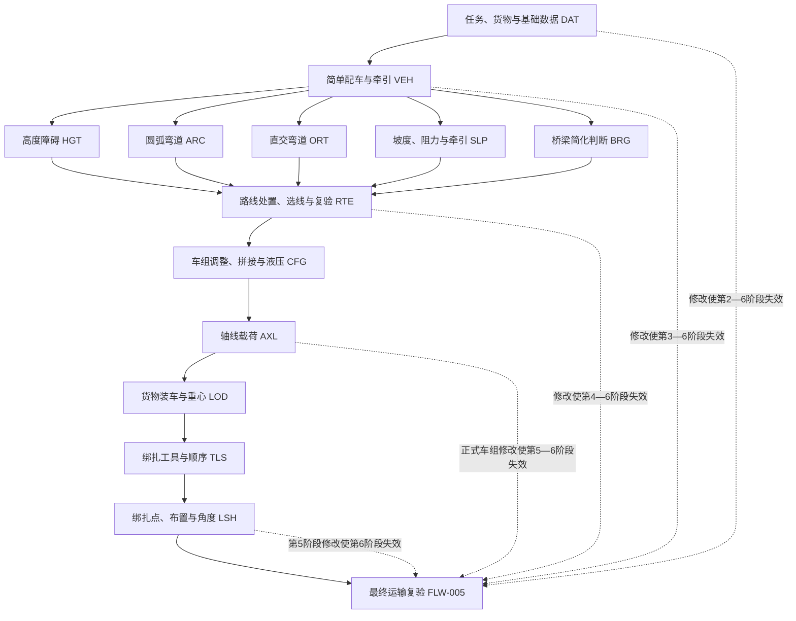

# 专业规则目录

> 基线版本：v0.1（第1周第5天）  
> 适用范围：单案例、三条候选路线、六阶段教学实验首版。  
> 安全声明：本文全部专业判断仅用于教学演示，不替代真实工程勘测、车辆选型、桥梁验算、运输方案审查或安全论证。

## 1. 文档目标与依据

本文把论文中的配车、通行、牵引、轴载、装车和绑扎知识转成可由页面、状态机、数据库、日志和测试共同引用的规则基线。依据优先级为：`article.pdf` 第2—4章原文及图表；`docs/论文功能映射.md`；`docs/用户与场景.md`；`docs/六阶段实验主流程.md`；第4天分支中的 `docs/通用功能与页面清单.md`；126天实施计划第1周第5天要求。

页码采用“论文页/PDF页”。公式2.1—2.30已回查论文第15—21页（PDF第22—28页）；第3章操作与流程已回查论文第48—54页（PDF第55—61页）。论文未给出参数、阈值、精度或公式时，一律标为“论文未明确”，不使用隐藏默认值。

## 2. 专业规则范围与原则

1. 规则分为数据完整性、输入格式、单位、专业计算、专业比较、阶段继续、回退与下游失效、保存与幂等、日志与评价取数、技术异常十层。
2. 专业失败是学生输入或操作不符合已确认教学规则；技术异常是资源、网络、会话或保存故障。二者分开记录，技术异常不计学生错误。
3. 阻断规则均给出唯一首选恢复目标；修正后重算受影响结果，历史日志只追加不删除。
4. 未成功持久化不得显示规则通过、阶段通过或实验完成；同一幂等键重复提交不重复记日志、错误、提示、分数或完成记录。
5. “测试假设值”只验证结构和比较方向，不进入案例数据或专业结论。

## 3. 规则分类与编号

| 前缀 | 分类 | 数量 | 编号范围 |
|---|---|---:|---|
| DAT | 任务、货物和基础数据 | 3 | DAT-001—003 |
| VEH | 简单配车与牵引车选择 | 3 | VEH-001—003 |
| HGT | 高度障碍 | 2 | HGT-001—002 |
| ARC | 圆弧弯道 | 2 | ARC-001—002 |
| ORT | 直交弯道 | 2 | ORT-001—002 |
| SLP | 坡度、阻力与牵引 | 4 | SLP-001—004 |
| BRG | 桥梁简化判断 | 1 | BRG-001 |
| RTE | 路线处置、选线与复验 | 4 | RTE-001—004 |
| CFG | 车组调整、拼接和液压操作 | 4 | CFG-001—004 |
| AXL | 轴线载荷 | 3 | AXL-001—003 |
| LOD | 货物装车与重心 | 2 | LOD-001—002 |
| TLS | 绑扎工具与顺序 | 2 | TLS-001—002 |
| LSH | 绑扎点、布置与角度 | 2 | LSH-001—002 |
| FLW | 阶段继续、回退和下游失效 | 5 | FLW-001—005 |
| LOG | 规则日志与评价取数 | 2 | LOG-001—002 |
| ERR | 规则执行异常 | 3 | ERR-001—003 |

共44条，分类内连续且全局唯一。

## 4. 规则输入输出通用约定

- 数值输入采用十进制；质量/重量必须区分。论文公式以 `mg` 表示重力或车组总重，原文单位出现kN时保持kN；案例录入的kg不得未经换算直接代入。重力加速度取值、换算精度、舍入位数均须由规则配置确认。
- 长度统一进入计算前换算为m，角度输入为°；三角函数内部角度制/弧度制转换方式和精度须配置。原始值、原单位、换算值、换算规则版本同时保存。
- 输入来源仅允许：案例基础数据、学生测量、学生选择、前阶段结果、规则配置、三维交互结果。是否可由学生修改须显式声明。
- 通用输出结构：`ruleId`、`ruleVersion`、数值结果、单位、布尔/枚举结论、失败原因、唯一恢复目标、下游失效范围、保存状态。
- 缺失、非数值、非有限数、单位未知或依赖版本失效均先返回输入错误，不进入专业计算。论文未明确的阈值不得以0、无限大或界面默认值代替。
- 相等边界仅在论文明确时采用：轴载“不超过”上限通过、绑扎角“不得大于60°”故60°通过；其余相等边界列入待确认并阻止确定性提交。

## 5. 任务、货物与基础数据规则

| 编号 | 名称/层级 | 触发与前置 | 输入（类型；单位；来源；可改） | 过程与输出 | 通过/失败/相等边界 | 反馈、唯一恢复与重试 | 保存、日志、依赖与状态 |
|---|---|---|---|---|---|---|---|
| DAT-001 | 任务货物关键字段完整性/数据完整性 | 第一阶段提交；案例已加载 | 重量、长宽高、重心坐标、起终点、装运要求（数值/文本；kg或经确认质量单位、m；案例；学生只读） | 按必填清单逐项检查；输出缺失字段集与完整布尔值 | 全齐通过；任一缺失失败；无相等边界 | 指明字段；回第一阶段任务/货物数据；补齐后重提 | 保存原值、来源和案例版本；记B1前置证据；下游第二至六阶段；可直接实现，P0，实施计划要求，论文14、48页/PDF21、55 |
| DAT-002 | 格式与单位合法性/格式、单位 | 任一专业提交；DAT-001已通过 | 原始值、数据类型、单位码（任意；原单位；各来源；依字段） | 校验数值有限性、允许单位并按已确认配置换算；输出标准值或字段错误 | 合法且换算成功通过；非法/未知单位失败；浮点容差未明确 | 字段级错误；回当前输入字段；修正后重算 | 原值、原单位、标准值、换算版本均存；影响所有专业计算；可直接实现，P0，合理推导，论文未规定换算精度 |
| DAT-003 | 数据来源与版本可追溯/保存日志 | 读取或保存专业输入时 | 值、来源类型、来源ID、版本（结构体；随值；六类来源；只读元数据） | 验证来源在允许枚举且版本有效；输出可追溯引用 | 有合法来源与有效版本通过；缺来源/过期版本失败 | 显示来源或版本问题；回数据加载入口；同版本重试 | 保存来源链；上游改动触发FLW-002；可直接实现，P1，合理推导 |

## 6. 简单配车与牵引规则

| 编号 | 名称/层级 | 触发与前置 | 输入 | 过程与输出 | 通过/失败/边界 | 恢复 | 保存、日志、状态与来源 |
|---|---|---|---|---|---|---|---|
| VEH-001 | 三种车组组合选择/专业比较 | 第二阶段选择；货物数据完整 | 带鹅颈半挂、不带鹅颈全挂、自行式液压轴线车（枚举；无；学生选择）及已确认适用条件 | 展示论文优缺点并匹配案例允许集合；输出组合枚举与适用性 | 命中允许集合通过；不适用失败；阈值论文未明确 | 回组合方式选择 | 保存选择、组合版本；可直接实现，P1，论文26、48—49页/PDF33、55—56 |
| VEH-002 | 挂车轴线/纵列选择/专业比较 | VEH-001后 | 货物尺寸/重量、挂车轴线数、纵列数、挂车参数（m、kg/kN、整数；案例/学生/配置） | 按经确认的案例参数校验尺寸与承载；输出挂车方案 | 全部配置规则通过才通过；缺参数或不满足失败；选型阈值不得推造 | 回挂车参数选择 | 保存输入/规则版本；需案例参数后实现，P1，论文49页/PDF56 |
| VEH-003 | 牵引车种类数量与牵引能力/专业计算比较 | VEH-002后 | 6x6/8x8种类、数量、车货总重、动力参数、路面参数（枚举/整数/数值；kN、m等；学生/案例/配置） | 复用SLP-002—003计算所需行驶阻力和有效牵引力；输出可运输性及方案 | 有效牵引力及附着力均不小于行驶阻力才通过；相等边界按“不小于”通过；经济性仅作“满足运输性后比较”，无公式不排序 | 回牵引车选择；修改后重算 | 记录B1/B2；需案例参数后实现，P0，论文49页/PDF56及公式2.7—2.13 |

## 7. 高度障碍规则

| 编号 | 名称/层级 | 输入与过程 | 输出与判定 | 失败与恢复 | 状态与来源 |
|---|---|---|---|---|---|
| HGT-001 | 高度输入完整与单位统一/完整性单位 | 障碍净高、车货总高、悬架可调量（数值；m；学生测量/前阶段/配置）；先执行DAT-002 | 标准化三值或字段错误 | 缺失/单位错回对应测量或配置；资源失败走ERR-003 | 可直接实现，P1，论文50—52页/PDF57—59 |
| HGT-002 | 高度三态判断/专业比较 | 比较净高 `H_c`、原总高 `H_v`、调整后总高 `H'_v`；不自行加入安全余量 | `H_c>H_v`可通行；原不通过但经确认调整后满足则“调整后通行”；否则不可通行。`=`与安全余量论文未明确，阻止确定性结论 | 回高度测量；需调整则第四阶段悬架高度；修改后复验 | 需课程负责人确认，P0，论文50、52页/PDF57、59 |

## 8. 圆弧弯道规则

| 编号 | 名称/层级 | 输入与公式 | 输出与判定 | 失败与恢复 | 状态与来源 |
|---|---|---|---|---|---|
| ARC-001 | 最小内外转弯半径计算/专业计算 | 车组长度`L`、宽度`B`、最大转向角`β`及论文图2.4参数；公式2.14—2.17仅作带风险说明的教学展示 | 首版自动判分不执行疑似错式2.16—2.17；输出教学引用或已发布案例真值的校验状态 | 缺已发布真值返回RULE_CONFIG_INCOMPLETE；回案例加载/车辆参数且不计学生错误 | PCR-009判定契约，P1，论文19页/PDF26 |
| ARC-002 | 圆弧弯道通行比较/专业比较 | 实测弯道内外可用半径（m；学生测量）与经确认的`R_n/R_w` | 实际几何同时满足内外包络才可通行；相等边界、测量容差论文未明确，阻止确定性提交 | 回圆弧弯道测量；修正后重算 | 需课程负责人确认，P0，论文19、50页/PDF26、57 |

## 9. 直交弯道规则

| 编号 | 名称/层级 | 输入与公式 | 输出与判定 | 失败与恢复 | 状态与来源 |
|---|---|---|---|---|---|
| ORT-001 | 所需最小出口宽度计算/专业计算 | 夹角`φ`、入口宽`W1`、内圆角半径`r`、车组尺寸及图2.5—2.6参数；公式2.18—2.30仅作教学展示 | 首版自动判分不执行表达有疑点的2.24、2.26、2.29；只校验已发布案例真值 | 缺已发布真值返回RULE_CONFIG_INCOMPLETE；回案例加载/直交弯道测量且不计学生错误 | PCR-009判定契约，P1，论文19—21页/PDF26—28 |
| ORT-002 | 直交弯道通行比较/专业比较 | 实际出口宽（m）与经确认计算的所需宽 | 实际宽大于所需宽则可通行；相等边界及容差未明确，阻止确定性结论 | 回直交弯道测量；修正后重算 | 需课程负责人确认，P0，论文20—21、50页/PDF27—28、57 |

## 10. 坡度、阻力与牵引规则

| 编号 | 名称/层级 | 输入与公式 | 输出与判定 | 失败与恢复 | 状态与来源 |
|---|---|---|---|---|---|
| SLP-001 | 坡度计算/专业计算 | 水平距离`l`、高差`h`（m；学生测量）；式2.8 `i=h/l×100%=tanα` | 百分比坡度`i`；`l>0`且输入合法通过；论文称常见道路纵坡通常不超过9%，不得把9%擅作案例通行阈值 | 回坡度测量 | 可直接实现，P1，论文17页/PDF24 |
| SLP-002 | 滚动、坡度和行驶阻力/专业计算 | 车组总重`mg`、坡角`α`、滚阻系数`f`、坡度`i`；式2.7、2.9、2.10 | `F_f`、`F_i`、`F_p`（kN）；忽略空气/加速阻力是论文模型前提 | 缺重力换算或`f`回案例/路面配置 | 需案例参数后实现，P1，论文16—17页/PDF23—24 |
| SLP-003 | 牵引力与附着力校核/专业计算比较 | 动力参数及`F_Z,φ`；式2.11—2.13 | 发动机侧牵引力、附着上限、有效牵引力；有效牵引力≥行驶阻力通过，相等通过 | 回牵引车选择；缺参数不得伪通过 | 需案例参数后实现，P0，论文17—18页/PDF24—25 |
| SLP-004 | 增加牵引车后重算/阶段继续 | 牵引车新种类/数量、牵引系数0.7—0.8及全部动力/附着输入 | 使用经确认车辆参数重新执行SLP-002—003；输出新方案版本 | 仍不足回牵引车选择；多车系数具体取值须配置 | 需案例参数后实现，P1，论文17、52页/PDF24、59 |

## 11. 桥梁简化判断规则

| 编号 | 名称/层级 | 输入与判断 | 输出与边界 | 失败与恢复 | 状态与来源 |
|---|---|---|---|---|---|
| BRG-001 | 桥梁承载教学简化比较/专业比较 | 桥梁给定承载能力、车货总重（同一经确认单位；案例/前阶段）；仅作直接比较 | 车货总重不大于给定承载能力则教学判定可通行，等于时通过；超过或数据缺失不通过 | 回桥梁数据/车组选择；不得扩展为结构或有限元分析 | 需案例参数后实现，P0，论文51页/PDF58 |

## 12. 路线处置、选线与复验规则

| 编号 | 名称/层级 | 过程与输出 | 通过/失败 | 恢复 | 状态与来源 |
|---|---|---|---|---|---|
| RTE-001 | 单障碍状态归并/专业比较 | 复用HGT/ARC/ORT/SLP/BRG有效结论，输出可通行、可处置后通行、不可处置 | 有当前版本结论通过；未知/失效失败 | 回对应障碍规则 | 需案例参数后实现，P1，论文50—51页/PDF57—58 |
| RTE-002 | 路线淘汰/专业比较 | 任一障碍不可处置则路线淘汰；输出淘汰原因集 | 无不可处置障碍则保留；否则淘汰 | 回对应障碍或路线选择 | 可直接实现，P1，同上 |
| RTE-003 | 三路线选择/专业比较 | 汇总三条路线；先按可通行性筛选，再在可行路线中考虑经济性 | 只能选择可通行/可经确认处置通行路线；处置集合、成本与经济排序公式未明确时不得自动排名 | 回第三阶段路线选择 | 需课程负责人确认，P0，论文51页/PDF58 |
| RTE-004 | 第六阶段路线复验/阶段继续 | 复用第三阶段当前有效路线结论与版本；输出复验通过/错误路线 | 版本相容且路线正确通过；错误路线失败 | 唯一回第三阶段路线选择，并使第四至六阶段失效 | 可直接实现，P1，论文54页/PDF61 |

## 13. 车组调整、拼接与液压规则

| 编号 | 名称/层级 | 输入与过程 | 通过/失败 | 恢复 | 状态与来源 |
|---|---|---|---|---|---|
| CFG-001 | 按路线调整车组/专业比较 | 路线约束、牵引车、悬架、轴线/纵列配置；逐项复用相关规则 | 全部路线约束有有效响应才通过 | 回对应配置选择 | 需案例参数后实现，P1，论文52页/PDF59 |
| CFG-002 | 挂车拼接/三维操作 | 选定轴线/纵列与连接结果；按目标结构比对 | 拼接拓扑与案例配置一致通过 | 回当前拼接步骤并重置错误连接 | 需案例参数后实现，P1，论文52页/PDF59 |
| CFG-003 | 三点编点、三回路和阀门/三维操作 | 三点坐标、回路划分、阀门断开/联通状态；按案例答案逐步比对 | 三点、三回路、所有阀门目标状态及顺序全对通过 | 唯一回当前液压步骤；重置该步后重试 | 需案例参数后实现，P0，论文42、52页/PDF49、59 |
| CFG-004 | 错误步骤与受影响重做/回退 | 当前步骤、期望步骤、错误动作 | 错步阻断，不跳过；输出唯一当前步骤 | 回当前错误步骤，保留已确认前序，重做受影响后序 | 可直接实现，P1，主流程要求 |

## 14. 轴线载荷规则

| 编号 | 名称/层级 | 输入与公式 | 输出与判定 | 恢复 | 状态与来源 |
|---|---|---|---|---|---|
| AXL-001 | 三点支承回路合力/专业计算 | 货物重力`mg`、重心`x_g`、三点坐标`X_A..Y_C`；式2.1—2.3 | 解`R_A,R_B,R_C`（kN）；坐标系与方程可解才输出 | 回三点编点或货物参数 | 需案例参数后实现，P1，论文15页/PDF22 |
| AXL-002 | 悬架与轴线载荷/专业计算 | 回路合力、回路悬架数`n`、纵列数`K`、`Q_ij`、轴自重`N_ti`；式2.4—2.6 | 悬架载荷`Q`、货物分配轴载`N_Qi`、轴重`N_i`（kN） | 回挂车参数/回路配置 | 需案例参数后实现，P1，论文15—16页/PDF22—23 |
| AXL-003 | 逐轴允许载荷比较/专业比较 | 每轴`N_i`、允许最大轴载及车速条件（kN；计算/配置） | 所有轴`N_i≤N_i,max`通过，等于通过；任一超限失败；精度/舍入未明确时以未舍入值保存且阻止争议边界确定提交 | 唯一回第四阶段挂车参数选择；修改后重做CFG受影响步骤和AXL全套校核 | 需案例参数后实现，P0，论文16、53页/PDF23、60 |

## 15. 货物装车与重心规则

| 编号 | 名称/层级 | 输入与过程 | 输出与判定 | 恢复 | 状态与来源 |
|---|---|---|---|---|---|
| LOD-001 | 重心偏差计算/专业计算 | 货物位置/重心、车组中心（三维坐标；m；三维交互/案例） | 输出各轴向偏差和距离；坐标系、允许偏差及精度论文未明确 | 回货物位置调整 | 需课程负责人确认，P1，论文53页/PDF60 |
| LOD-002 | 重心与液压反馈对准/专业比较 | 重心偏差、三个液压回路/液压表读数、经确认允许区间 | 偏差和全部反馈同时命中配置才通过；阈值空缺时仅保存原始值并显示规则待确认 | 唯一回第五阶段货物位置调整 | 需课程负责人确认，P0，论文53页/PDF60 |

## 16. 绑扎工具与顺序规则

| 编号 | 名称/层级 | 输入与过程 | 输出与判定 | 恢复 | 状态与来源 |
|---|---|---|---|---|---|
| TLS-001 | 绑扎工具固定顺序/专业比较 | 当前步、可选工具、选择工具；顺序：橡胶垫→梯子→安全带→钢丝绳→紧固葫芦→防磨衬垫 | 选择等于当前正确工具才完成该步并推进；错选/错序失败；无数值边界 | 唯一回当前绑扎步骤，保留已完成前序 | 可直接实现，P0，论文42—43、53—54页/PDF49—50、60—61 |
| TLS-002 | 工具错误提示与重试/日志 | 错误工具、当前步、同规则错误序号、提示类型 | 首次给原因和方法，再次可升级说明但不代做；记录错误/提示次数 | 回当前步骤重选；重复提交按幂等键不加次数 | 可直接实现，P1，论文47页/PDF54及主流程 |

## 17. 绑扎点、布置与角度规则

| 编号 | 名称/层级 | 输入与过程 | 输出与判定 | 恢复 | 状态与来源 |
|---|---|---|---|---|---|
| LSH-001 | 候选点与倒八字布置/专业比较 | 四个候选点、学生选点、两侧绳索拓扑（三维交互/案例配置） | 命中正确点且两侧斜拉形成倒八字才通过；坐标和命中容差未明确 | 唯一回绑扎点选择并清除本次点/绳 | 需案例参数后实现，P1，论文54页/PDF61 |
| LSH-002 | 钢丝绳夹角/专业比较 | 钢丝绳与挂车板夹角`θ`（°；三维计算） | `θ≤60°`通过，`θ>60°`失败，60°通过；计算精度/容差未明确，保存未舍入值并由配置决定显示位数 | 唯一回绑扎点选择 | 可直接实现，P0，论文54页/PDF61 |

## 18. 阶段继续、回退与下游失效规则

| 编号 | 名称/层级 | 规则 | 失败与恢复 | 状态/来源 |
|---|---|---|---|---|
| FLW-001 | 阶段继续门禁/阶段继续 | 当前阶段全部P0规则通过且保存成功，前序版本有效，才允许下一阶段 | 留在最早未满足步骤 | 可直接实现，P1，实施计划/主流程 |
| FLW-002 | 上游修改失效矩阵/回退失效 | 第一阶段变更失效2—6；第二失效3—6；第三失效4—6；第四失效5—6；第五失效6；仅撤销有效标记，不删历史 | 回最早失效阶段并重验 | 可直接实现，P0，主流程§5、§14 |
| FLW-003 | 保存成功前不得通过/保存 | 持久化确认前状态只能是未保存/待重试 | 回最近保存点，用原幂等键重试 | 可直接实现，P1，实施计划G2 |
| FLW-004 | 重复提交幂等/幂等 | 相同业务对象、版本和幂等键返回既有结果，不新增事件或计数 | 保持既有状态 | 可直接实现，P1，主流程§14 |
| FLW-005 | 最终运输完成门禁/阶段继续 | 前五阶段完整且版本相容、无失效、路线复验正确、成功动画完成、完成记录保存成功才显示实验完成 | 错路线回第三阶段路线选择；缺失回最早失效阶段；技术失败回第六阶段保存点 | 可直接实现，P0，论文54页/PDF61及实施计划 |

## 19. 规则日志与评价关联

| 编号 | 名称/层级 | 规则与输出 | 评价关联 | 状态/来源 |
|---|---|---|---|---|
| LOG-001 | 规则事件最小字段/日志 | 每条关键事件含：事件ID、学生ID、尝试ID、阶段、步骤、规则编号/版本、输入摘要、计算结果、判断结果、错误类型/次数、提示类型/次数、回退目标、重试序号、客户端/服务端时间、技术异常类型 | 原始事件不可覆盖；重复键不重复 | 可直接实现，P1，论文13、47、68页/PDF20、54、75 |
| LOG-002 | 评价取数映射/日志评价 | B1取线路关键点计算/记录/分析错误；B2取实验操作错误；B3取工具错误；B5分别保存主动/自动/升级提示；B6保存开始、结束、暂停原始时间段 | 未确认归类、提示合并和暂停口径前不提前聚合 | 可直接实现，P1，论文62、68页/PDF69、75 |

技术异常规则：

| 编号 | 名称/层级 | 触发与处理 | 恢复 | 状态/来源 |
|---|---|---|---|---|
| ERR-001 | 技术异常与业务错误分离/技术异常 | 网络、会话、资源、计算服务、保存失败写`technicalExceptionType`，学生错误计数保持不变 | 最近保存点或原业务状态 | 可直接实现，P0，实施计划/主流程 |
| ERR-002 | 未确认配置阻断/技术配置 | 必需公式、参数、阈值、单位或版本为空时输出`RULE_CONFIG_INCOMPLETE`，不生成通过/失败专业结论 | 规则配置确认入口或当前数据步骤 | 可直接实现，P1，实施计划要求 |
| ERR-003 | 专业资源加载失败/技术异常 | 车辆/障碍/测量/动画资源不可用时显示对象与重试，不进入空场景 | 原阶段加载入口，同版本重试 | 可直接实现，P1，实施计划第118天 |

## 20. 专业规则依赖关系

## 21. 专业规则总台账

### 21.1 台账字段归一化说明

§5—§19按规则编号共同构成总台账。每条记录已填入：编号、名称、分类/层级、阶段、角色、目标、触发、前置、输入、类型、单位、来源、可修改性、公式/判断、变量/顺序、输出/单位、通过、失败、相等边界、容差、反馈、唯一恢复、重试、上下游、保存、日志、评价、配置、状态、首版、优先级、需求属性、来源、论文/PDF页码及备注；不适用项明确写“无”或由类别通用约定覆盖，不留空。以下表补齐治理和验收引用。

为避免重复长字段，所有规则默认引用：`S0`=保存原始输入、标准输入、规则/案例版本、计算过程、结论、失效与幂等键，保存失败执行FLW-003；`L0`=记录LOG-001字段，评价按LOG-002映射；`R0`=修正后以新重试序号重算受影响规则，历史事件不删除；`E0`=技术异常执行ERR-001且不计学生业务错误。类别表写出的特殊恢复、失效或日志要求覆盖默认值。无数值单位的枚举、布尔和流程规则，其输入/输出单位为“无”。

### 21.2 公式核对台账

| 式号/名称 | 原始公式（按PDF可辨内容转写） | 变量、单位与来源 | 阶段/前提/输出/判断 | 页码与状态 |
|---|---|---|---|---|
| 2.1—2.3 三点平衡 | `R_A+R_B+R_C=mg`; `R_AX_A+R_BX_B+R_CX_C=mgx_g`; `R_AY_A+R_BY_B+R_CY_C=0` | `R`回路合力kN；`X,Y,x_g`坐标m；`mg`货物重力kN；案例/编点 | 第四阶段；同一坐标系、方程可解；输出三回路合力 | 论文15/PDF22；可用，案例参数不足 |
| 2.4—2.6 轴载 | `Q=R/n`; `N_Qi=Σ(j=1..K)Q_ij`; `N_i=N_Qi+N_ti` | `Q`悬架货物载荷；`n`回路悬架数；`K`纵列数；`N_ti`轴自重；kN | 第四阶段；回路/纵列有效；输出逐轴载荷并比较上限 | 论文15—16/PDF22—23；可用，参数不足 |
| 2.7 滚阻 | `F_f=mg cos(α)·f≈mgf` | `mg`车组总重kN；`α`坡角°；`f`滚阻系数；案例/表2.3 | 常见小坡度、忽略余弦差；输出kN | 论文16/PDF23；可用 |
| 2.8 坡度 | `i=h/l×100%=tanα` | `h,l`高差/水平距离m；`i`百分比坡度；学生测量 | `l>0`；输出坡度 | 论文17/PDF24；PDF字形中`l`易与`i`混淆，按正文“水平距离l”记录 |
| 2.9 坡阻 | `F_i=mgi` | `mg`kN；`i`按公式使用的无量纲坡度 | 小坡度近似；输出kN | 论文17/PDF24；可用 |
| 2.10 行驶阻力 | `F_p=mg(i+f)` | 同2.7—2.9 | 忽略空气与加速阻力；输出kN | 论文17/PDF24；可用 |
| 2.11 发动机牵引力 | `F_t=T_e i_c i_g i_o i_w η_T/r` | `T_e`发动机转矩；`i_c,i_g,i_o,i_w`各传动比；`η_T`效率；`r`车轮动力半径；车辆配置 | 单车动力参数完整；输出牵引力，单位换算论文未明确 | 论文17/PDF24；参数/单位不足 |
| 2.12 附着力 | `F_φ=F_Z φ` | `F_Z`驱动轮正压力kN；`φ`附着系数；案例/表2.4 | 硬路面论文模型；输出附着上限kN | 论文18/PDF25；可用，案例参数不足 |
| 2.13 有效牵引力 | 当式2.11结果`≤F_Zφ`取式2.11；当其`>F_Zφ`取`F_Zφ` | 同2.11—2.12；多车牵引另考虑0.7—0.8牵引系数 | 输出有效牵引力；与`F_p`比较 | 论文18/PDF25；多车具体系数需配置 |
| 2.14—2.15 圆弧几何 | `OC=AD/tanβ-DC`; `OB=√(BE²+(OC+CE)²)` | `AD,BE`车组长度一半；`CE`车组宽；`DC`宽度一半；`β`最大转向角；m/° | 规则圆弧、图2.4几何；输出内/外轨迹基础量 | 论文19/PDF26；可转写 |
| 2.16 最小内半径 | PDF显示 `R_n=(2/L)/tanβ-B/2` | 正文称`L`车组长度、`B`宽度；其余见图2.4 | 公式显示与长度一半的正文/量纲不一致 | 论文19/PDF26；**论文表述冲突**，首版阻断确定计算 |
| 2.17 最小外半径 | PDF显示 `R_w=√(L²/2+((2/L)/tanβ-B/2)²)` | `L,B,β`同上 | 根号内写法存在量纲疑点 | 论文19/PDF26；**论文表述冲突**，首版阻断确定计算 |
| 2.18/2.23 极限转角 | `θ_max=arctan(l/(b+l·cotα_max))`（论文重复两次） | `α_max`挂车车轮最大转角；`l,b`未在正文完整定义 | 直交弯道、图2.5；输出极限状态角 | 论文20/PDF27；参数定义不足 |
| 2.19—2.22 直交中间量 | (2.19) `DO'=l/sinθ_max+c/2-W_1-r`; (2.20) `OO'=l/tanθ_max-b-c/2-r`; (2.21) `∠DOO'=arcsin(DO'/OO')`; (2.22) `∠EOO'=φ-∠DOO'` | `W1,r,φ`为入口宽、内圆角半径、道路夹角；`b,c,l`未完整定义 | 图2.5适用；输出中间几何量 | 论文20/PDF27；定义不足 |
| 2.24 横坐标 | PDF显示 `x'_o=-OO'·sin∠EOO'θ_max` | 符号连接方式和`x'_o`定义不完整 | 作为式2.25中间量 | 论文20/PDF27；**论文表述冲突** |
| 2.25 所需出口宽 | `W_2=l/sinθ_max+c/2+x'_o-r` | `W2`出口宽m；其余同上 | 与实际出口宽比较 | 论文21/PDF28；依赖未确认中间量 |
| 2.26 全挂最小半径 | PDF显示 `R_min=√((l/tanα_max+b)²+l²+c/2)` | `α_max,l,b,c`仅部分定义 | 全挂车组图2.6；量纲疑点 | 论文21/PDF28；**论文表述冲突** |
| 2.27—2.28 全挂中间量 | `O'K=√((l/tanα_max+b/2)²+(l+f)²)`; `∠O'KN=arccos((l+f')/O'K)` | `f,f'`等未完整定义 | 图2.6；输出中间量 | 论文21/PDF28；参数定义不足 |
| 2.29 外轮轨迹 | PDF显示 `O'Q=√(O'K²+j²+-2O'K·j·cos(180°-β_max-∠O'KN))` | 正文仅明确`j`为牵引杆销孔距离；`β_max`未完整定义 | 图2.6；`+-2`按PDF原样保留 | 论文21/PDF28；**论文表述冲突** |
| 2.30 出口加宽 | `ΔW_2=d/2-(R_min-O'Q)` | `d`牵引车宽m；其余同上 | 加到挂车所需出口宽；输出m | 论文21/PDF28；依赖冲突公式 |

表2.3和表2.4只可作为经课程负责人确认的路面配置来源；案例具体路面、车速、天气未给出时不得自动选系数。按PCR-009，公式2.16—2.17、2.24、2.26、2.29首版保留原始输入和公式影像引用并显示“论文表述冲突”，禁止进入自动判分；自动校验只使用第50—91天形成且通过来源、单位、版本、边界和四类样例门禁的案例真值。

### 21.3 逐规则治理与验收引用

| 规则 | 阶段/角色 | 配置要求 | 规则状态 | 首版 | 优先级 | 需求属性 | 来源（论文页/PDF页或冻结文档） | 验收引用 |
|---|---|---|---|---|---|---|---|---|
| DAT-001 | 1/学生、系统 | 必填字段清单、案例版本 | 可直接实现 | 是 | P0 | 实施计划要求 | 论文14、48/PDF21、55 | DAT-001-N/F/B/I |
| DAT-002 | 全阶段/系统 | 单位字典、换算与精度 | 可直接实现 | 是 | P0 | 根据论文合理推导 | 论文未规定换算精度；主流程 | DAT-002-N/F/B/I |
| DAT-003 | 全阶段/系统 | 来源枚举、版本策略 | 可直接实现 | 是 | P1 | 根据论文合理推导 | 主流程§14 | — |
| VEH-001 | 2/学生、系统 | 案例允许组合 | 可直接实现 | 是 | P1 | 论文明确要求 | 论文26、48—49/PDF33、55—56 | — |
| VEH-002 | 2/学生、系统 | 挂车尺寸与承载参数 | 需案例参数后实现 | 是 | P1 | 论文明确要求 | 论文49/PDF56 | — |
| VEH-003 | 2/学生、系统 | 车辆动力、路面、牵引参数 | 需案例参数后实现 | 是 | P0 | 论文明确要求 | 论文17—18、49/PDF24—25、56 | VEH-003-N/F/B/I |
| HGT-001 | 3/学生、系统 | 长度单位与悬架范围 | 可直接实现 | 是 | P1 | 论文明确要求 | 论文50—52/PDF57—59 | — |
| HGT-002 | 3/学生、系统 | 相等边界、安全余量 | 需课程负责人确认 | 是 | P0 | 论文未明确 | 论文50、52/PDF57、59 | HGT-002-N/F/B/I |
| ARC-001 | 3/系统 | 已发布案例真值；式2.16—2.17只展示不判分 | 判定契约已冻结；案例值第57—69天形成 | 是 | P1 | 论文明确要求；PCR-009 | 论文19/PDF26 | 配置缺失样例 |
| ARC-002 | 3/学生、系统 | 测量容差、相等边界 | 需课程负责人确认 | 是 | P0 | 论文未明确 | 论文19、50/PDF26、57 | ARC-002-N/F/B/I |
| ORT-001 | 3/系统 | 已发布案例真值；疑似错式只展示不判分 | 判定契约已冻结；案例值第57—69天形成 | 是 | P1 | 论文明确要求；PCR-009 | 论文20—21/PDF27—28 | 配置缺失样例 |
| ORT-002 | 3/学生、系统 | 相等边界、测量容差 | 需课程负责人确认 | 是 | P0 | 论文未明确 | 论文20—21、50/PDF27—28、57 | ORT-002-N/F/B/I |
| SLP-001 | 3/学生、系统 | 长度/百分比精度 | 可直接实现 | 是 | P1 | 论文明确要求 | 论文17/PDF24 | — |
| SLP-002 | 2、3、4/系统 | 重力换算、滚阻系数 | 需案例参数后实现 | 是 | P1 | 论文明确要求 | 论文16—17/PDF23—24 | — |
| SLP-003 | 2、3、4/学生、系统 | 车辆动力与附着参数 | 需案例参数后实现 | 是 | P0 | 论文明确要求 | 论文17—18/PDF24—25 | SLP-003-N/F/B/I |
| SLP-004 | 4/学生、系统 | 多车牵引系数与车辆参数 | 需案例参数后实现 | 是 | P1 | 论文明确要求 | 论文17、52/PDF24、59 | — |
| BRG-001 | 3/学生、系统 | 桥梁承载值及来源 | 需案例参数后实现 | 是 | P0 | 论文明确要求 | 论文51/PDF58 | BRG-001-N/F/B/I |
| RTE-001 | 3、6/系统 | 障碍处置状态 | 需案例参数后实现 | 是 | P1 | 论文明确要求 | 论文50—51/PDF57—58 | — |
| RTE-002 | 3/系统 | 无 | 可直接实现 | 是 | P1 | 论文明确要求 | 论文51/PDF58 | — |
| RTE-003 | 3/学生、系统 | 处置集合、经济性规则 | 需课程负责人确认 | 是 | P0 | 论文未明确 | 论文51/PDF58 | RTE-003-N/F/B/I |
| RTE-004 | 6/学生、系统 | 路线版本 | 可直接实现 | 是 | P1 | 论文明确要求 | 论文54/PDF61；主流程S6 | — |
| CFG-001 | 4/学生、系统 | 路线约束与车组参数 | 需案例参数后实现 | 是 | P1 | 论文明确要求 | 论文52/PDF59 | — |
| CFG-002 | 4/学生、系统 | 拼接目标拓扑 | 需案例参数后实现 | 是 | P1 | 论文明确要求 | 论文52/PDF59 | — |
| CFG-003 | 4/学生、系统 | 三点、回路、阀门答案 | 需案例参数后实现 | 是 | P0 | 论文明确要求 | 论文42、52/PDF49、59 | CFG-003-N/F/B/I |
| CFG-004 | 4/学生、系统 | 步骤序列 | 可直接实现 | 是 | P1 | 根据论文合理推导 | 六阶段主流程§9、§13 | — |
| AXL-001 | 4/系统 | 三点坐标、货物重力 | 需案例参数后实现 | 是 | P1 | 论文明确要求 | 论文15/PDF22 | — |
| AXL-002 | 4/系统 | 回路、悬架、纵列、轴自重 | 需案例参数后实现 | 是 | P1 | 论文明确要求 | 论文15—16/PDF22—23 | — |
| AXL-003 | 4/学生、系统 | 允许轴载、车速、精度 | 需案例参数后实现 | 是 | P0 | 论文明确要求 | 论文16、53/PDF23、60 | AXL-003-N/F/B/I |
| LOD-001 | 5/学生、系统 | 坐标系、偏差算法/精度 | 需课程负责人确认 | 是 | P1 | 论文未明确 | 论文53/PDF60 | — |
| LOD-002 | 5/学生、系统 | 偏差和液压允许区间 | 需课程负责人确认 | 是 | P0 | 论文未明确 | 论文53/PDF60 | LOD-002-N/F/B/I |
| TLS-001 | 5/学生、系统 | 固定六步序列 | 可直接实现 | 是 | P0 | 论文明确要求 | 论文42—43、53—54/PDF49—50、60—61 | TLS-001-N/F/B/I |
| TLS-002 | 5/学生、系统 | 提示升级口径 | 可直接实现 | 是 | P1 | 根据论文合理推导 | 论文47/PDF54；主流程§12 | — |
| LSH-001 | 5/学生、系统 | 四点坐标、正确点、命中容差 | 需案例参数后实现 | 是 | P1 | 论文明确要求 | 论文54/PDF61 | — |
| LSH-002 | 5/学生、系统 | 角度算法、精度、显示位数 | 可直接实现 | 是 | P0 | 论文明确要求 | 论文54/PDF61 | LSH-002-N/F/B/I |
| FLW-001 | 1—6/系统 | 阶段必需规则集 | 可直接实现 | 是 | P0 | 实施计划要求 | 六阶段主流程§5—11 | FLW-001-N/F/B/I |
| FLW-002 | 1—6/系统 | 字段影响矩阵 | 可直接实现 | 是 | P0 | 实施计划要求 | 六阶段主流程§5、§14 | FLW-002-N/F/B/I |
| FLW-003 | 1—6/系统 | 保存确认策略 | 可直接实现 | 是 | P1 | 实施计划要求 | 六阶段主流程§14 | SAV-01 |
| FLW-004 | 1—6/系统 | 幂等键组成 | 可直接实现 | 是 | P1 | 根据论文合理推导 | 六阶段主流程§14 | IDM-01 |
| FLW-005 | 6/学生、系统 | 完成门禁和路线版本 | 可直接实现 | 是 | P0 | 论文明确要求；实施计划要求 | 论文54/PDF61；主流程§11 | FLW-005-N/F/B/I |
| LOG-001 | 全阶段/系统、教师 | 事件字段和版本 | 可直接实现 | 是 | P1 | 论文明确要求 | 论文13、47、68/PDF20、54、75 | — |
| LOG-002 | 全阶段/系统、教师 | 错误/提示/时长口径 | 可直接实现 | 是 | P1 | 论文明确要求；论文未明确 | 论文62、68/PDF69、75 | — |
| ERR-001 | 全阶段/系统 | 技术异常枚举 | 可直接实现 | 是 | P0 | 实施计划要求 | 六阶段主流程§2、§14 | ERR-001-N/F/B/I |
| ERR-002 | 全阶段/系统 | 必需配置清单 | 可直接实现 | 是 | P1 | 实施计划要求 | 本文§2、§4 | — |
| ERR-003 | 全阶段/系统 | 必需资源清单/版本 | 可直接实现 | 是 | P1 | 实施计划要求 | 第118天；六阶段主流程ERR-004 | — |

### 21.4 治理统计

| 规则状态 | 数量 | 处理基线 |
|---|---:|---|
| 可直接实现 | 22 | 按本文表达式、顺序或流程实现，参数仍须通过DAT校验 |
| 需案例参数后实现 | 14 | 参数缺失时执行ERR-002，不生成专业结论 |
| 需课程负责人确认 | 6 | 确认阈值、边界或规则后版本化生效 |
| 论文表述冲突 | 2 | 保留原文不同表述并阻断确定性计算；涉及4处公式表达冲突 |
| 论文未明确 | 0 | 已拆入“需确认”规则或待确认事项，不以猜测建独立规则 |
| 首版暂不实现 | 0 | 排除项在§24列出，不混入可执行规则 |

## 22. 验收样例

以下每个P0规则给出正常N、失败F、边界B、缺失/非法I四类，共72个结构化专业样例。除论文明确常数60°外，数字均标为“测试假设值”，只验证方向和流程；`SAV-01`通用验证保存失败不显示通过，`IDM-01`验证重复提交不重复计数，可被全部样例复用。日志均至少记录LOG-001字段。

样例采用规范化引用：样例ID=`规则编号-类型`；“输入、数据类型、单位、采用公式/判断、变量、计算顺序、输出单位、论文/PDF页码”取对应规则在§5—§19和§21.2—21.3的已填字段；本表给出该样例的具体输入差异、预期过程/输出和是否通过。页面反馈与唯一恢复目标取规则类别表，保存与日志取`S0/L0`。因此每个样例均完整包含任务要求的输入、单位、公式/判断、计算过程、输出、通过标志、页面反馈、恢复目标和日志，不使用空字段；引用方式便于测试复用且避免在四类样例中复制同一公式。

| P0规则 | N 正常样例 | F 失败样例 | B 边界样例 | I 缺失/非法样例 |
|---|---|---|---|---|
| DAT-001 | 全部必填字段及单位齐全→完整=true、可提交 | 删除重心→列出缺失并回任务数据 | 字段为空串按缺失处理 | 重量=`NaN`→DAT-002失败 |
| DAT-002 | `3500 mm`按已确认换算为`3.5 m`并保存双值 | 单位=`尺`不在配置→拒绝 | `0`仅在字段允许零时通过，允许性须配置 | 非有限数/空单位→字段错误 |
| VEH-003 | 测试假设：有效牵引力大于阻力→运输性通过 | 有效牵引力小于阻力→回牵引车选择 | 二者相等→通过 | 缺`φ`或动力参数→ERR-002 |
| HGT-002 | 测试假设：净高大于总高→可通行 | 调整后仍低于总高→不可通行 | 净高等于总高→规则待确认，不伪通过 | 缺净高/单位错→回测量 |
| ARC-002 | 经确认公式输出后，实际内外半径均有余量→通过 | 任一方向不足→不可通行 | 实际等于所需→待边界确认 | 缺`β`或公式冲突未关闭→ERR-002 |
| ORT-002 | 经确认所需宽小于实际宽→通过 | 实际宽小于所需宽→失败 | 相等→待确认 | 缺`φ/W1/r`→回测量 |
| SLP-003 | 测试假设：发动机侧与附着上限所得有效力均覆盖`F_p`→通过 | 有效力小于`F_p`→回牵引车 | 有效力=`F_p`→通过 | 缺`F_Z/φ/f`→ERR-002 |
| BRG-001 | 测试假设：车货总重小于给定承载→教学判定可通行 | 总重大于承载→不可通行 | 总重等于承载→通过 | 承载来源/单位缺失→阻断 |
| RTE-003 | 三路线结论完整，选择可行路线→通过 | 选择含不可处置障碍路线→失败 | 多条同等可行且经济规则缺失→不自动排序 | 任一路线五类结论缺失→阻断 |
| CFG-003 | 三点、三回路和阀门序列与案例配置一致→通过 | 任一阀门状态错→当前步失败 | 最后一步完成且保存成功才通过 | 三点坐标配置缺失→ERR-002 |
| AXL-003 | 测试假设：所有未舍入轴载低于各上限→通过 | 任一轴超限→回挂车参数选择 | 轴载恰等上限→通过 | 缺轴自重/上限/车速条件→阻断 |
| LOD-002 | 经确认偏差和液压区间均命中→通过 | 任一读数越界→回货物位置调整 | 恰在区间端点→按经确认闭开区间；未确认则阻断 | 阈值为空→只存原始值 |
| TLS-001 | 依次选六件工具→每步推进并最终通过 | 当前应选安全带却选钢丝绳→阻断 | 同一正确工具重复提交→IDM-01，不推进两次 | 当前步骤或工具ID缺失→输入错误 |
| LSH-002 | 测试假设角度55°→通过 | 60.1°→失败并回选点 | 60.0°→通过 | 角度非有限/计算资源失败→ERR-003 |
| FLW-001 | 当前P0规则均通过并保存、前序版本有效→允许进入下一阶段 | 任一P0失败或未保存→不得前进 | 恰在合法阶段转换点重复点击→IDM-01，只转换一次 | 前序版本缺失/失效→回最早未满足步骤 |
| FLW-002 | 修改第三阶段路线→4—6失效、1—3历史保留 | 修改后仍沿用旧第5阶段通过→请求拒绝 | 只改不影响规则的展示字段→按字段影响配置决定 | 无变更版本→拒绝失效操作 |
| FLW-005 | 前五阶段同版本、正确路线、动画和保存成功→完成 | 错误路线→回第三阶段并失效4—6 | 重复完成请求→IDM-01，仅一条完成记录 | 任一阶段结果缺失/保存失败→不显示完成 |
| ERR-001 | 资源失败记录技术异常，B1—B3不增加 | 把网络错误计为B2→验收失败 | 同一事件先超时后成功只保留一次业务结果 | 缺异常类型→记录为待分类技术异常，不计业务错 |

通用样例：`SAV-01` 输入为任一已通过计算加“持久化失败”，预期页面显示“未保存/待重试”，恢复目标为最近保存点，原幂等键重试；`IDM-01` 连续两次提交相同事件ID/业务键，预期第二次返回原结果，日志、错误、提示、计分、完成记录增量均为0。

## 23. 待确认事项

| 编号 | 事项 | 当前基线处理 |
|---|---|---|
| Q-01 | 单案例完整货物参数、重心坐标 | 缺项阻断DAT-001 |
| Q-02 | 6x6、8x8牵引车完整动力/尺寸参数 | VEH/SLP不作确定判断 |
| Q-03 | 挂车轴线、纵列、自重、允许轴载及车速关系 | VEH/AXL不作确定判断 |
| Q-04 | 案例路面、滚阻系数、附着系数及多车牵引系数 | 仅保存候选表值，不自动选取 |
| Q-05 | 坡度牵引所需全部案例参数及重力换算 | 缺项执行ERR-002 |
| Q-06 | 圆弧式2.16—2.17正确排版、参数定义和边界 | PCR-009已决策：首版只展示不自动判分；取得勘误须新CR/版本 |
| Q-07 | 直交式2.18—2.30完整参数和疑似排版错误 | PCR-009已决策：疑似错式只展示；首版判分使用已发布案例真值 |
| Q-08 | 三路线五类障碍测量真值、单位与来源 | 无真值不形成案例验收结论 |
| Q-09 | 高度相等边界、安全余量、悬架可调范围 | 相等阻断待确认 |
| Q-10 | 桥梁承载数据及权威来源 | 只保留教学简化接口 |
| Q-11 | 合法障碍处置集合与处置成本 | 不生成集合或成本 |
| Q-12 | 路线经济性公式、排序和并列处理 | 只做可通行性筛选 |
| Q-13 | 三点支承坐标、回路/悬架映射完整参数 | AXL结构可验收、数值待确认 |
| Q-14 | 轴载单位、计算精度、容差、舍入 | 保存未舍入值，不决定争议边界 |
| Q-15 | 货物重心允许偏差和坐标系 | 只保存偏差原值 |
| Q-16 | 液压表/回路正确区间及端点 | 阈值空时不判通过 |
| Q-17 | 四候选绑扎点坐标、正确点和命中容差 | LSH-001不作确定判断 |
| Q-18 | 夹角计算算法、精度、显示位数及60°附近容差 | 60°逻辑明确，数值精度待确认 |
| Q-19 | 提示次数最终计分口径 | 三类提示分别保存 |
| Q-20 | B1/B2/B3错误归类口径 | 保存规则ID和原始事件，不提前合并 |
| Q-21 | 暂停时间是否计入B6 | 保存原始时间段 |
| Q-22 | 规则版本确认、审批、生效与历史兼容 | 未发布版本不得用于确定提交 |
| Q-23 | 单位换算常数、角度制转换和精度 | 无配置不静默换算 |
| Q-24 | 所有未明确相等边界与浮点比较策略 | 除轴载、牵引、桥梁、60°外均阻断争议边界 |
| Q-25 | 第4天页面清单尚未合并进最新main | 本文从`ai/week1-day4-page-list`只读引用，不改参考文件 |

## 24. 首版范围与排除范围

首版纳入44条规则的输入、输出、判断结构、保存、日志、恢复和配置门禁；参数齐全的规则才形成确定结论。首版排除工程级有限元、桥梁结构受力分析、设计院级路线校核、复杂车辆动力学、实时交通、开放世界路线、多案例规则编辑器、AI自动方案、AHP现场工具、德尔菲问卷、系统替学生操作及未经确认的工程安全结论。

## 25. 与后续任务的衔接

- 规则引擎以规则编号、版本、输入/输出结构和状态实现；ERR-002是未确认配置的统一门禁。
- 案例数据以§23逐项补齐，不得把§22测试假设值写入案例基线。
- 数据库保存规则版本、原始/标准值、结论版本、失效链和LOG-001事件。
- 状态机直接使用FLW与各规则唯一恢复目标；页面使用同一错误码和结论枚举。
- 单元测试从§22生成；原型显示输入来源、单位、计算过程、保存状态、错误原因和恢复入口。

## 26. 第5天验收结果

| 验收项 | 结果 | 证据 |
|---|---|---|
| 26个规定标题 | 通过 | §1—§26连续 |
| 高度、两类弯道、坡度、桥梁、轴载、装车、绑扎覆盖 | 通过 | HGT/ARC/ORT/SLP/BRG/AXL/LOD/TLS/LSH |
| 配车、牵引、处置、复验有入口 | 通过 | VEH/RTE/CFG/FLW |
| 输入、单位、输出、通过、失败、恢复 | 通过 | §4及§5—§19逐条台账 |
| 公式回查、变量、前提、页码 | 通过 | §21.2，式2.1—2.30及冲突标记 |
| 不补造参数/阈值 | 通过 | ERR-002、§23、冲突公式保守处理 |
| 技术异常分离 | 通过 | ERR-001—003 |
| 下游失效一致 | 通过 | FLW-002 |
| 轴载/路线失败恢复 | 通过 | AXL-003、RTE-004、FLW-005 |
| 工具顺序、倒八字、60° | 通过 | TLS-001、LSH-001—002 |
| P0验收样例 | 通过 | 18条P0×4类=72，另2个通用样例 |
| Mermaid | 通过 | §20一张依赖图 |
| 首版边界 | 通过 | §2、§24安全声明与排除范围 |

**结论：文档结构与规则基线满足第5天验收；涉及论文冲突或缺失案例参数的专业数值验收，须按§23关闭事项后执行。**
