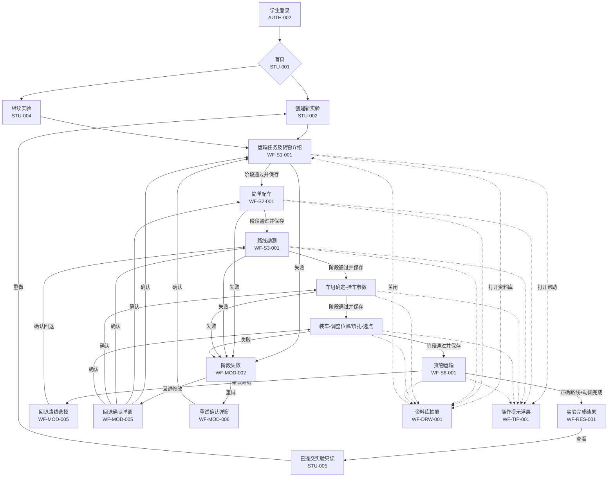

# 六阶段低保真原型

> 编制日期：2026-06-23  
> 任务：第2周第9天（总第9天）六阶段低保真原型  
> 基线状态：基于第8天学生端信息架构  
> 专业边界：所有运输判断仅用于教学，不替代真实工程勘测、设计、审查或安全论证。

---

## 1. 文档目标与依据

### 1.1 文档目标

本文档为学生端六阶段实验流程建立低保真原型，明确每个阶段页面的目标、信息区、操作区、参数区、提示区、错误反馈、保存状态、提交按钮、继续条件、回退入口和失败/重试状态，为后续前端页面、路由、状态机、规则引擎、日志、评分和三维交互开发提供页面基线。

### 1.2 文档依据

| 序号 | 依据文档 | 用法 |
|---|---|---|
| 1 | `docs/论文功能映射.md` | 功能编号、角色、数据对象、论文来源 |
| 2 | `docs/用户与场景.md` | STU场景、权限、待确认事项 |
| 3 | `docs/六阶段实验主流程.md` | 15状态、54转换、六阶段与恢复规则 |
| 4 | `docs/通用功能与页面清单.md` | 页面编号复用 |
| 5 | `docs/专业规则目录.md` | 44条规则分类与编号 |
| 6 | `docs/范围排除清单与变更流程.md` | IN/SUP/OUT边界 |
| 7 | `docs/第1周需求复盘与G1预审.md` | CON/GAP/RISK约束 |
| 8 | `docs/学生端信息架构.md` | 导航层级、入口关系、40项页面追踪 |
| 9 | 126天实施计划 | 第9天要求与验收标准 |

### 1.3 需求属性

- **论文明确要求**：论文第2—4章直接描述
- **根据论文合理推导**：为实现数据隔离、流程闭环、可恢复和可验收而补充的最小规则
- **实施计划要求**：126天实施计划明确纳入首版
- **论文未明确**：现有文档均不能确定，须后续确认
- **首版暂不实现**：实施计划明确排除或属研究过程

---

## 2. 原型设计原则

### 2.1 页面与组件边界

| 边界类型 | 定义 | 路由/状态要求 | 示例 |
|---|---|---|---|
| 独立页面 | 具有独立路由、URL可直接访问 | 完整鉴权与恢复路径 | EXP-S1-001 |
| 页面内区域 | 同一页面中的分块区域 | 不产生新路由 | 参数区、操作区 |
| 页面内标签页 | 页面内的标签切换 | 切换不改变路由 | 路线切换标签 |
| 弹窗 | 模态覆盖，阻断背景操作 | 可关闭，关闭不改变实验状态 | 阶段通过弹窗 |
| 抽屉 | 侧边滑出面板 | 不改变路由和保存状态 | 资料库抽屉 |
| 浮层提示 | 轻量信息或错误提示 | 自动消失或手动关闭 | 操作提示浮层 |
| 加载状态 | 数据或资源加载中 | 显示进度；失败可重试 | 阶段加载状态 |
| 空状态 | 查询成功但无数据 | 显示无记录说明与下一步 | 无数据状态 |
| 错误状态 | 技术/业务/权限失败 | 明确错误类型和恢复入口 | 保存失败状态 |
| 只读状态 | 已完成尝试查看模式 | 禁止所有写操作 | 已完成只读视图 |

### 2.2 状态覆盖要求

每个阶段页面及其通用外壳必须覆盖以下状态（不要求每页全部有独立UI，但必须明确当前状态归属）：

| 编号 | 状态名称 | 类型 | 说明 |
|---|---|---|---|
| ST-01 | 加载中 | 技术 | 阶段数据/资源正在加载 |
| ST-02 | 加载失败 | 技术 | 阶段数据/资源加载出错 |
| ST-03 | 空数据 | 业务 | 合法查询但无内容 |
| ST-04 | 参数缺失 | 业务 | 必要输入数据不完整 |
| ST-05 | 可操作 | 业务 | 学生可正常编辑/操作 |
| ST-06 | 只读 | 权限 | 已完成尝试查看模式 |
| ST-07 | 保存中 | 技术 | 正在持久化数据 |
| ST-08 | 保存成功 | 业务 | 数据已确认持久化 |
| ST-09 | 保存失败 | 技术 | 持久化未确认 |
| ST-10 | 规则检查中 | 业务 | 提交后系统正在校验 |
| ST-11 | 规则通过 | 业务 | 校验通过 |
| ST-12 | 规则不通过 | 业务 | 校验失败 |
| ST-13 | 阻断性错误 | 业务 | 阻止继续的严重业务错误 |
| ST-14 | 技术异常 | 技术 | 网络/资源/服务异常 |
| ST-15 | 网络中断 | 技术 | 网络连接断开 |
| ST-16 | 网络恢复 | 技术 | 网络重连成功 |
| ST-17 | 日志待重试 | 技术 | 日志写入未确认 |
| ST-18 | 下游结果失效 | 业务 | 上游变更使下游结论过期 |
| ST-19 | 未解锁阶段 | 业务 | 前序未通过不可进入 |
| ST-20 | 已完成阶段 | 业务 | 阶段已通过并保存 |

### 2.3 入口与权限规则

1. 学生只能进入本人实验。
2. 学生不得进入教师端或其他学生实验。
3. 已完成实验进入只读模式。
4. 重做必须创建新的实验尝试。
5. 未通过前序阶段不得进入后续阶段。
6. 修改上游数据后，受影响的下游页面必须显示结果失效并要求重新校验。
7. 未成功保存不得显示"已提交"或"已完成"。
8. 页面刷新、短暂断网或重新登录后，应从最近成功保存点恢复。
9. 技术异常不得显示成学生操作错误。
10. 规则不通过不得显示成系统故障。

---

## 3. 六阶段名称与顺序

六阶段名称和顺序严格固定，不得修改：

| 序号 | 阶段名称 | 页面编号 | 后续阶段 |
|---|---|---|---|
| 1 | 运输任务及货物介绍 | WF-S1-001 | → 简单配车 |
| 2 | 简单配车 | WF-S2-001 | → 路线勘测 |
| 3 | 路线勘测 | WF-S3-001 | → 车组确定 |
| 4 | 车组确定 | WF-S4-001 | → 货物装车与绑扎加固 |
| 5 | 货物装车与绑扎加固 | WF-S5-001 | → 货物运输 |
| 6 | 货物运输 | WF-S6-001 | → 实验完成结果 |

来源：论文2.3.5、3.4.2；映射§3；主流程§5。

---

## 4. 通用实验工作区框架

### 4.1 框架说明

六阶段共用一个实验工作区外壳，外壳固定显示六阶段进度、当前阶段信息、保存状态、帮助入口和底部操作区。六个阶段页面内容在框架的内容区内切换。

| 项目 | 内容 |
|---|---|
| 页面编号 | WF-COM-001 |
| 页面名称 | 六阶段实验总工作区 |
| 页面类型 | 共享框架（独立页面内含阶段切换） |
| 所属阶段 | 全部六阶段 |
| 使用角色 | 学生 |
| 页面目标 | 提供六阶段实验的共享外壳，统一呈现进度、状态和操作入口 |
| 进入入口 | 创建新实验确认（STU-002）或继续实验恢复（STU-004） |
| 前置条件 | 尝试归属本人、案例/规则可用、保存点有效 |

### 4.2 布局草图

```text
┌──────────────────────────────────────────────────────────┐
│ [阶段名称]              六阶段进度条 ○●○○○○    保存状态 │
├──────────────────────────────────────────────────────────┤
│ 阶段目标：简述本阶段要完成什么                           │
├──────────────────────────────────────────────────────────┤
│ ┌───┬───┬───┬───┬───┬───┐                              │
│ │ S1│ S2│ S3│ S4│ S5│ S6│  六阶段进度（高亮当前）      │
│ │ ✔ │ ✔ │ ▶ │ 🔒│ 🔒│ 🔒│  ✔通过  ▶当前  🔒未解锁  │
│ └───┴───┴───┴───┴───┴───┘                              │
├──────────────────────────────────────────────────────────┤
│                                                          │
│  内容区（阶段特定页面内容）                              │
│  学生操作区 / 参数结果区 / 三维展示区                   │
│                                                          │
├──────────────────────────────────────────────────────────┤
│ [资料库] [帮助]   状态：已保存    [上一步] [提交/继续]  │
└──────────────────────────────────────────────────────────┘
```

### 4.3 区域说明

| 区域 | 位置 | 内容 |
|---|---|---|
| 顶部标题区 | 外壳顶部 | 当前阶段名称、六阶段进度条（含各阶段状态图标）、保存状态指示器、是否只读标识 |
| 阶段目标区 | 进度条下方 | 本阶段要完成什么、完成后进入哪个阶段、失败后果简述 |
| 内容区 | 中部主区域 | 随阶段切换，包含操作区、参数区、三维展示区等 |
| 底部操作区 | 外壳底部 | 资料库按钮、帮助按钮、保存状态、上一步、提交/继续按钮 |
| 资料库入口 | 底部左侧 | 打开资料库抽屉（WF-DRW-001） |
| 帮助入口 | 底部左侧 | 打开操作提示浮层（WF-TIP-001） |

### 4.4 状态映射

| 工作区状态 | 显示方式 | 说明 |
|---|---|---|
| 加载中 | 内容区显示加载骨架/进度 | ST-01 |
| 加载失败 | 内容区显示错误+重试 | ST-02 |
| 可操作 | 内容区正常显示，操作控件可用 | ST-05 |
| 只读 | 顶部标识"只读查看"，控件禁用 | ST-06 |
| 保存中 | 底部显示"保存中…" | ST-07 |
| 保存成功 | 底部显示"已保存" | ST-08 |
| 保存失败 | 底部显示"保存失败，点击重试" | ST-09 |
| 未解锁阶段 | 该阶段进度点显示🔒，不可点击 | ST-19 |
| 已完成阶段 | 该阶段进度点显示✔ | ST-20 |
| 下游失效 | 阶段进度点显示⚠️失效标识 | ST-18 |

### 4.5 核心操作

- 查看六阶段进度
- 打开资料库抽屉
- 请求当前步骤帮助
- 保存草稿（手动或自动）
- 提交当前阶段
- 上一步/回退
- 继续下一阶段

### 4.6 保存要求

- 每个阶段通过后保存完整快照
- 关键选择可保存草稿
- 保存状态实时反映在底部操作区
- 自动保存频率未定，但关键操作必须即时保存

### 4.7 日志要求

- 记录每个阶段的进入、操作、提交和通过/失败事件
- 记录资料库打开和帮助请求

### 4.8 验收标准

- 六阶段进度条正确反映每个阶段状态
- 未解锁阶段不可点击
- 只读模式下所有控件禁用
- 保存状态实时更新
- 资料库和帮助可打开并返回原状态

| 需求属性 | 需求来源 |
|---|---|
| 实施计划要求 | 六阶段实验主流程§3、§5；学生端信息架构§13 |

---

## 5. 通用页面状态

### 5.1 通用加载状态（WF-COM-002）

```text
┌──────────────────────────────────────────────┐
│ [阶段名称]           ●●○○○○     —           │
├──────────────────────────────────────────────┤
│ 正在加载阶段数据…                             │
│ ████████░░░░░░ 80%                          │
│ [取消]                                       │
└──────────────────────────────────────────────┘
```

- **页面类型**：加载状态（框架内区域）
- **触发条件**：进入新阶段、恢复实验、保存点加载
- **显示内容**：加载进度、阶段名称、取消按钮
- **失败去向**：WF-COM-002-ERR（加载失败状态）
- **超时处理**：超过15秒显示重试按钮

### 5.2 通用保存失败状态（WF-COM-003）

```text
┌──────────────────────────────────────────────┐
│ 保存失败                                       │
│ 数据未保存成功，请重试。                       │
│ [重试] [返回上一步]                            │
└──────────────────────────────────────────────┘
```

- **页面类型**：错误状态（弹窗或浮层）
- **触发条件**：保存操作未收到服务端确认
- **显示内容**：失败对象、重试入口
- **约束**：确认成功前不显示"阶段通过"或"已提交"

### 5.3 通用技术异常状态（WF-COM-004）

```text
┌──────────────────────────────────────────────┐
│ 系统异常                                       │
│ 网络连接或系统服务暂时不可用。                 │
│ 原因：[具体异常类型]                          │
│ 提示：这不影响你的实验评分。                   │
│ [重试] [返回最近保存点]                        │
└──────────────────────────────────────────────┘
```

- **页面类型**：错误状态（弹窗或浮层）
- **触发条件**：网络中断、资源加载失败、服务超时
- **显示内容**：异常类型、恢复入口
- **约束**：不计为学生业务错误，不增加错误计数

### 5.4 通用空数据状态（WF-COM-006）

```text
┌──────────────────────────────────────────────┐
│ 暂无数据                                       │
│ 当前没有可显示的内容。                         │
│ [创建新实验] [返回首页]                        │
└──────────────────────────────────────────────┘
```

### 5.5 通用无权限状态（WF-COM-007）

```text
┌──────────────────────────────────────────────┐
│ 无权访问                                       │
│ 你没有权限访问该页面。                         │
│ [返回首页]                                     │
└──────────────────────────────────────────────┘
```

---

## 6. 运输任务及货物介绍原型（WF-S1-001）

### 6.1 页面基本信息

| 项目 | 内容 |
|---|---|
| 页面编号 | WF-S1-001 |
| 页面名称 | 运输任务及货物介绍 |
| 页面类型 | 工作区内容页 |
| 所属阶段 | 1—运输任务及货物介绍 |
| 使用角色 | 学生 |
| 页面目标 | 让学生理解任务背景、起止点、道路状况、装运要求和货物参数，为后续配车提供输入基础 |
| 进入入口 | 创建新实验成功后自动进入 |
| 前置条件 | 尝试归属本人、案例/任务/货物模型和必需参数可加载 |

### 6.2 布局草图

```text
┌──────────────────────────────────────────────────────────────┐
│ 运输任务及货物介绍          ●○○○○○     已保存               │
│ 目标：了解任务与货物参数，确认后进入简单配车                  │
├──────────────────────────────────────────────────────────────┤
│ ┌──┬──┬──┬──┬──┬──┐                                        │
│ │▶ │🔒│🔒│🔒│🔒│🔒│  当前阶段高亮                          │
│ └──┴──┴──┴──┴──┴──┘                                        │
├───────────────┬──────────────────────────────────────────────┤
│ 任务参数区    │ 三维展示区（货物 360°查看）                   │
│               │                                               │
│ 案例名称：    │  ┌────────────────────────────────────┐      │
│   浙江石化    │  │        [货物 3D 模型占位]          │      │
│   气化炉运输  │  │   可拖动旋转、滚轮缩放             │      │
│               │  │                                    │      │
│ 起点：XXXX    │  └────────────────────────────────────┘      │
│ 终点：XXXX    │  [重置视角] [查看尺寸] [查看重心]             │
│               │                                               │
│ 运输要求：    │                                               │
│ • 时间要求    │                                               │
│ • 特殊要求    │                                               │
│               │                                               │
│ 货物参数：    │                                               │
│ 名称：气化炉  │                                               │
│ 重量：XXX kg  │                                               │
│ 尺寸：L×W×H   │                                               │
│ 重心：X Y Z   │                                               │
│ 材质：XXXX    │                                               │
├───────────────┴──────────────────────────────────────────────┤
│ [资料库] [帮助]  状态：已保存   [提交并进入简单配车]         │
└──────────────────────────────────────────────────────────────┘
```

### 6.3 核心展示内容

| 展示项 | 内容 | 来源 |
|---|---|---|
| 案例名称 | 浙江石化气化炉运输方案 | 论文明确要求 |
| 起止点 | 装运起止地 | 论文明确要求 |
| 道路状况 | 途经路段、停车/食宿点 | 论文明确要求 |
| 装运要求 | 时间、货主要求 | 论文明确要求 |
| 货物参数 | 名称、数量、厂家、重量、长宽高、形状、重心 | 论文明确要求 |
| 货物三维 | 支持旋转、缩放、参数联动展示 | 论文明确要求 |

### 6.4 区域说明

| 区域 | 位置 | 说明 |
|---|---|---|
| 任务参数区 | 左侧 | 展示案例名称、起止点、运输要求、货物参数列表 |
| 三维展示区 | 右侧 | 货物 3D 模型占位区域，可旋转/缩放/重置，参数联动 |
| 模型操作栏 | 三维区下方 | 重置视角、查看尺寸、查看重心等辅助功能按钮 |

### 6.5 核心操作

| 操作 | 类型 | 说明 |
|---|---|---|
| 阅读任务参数 | 阅读 | 浏览任务背景和货物参数 |
| 查看货物三维模型 | 交互 | 拖动旋转、滚轮缩放、重置视角 |
| 查看尺寸/重心 | 点击 | 点击后三维模型高亮对应参数 |
| 确认已阅读 | 点击 | 确认理解后提交，进入下一阶段 |

### 6.6 输入/输出数据

| 数据 | 类型 | 来源 |
|---|---|---|
| 输入 | 案例ID、货物ID | 系统/案例数据 |
| 输出 | 确认事件、查看/缩放事件、阶段通过状态 | 日志 |

### 6.7 系统判断

| 判断 | 条件 |
|---|---|
| 必需字段完整性 | 起点、终点、货物重量、长宽高、重心数据齐全 |
| 模型/参数资源可用 | 3D模型和参数绑定正常 |
| 学生确认动作 | 学生点击确认提交 |

### 6.8 继续条件

| 条件 | 允许/阻止 |
|---|---|
| 所有必需任务和货物数据齐全 | 允许继续 |
| 学生已完成确认操作 | 允许继续 |
| 360°交互可用 | 允许继续 |
| 任一必需字段缺失 | 阻止继续 |
| 模型/资源加载失败 | 阻止继续（技术异常，不计业务错） |

### 6.9 失败状态

| 失败类型 | 显示 | 恢复 |
|---|---|---|
| 任务数据缺失 | 左侧参数区红色标记缺失字段 | 补齐数据后重试 |
| 货物参数缺失 | 标注缺失参数名 | 补充案例数据 |
| 模型加载失败 | 三维区显示[模型加载失败，重试] | 重试加载 |
| 确认未完成 | 提交按钮禁用 | 完成确认后再提交 |

### 6.10 回退/重试入口

| 操作 | 入口 | 目标 |
|---|---|---|
| 回退 | 无（第一阶段无前序阶段） | — |
| 重试 | 加载失败时显示重试按钮 | 重新加载阶段数据 |

### 6.11 保存要求

- 创建尝试时保存
- 确认提交时保存确认事件
- 阶段通过后保存完整快照

### 6.12 验收标准

| 验收项 | 标准 |
|---|---|
| 任务和货物关键参数均展示 | 起止点、道路、要求、重量、长宽高、重心均可见 |
| 模型可完整环绕和缩放 | 拖动可环绕一周，滚轮缩放在有效范围 |
| 删除任一必需字段后不能进入下一阶段 | 缺数据时提交按钮禁用或提交被阻止 |
| 参数缺失有明确标注 | 缺失字段名明确显示 |

| 需求属性 | 需求来源 |
|---|---|
| 论文明确要求 | 论文2.2、3.4.2；映射SIM-001—004；主流程§6 |

---

## 7. 简单配车原型（WF-S2-001）

### 7.1 页面基本信息

| 项目 | 内容 |
|---|---|
| 页面编号 | WF-S2-001 |
| 页面名称 | 简单配车 |
| 页面类型 | 工作区内容页 |
| 所属阶段 | 2—简单配车 |
| 使用角色 | 学生 |
| 页面目标 | 了解三种车组组合方式，选择组合方式、挂车轴线/纵列和牵引车种类/数量，形成通过初步校验的车组方案 |
| 进入入口 | 第一阶段通过并保存后自动进入 |
| 前置条件 | 任务与货物参数有效、三种组合方式及车辆参数可用 |

### 7.2 布局草图

```text
┌──────────────────────────────────────────────────────────────┐
│ 简单配车                    ●●○○○○     已保存               │
│ 目标：选择车组组合、挂车和牵引车，形成初步车组方案           │
├──────────────────────────────────────────────────────────────┤
│ ┌──┬──┬──┬──┬──┬──┐                                        │
│ │✔ │▶ │🔒│🔒│🔒│🔒│  ✔通过  ▶当前  🔒未解锁              │
│ └──┴──┴──┴──┴──┴──┘                                        │
├──────────────────────────────────────────────────────────────┤
│ 组合方式选择 ──────────────────────────────────────          │
│ ○ 带鹅颈半挂牵引车   [查看动画] [优缺点]                    │
│ ○ 不带鹅颈全挂牵引车  [查看动画] [优缺点]                    │
│ ● 自行式液压轴线车   [查看动画] [优缺点]                    │
│                                                              │
│ ──── 挂车选择 ──────────────────────────                    │
│ 轴线数：[2 ▼]  纵列数：[1 ▼]                                │
│ 当前挂车参数：长 XXm × 宽 XXm  承载 XXt                     │
│                                                              │
│ ──── 牵引车选择 ────────────────────────                    │
│ 种类：[6×6 ▼]  数量：[1 ▼]                                  │
│ 牵引力计算：有效牵引力 XXXkN ≥ 行驶阻力 XXXkN               │
│                                                              │
│ ──── 规则检查结果 ─────────────────────                     │
│ ✅ 组合方式适用                                              │
│ ✅ 挂车尺寸/承载满足                                         │
│ ✅ 牵引力满足                                                 │
│ ❌ 经济性比较：论文未明确，暂不判断                           │
│                                                              │
│ 当前组合参数汇总：                                            │
│ 组合：自行式液压轴线车  轴线：2  纵列：1  牵引车：6×6×1     │
│ 车货总重：XXXt                                               │
├──────────────────────────────────────────────────────────────┤
│ [资料库] [帮助]  状态：已保存  [上一步] [提交并进入路线勘测] │
└──────────────────────────────────────────────────────────────┘
```

### 7.3 核心展示内容

| 展示项 | 说明 |
|---|---|
| 三种组合方式 | 名称、动画入口、优缺点说明 |
| 挂车参数 | 轴线数/纵列数选择、尺寸/承载参数 |
| 牵引车参数 | 6×6/8×8种类、数量、动力参数 |
| 规则检查结果 | 逐项显示通过/不通过及原因 |
| 当前组合汇总 | 所选全部参数的摘要 |

### 7.4 核心操作

| 操作 | 说明 |
|---|---|
| 查看组合动画 | 点击播放对应组合动画 |
| 查看优缺点 | 点击展开组合优缺点说明 |
| 选择组合方式 | 单选按钮选择一种组合 |
| 选择轴线数/纵列数 | 下拉或数值选择 |
| 选择牵引车种类/数量 | 下拉选择 |
| 查看牵引力计算 | 系统自动计算并显示 |
| 提交方案 | 点击提交进行规则校验 |

### 7.5 系统判断

| 判断 | 条件 |
|---|---|
| 组合适用性 | 是否匹配案例允许集合 |
| 挂车尺寸/承载 | 货物尺寸和重量是否在挂车参数范围内 |
| 牵引力 | 有效牵引力≥行驶阻力（相等通过） |
| 输入完整性 | 所有必选项已选择 |

### 7.6 继续条件

| 条件 | 允许/阻止 |
|---|---|
| 组合方式已选择 | 允许 |
| 挂车参数已选择 | 允许 |
| 牵引车已选择 | 允许 |
| 全部规则检查通过 | 允许继续 |
| 任一规则不通过 | 阻止继续，显示失败原因 |

### 7.7 失败状态与恢复

| 失败类型 | 恢复目标 |
|---|---|
| 组合不适用 | 回组合方式选择，显示原因 |
| 挂车参数不满足 | 回挂车参数选择，显示不满足项 |
| 牵引力不足 | 回牵引车选择，显示计算过程 |
| 参数缺失 | 显示缺失字段，补齐后重提 |

### 7.8 回退/重试入口

| 操作 | 目标 |
|---|---|
| 上一步 | 返回第一阶段（只读查看已保存结果） |
| 重试 | 在本阶段修改选择后重新提交 |

### 7.9 三维展示说明

本阶段需要3D场景展示组合动画和车辆模型参数。首版可先用参数化示意或简易3D占位，不要求完整动画。

| 需求属性 | 需求来源 |
|---|---|
| 论文明确要求 | 论文2.3.5、3.4.2；映射SIM-005—010；主流程§7 |

---

## 8. 路线勘测原型（WF-S3-001）

### 8.1 页面基本信息

| 项目 | 内容 |
|---|---|
| 页面编号 | WF-S3-001 |
| 页面名称 | 路线勘测 |
| 页面类型 | 工作区内容页（含路线切换标签） |
| 所属阶段 | 3—路线勘测 |
| 使用角色 | 学生 |
| 页面目标 | 完成三条候选路线的五类障碍勘测，形成通行/处置/淘汰结论并选择一条可行路线 |
| 进入入口 | 第二阶段通过并保存后自动进入 |
| 前置条件 | 初步车组有效、三条路线及五类障碍对象可加载 |

### 8.2 布局草图

```text
┌──────────────────────────────────────────────────────────────┐
│ 路线勘测                    ●●●○○○     已保存               │
│ 目标：测量三条路线的障碍，选择可通行路线                      │
├──────────────────────────────────────────────────────────────┤
│ ┌──┬──┬──┬──┬──┬──┐                                        │
│ │✔ │✔ │▶ │🔒│🔒│🔒│                                      │
│ └──┴──┴──┴──┴──┴──┘                                        │
├──────────┬───────────────────────────────────────────────────┤
│ 路线标签 │ 障碍勘测区                             3D场景区  │
├──────────┤                                               │
│ [路线A]  │ 高度：净高 XXm > 总高 XXm → ✅可通行    │ 路线A   │
│ [路线B]  │ 圆弧弯道：半径满足 → ✅可通行           │ 场景    │
│ [路线C]  │ 直交弯道：出口宽满足 → ✅可通行         │ 占位    │
│          │ 坡度：牵引力满足 → ✅可通行              │         │
│          │ 桥梁：总重≤承载 → ✅可通行               │         │
│          │                                           │         │
│          │ 路线状态：✅ 可通行（0项不可处置）       │         │
│          │                                           │         │
│          │ 测量操作：                                 │         │
│          │ [测量高度] [测量圆弧] [测量直交]          │         │
│          │ [测坡度] [查看桥梁]                       │         │
│          │                                           │         │
│          │ 测量结果：输入值→计算值→结论             │         │
│          │ 处置选项：[可处置] [不可处置→淘汰路线]    │         │
│          │                                           │         │
│          │ [选择此路线]                               │         │
├──────────┴───────────────────────────────────────────────────┤
│ [资料库] [帮助]  状态：已保存  [上一步] [提交并进入车组确定] │
└──────────────────────────────────────────────────────────────┘
```

### 8.3 核心操作

| 操作 | 说明 |
|---|---|
| 切换路线标签 | 在路线A/B/C之间切换，不丢已测数据 |
| 测量障碍 | 点击各类测量入口，输入/选择测量值 |
| 查看计算结果 | 系统计算后显示通行结论 |
| 选择处置方案 | 对不可通行障碍选择处置方式或淘汰 |
| 选择路线 | 从可通行路线中选择一条 |
| 提交阶段 | 确认勘测结果并提交 |

### 8.4 五类障碍测量

| 障碍类型 | 测量输入 | 系统计算 | 结论 |
|---|---|---|---|
| 高度 | 净高 | 与车货总高比较 | 可通行/调整后通行/不可通行 |
| 圆弧弯道 | 弯道半径 | 计算最小内外转弯半径并比较 | 可通行/不可通行 |
| 直交弯道 | 夹角、出入口宽、内圆角半径 | 计算所需最小出口宽度并比较 | 可通行/不可通行 |
| 坡度 | 水平距离、垂直距离 | 计算坡度、阻力、牵引力 | 可通行/不可通行 |
| 桥梁 | 桥梁承载能力 | 与车货总重比较 | 可通行/不可通行 |

### 8.5 经济性处理

论文未明确经济性计算公式和处置成本。首版处理：
- 优先按可通行性筛选
- 不自行设计经济排序算法
- 界面显示"经济性：论文未明确，暂不排序"

### 8.6 继续条件

| 条件 | 允许/阻止 |
|---|---|
| 三条路线五类障碍均有测量记录 | 允许 |
| 每条路线有明确结论（可通行/淘汰） | 允许 |
| 已选择一条可通行路线 | 允许 |
| 任一必需测量缺失 | 阻止 |
| 选择不可处置/被淘汰路线 | 阻止 |

### 8.7 失败状态与恢复

| 失败类型 | 恢复目标 |
|---|---|
| 测量缺失 | 回对应路线对应测量步骤 |
| 判断错误 | 回对应障碍判断步骤 |
| 选择不可通行路线 | 回路线选择步骤 |

### 8.8 三维展示说明

本阶段需要3D场景展示三条路线、障碍物位置和测量点。场景加载失败时显示路线示意图/参数化表格替代。

| 需求属性 | 需求来源 |
|---|---|
| 论文明确要求 | 论文3.4.2；映射SIM-011—018；主流程§8 |

---

## 9. 车组确定原型（WF-S4-001）

### 9.1 页面基本信息

| 项目 | 内容 |
|---|---|
| 页面编号 | WF-S4-001 |
| 页面名称 | 车组确定 |
| 页面类型 | 工作区内容页（含多步骤标签） |
| 所属阶段 | 4—车组确定 |
| 使用角色 | 学生 |
| 页面目标 | 依据路线约束完成牵引车/悬架/挂车调整、挂车拼接、三点液压编点、阀门操作和轴载校核，正式确定车组 |
| 进入入口 | 第三阶段通过并保存后自动进入 |
| 前置条件 | 选定路线及障碍结论有效、初步车组和校核参数可用 |

### 9.2 布局草图

```text
┌──────────────────────────────────────────────────────────────┐
│ 车组确定                    ●●●●○○     已保存               │
│ 目标：根据路线调整车组，完成拼接、液压编点和轴载校核          │
├──────────────────────────────────────────────────────────────┤
│ ┌──┬──┬──┬──┬──┬──┐                                        │
│ │✔ │✔ │✔ │▶ │🔒│🔒│                                      │
│ └──┴──┴──┴──┴──┴──┘                                        │
├──────────┬───────────────────────────────────────────────────┤
│ 步骤导航 │ 操作区                                   3D区   │
├──────────┤                                               │
│ [①配置] │ 路线约束影响：                          │ 车组   │
│ [②拼接] │ 坡度→增加1台牵引车                      │ 3D     │
│ [③编点] │ 高度→调整悬架高度                      │ 占位   │
│ [④阀门] │                                           │        │
│ [⑤校核] │ 牵引车：[6×6]×2台   悬架高：XXXm       │        │
│          │ 挂车：轴线[4] 纵列[2]                     │        │
│          │                                           │        │
│          │ 三点坐标：                                │        │
│          │ 点A (X,Y)  点B (X,Y)  点C (X,Y)          │        │
│          │ 回路区域：[回路1] [回路2] [回路3]         │        │
│          │                                           │        │
│          │ 阀门状态：                                │        │
│          │ 控制箱1：上[开] 下[关]                    │        │
│          │ 控制箱2：上[关] 下[开]                    │        │
│          │ 控制箱3：上[开] 下[开]                    │        │
│          │                                           │        │
│          │ ─── 轴线载荷校核 ────                    │        │
│          │ 轴1：XXkN ≤ XXkN ✅                       │        │
│          │ 轴2：XXkN ≤ XXkN ✅                       │        │
│          │ 轴3：XXkN ≤ XXkN ✅                       │        │
│          │ 轴4：XXkN ≤ XXkN ✅                       │        │
│          │ 结论：✅ 全部满足                         │        │
├──────────┴───────────────────────────────────────────────────┤
│ [资料库] [帮助]  状态：已保存  [上一步] [提交并进入装车绑扎] │
└──────────────────────────────────────────────────────────────┘
```

### 9.3 核心操作

| 步骤 | 操作 |
|---|---|
| ① 配置 | 增加牵引车、调整悬架高度、选择挂车轴线/纵列 |
| ② 拼接 | 点击/拖拽挂车单元拼接成目标结构 |
| ③ 编点 | 在挂车平面标记三点坐标，划分三处回路 |
| ④ 阀门 | 点击控制箱阀门旋转，使回路断开/联通 |
| ⑤ 校核 | 提交轴载计算，检查各轴是否超限 |

### 9.4 系统判断

| 判断 | 条件 |
|---|---|
| 路线约束响应 | 坡度/高度等约束有对应调整 |
| 拼接正确性 | 拓扑结构与目标配置一致 |
| 编点正确性 | 三点坐标和回路划分与答案一致 |
| 阀门状态 | 三个控制箱状态组合正确 |
| 轴载校核 | 所有轴线载荷≤允许上限 |

### 9.5 继续条件

| 条件 | 允许/阻止 |
|---|---|
| 配置满足路线约束 | 允许继续到拼接 |
| 拼接正确完成 | 允许继续到编点 |
| 编点正确 | 允许继续到阀门操作 |
| 阀门状态正确 | 允许提交轴载校核 |
| 全轴线载荷合格 | 允许进入下一阶段 |
| 任一轴超限 | 回退到挂车参数选择 |

### 9.6 失败状态与恢复

| 失败类型 | 恢复目标 |
|---|---|
| 配置错误 | 回当前配置步骤 |
| 拼接错误 | 回拼接步骤，重置错误连接 |
| 编点/回路错误 | 回编点步骤 |
| 阀门状态错误 | 回阀门操作步骤 |
| 轴载超限 | 唯一回挂车参数选择，修改后重新校核 |

### 9.7 三维展示说明

本阶段需要3D场景展示车组配置、挂车拼接和液压编点。首版可用参数化表格+示意图结合，3D模型用占位。

| 需求属性 | 需求来源 |
|---|---|
| 论文明确要求 | 论文2.3.5、3.4.2；映射SIM-019—023；主流程§9 |

---

## 10. 货物装车与绑扎加固原型（WF-S5-001）

### 10.1 页面基本信息

| 项目 | 内容 |
|---|---|
| 页面编号 | WF-S5-001 |
| 页面名称 | 货物装车与绑扎加固 |
| 页面类型 | 工作区内容页（含装车/绑扎两个操作区域） |
| 所属阶段 | 5—货物装车与绑扎加固 |
| 使用角色 | 学生 |
| 页面目标 | 完成货物重心对准、液压反馈检查以及顺序、点位、布置和角度均合格的绑扎加固 |
| 进入入口 | 第四阶段通过并保存后自动进入 |
| 前置条件 | 货物、正式车组、液压反馈、工具和绑扎点资源可用 |

### 10.2 布局草图

```text
┌──────────────────────────────────────────────────────────────┐
│ 货物装车与绑扎加固          ●●●●●○     已保存               │
│ 目标：对准重心，按顺序绑扎加固                                │
├──────────────────────────────────────────────────────────────┤
│ ┌──┬──┬──┬──┬──┬──┐                                        │
│ │✔ │✔ │✔ │✔ │▶ │🔒│                                      │
│ └──┴──┴──┴──┴──┴──┘                                        │
├──────────────────────────────────────────────────────────────┤
│ ──── 装车区 ─────────────────────────────────                │
│                                                              │
│  ┌────────────────────────────────────┐                      │
│  │   [货物 3D 模型占位]               │  重心对准提示       │
│  │   键盘/拖拽放置货物                │  X轴偏移：+XXcm     │
│  │   货物重心→车组中心                │  Y轴偏移：-XXcm     │
│  └────────────────────────────────────┘  Z轴偏移：0cm       │
│                                         → ⚠️ 请向右调整    │
│  液压表读数：                                              │
│  回路1：XXMPa  回路2：XXMPa  回路3：XXMPa   ✅ 平衡      │
│                                                              │
│ ──── 绑扎区 ─────────────────────────────────                │
│                                                              │
│ 工具顺序（当前：第3步—钢丝绳）：                             │
│ [✅橡胶垫] → [✅梯子] → [✅安全带] → [▶钢丝绳] → [葫芦] → [衬垫]│
│                                                              │
│ 绑扎工具栏：                                                │
│ [橡胶垫] [梯子]  [安全带] [钢丝绳] [紧固葫芦] [防磨衬垫]    │
│                                                              │
│ 绑扎点选择（4选2）：                                        │
│  ● 点A   ○ 点B   ● 点C   ○ 点D                            │
│                                                              │
│ 倒八字布置：✅ 已形成                                       │
│ 钢丝绳夹角：45° ≤ 60° ✅                                    │
├──────────────────────────────────────────────────────────────┤
│ [资料库] [帮助]  状态：已保存  [上一步] [提交并进入运输]     │
└──────────────────────────────────────────────────────────────┘
```

### 10.3 核心展示内容

| 展示项 | 内容 |
|---|---|
| 货物放置区 | 货物可移动区域、车组中心标记 |
| 重心偏移提示 | 三轴向偏移量、调整方向提示 |
| 液压表反馈 | 三回路读数、平衡状态指示 |
| 绑扎工具顺序 | 六步进度指示（橡胶垫→梯子→安全带→钢丝绳→紧固葫芦→防磨衬垫） |
| 绑扎工具栏 | 六类工具可选、当前应选步骤高亮 |
| 绑扎点选择 | 四个候选点（选2点，对角形成倒八字） |
| 夹角显示 | 钢丝绳与挂车板角度数值及比较结果 |

### 10.4 核心操作

| 操作 | 说明 |
|---|---|
| 键盘/拖拽放置货物 | 移动货物到目标位置 |
| 查看液压表 | 确认三回路读数 |
| 依次选择绑扎工具 | 按固定顺序点击工具 |
| 选择绑扎点 | 从四个候选点中选两个 |
| 提交绑扎 | 系统校验点位、角度和布置 |

### 10.5 绑定工具顺序

固定顺序：橡胶垫 → 梯子 → 安全带 → 钢丝绳 → 紧固葫芦 → 防磨衬垫
来源：论文3.4.2，TLS-001

### 10.6 系统判断

| 判断 | 条件 |
|---|---|
| 重心偏差 | 是否在允许范围内（阈值待确认） |
| 液压反馈 | 三个回路读数是否在合格区间（区间待确认） |
| 工具顺序 | 是否匹配当前绑扎步骤 |
| 绑扎点 | 是否选中正确点位 |
| 倒八字布置 | 两侧绳索是否形成倒八字 |
| 夹角 | 钢丝绳与挂车板≤60° |

### 10.7 待确认阈值

| 参数 | 状态 |
|---|---|
| 重心允许偏差 | 论文未明确，阈值配置后生效 |
| 液压表正确区间 | 论文未明确，阈值配置后生效 |
| 绑扎点坐标容差 | 论文未明确，阈值配置后生效 |

阈值配置为空时，界面显示"规则待确认"，不形成确定性通过结论。

### 10.8 继续条件

| 条件 | 允许/阻止 |
|---|---|
| 装车重心对准（已配置阈值内） | 允许进入绑扎 |
| 液压反馈合格 | 允许继续 |
| 工具顺序完整正确 | 允许继续 |
| 绑扎点位和角度正确 | 允许继续 |
| 偏移或液压不合格 | 回货物位置调整 |
| 工具错序 | 回当前绑扎步骤 |
| 点位或角度错误 | 回绑扎点选择 |

### 10.9 三维展示说明

本阶段需要3D场景展示货物放置、绑扎工具和绑扎点。工具选择可先用参数操作+反馈提示占位，不要求完整绑扎动画。

### 10.10 关于UI拆分为两个页签的说明

本阶段包含"装车"和"绑扎"两个紧密关联的子任务，但不应拆分为独立页面。建议在页面内用上下区域或左右区域区分，装车完成解锁绑扎区。

| 需求属性 | 需求来源 |
|---|---|
| 论文明确要求 | 论文3.3.2、3.4.2；映射SIM-024—027；主流程§10 |

---

## 11. 货物运输原型（WF-S6-001）

### 11.1 页面基本信息

| 项目 | 内容 |
|---|---|
| 页面编号 | WF-S6-001 |
| 页面名称 | 货物运输 |
| 页面类型 | 工作区内容页 |
| 所属阶段 | 6—货物运输 |
| 使用角色 | 学生 |
| 页面目标 | 汇总复验前五阶段有效结果，选择正确路线完成运输动画并锁定实验 |
| 进入入口 | 第五阶段通过并保存后自动进入 |
| 前置条件 | 前五阶段均为当前版本的有效"阶段通过"，无下游失效标记 |

### 11.2 布局草图

```text
┌──────────────────────────────────────────────────────────────┐
│ 货物运输                    ●●●●●●     已保存               │
│ 目标：复验方案，选择正确路线完成运输                          │
├──────────────────────────────────────────────────────────────┤
│ ┌──┬──┬──┬──┬──┬──┐                                        │
│ │✔ │✔ │✔ │✔ │✔ │▶ │                                      │
│ └──┴──┴──┴──┴──┴──┘                                        │
├──────────────────────────────────────────────────────────────┤
│ ──── 运输前复验汇总 ───────────────────────                  │
│                                                              │
│ 📋 任务与货物  ✅ 已确认                                    │
│ 🚛 初步车组    ✅ 已确认   组合：自行式液压轴线车            │
│ 🗺️ 选定路线    ✅ 路线A（3项障碍可通行，2项经处置通行）     │
│ 🔧 正式车组    ✅ 已确定   牵引车6×6×2  轴线4  纵列2        │
│ 📦 装车绑扎    ✅ 已通过   重心对准  绑扎合格                │
│                                                              │
│ 风险项：                                                     │
│ ⚠️ 路线A有两处需要处置后才能通行                             │
│ ⚠️ 处置方案：桥梁加固 + 临时道路拓宽                        │
│                                                              │
│ 通过项：全部五阶段结果均有效                                  │
│                                                              │
│ ──── 运输 ─────────────────────────────                     │
│                                                              │
│ [▶ 开始运输]                                                  │
│                                                              │
│ 运输动画区域（占位）：                                        │
│ ┌────────────────────────────────────┐                       │
│ │     [运输3D动画/成功占位]           │                       │
│ │     路线：路线A  状态：待开始       │                       │
│ └────────────────────────────────────┘                       │
├──────────────────────────────────────────────────────────────┤
│ [资料库] [帮助]  状态：已保存  [上一步] [提交完成实验]        │
└──────────────────────────────────────────────────────────────┘
```

### 11.3 核心展示内容

| 展示项 | 内容 |
|---|---|
| 五阶段结果汇总 | 每阶段状态、关键参数摘要 |
| 风险项清单 | 需要处置才能通行的障碍列表 |
| 通过项清单 | 全部合格的五阶段结果 |
| 运输动画区 | 成功/失败动画占位区域 |

### 11.4 核心操作

| 操作 | 说明 |
|---|---|
| 查看复验汇总 | 浏览五阶段结果摘要 |
| 点击开始运输 | 触发运输动画 |
| 查看运输结果 | 成功或失败反馈 |
| 提交完成实验 | 确认实验结果 |

### 11.5 系统判断

| 判断 | 条件 |
|---|---|
| 前五阶段版本相容 | 全部结果使用同一版本 |
| 路线正确性 | 所选路线是否为可经处置后通行的正确路线 |
| 动画资源可用 | 成功/失败动画资源可加载 |

### 11.6 继续条件

| 条件 | 允许/阻止 |
|---|---|
| 前五阶段关键结果齐全且版本相容 | 允许开始运输 |
| 选择正确路线 | 运输成功、进入实验完成 |
| 选择错误路线 | 播放失败动画、回退到路线选择 |
| 任一关键结果缺失或已失效 | 阻止开始运输 |
| 动画资源加载失败 | 技术异常阻止，显示重试 |

### 11.7 失败状态与恢复

| 失败类型 | 恢复目标 |
|---|---|
| 错误路线（两种错误路线） | 回第三阶段路线选择，第四/五阶段失效需重新校验 |
| 关键结果缺失/失效 | 回最早失效阶段 |
| 技术异常（动画/保存） | 回第六阶段保存点重试 |

### 11.8 三维展示说明

本阶段需要3D场景展示运输过程动画：
- 成功运输：车组沿正确路线行驶到达终点
- 失败运输：在障碍点停止并显示失败原因
首版可用预设动画或参数化示意占位。

| 需求属性 | 需求来源 |
|---|---|
| 论文明确要求 | 论文2.3.5、3.4.2；映射SIM-028；主流程§11 |

---

## 12. 实验中资料库抽屉（WF-DRW-001）

### 12.1 基本信息

| 项目 | 内容 |
|---|---|
| 页面编号 | WF-DRW-001 |
| 页面名称 | 实验中资料库 |
| 页面类型 | 侧边抽屉 |
| 所属阶段 | 全部六阶段 |
| 使用角色 | 学生 |
| 页面目标 | 在实验过程中随时查阅知识资料，不离开实验状态 |
| 进入入口 | 底部操作区[资料库]按钮 |
| 前置条件 | 当前实验阶段可交互 |

### 12.2 布局草图

```text
┌──────────────────────────────────┐
│ 资料库                    [✕]   │
├──────────────────────────────────┤
│ 目录                             │
├──────────────────────────────────┤
│ 📚 大件运输安全知识              │
│  ├─ 安全概述                     │
│  └─ 运输安全规范                 │
│ 📚 运输车组知识                  │
│  ├─ 组合方式                     │
│  ├─ 牵引车参数                   │
│  └─ 挂车参数                     │
│ 📚 运输方案制定                  │
│  ├─ 路线勘测                     │
│  ├─ 车组确定                     │
│  └─ 装车绑扎                     │
│ 📚 运输校核                      │
│  ├─ 法规校核                     │
│  └─ 安全校核                     │
│ 📂 教材章节                      │
│  ├─ 第X章 大件运输概况           │
│  └─ 第Y章 运输方案实例           │
├──────────────────────────────────┤
│ 推荐：当前阶段相关知识            │
│ → 简单配车—组合方式选择          │
└──────────────────────────────────┘
```

### 12.3 区域说明

| 区域 | 内容 |
|---|---|
| 顶部 | 标题"资料库"+ 关闭按钮 |
| 内容 | 章节目录树，可展开/折叠 |
| 推荐区 | 基于当前阶段的推荐阅读内容 |

### 12.4 核心操作

| 操作 | 说明 |
|---|---|
| 浏览目录 | 展开/折叠章节 |
| 选择章节 | 打开内容详情 |
| 关闭抽屉 | 返回实验原步骤 |

### 12.5 状态约束

- 打开资料库不改变实验保存状态
- 关闭后回到原阶段原步骤
- 不产生新路由
- 学习活动记录进入日志

| 需求属性 | 需求来源 |
|---|---|
| 论文明确要求 | 论文2.2、2.3.5、3.4.1 |

---

## 13. 实验中操作提示浮层（WF-TIP-001）

### 13.1 基本信息

| 项目 | 内容 |
|---|---|
| 页面编号 | WF-TIP-001 |
| 页面名称 | 操作提示 |
| 页面类型 | 轻量浮层/面板 |
| 所属阶段 | 全部六阶段 |
| 使用角色 | 学生 |
| 页面目标 | 提供当前步骤的操作方法提示，不直接代做 |
| 进入入口 | 底部操作区[帮助]按钮或自动触发（阻断错误时） |

### 13.2 布局草图

#### 主动帮助

```text
┌──────────────────────────────────┐
│ 当前步骤提示              [✕]   │
├──────────────────────────────────┤
│ 阶段：简单配车                    │
│ 步骤：选择挂车轴线数              │
├──────────────────────────────────┤
│ 提示：                            │
│ 根据货物尺寸和重量选择合适       │
│ 的挂车轴线数。                   │
│                                   │
│ - 货物长度：XXm                   │
│ - 货物重量：XXt                   │
│ - 单轴线承载：XXt                 │
│                                   │
│ 所需最少轴线数 = 货物重量 /       │
│  单轴线承载（向上取整）          │
│                                   │
│ [打开资料库查看详情]              │
└──────────────────────────────────┘
```

#### 阻断错误自动提示

```text
┌──────────────────────────────────┐
│ ⚠️ 操作错误               [✕]   │
├──────────────────────────────────┤
│ 错误：挂车轴线数不足               │
│                                   │
│ 当前选择：2轴线                    │
│ 货物重量：120t                     │
│ 单轴线承载：30t                    │
│ 所需最少：4轴线                    │
│                                   │
│ 请重新选择挂车轴线数。            │
│                                   │
│ [返回修改] [查看资料]             │
└──────────────────────────────────┘
```

### 13.3 提示规则

| 提示类型 | 触发 | 内容 |
|---|---|---|
| 主动帮助 | 学生点击帮助 | 当前知识点、操作目标和方法提示 |
| 首次阻断错误 | 规则校验失败 | 错误原因、失败输入、修正方法 |
| 同类错误再次 | 同一规则第二次失败 | 更具体的正确操作说明 |

### 13.4 约束

- 提示不代做、不自动填值、不自动提交
- 提示使用次数入日志
- 关闭浮层后返回原步骤

| 需求属性 | 需求来源 |
|---|---|
| 论文明确要求 | 论文2.2、2.3.5、3.4.1 |

---

## 14. 实验中日志与时间线抽屉（WF-DRW-002）

### 14.1 基本信息

| 项目 | 内容 |
|---|---|
| 页面编号 | WF-DRW-002 |
| 页面名称 | 实验时间线/日志 |
| 页面类型 | 侧边抽屉 |
| 所属阶段 | 全部六阶段 |
| 使用角色 | 学生 |
| 页面目标 | 在实验中查看当前尝试的操作记录和时间线 |
| 进入入口 | 工作区中的[日志/时间线]入口（首版可在实验记录中查看，实验中不强制提供） |

### 14.2 布局草图

```text
┌──────────────────────────────────┐
│ 实验时间线                [✕]   │
├──────────────────────────────────┤
│ 尝试：第2次                      │
│ 用时：00:23:45                   │
├──────────────────────────────────┤
│ 时间线                            │
│                                   │
│ 09:23 阶段1 查看货物参数         │
│ 09:25 阶段1 360°查看货物         │
│ 09:28 阶段1 ✅ 提交通过          │
│ 09:30 阶段2 查看组合动画         │
│ 09:35 阶段2 选择自行式轴线车     │
│ 09:38 阶段2 ⚠️ 牵引力不足       │
│ 09:39 阶段2 查看帮助             │
│ 09:40 阶段2 增加牵引车数量       │
│ 09:42 阶段2 ✅ 提交通过          │
│ 09:45 阶段3 进入路线勘测…        │
│                                   │
│ [查看完整日志]                   │
└──────────────────────────────────┘
```

### 14.3 约束

- 只读展示，不支持编辑
- 不改变实验状态
- 时间线按六阶段顺序排列
- 操作事件含类型标签（查看/操作/错误/帮助/通过）

| 需求属性 | 需求来源 |
|---|---|
| 论文明确要求 | 论文2.2、3.4.1 |

---

## 15. 阶段通过、失败与重试状态

### 15.1 阶段通过状态弹窗（WF-MOD-001）

```text
┌──────────────────────────────────┐
│ ✅ 阶段通过                       │
├──────────────────────────────────┤
│ 阶段：简单配车                    │
│ 结果：全部规则检查通过            │
│                                   │
│ 规则检查详情：                    │
│ ✅ 组合方式适用                   │
│ ✅ 挂车尺寸/承载满足             │
│ ✅ 牵引力满足                     │
│                                   │
│ 方案摘要已保存。                  │
│                                   │
│         [继续下一阶段]            │
└──────────────────────────────────┘
```

- **页面类型**：弹窗
- **触发条件**：阶段校验通过且保存成功
- **操作**：点击继续进入下一阶段

### 15.2 阶段失败状态弹窗（WF-MOD-002）

```text
┌──────────────────────────────────┐
│ ❌ 阶段未通过                     │
├──────────────────────────────────┤
│ 阶段：简单配车                    │
│ 失败原因：                        │
│ ❌ 牵引力不足                     │
│                                   │
│ 当前有效牵引力：150kN             │
│ 行驶阻力：200kN                   │
│ 原因：总重过大/牵引车动力不足    │
│                                   │
│ 建议：增加牵引车数量或更换       │
│ 大功率牵引车                     │
│                                   │
│ [返回修改] [查看帮助]            │
└──────────────────────────────────┘
```

- **页面类型**：弹窗
- **触发条件**：阶段校验失败（业务规则不通过）
- **约束**：显示具体失败原因和可执行修改方向
- **操作**：返回指定修改步骤

### 15.3 阶段参数缺失状态（WF-MOD-003）

```text
┌──────────────────────────────────┐
│ ⚠️ 参数不完整                     │
├──────────────────────────────────┤
│ 以下参数缺失：                    │
│ ① 货物重量（必需）              │
│ ② 货物重心坐标（必需）          │
│                                   │
│ 缺失参数将影响和阻止后续         │
│ 阶段正常进行。                   │
│                                   │
│ [补充参数] [返回上一步]          │
└──────────────────────────────────┘
```

### 15.4 阶段规则不通过状态（WF-MOD-004）

```text
┌──────────────────────────────────┐
│ ❌ 规则不通过                     │
├──────────────────────────────────┤
│ 规则：AXL-003 轴线载荷校核       │
│                                   │
│ 轴线 3 载荷 150kN > 允许 120kN   │
│ 已超出上限 30kN                   │
│                                   │
│ 请返回挂车参数选择，增加         │
│ 轴线数或调整配置。               │
│                                   │
│ [返回挂车参数] [查看规则详情]    │
└──────────────────────────────────┘
```

- **约束**：规则不通过显示为业务校验结果，不得显示为系统故障

### 15.5 阶段回退确认弹窗（WF-MOD-005）

```text
┌──────────────────────────────────┐
│ 🔄 确认回退                       │
├──────────────────────────────────┤
│ 回退目标：挂车参数选择            │
│                                   │
│ 回退后以下结果将失效：            │
│ ⚠️ 当前拼接结果（重新拼接）      │
│ ⚠️ 液压编点结果（保留旧日志）     │
│ ⚠️ 轴载校核结果（需重新计算）     │
│                                   │
│ 旧操作记录将保留在日志中。        │
│                                   │
│ [取消] [确认回退]                 │
└──────────────────────────────────┘
```

### 15.6 阶段重试确认弹窗（WF-MOD-006）

```text
┌──────────────────────────────────┐
│ 🔄 确认重试                       │
├──────────────────────────────────┤
│ 重试类型：[修改后重新提交]        │
│                                   │
│ 重试不会删除已保存的历史记录。    │
│ 同一错误的重复提交将记录错误计数。│
│                                   │
│ [取消] [确认重试]                 │
└──────────────────────────────────┘
```

### 15.7 下游结果失效提示（WF-COM-010）

```text
┌──────────────────────────────────┐
│ ⚠️ 上游数据已修改                 │
├──────────────────────────────────┤
│ 你最近修改了阶段3（路线勘测）      │
│ 的数据。                           │
│                                   │
│ 以下阶段结果已标记为失效：        │
│ ⚠️ 阶段4 车组确定                 │
│ ⚠️ 阶段5 货物装车与绑扎加固       │
│ ⚠️ 阶段6 货物运输                 │
│                                   │
│ 请重新校验这些阶段的结果。        │
│                                   │
│ [返回最早失效阶段]                │
└──────────────────────────────────┘
```

---

## 16. 下游结果失效提示

### 16.1 失效矩阵

| 上游修改 | 下游失效范围 |
|---|---|
| 第一阶段（任务/货物参数） | 第二至六阶段全部失效 |
| 第二阶段（初步车组） | 第三至六阶段失效 |
| 第三阶段（路线勘测/选线） | 第四至六阶段失效 |
| 第四阶段（正式车组） | 第五至六阶段失效 |
| 第五阶段（装车/绑扎） | 第六阶段失效 |

来源：六阶段实验主流程§5

### 16.2 失效提示方式

| 位置 | 显示方式 |
|---|---|
| 六阶段进度条 | 失效阶段显示⚠️图标 |
| 阶段页面顶部 | 显示"⚠️ 该阶段结果已失效，需重新校验" |
| 进入失效阶段时 | 弹窗提示失效原因和最早失效阶段 |
| 底部操作区 | 提交/继续按钮禁用，显示"需重新校验" |

### 16.3 约束

- 失效只标记结论不可用，不删除历史日志
- 失效阶段必须重新校验通过后才能继续
- 回退到最早失效阶段后从上到下重新校验

| 需求属性 | 需求来源 |
|---|---|
| 根据论文合理推导 | 六阶段实验主流程§5、§14；FLW-002 |

---

## 17. 实验完成结果入口（WF-RES-001）

### 17.1 基本信息

| 项目 | 内容 |
|---|---|
| 页面编号 | WF-RES-001 |
| 页面名称 | 实验完成结果 |
| 页面类型 | 独立页面 |
| 所属阶段 | 第六阶段通过后 |
| 使用角色 | 学生 |
| 页面目标 | 展示实验完成状态、六阶段摘要和评价状态 |

### 17.2 布局草图

```text
┌──────────────────────────────────────────────┐
│ 实验完成                         ✅          │
├──────────────────────────────────────────────┤
│ 实验状态：已完成                             │
│ 完成时间：2026-06-23 10:45                   │
│ 尝试次数：第2次                              │
│ 用时：00:45:12                               │
├──────────────────────────────────────────────┤
│ ──── 六阶段结果摘要 ────────────              │
│                                               │
│ ① 运输任务及货物介绍  ✅ 已确认              │
│ ② 简单配车            ✅ 已通过              │
│ ③ 路线勘测            ✅ 路线A              │
│ ④ 车组确定            ✅ 已确定              │
│ ⑤ 货物装车与绑扎加固  ✅ 已通过              │
│ ⑥ 货物运输            ✅ 已完成              │
│                                               │
│ ──── 评价状态 ─────────────────               │
│                                               │
│ 客观评价：📊 待生成（系统正在处理）          │
│ 教师评价：👨‍🏫 待评价                        │
│ 综合成绩：🔒 待发布                         │
│                                               │
│ [查看时间线] [查看操作记录]                   │
│ [返回我的实验]                               │
└──────────────────────────────────────────────┘
```

### 17.3 核心展示内容

| 展示项 | 内容 |
|---|---|
| 完成状态 | 已完成（✅标识） |
| 完成时间 | 锁定完成时刻 |
| 六阶段摘要 | 每阶段名称、状态和关键结果 |
| 评价状态 | 客观评价/教师评价/综合成绩的当前状态 |

### 17.4 评价状态显示规则

| 评价状态 | 显示 | 说明 |
|---|---|---|
| 客观评价待生成 | 📊 待生成 | 系统正在从日志聚合数据 |
| 客观评价生成失败 | 📊 生成失败 | 数据缺失或规则冲突 |
| 教师评价待评价 | 👨‍🏫 待评价 | 等待教师打分 |
| 综合成绩待发布 | 🔒 待发布 | 全部评价就绪但未发布 |

### 17.5 成绩可见性

- 学生默认可见：完成状态、六阶段摘要、评价状态
- 学生默认不可见：最终成绩、分项成绩、教师评分
- 成绩发布规则确认后方可开放

| 需求属性 | 需求来源 |
|---|---|
| 根据论文合理推导 | 学生端信息架构§15；用户与场景Q-04 |

---

## 18. 页面入口与跳转关系

### 18.1 Mermaid：六阶段页面跳转图



### 18.2 Mermaid：阶段内部交互状态图

```mermaid
stateDiagram-v2
    [*] --> 加载中_ST01
    加载中_ST01 --> 可操作_ST05: 数据/资源加载成功
    加载中_ST01 --> 加载失败_ST02: 资源加载失败
    加载失败_ST02 --> 加载中_ST01: 重试加载
    
    可操作_ST05 --> 参数缺失_ST04: 必要数据不完整
    参数缺失_ST04 --> 可操作_ST05: 补充参数
    
    可操作_ST05 --> 规则检查中_ST10: 提交操作
    规则检查中_ST10 --> 规则通过_ST11: 校验通过
    规则检查中_ST10 --> 规则不通过_ST12: 校验失败
    规则检查中_ST10 --> 保存失败_ST09: 技术异常
    规则检查中_ST10 --> 阻断性错误_ST13: 严重业务错误
    
    规则通过_ST11 --> 保存中_ST07: 开始保存
    保存中_ST07 --> 保存成功_ST08: 持久化确认
    保存中_ST07 --> 保存失败_ST09: 持久化未确认
    保存失败_ST09 --> 保存中_ST07: 重试保存
    
    保存成功_ST08 --> [*]: 继续下一阶段
    
    规则不通过_ST12 --> 可操作_ST05: 返回修改
    规则不通过_ST12 --> 阻断性错误_ST13: 不可自动恢复
    阻断性错误_ST13 --> 可操作_ST05: 回退指定步骤
    
    下游结果失效_ST18 --> 可操作_ST05: 返回最早失效阶段重新校验
    
    state 只读_ST06 {
        可操作_ST05 --> 只读_ST06: 已完成尝试查看
    }
    
    note right of 规则不通过_ST12: 显示错误原因和恢复目标
    note right of 保存失败_ST09: 不显示阶段通过
```

---

## 19. 原型页面总台账

### 19.1 页面分类统计

| 分类 | 编号范围 | 数量 | 说明 |
|---|---|---|---|
| 通用框架与状态 | WF-COM-001 ~ WF-COM-011 | 11 | 工作区框架、通用状态、失效提示、结果入口 |
| 六阶段页面 | WF-S1-001 ~ WF-S6-001 | 6 | 每个阶段一个内容页 |
| 抽屉 | WF-DRW-001 ~ WF-DRW-002 | 2 | 资料库抽屉、日志时间线抽屉 |
| 弹窗 | WF-MOD-001 ~ WF-MOD-006 | 6 | 通过、失败、参数缺失、规则不通过、回退、重试 |
| 浮层提示 | WF-TIP-001 | 1 | 操作提示浮层（含主动帮助和错误提示） |
| 错误状态 | WF-ERR-001 ~ WF-ERR-002 | 2 | 保存失败状态、加载状态 |
| 结果入口 | WF-RES-001 | 1 | 实验完成结果 |
| **合计** | | **29** | |

### 19.2 完整页面编号清单

| 编号 | 名称 | 类型 | 阶段 |
|---|---|---|---|
| WF-COM-001 | 六阶段实验总工作区框架 | 独立页面（共享框架） | 全部 |
| WF-COM-002 | 通用加载状态 | 加载状态 | 全部 |
| WF-COM-003 | 通用保存失败状态 | 错误状态（弹窗/浮层） | 全部 |
| WF-COM-004 | 通用技术异常状态 | 错误状态（弹窗/浮层） | 全部 |
| WF-COM-005 | 通用空数据状态 | 空状态 | 全部 |
| WF-COM-006 | 通用无权限状态 | 错误状态 | 全部 |
| WF-COM-007 | 通用网络中断状态 | 浮层 | 全部 |
| WF-COM-008 | 未解锁阶段状态 | 状态（进度条样式） | 全部 |
| WF-COM-009 | 已完成阶段状态 | 状态（进度条样式） | 全部 |
| WF-COM-010 | 下游结果失效提示 | 提示（弹窗/内联提示） | 全部 |
| WF-COM-011 | 日志待重试状态 | 错误状态 | 全部 |
| WF-S1-001 | 运输任务及货物介绍 | 工作区内容页 | 1 |
| WF-S2-001 | 简单配车 | 工作区内容页 | 2 |
| WF-S3-001 | 路线勘测 | 工作区内容页（含路线标签） | 3 |
| WF-S4-001 | 车组确定 | 工作区内容页（含步骤导航） | 4 |
| WF-S5-001 | 货物装车与绑扎加固 | 工作区内容页（装车+绑扎分区） | 5 |
| WF-S6-001 | 货物运输 | 工作区内容页 | 6 |
| WF-DRW-001 | 实验中资料库抽屉 | 侧边抽屉 | 全部 |
| WF-DRW-002 | 实验中日志/时间线抽屉 | 侧边抽屉 | 全部 |
| WF-TIP-001 | 实验中操作提示浮层 | 浮层/面板 | 全部 |
| WF-MOD-001 | 阶段通过状态弹窗 | 弹窗 | 全部 |
| WF-MOD-002 | 阶段失败状态弹窗 | 弹窗 | 全部 |
| WF-MOD-003 | 阶段参数缺失状态 | 弹窗 | 全部 |
| WF-MOD-004 | 阶段规则不通过状态 | 弹窗 | 全部 |
| WF-MOD-005 | 阶段回退确认弹窗 | 弹窗 | 全部 |
| WF-MOD-006 | 阶段重试确认弹窗 | 弹窗 | 全部 |
| WF-ERR-001 | 阶段保存失败状态 | 错误状态 | 全部 |
| WF-ERR-002 | 阶段加载状态 | 加载状态 | 全部 |
| WF-RES-001 | 实验完成结果 | 独立页面 | 6→完成后 |

---

## 20. 待确认事项

### 20.1 待确认事项清单

| 编号 | 事项 | 当前基线处理 | 影响范围 | 建议责任人 |
|---|---|---|---|---|
| Q-01 | 第五阶段"装车"与"绑扎"是否需要在UI上拆成两个页签 | 当前在同一页面用上下分区，装车通过后解锁绑扎区 | WF-S5-001 | 产品经理 |
| Q-02 | 三维场景与参数表在小屏桌面下的布局方式 | 当前采用左右布局（左参数右三维），低于1280px可切换上下布局 | WF-S1-001至WF-S6-001 | 前端负责人 |
| Q-03 | 实验中资料库是抽屉、弹窗还是新页面 | 当前确定为侧边抽屉（WF-DRW-001），不产生新路由 | WF-DRW-001 | 产品经理 |
| Q-04 | 操作提示是否允许学生主动查看历史提示 | 当前只显示当前步骤提示，历史提示可在日志时间线中查看 | WF-TIP-001 | 产品经理 |
| Q-05 | 阶段保存是手动保存、自动保存还是两者都有 | 当前基线：关键操作即时保存+手动提交保存；未定自动保存频率 | 全部阶段 | 技术负责人 |
| Q-06 | 自动保存频率 | 未定，基线要求关键事件即时提交 | 全部阶段 | 技术负责人 |
| Q-07 | 保存失败时是否允许继续本地操作 | 当前基线：保存失败显示状态但不阻止本地编辑，阻止提交和阶段推进 | 全部阶段 | 技术负责人 |
| Q-08 | 规则警告是否允许进入下一阶段 | P0规则失败阻止继续；非P0警告的处置方式待确认 | 全部阶段 | 课程负责人 |
| Q-09 | 阶段失败后是否允许直接重试 | 当前基线：允许重试，重试不删除历史日志 | 全部阶段 | 产品经理 |
| Q-10 | 回退上游阶段后，下游哪些数据必须清空，哪些只标记失效 | 当前基线：只标记失效（WF-COM-010），不清空数据，保留旧日志 | 全部阶段 | 产品经理 |
| Q-11 | 已完成实验只读查看是否复用同一页面 | 当前基线：复用工作区框架，切换为只读模式（控件禁用） | STU-005 | 前端负责人 |
| Q-12 | 实验结果页中学生是否可见最终成绩 | 当前基线：默认不可见，待发布规则确认 | WF-RES-001 | 课程负责人 |
| Q-13 | 成绩发布流程是否需要教师确认 | 论文未明确，首版不做成绩发布工作流 | WF-RES-001 | 课程负责人 |
| Q-14 | 教师评价入口是否从结果页跳转还是教师端独立入口 | 教师端独立入口，学生结果页不显示教师评价入口 | 教师端 | 产品经理 |
| Q-15 | 日志断网续传是否需要学生可见状态 | 当前基线：技术异常显示但不作为学生业务状态 | WF-COM-011 | 技术负责人 |
| Q-16 | 页面是否需要单独暂停按钮 | 当前基线：工作区无单独暂停按钮，离开自动暂停 | 全部阶段 | 产品经理 |

### 20.2 首版排除范围

| 排除项 | 说明 |
|---|---|
| 高保真视觉设计 | 本日仅低保真原型，不涉及配色、字体、图标细节 |
| 真实3D模型制作 | 首版使用占位模型或参数化示意 |
| VR/头显专用页面 | 实施计划明确排除 |
| 多人同步实验 | 实施计划明确排除 |
| 即时聊天 | 实施计划明确排除 |
| 移动端专用页面 | 实施计划明确排除 |
| 开放世界 | 实施计划明确排除 |
| 多案例编辑器 | 实施计划明确排除 |
| 排行榜 | 实施计划明确排除 |
| AI辅导 | 实施计划明确排除 |
| 德尔菲问卷管理 | 首版暂不实现 |
| AHP现场计算工具 | 首版使用论文固定权重，不提供矩阵录入页 |
| 工程级有限元/桥梁分析 | 教学简化判断，不作工程承诺 |
| 真实地图导航 | 使用预设路线数据和示意图 |
| 真实运输审批流程 | 不模拟实际运输审批 |

---

## 21. 第9天验收结果

| 验收项 | 结果 | 证据 |
|---|---|---|
| 已创建 docs/六阶段低保真原型.md | 通过 | 本文档 |
| 文档包含规定的 20 个标题 | 通过 | §1—§21（合并待确认+首版排除为§20，验收为§21） |
| 六阶段名称和顺序完全正确 | 通过 | §3严格按论文顺序 |
| 每个阶段都有低保真页面草图 | 通过 | §6—§11，ASCII wireframe |
| 每个阶段都有阶段目标 | 通过 | 各阶段§x.1页面目标 |
| 每个阶段都有学生可操作项 | 通过 | 各阶段"核心操作"节 |
| 每个阶段都有提示入口 | 通过 | 各阶段底部操作区[帮助]按钮 |
| 每个阶段都有继续条件 | 通过 | 各阶段"继续条件"节 |
| 每个阶段都有失败、回退、重试和保存状态 | 通过 | 各阶段"失败状态"和"回退/重试入口"节 |
| 明确页面、抽屉、弹窗、浮层和状态的边界 | 通过 | §2.1组件边界、§19分类台账 |
| 至少包含两张 Mermaid 图 | 通过 | §18.1页面跳转图、§18.2状态图 |
| Mermaid 代码块闭合且语法可渲染 | 通过 | §18两个代码块均闭合 |
| 页面编号唯一 | 通过 | §19.2共29项唯一编号 |
| Markdown 表格列数一致 | 通过 | 全文表格无列数不一致 |
| 每个首版页面都有验收标准和需求来源 | 通过 | 各阶段末尾"验收标准"和"需求属性/来源" |
| 不修改既有参考文件 | 通过 | 仅新增 docs/六阶段低保真原型.md |
| 不编写业务代码、不安装依赖、不创建脚手架 | 通过 | 本日仅编写本Markdown文档 |
| 不伪造论文未明确的规则、分值或成绩流程 | 通过 | 未确认项明确标记待确认 |
| **统计口径** | | |
| 原型页面/状态条目总数 | 29 | §19.2 |
| 六阶段页面数量 | 6 | WF-S1-001至WF-S6-001 |
| 抽屉数量 | 2 | WF-DRW-001、WF-DRW-002 |
| 弹窗数量 | 6 | WF-MOD-001至WF-MOD-006 |
| 浮层提示数量 | 1 | WF-TIP-001 |
| 通用状态数量 | 11 | WF-COM-001至WF-COM-011 |
| Mermaid 图数量 | 2 | §18.1、§18.2 |
| 待确认事项数量 | 16 | §20.1 |
| 首版排除项数量 | 15 | §20.2 |

### 第9天结论：通过验收
