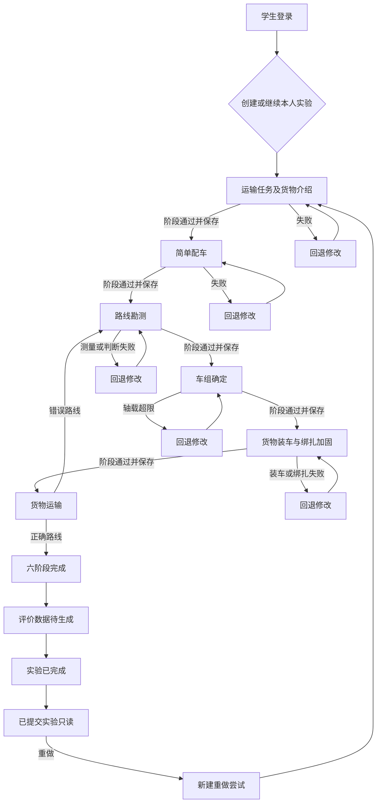
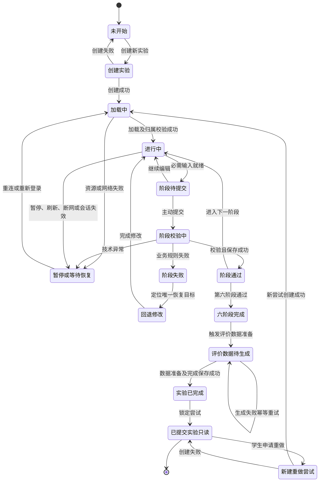

# 六阶段实验主流程

## 1. 文档目标与依据

本文档是“大件运输虚拟仿真实验教学系统”第1周第3天流程基线，用于后续页面原型、数据库实体、实验状态机、专业规则、操作日志和自动化验收设计。本文固化实验进入、六阶段顺序、阶段提交与校验、成功、失败、提示、回退、重试、恢复、评价衔接、只读结束和新建重做尝试；不规定技术实现，不把论文未给出的公式、阈值或案例参数伪装为确定规则。

依据按优先级引用：

1. `article.pdf` 第2—4章，尤其2.3.5、3.4.1、3.4.2和4.3.3—4.3.4。
2. `docs/论文功能映射.md` 第3—5、9、11—15节及SIM、LOG、GEN、TEA台账。
3. `docs/用户与场景.md` 第3—11、13—16节，特别是STU-003—005、ERR-002—007。
4. `大件运输虚拟仿真实验教学系统_单人复刻126天计划.md` 第1周第3天、G2、G5及第96—100天要求。

需求属性只使用：**论文明确要求**、**根据论文合理推导**、**实施计划要求**、**论文未明确**、**首版暂不实现**。同一规则存在多种依据时并列标注。

## 2. 流程范围与术语

| 术语 | 定义 | 约束 | 需求属性与来源 |
|---|---|---|---|
| 实验尝试 | 一名学生针对一个案例的一次独立实验记录 | 绑定唯一学生；完成后不可修改；重做创建新尝试 | 实施计划第96天；根据论文合理推导 |
| 阶段 | 六阶段中一个固定顺序的业务单元 | 名称和顺序不得修改；前阶段未通过不得进入后阶段 | 论文2.3.5、3.4.2；实施计划第3天 |
| 步骤 | 阶段内部可校验的操作或判断 | 可在本阶段修正，也可按规则回退到指定上游步骤 | 根据论文合理推导 |
| 保存点 | 服务端确认持久化成功的阶段或关键步骤快照 | 未成功保存不得显示为已提交；恢复只认已确认保存点 | 实施计划G2、第100天；合理推导 |
| 业务失败 | 学生输入、选择或操作不满足教学规则 | 计入错误日志；必须给出唯一恢复目标 | 论文2.2、3.4.1、3.4.2 |
| 技术异常 | 网络、资源、会话或保存服务异常 | 不计为学生业务错误；恢复至最近保存点或原状态 | 实施计划第100、118天；合理推导 |
| 回退 | 因业务失败或上游修改返回指定步骤 | 保留历史失败日志；受影响的下游结论失效 | 根据论文合理推导；实施计划G5 |
| 重试 | 在同一尝试内修正后再次提交或按同一幂等标识补交 | 不得重复日志、计分或完成记录 | 实施计划第100天；合理推导 |
| 只读 | 可查看但不可改写业务输入、结论和原始日志 | 学生已完成尝试和教师授权查看均为只读 | 实施计划第96天；合理推导 |

流程边界从学生登录后选择“创建新实验”或“继续实验”开始，到“实验已完成”并进入“已提交实验只读”为止；评价数据生成只固化衔接状态，不在本文制定成绩发布和教师评价细则。

## 3. 实验生命周期

生命周期固定为15个状态：

| 序号 | 状态名称 | 状态含义 | 可进入主体 | 可离开条件 | 需求属性与来源 |
|---:|---|---|---|---|---|
| 1 | 未开始 | 学生已登录但尚无本次尝试 | 学生 | 请求创建实验 | 实施计划要求；合理推导 |
| 2 | 创建实验 | 系统创建并绑定学生、案例和尝试ID | 学生、系统 | 创建成功并开始加载，或创建失败返回未开始 | 实施计划第27天；合理推导 |
| 3 | 加载中 | 加载案例、规则、阶段快照和必要资源 | 系统 | 资源完整进入进行中；失败进入暂停或等待恢复 | 实施计划G2；合理推导 |
| 4 | 进行中 | 学生在当前合法阶段操作，阶段名另存 | 学生 | 提交、暂停或技术异常 | 论文2.3.5、3.4.2 |
| 5 | 阶段待提交 | 当前阶段必需输入表面完整，等待学生主动提交 | 学生 | 提交后进入阶段校验中，或继续编辑返回进行中 | 合理推导 |
| 6 | 阶段校验中 | 系统对归属、顺序、必填项和业务规则进行校验 | 系统 | 通过或失败；技术异常进入暂停或等待恢复 | 合理推导 |
| 7 | 阶段通过 | 当前阶段结果已校验并成功保存 | 系统 | 非末阶段进入下一阶段进行中；第六阶段进入六阶段完成 | 论文流程；实施计划G5 |
| 8 | 阶段失败 | 当前提交未通过业务规则，历史输入与失败原因保留 | 系统 | 进入回退修改 | 论文3.4.2 |
| 9 | 回退修改 | 学生位于唯一指定恢复步骤，相关下游结论已标记失效 | 学生 | 修改后回到进行中或阶段待提交 | 论文3.4.2；合理推导 |
| 10 | 暂停或等待恢复 | 用户主动离开，或发生网络、会话、资源、保存异常 | 学生、系统 | 恢复身份与资源后进入加载中 | 实施计划G2、G5；合理推导 |
| 11 | 六阶段完成 | 正确运输动画完成，六阶段业务闭环已锁定 | 系统 | 发起评价数据生成 | 论文3.4.2；实施计划G5 |
| 12 | 评价数据待生成 | 等待从完整日志和阶段结果生成评价输入 | 系统 | 评价数据准备成功进入实验已完成；失败保持待生成并重试 | 论文4.3.3—4.3.4；合理推导 |
| 13 | 实验已完成 | 完成时间与完成记录已唯一保存 | 系统 | 转为已提交实验只读 | 实施计划第96天；合理推导 |
| 14 | 已提交实验只读 | 学生和授权教师只能查看原尝试 | 学生、教师 | 学生发起重做时进入新建重做尝试 | 实施计划第96天 |
| 15 | 新建重做尝试 | 从旧尝试只读页创建全新尝试，不复制旧通过状态 | 学生、系统 | 新尝试创建后进入加载中；失败返回已提交实验只读 | 实施计划第96天；合理推导 |

状态不允许隐式跳转。页面显示状态必须以服务端已确认状态为准；阶段提交、阶段通过、六阶段完成、实验已完成均须使用幂等业务键，重复请求只返回既有结果。

## 4. 实验进入与恢复流程

1. **创建新实验**：学生登录后，从“未开始”发起创建；系统校验学生角色、案例可用性及不存在同请求重复创建，生成归属本人的尝试后进入“加载中”。
2. **继续未完成实验**：学生选择本人状态非“实验已完成”或“已提交实验只读”的尝试；系统校验归属和版本，加载最近成功保存点。若存在未确认的本地输入，只显示为待恢复草稿，不显示为已提交。
3. **刷新、短暂断网或重新登录恢复**：当前尝试进入“暂停或等待恢复”；恢复网络和有效身份后先进入“加载中”，再依据服务端保存点返回当前阶段“进行中”。重复上报使用原事件ID，不重复计错或计分。
4. **越权拒绝**：学生请求其他学生尝试时拒绝访问，不返回该尝试内容；状态保持原页面。授权教师可只读查看范围内尝试，不进入学生可操作状态。
5. **完成后处理**：已完成尝试进入“已提交实验只读”。任何修改请求均拒绝；重做只能进入“新建重做尝试”，生成新尝试ID并从第一阶段开始。
6. **资源或保存失败**：进入“暂停或等待恢复”，显示失败对象和重试入口；技术异常日志与学生业务错误分开。只有保存确认成功后才能展示“阶段通过”或“实验已完成”。

验收时至少使用学生A、学生B和授权教师T验证：A不能读取B；T只能只读查看授权学生；刷新、短断网、重登后回到一致保存点；已完成尝试修改失败而新建重做成功。

## 5. 六阶段总体流程

六阶段名称和顺序固定如下：

1. 运输任务及货物介绍
2. 简单配车
3. 路线勘测
4. 车组确定
5. 货物装车与绑扎加固
6. 货物运输

通用门禁：当前尝试必须归属学生本人、状态可编辑、前序阶段均为已保存的“阶段通过”。每阶段由“进行中”到“阶段待提交”，再到“阶段校验中”；通过后保存并进入下一阶段，失败后进入“阶段失败”并按唯一目标进入“回退修改”。任何非法跳步均被拒绝并记录安全/流程事件，不计为专业操作错误。

修改上游数据时，下游失效范围为：第一阶段任务/货物关键参数变更使第二至六阶段失效；第二阶段初步车组变更使第三至六阶段失效；第三阶段路线测量、结论或选线变更使第四至六阶段失效；第四阶段正式车组变更使第五至六阶段失效；第五阶段装车或绑扎结果变更使第六阶段失效。失效只撤销当前有效结论，不删除旧日志和旧版本。

## 6. 第一阶段：运输任务及货物介绍

| 要素 | 固化规则 |
|---|---|
| 阶段目标 | 让学生理解任务、起止点、道路状况、装运要求和货物参数，并通过360°查看建立后续配车输入基础。 |
| 触发条件 | 新尝试加载成功，或恢复点位于第一阶段。 |
| 前置条件 | 尝试归属本人；案例、任务、货物模型和必需参数可加载。 |
| 输入数据 | 案例/货物标识；起止点、道路状况、装运要求；货物名称、数量、厂家、重量、长宽高、形状、重心等。 |
| 学生操作 | 阅读任务与货物参数；旋转、缩放、重置并查看货物360°模型；主动确认已阅读。 |
| 系统判断 | 身份与顺序合法；必需任务/货物字段齐全；模型与参数绑定；确认动作存在。 |
| 阶段通过条件 | 必需数据齐全且学生完成确认；360°交互可用。 |
| 阶段失败条件 | 必需任务数据缺失、货物关键参数缺失、模型/参数资源不可用或确认未完成。 |
| 错误提示 | 指明缺失字段或失败资源；技术加载失败不提示为学生操作错误。 |
| 回退目标 | 数据不完整或加载失败进入“暂停或等待恢复”；未确认则留在本阶段“进行中”。 |
| 重试方式 | 重试加载或完成阅读确认；沿用同一尝试。 |
| 保存时机 | 创建尝试；确认提交；阶段通过后保存完整快照。 |
| 产生的数据 | 任务与货物版本、查看/缩放/确认事件、阶段结果、开始/结束时间。 |
| 操作日志 | 记录模型查看、帮助、确认、缺失数据、加载异常和提交结果；异常类型区分业务/技术。 |
| 后续阶段 | 简单配车。 |
| 验收标准 | 起止点、道路、装运要求和货物关键参数均展示；模型可完整环绕和缩放；删除任一必需字段后不能进入简单配车。 |
| 需求来源 | 论文2.2、2.3.5、3.4.2，论文第14、25—26、48页（PDF21、32—33、55）；映射SIM-001—004。 |
| 需求属性 | 论文明确要求；数据完整性门禁为根据论文合理推导。 |

## 7. 第二阶段：简单配车

| 要素 | 固化规则 |
|---|---|
| 阶段目标 | 了解三种车组组合方式并形成通过初步校验的组合、挂车和牵引车方案。 |
| 触发条件 | 第一阶段“阶段通过”且保存成功。 |
| 前置条件 | 任务与货物参数有效；三种组合方式及6x6/8x8牵引车、挂车参数可用。 |
| 输入数据 | 货物尺寸/重量；组合方式；挂车轴线数/纵列数；牵引车种类/数量及车辆参数。 |
| 学生操作 | 查看三种组合动画及优缺点；选择组合方式、挂车轴线/纵列和牵引车种类/数量；提交初步方案。 |
| 系统判断 | 选择完整；按案例配置的尺寸、承载、牵引力、运输性教学规则校验；未确认参数不填造。 |
| 阶段通过条件 | 初步车组校验全部通过且结果成功保存。 |
| 阶段失败条件 | 组合不适用、挂车参数不满足、牵引车种类/数量不满足或输入缺失。 |
| 错误提示 | 显示失败项、已用输入和可执行修改方向，不只显示“错误”。 |
| 回退目标 | 本阶段“回退修改”的组合/挂车/牵引车选择步骤。 |
| 重试方式 | 保留未冲突选择，重新选择并提交；每次判断独立记录。 |
| 保存时机 | 关键选择可保存草稿；校验通过后保存初步车组快照。 |
| 产生的数据 | 三种方式查看记录、选择值、校验输入/输出、错误原因、重试次数、初步车组版本。 |
| 操作日志 | 记录每次选择、提交、规则命中、提示和修改前后差异。 |
| 后续阶段 | 路线勘测。 |
| 验收标准 | 三种组合均可查看；至少一组错误方案被解释并可重选；只有初步校验通过才可进入路线勘测。 |
| 需求来源 | 论文2.3.5、3.4.2，论文第26、48—49页（PDF33、55—56）；映射SIM-005—010。 |
| 需求属性 | 论文明确要求；可解释校验和幂等保存为根据论文合理推导/实施计划要求。 |

## 8. 第三阶段：路线勘测

| 要素 | 固化规则 |
|---|---|
| 阶段目标 | 完成三条候选路线的五类障碍勘测，形成可追溯的通行/处置/淘汰结论和路线选择。 |
| 触发条件 | 第二阶段“阶段通过”且保存成功。 |
| 前置条件 | 初步车组有效；三条路线及高度、圆弧弯道、直交弯道、坡度、桥梁对象可加载。 |
| 输入数据 | 每条路线五类障碍的必需测量值、单位、初步车组参数、障碍处置结论和路线选择。 |
| 学生操作 | 逐条路线测量/录入五类数据，查看教学计算与比较结果，判断处置可能性，淘汰不可处置路线并选线。 |
| 系统判断 | 三条路线和五类必需数据均完整；计算输入单位合法；不可处置路线不得入选；经济性公式未确认时不自动给出伪排序。 |
| 阶段通过条件 | 三条路线勘测完整；每个障碍有结论；不可处置路线已淘汰；所选路线可通行或可经已确认处置通行。 |
| 阶段失败条件 | 缺测量、单位/格式非法、障碍判断错误、选择不可处置路线，或依赖未确认经济性规则强行提交。 |
| 错误提示 | 精确到路线、障碍、缺失值或错误结论；经济性处显示“论文未明确，等待规则确认”。 |
| 回退目标 | 测量/判断错误返回本路线对应测量步骤；不可通行选择返回本阶段路线选择步骤。 |
| 重试方式 | 修正测量或判断并重算；重新选线；历史测量和失败日志保留。 |
| 保存时机 | 每个障碍完成后可保存草稿；三条路线阶段通过后保存勘测快照与选线。 |
| 产生的数据 | 测量值/单位、计算输入/输出、障碍结论、处置状态、淘汰原因、路线选择与版本。 |
| 操作日志 | 记录测量、修改、计算、结论、淘汰、提示、选线和提交。 |
| 后续阶段 | 车组确定。 |
| 验收标准 | 三条路线各覆盖五类障碍；任一必需测量缺失不可提交；不可处置路线不可选；未配置经济性规则时不出现虚构公式或排序。 |
| 需求来源 | 论文3.4.2，论文第50—51页（PDF57—58）；映射SIM-011—018。 |
| 需求属性 | 五类勘测与淘汰为论文明确要求；完整性门禁为合理推导；经济性公式和处置成本为论文未明确。 |

## 9. 第四阶段：车组确定

| 要素 | 固化规则 |
|---|---|
| 阶段目标 | 依据路线约束完成牵引车、悬架、挂车调整，挂车拼接、三点液压编点、阀门操作和轴载校核，正式确定车组。 |
| 触发条件 | 第三阶段“阶段通过”且保存成功。 |
| 前置条件 | 选定路线及障碍结论有效；初步车组和案例所需校核参数可用。 |
| 输入数据 | 路线约束；牵引车数量/种类；悬架高度；挂车轴线/纵列；拼接结构；三点坐标/回路；阀门状态；轴载参数。 |
| 学生操作 | 按路线调整配置，拼接挂车，完成三点液压编点和三回路划分，操作阀门，提交轴载校核。 |
| 系统判断 | 调整响应路线约束；拼接、编点、回路、阀门正确；依据配置的三点支承模型计算并逐轴比较允许轴载。 |
| 阶段通过条件 | 所有必需步骤正确，任一轴线均不超限，正式车组结果保存成功。 |
| 阶段失败条件 | 配置仍不满足路线、拼接错误、编点/回路错误、阀门状态错误、参数缺失或任一轴线超限。 |
| 错误提示 | 指明失败步骤；轴载失败显示各轴计算值、上限和超限轴，不填造缺失案例参数。 |
| 回退目标 | 拼接/编点/阀门错误回当前步骤；轴载超限唯一回退至本阶段“挂车参数选择”。 |
| 重试方式 | 重置当前交互或修改挂车参数后重新完成受影响步骤并重新校核。 |
| 保存时机 | 配置、拼接、编点、阀门可保存步骤快照；全部校核通过后保存正式车组。 |
| 产生的数据 | 最终配置版本、拼接结果、三点/回路、阀门状态、逐轴载荷、上限、校核结论。 |
| 操作日志 | 记录每次调整、拼接、标点、阀门动作、计算、超限、回退和重试。 |
| 后续阶段 | 货物装车与绑扎加固。 |
| 验收标准 | 路线结果能约束车组；拼接、三点、阀门均可判错；任一轴超限必回挂车参数选择且重新校核；全轴合格才正式确定。 |
| 需求来源 | 论文2.2、2.3.5、3.3.2、3.4.2，论文第15—16、27、42、52—53页（PDF22—23、34、49、59—60）；映射SIM-019—023。 |
| 需求属性 | 论文明确要求；完整案例参数论文未明确；步骤失效范围为合理推导。 |

## 10. 第五阶段：货物装车与绑扎加固

| 要素 | 固化规则 |
|---|---|
| 阶段目标 | 完成货物重心对准、液压反馈检查以及顺序、点位、布置和角度均合格的绑扎加固。 |
| 触发条件 | 第四阶段“阶段通过”且正式车组保存成功。 |
| 前置条件 | 货物、正式车组、液压反馈、工具、候选绑扎点和角度检测资源可用。 |
| 输入数据 | 货物位置/重心；液压读数；工具选择序列；绑扎点；倒八字布置；钢丝绳与挂车板夹角。 |
| 学生操作 | 调整货物位置并检查液压反馈；依次使用橡胶垫→梯子/安全带→钢丝绳→紧固葫芦→防磨衬垫；选择点位并形成倒八字布置。 |
| 系统判断 | 重心与液压是否满足已配置规则；工具是否匹配当前步骤；绑扎点是否正确；是否倒八字；夹角是否不大于60°。 |
| 阶段通过条件 | 重心/液压检查通过，工具顺序完整正确，点位和倒八字正确，夹角≤60°，结果保存成功。 |
| 阶段失败条件 | 装车错位、液压反馈不合格、工具错选/错序、绑扎点错误、非倒八字或夹角>60°。 |
| 错误提示 | 显示调整方向或当前正确步骤类型；指明点位/布置/角度问题；未确认重心容差和液压区间标记“论文未明确”。 |
| 回退目标 | 装车偏移回“货物位置调整”；工具错序回“当前绑扎步骤”；绑扎点、布置或角度错误回“绑扎点选择”。 |
| 重试方式 | 调整位置、重新查看液压；重选当前工具；清除本次点位/绳索选择后重新选点。 |
| 保存时机 | 装车检查通过、每个正确工具步骤、绑扎校验通过及阶段通过后保存；失败日志即时保存。 |
| 产生的数据 | 货物位置/偏差、液压读数、工具序列、点位、布局、角度、判断、重试次数。 |
| 操作日志 | 记录移动、读表、工具选择、动画、点位、角度、错误、提示、回退和提交。 |
| 后续阶段 | 货物运输。 |
| 验收标准 | 错位不可绑扎通过；论文工具顺序逐步校验；错序回当前步骤；错点或角度>60°回选点；所有条件合格才进入货物运输。 |
| 需求来源 | 论文3.3.2、3.4.2，论文第42—43、53—54页（PDF49—50、60—61）；映射SIM-024—027。 |
| 需求属性 | 操作顺序、倒八字和≤60°为论文明确要求；重心容差、液压区间、点坐标和除60°外角度容差为论文未明确。 |

## 11. 第六阶段：货物运输

| 要素 | 固化规则 |
|---|---|
| 阶段目标 | 汇总复验前五阶段有效结果，以正确路线完成运输动画并锁定实验。 |
| 触发条件 | 第五阶段“阶段通过”且保存成功。 |
| 前置条件 | 前五阶段均为当前版本的有效“阶段通过”，无下游失效标记。 |
| 输入数据 | 任务/货物、初步及正式车组、路线测量/处置/选择、装车、绑扎及最终路线复验选择。 |
| 学生操作 | 查看汇总，确认关键结果，选择/复验路线并点击开始运输。 |
| 系统判断 | 前五阶段关键结果齐全且版本相容；路线是否为可经确认处置后通行的正确路线。 |
| 阶段通过条件 | 正确路线、关键结果齐全，成功动画完整播放且完成记录保存成功。 |
| 阶段失败条件 | 缺任一关键结果、结果已失效、选择错误路线、动画资源失败或完成保存失败。 |
| 错误提示 | 缺失/失效项列出并阻止开始；错误路线播放对应失败反馈；技术异常显示重试且不计业务错。 |
| 回退目标 | 错误路线唯一回退至第三阶段“路线选择”；缺失/失效结果回对应最早失效阶段；技术异常进入“暂停或等待恢复”。 |
| 重试方式 | 修正路线并使第四、五阶段重新校验后再次运输；技术失败从保存点重试动画/保存。 |
| 保存时机 | 复验提交、路线失败、成功动画结束、“六阶段完成”和“实验已完成”分别幂等保存。 |
| 产生的数据 | 汇总版本、复验结果、路线、失败/成功动画事件、完成时间、唯一完成记录。 |
| 操作日志 | 记录复验、开始、路线判断、动画结果、回退、异常、完成与只读转换。 |
| 后续阶段 | 成功进入“六阶段完成”→“评价数据待生成”→“实验已完成”→“已提交实验只读”；失败按规则回退。 |
| 验收标准 | 缺任一关键结果不得开始；两条错误路线均失败并返回路线选择；正确路线完成；重复开始不产生重复完成/计分；完成后修改被拒绝。 |
| 需求来源 | 论文2.3.5、3.4.2，论文第28、54页（PDF35、61）；映射SIM-028；实施计划第96—100天。 |
| 需求属性 | 成败路线行为为论文明确要求；汇总门禁、幂等和只读为实施计划要求/合理推导。 |

## 12. 操作提示流程

| 场景 | 触发 | 提示内容 | 对流程影响 | 日志要求 | 需求属性与来源 |
|---|---|---|---|---|---|
| 主动帮助 | 学生点击当前步骤“帮助” | 当前知识点、操作目标和方法提示 | 不改变业务状态，不自动填值或代做 | 类型=主动、阶段、步骤、提示ID、次数、时间 | 论文2.3.5、3.4.1明确要求 |
| 首次阻断错误 | 阶段校验命中业务失败 | 错误原因、失败输入、恢复目标和可执行修正方法 | 进入阶段失败并按唯一目标回退 | 类型=自动错误、规则ID、阶段、次数、时间 | 论文2.2、3.4.1明确要求 |
| 同类错误再次发生 | 同一尝试、同一规则再次失败 | 比首次更具体的方法或正确操作说明 | 仍不自动完成；仍须学生操作后重验 | 类型=升级提示、同类错误序号、阶段、时间 | 论文3.4.1；不代做为合理推导 |
| 提示加载失败 | 提示资源异常 | 显示技术错误、重试和资料库入口 | 不允许绕过规则，不计学生业务错误 | 类型=技术异常、资源、阶段、时间 | 实施计划第118天；合理推导 |

提示次数按原始事件保存；主动提示是否与自动提示共同计入B5的最终统计口径属于论文未明确，在规则确认前分别统计、不合并猜测。

## 13. 失败、回退与重试规则

每个失败场景只有一个首选恢复目标；若目标数据依赖更早已失效结果，则以“最早失效阶段”覆盖普通目标。

| 编号 | 失败场景 | 失败状态/结果 | 唯一恢复目标 | 重试条件 | 是否计学生业务错误 | 验收标准 | 来源/属性 |
|---|---|---|---|---|---|---|---|
| FR-01 | 配车方案错误 | 阶段失败 | 第二阶段组合/挂车/牵引车选择 | 修改后重新提交 | 是 | 错误原因可见，不能进第三阶段 | 论文3.4.2明确 |
| FR-02 | 路线测量缺失或错误 | 阶段失败 | 第三阶段对应路线的对应测量步骤 | 补齐/修正并重算 | 是 | 精确定位路线和字段 | 论文3.4.2；完整性为推导 |
| FR-03 | 路线判断错误 | 阶段失败 | 第三阶段对应障碍判断步骤 | 修正结论并重算 | 是 | 旧结论留日志，新结论有版本 | 论文3.4.2；推导 |
| FR-04 | 路线不可通行或不可处置 | 阶段失败 | 第三阶段路线选择 | 淘汰该路线并重选 | 是 | 不可处置路线不可再提交 | 论文3.4.2明确 |
| FR-05 | 挂车拼接/编点/阀门错误 | 阶段失败 | 第四阶段当前错误步骤 | 重置该步骤后重做 | 是 | 不跳过中间步骤 | 论文3.3.2、3.4.2明确 |
| FR-06 | 轴载超限 | 阶段失败 | 第四阶段挂车参数选择 | 修改挂车并重新完成受影响校核 | 是 | 任一轴超限必回该目标 | 论文3.4.2明确 |
| FR-07 | 装车偏移或液压不合格 | 阶段失败 | 第五阶段货物位置调整 | 调位并重新检查 | 是 | 未通过不可开始绑扎/运输 | 论文3.4.2明确；阈值未明确 |
| FR-08 | 绑扎工具错选/错序 | 阶段失败 | 第五阶段当前绑扎步骤 | 重选当前工具 | 是 | 已正确的前序工具不删除，当前步重做 | 论文3.4.2明确 |
| FR-09 | 绑扎点/布置/角度错误 | 阶段失败 | 第五阶段绑扎点选择 | 清除本次点/绳并重选 | 是 | 错点、非倒八字或>60°均阻断 | 论文3.4.2明确 |
| FR-10 | 运输路线错误 | 阶段失败 | 第三阶段路线选择 | 重新选线并使第四、五阶段复验 | 是 | 失败动画后不完成实验 | 论文3.4.2明确 |
| FR-11 | 非法跳步 | 请求拒绝，状态不变 | 当前合法阶段 | 完成缺失前置后再操作 | 否，记流程/安全事件 | 无数据泄露且状态不前移 | 合理推导/实施计划 |
| FR-12 | 刷新、短断网或重登 | 暂停或等待恢复 | 最近成功保存点 | 重连并校验归属/版本 | 否 | 不丢已保存状态、不重复计分 | 实施计划G2/G5 |
| FR-13 | 资源加载失败 | 暂停或等待恢复 | 原阶段加载入口 | 资源可用后按同版本重试 | 否 | 不进入空场景，不破坏快照 | 实施计划第118天 |
| FR-14 | 日志保存失败 | 暂停或等待恢复 | 原业务状态的待保存队列 | 用原事件ID重试 | 否 | 成功前不显示已提交；仅一条日志 | 实施计划第100天 |
| FR-15 | 阶段结果保存失败 | 暂停或等待恢复 | 原阶段校验前保存点 | 恢复后重新提交同幂等键 | 否 | 不出现虚假阶段通过 | 合理推导/实施计划 |
| FR-16 | 完成记录保存失败 | 评价数据待生成之前的六阶段完成保存点 | 六阶段完成 | 同完成键重试 | 否 | 最终只有一条完成记录 | 合理推导/实施计划 |

## 14. 状态保存与日志规则

1. 每个阶段通过必须先持久化阶段输入、规则版本、判断结果和日志，再对学生显示“阶段通过”。
2. 关键操作和判断必须写日志，最小字段为事件ID、学生ID、尝试ID、阶段、步骤、动作、对象、输入摘要、规则ID/版本、结果、反馈、客户端时间、服务端时间和异常类型。
3. 回退与修改使用追加记录；不得删除或覆盖历史失败日志。旧结果保留版本但标记失效。
4. 上游修改按第5节失效矩阵使下游结论失效；再次进入下游时必须重新校验，不能沿用旧“阶段通过”。
5. 阶段提交、日志批次、评分触发和完成记录均使用幂等键；重复提交返回原结果，不重复写日志、计错、计提示、计分或完成。
6. 技术异常使用独立异常类型，不写为学生专业业务错误，不影响错误次数指标。
7. 未收到服务端保存确认的数据只能显示“未保存/待重试”，不得显示“已提交”“阶段通过”或“实验已完成”。
8. 自动保存频率和日志断网续传机制未确认；首版基线只要求关键事件即时提交、失败可重试、事件幂等，具体频率进入待确认事项。
9. 暂停期间是否计入成绩未确认；保存原始进入/离开时间，不自行计算扣分。

## 15. 权限与数据归属

| 主体 | 可执行 | 禁止 | 数据归属与验收 | 来源/属性 |
|---|---|---|---|---|
| 学生 | 创建/继续本人未完成尝试；操作本人进行中阶段；只读查看本人已完成尝试；新建重做 | 访问他人尝试、跳步、改已完成尝试、改原始日志/评价 | 所有请求同时校验登录身份和尝试学生ID；替换资源ID仍被拒绝 | 用户与场景；合理推导/实施计划 |
| 教师 | 只读查看授权范围学生的尝试、阶段结果和原始日志 | 替学生操作、修改/删除原始日志、访问未授权学生 | 权限范围校验在列表和单条资源同时执行；查看产生访问审计 | 论文4.3.4；合理推导 |
| 评价系统 | 读取有效结果和日志，生成评价数据 | 覆盖原始日志、对缺失规则猜值 | 计算结果关联尝试、规则和权重版本 | 论文4.3.3—4.3.4 |
| 系统管理员 | 仅执行获批的平台支持 | 未确认前读写学生业务数据或日志/成绩 | 具体权限论文未明确，不作为本日默认授权 | 论文未明确 |

实验尝试、阶段快照和操作日志都必须绑定学生ID与尝试ID。教师授权范围的确定方式属于论文未明确，但“无授权即拒绝”和“原始日志只读”是首版强制边界。

## 16. Mermaid流程图

### 16.1 六阶段总体流程图

### 16.2 进入、成功、失败、回退、恢复和结束状态图

## 17. 状态转换总台账

说明：失败目标是转换本身执行失败后的状态；回退状态是业务失败后学生实际修改的唯一目标。“—”表示该转换无独立回退。所有“阶段通过”转换均以保存成功为前提。

| 转换编号 | 当前状态 | 触发事件 | 使用角色 | 前置条件 | 输入 | 系统判断 | 成功目标状态 | 失败目标状态 | 回退状态 | 保存内容 | 日志事件 | 是否允许重试 | 验收标准 | 需求属性 | 需求来源 | 备注 |
|---|---|---|---|---|---|---|---|---|---|---|---|---|---|---|---|---|
| ENT-001 | 未开始 | 创建新实验 | 学生 | 已登录且案例可用 | 案例ID、请求ID | 学生角色、案例、幂等 | 创建实验 | 未开始 | — | 创建请求 | attempt_create_requested | 是 | 同请求仅创建一个本人尝试 | 实施计划要求 | 第27天、G2 | 首版一个案例 |
| ENT-002 | 创建实验 | 创建成功 | 系统 | 尝试ID及归属已保存 | 尝试版本 | 归属唯一、状态有效 | 加载中 | 未开始 | — | 尝试初始记录 | attempt_created | 是 | 记录绑定当前学生 | 根据论文合理推导 | 用户与场景STU-003 | 技术失败不计业务错 |
| ENT-003 | 未开始 | 继续未完成实验 | 学生 | 存在本人未完成尝试 | 尝试ID | 归属、未完成、版本 | 加载中 | 未开始 | — | 访问时间 | attempt_resume_requested | 是 | 他人或已完成尝试不可编辑进入 | 实施计划要求 | G2、第27天 | 已完成走ENT-006 |
| ENT-004 | 加载中 | 加载完成 | 系统 | 身份、资源和保存点可用 | 尝试ID、版本 | 归属、资源完整、快照一致 | 进行中 | 暂停或等待恢复 | — | 恢复点 | attempt_loaded | 是 | 返回最近确认保存点且无越权 | 根据论文合理推导 | G2/G5 | 当前阶段随快照 |
| ENT-005 | 任意可编辑状态 | 教师查看或学生越权访问 | 学生、教师 | 请求目标存在 | 目标尝试ID | 学生本人或教师授权只读 | 已提交实验只读 | 当前状态 | — | 访问审计 | access_checked | 是 | 学生越权无数据；教师无编辑能力 | 根据论文合理推导 | 用户与场景权限矩阵 | 教师视图借用只读语义 |
| ENT-006 | 实验已完成 | 锁定尝试 | 系统 | 完成记录唯一保存 | 尝试ID | 完成状态一致 | 已提交实验只读 | 实验已完成 | — | 锁定时间 | attempt_locked | 是 | 修改接口全部拒绝 | 实施计划要求 | 第96天 | 自动转换 |
| S1-001 | 进行中 | 提交任务介绍确认 | 学生 | 当前为第一阶段 | 任务/货物版本、确认 | 必需字段、360°资源、顺序 | 阶段校验中 | 进行中 | 第一阶段进行中 | 确认输入 | s1_submitted | 是 | 缺确认或必需字段不进入下一阶段 | 论文明确要求；推导 | 论文3.4.2；SIM-001—004 | — |
| S1-002 | 阶段校验中 | 第一阶段校验通过 | 系统 | 输入完整 | 第一阶段快照 | 字段完整、模型绑定 | 阶段通过 | 阶段失败 | 第一阶段进行中 | 第一阶段结果 | s1_passed | 是 | 删除任一必需字段则失败 | 论文明确要求；推导 | 映射§5.1 | 保存后才通过 |
| S1-003 | 阶段失败 | 任务数据缺失 | 系统 | 校验已定位缺失 | 字段/资源 | 业务缺失或技术失败 | 回退修改 | 暂停或等待恢复 | 第一阶段进行中 | 失败原因 | s1_failed | 是 | 业务缺失留阶段；技术失败待恢复 | 根据论文合理推导 | SIM-002—004 | 唯一恢复明确 |
| S1-004 | 阶段通过 | 进入简单配车 | 系统 | 第一阶段保存成功 | 尝试版本 | 顺序合法 | 进行中 | 阶段通过 | 第一阶段进行中 | 当前阶段=2 | s2_entered | 是 | 仅已通过第一阶段可进入 | 实施计划要求 | 第3天、G5 | 阶段名=简单配车 |
| S2-001 | 进行中 | 提交初步配车 | 学生 | 当前为第二阶段 | 组合、挂车、牵引车 | 输入完整、顺序合法 | 阶段校验中 | 进行中 | 第二阶段选择 | 配车方案 | s2_submitted | 是 | 缺任一选择不可校验 | 论文明确要求 | 论文3.4.2 | — |
| S2-002 | 阶段校验中 | 配车校验通过 | 系统 | 教学规则可用 | 方案、规则版本 | 尺寸/承载/牵引力等通过 | 阶段通过 | 阶段失败 | 第二阶段选择 | 初步车组快照 | s2_passed | 是 | 正确方案保存后进入第三阶段 | 论文明确要求 | SIM-005—010 | 规则数据须可配置 |
| S2-003 | 阶段失败 | 配车方案错误 | 系统 | 有明确失败项 | 失败规则、方案 | 失败原因可解释 | 回退修改 | 阶段失败 | 第二阶段选择 | 失败与原方案 | s2_failed | 是 | 显示原因并允许原阶段重选 | 论文明确要求 | 论文3.4.2 | 不删除失败日志 |
| S2-004 | 阶段通过 | 进入路线勘测 | 系统 | 初步车组已保存 | 车组版本 | 顺序与版本有效 | 进行中 | 阶段通过 | 第二阶段选择 | 当前阶段=3 | s3_entered | 是 | 未通过配车不能进入 | 论文明确要求 | 论文3.4.2 | 阶段名=路线勘测 |
| S3-001 | 进行中 | 保存单项测量 | 学生 | 当前为第三阶段 | 路线、障碍、值、单位 | 字段格式和单位合法 | 进行中 | 回退修改 | 对应测量步骤 | 测量草稿/结果 | s3_measurement_saved | 是 | 三路线五类对象均可记录 | 论文明确要求 | SIM-011—017 | 同事件幂等 |
| S3-002 | 进行中 | 提交路线勘测 | 学生 | 三路线记录已填写 | 测量、结论、选线 | 必填、顺序、候选范围 | 阶段校验中 | 回退修改 | 缺失测量步骤 | 提交快照 | s3_submitted | 是 | 缺任一必需测量不得提交 | 论文明确要求；推导 | 论文3.4.2 | — |
| S3-003 | 阶段校验中 | 测量/判断错误 | 系统 | 可定位错误障碍 | 路线、障碍、计算 | 规则比较失败 | 阶段失败 | 暂停或等待恢复 | 对应测量或判断步骤 | 失败结论 | s3_rule_failed | 是 | 返回唯一具体步骤并重算 | 论文明确要求 | SIM-012—016 | — |
| S3-004 | 阶段校验中 | 路线不可处置 | 系统 | 处置结论有效 | 路线、障碍结论 | 路线不可处置 | 阶段失败 | 暂停或等待恢复 | 第三阶段路线选择 | 淘汰结论 | s3_route_eliminated | 是 | 该路线不可作为提交路线 | 论文明确要求 | 论文3.4.2 | 成本未明确 |
| S3-005 | 阶段校验中 | 勘测与选线通过 | 系统 | 三路线均完整 | 全量勘测、选线 | 可通行性通过；不伪造经济公式 | 阶段通过 | 阶段失败 | 第三阶段路线选择 | 路线快照 | s3_passed | 是 | 三路线五类完整且选线合法 | 论文明确要求；未明确 | 映射§5.3 | 经济性待确认 |
| S3-006 | 阶段通过 | 进入车组确定 | 系统 | 路线结果保存成功 | 路线版本 | 顺序与版本有效 | 进行中 | 阶段通过 | 第三阶段路线选择 | 当前阶段=4 | s4_entered | 是 | 无有效路线不得进入 | 论文明确要求 | 论文3.4.2 | 阶段名=车组确定 |
| S4-001 | 进行中 | 提交路线适配配置 | 学生 | 当前为第四阶段 | 牵引车、悬架、挂车 | 满足路线约束 | 进行中 | 回退修改 | 第四阶段配置选择 | 配置版本 | s4_config_saved | 是 | 路线约束影响配置结论 | 论文明确要求 | 论文3.4.2 | — |
| S4-002 | 进行中 | 完成拼接编点阀门 | 学生 | 配置有效 | 拼接、三点、回路、阀门 | 各步骤顺序和结果正确 | 阶段待提交 | 回退修改 | 当前错误步骤 | 步骤快照 | s4_assembly_completed | 是 | 任一步错误不进入轴载提交 | 论文明确要求 | SIM-020—022 | — |
| S4-003 | 阶段待提交 | 提交轴载校核 | 学生 | 必需参数和步骤齐全 | 校核参数 | 完整性、单位、版本 | 阶段校验中 | 回退修改 | 第四阶段挂车参数选择 | 校核请求 | s4_axle_submitted | 是 | 参数缺失不显示校核成功 | 论文明确要求；推导 | SIM-023 | — |
| S4-004 | 阶段校验中 | 轴载超限 | 系统 | 已计算逐轴载荷 | 计算值、上限 | 任一轴超限 | 阶段失败 | 暂停或等待恢复 | 第四阶段挂车参数选择 | 逐轴结果 | s4_axle_failed | 是 | 超限必回挂车参数并重算 | 论文明确要求 | 论文3.4.2第53页 | 唯一恢复目标 |
| S4-005 | 阶段校验中 | 全轴校核通过 | 系统 | 所有步骤与参数有效 | 正式车组快照 | 任一轴均不超限 | 阶段通过 | 阶段失败 | 第四阶段挂车参数选择 | 正式车组 | s4_passed | 是 | 全轴合格且保存后才通过 | 论文明确要求 | SIM-023 | 案例参数待确认 |
| S4-006 | 阶段通过 | 进入装车绑扎 | 系统 | 正式车组保存成功 | 车组版本 | 顺序与版本有效 | 进行中 | 阶段通过 | 第四阶段挂车参数选择 | 当前阶段=5 | s5_entered | 是 | 无正式车组不得进入 | 论文明确要求 | 论文3.4.2 | 阶段名固定 |
| S5-001 | 进行中 | 提交货物位置 | 学生 | 当前为第五阶段 | 位置、重心、液压 | 规则已配置且输入完整 | 阶段校验中 | 进行中 | 第五阶段货物位置调整 | 位置快照 | s5_loading_submitted | 是 | 未确认阈值不得伪判通过 | 论文明确要求；未明确 | SIM-024—025 | 阈值待确认 |
| S5-002 | 阶段校验中 | 装车检查失败 | 系统 | 有位置/液压反馈 | 偏差、读数 | 不满足配置规则 | 阶段失败 | 暂停或等待恢复 | 第五阶段货物位置调整 | 失败反馈 | s5_loading_failed | 是 | 返回调整位置且不进绑扎完成 | 论文明确要求 | 论文3.4.2 | — |
| S5-003 | 进行中 | 选择绑扎工具 | 学生 | 装车检查通过 | 当前步、工具 | 工具是否匹配固定顺序 | 进行中 | 阶段失败 | 第五阶段当前绑扎步骤 | 工具事件 | s5_tool_selected | 是 | 错序阻断并原步骤重选 | 论文明确要求 | 论文3.4.2 | 顺序固定 |
| S5-004 | 进行中 | 提交绑扎点和角度 | 学生 | 工具序列完成到相应步骤 | 点位、布置、角度 | 点位、倒八字、≤60° | 阶段校验中 | 阶段失败 | 第五阶段绑扎点选择 | 绑扎快照 | s5_lashing_submitted | 是 | 错点/非倒八字/>60°不可通过 | 论文明确要求 | SIM-027 | 点坐标容差待确认 |
| S5-005 | 阶段失败 | 绑扎校验失败 | 系统 | 可定位工具或点位错误 | 失败规则 | 工具错序或点/角错误 | 回退修改 | 阶段失败 | 当前绑扎步骤或绑扎点选择 | 失败与回退 | s5_lashing_failed | 是 | 恢复目标由失败类型唯一映射 | 论文明确要求 | 论文3.4.2 | — |
| S5-006 | 阶段校验中 | 装车绑扎全部通过 | 系统 | 全部结果有效 | 阶段快照 | 装车、工具、点、布置、角度 | 阶段通过 | 阶段失败 | 第五阶段货物位置调整 | 装车绑扎结果 | s5_passed | 是 | 所有条件同时满足且保存 | 论文明确要求 | 映射§5.5 | — |
| S5-007 | 阶段通过 | 进入货物运输 | 系统 | 第五阶段保存成功 | 阶段版本 | 顺序与版本有效 | 进行中 | 阶段通过 | 第五阶段货物位置调整 | 当前阶段=6 | s6_entered | 是 | 任一第五阶段条件失败不得进入 | 论文明确要求 | 论文3.4.2 | 阶段名=货物运输 |
| S6-001 | 进行中 | 提交运输复验 | 学生 | 前五阶段均有效 | 汇总版本、路线 | 完整性与版本相容 | 阶段校验中 | 回退修改 | 最早失效阶段 | 复验请求 | s6_review_submitted | 是 | 缺任一关键结果不得开始 | 根据论文合理推导 | SIM-028、G5 | — |
| S6-002 | 阶段校验中 | 错误路线 | 系统 | 汇总完整 | 路线、处置结论 | 路线不可通行 | 阶段失败 | 暂停或等待恢复 | 第三阶段路线选择 | 失败动画与原因 | s6_route_failed | 是 | 播放失败反馈且不完成 | 论文明确要求 | 论文3.4.2第54页 | 下游重新校验 |
| S6-003 | 阶段失败 | 返回路线选择 | 学生、系统 | 错误路线失败已保存 | 失败路线 | 回退目标固定 | 回退修改 | 阶段失败 | 第三阶段路线选择 | 下游失效标记 | s6_rollback_route | 是 | 第四、五、六阶段结论失效 | 论文明确要求；推导 | 论文3.4.2、G5 | 历史日志保留 |
| S6-004 | 阶段校验中 | 正确路线动画完成 | 系统 | 关键结果齐全、路线正确 | 动画结果、完成键 | 动画成功且保存可用 | 阶段通过 | 暂停或等待恢复 | 第六阶段运输复验 | 运输结果 | s6_passed | 是 | 重复请求只产生一个结果 | 论文明确要求；计划 | SIM-028、第100天 | — |
| S6-005 | 阶段通过 | 第六阶段结束 | 系统 | 运输通过已保存 | 尝试ID | 六阶段均有效 | 六阶段完成 | 阶段通过 | 第六阶段运输复验 | 六阶段完成快照 | six_stages_completed | 是 | 完成状态唯一且可复核 | 实施计划要求 | G5 | — |
| HLP-001 | 进行中 | 主动点击帮助 | 学生 | 当前步骤可识别 | 阶段、步骤 | 提示匹配当前上下文 | 进行中 | 进行中 | 当前步骤 | 提示事件 | help_requested | 是 | 显示后可关闭且不代做 | 论文明确要求 | 论文2.3.5、3.4.1 | — |
| HLP-002 | 阶段失败 | 首次阻断错误提示 | 系统 | 有业务失败规则 | 规则、失败输入 | 生成原因与修正方法 | 回退修改 | 阶段失败 | 规则指定步骤 | 自动提示事件 | error_hint_shown | 是 | 提示含唯一恢复目标 | 论文明确要求 | 论文2.2、3.4.1 | — |
| HLP-003 | 阶段失败 | 同类错误再次发生 | 系统 | 同尝试同规则已有失败 | 错误次数 | 次数≥2 | 回退修改 | 阶段失败 | 规则指定步骤 | 升级提示事件 | escalated_hint_shown | 是 | 更具体但不自动完成 | 论文明确要求；推导 | 论文3.4.1 | 分别统计类型 |
| ERR-001 | 进行中 | 暂停或离开 | 学生 | 有尝试和保存点 | 当前状态 | 可保存的关键事件已确认 | 暂停或等待恢复 | 进行中 | 最近保存点 | 暂停时间 | attempt_paused | 是 | 再进入从保存点恢复 | 根据论文合理推导 | 用户与场景ERR-005 | 计时规则待确认 |
| ERR-002 | 任意可编辑状态 | 刷新或短断网 | 系统 | 有尝试ID | 本地/服务端版本 | 网络不可用或页面重建 | 暂停或等待恢复 | 当前状态 | 最近保存点 | 技术异常 | connection_interrupted | 是 | 不把未保存数据标为已提交 | 实施计划要求 | G2/G5 | 不计业务错误 |
| ERR-003 | 暂停或等待恢复 | 重连或重登 | 学生、系统 | 身份恢复 | 尝试ID、版本 | 归属、保存点、幂等队列 | 加载中 | 暂停或等待恢复 | 最近保存点 | 恢复事件 | recovery_started | 是 | 不丢关键日志、不重复计分 | 实施计划要求 | 第100天 | 续传细则待确认 |
| ERR-004 | 加载中 | 资源加载失败 | 系统 | 资源请求发生 | 资源ID | 必需资源不可用 | 暂停或等待恢复 | 加载中 | 原阶段加载入口 | 技术错误 | resource_load_failed | 是 | 显示资源和重试入口 | 实施计划要求 | 第118天 | 不计业务错误 |
| ERR-005 | 阶段校验中 | 阶段保存失败 | 系统 | 校验结果尚未确认保存 | 幂等键、快照 | 持久化未确认 | 暂停或等待恢复 | 阶段校验中 | 原阶段保存点 | 保存异常 | stage_save_failed | 是 | 页面不显示阶段通过 | 实施计划要求；推导 | 第100天 | — |
| ERR-006 | 任意状态 | 日志保存失败 | 系统 | 有事件ID | 日志批次 | 未确认写入 | 暂停或等待恢复 | 当前状态 | 原业务状态 | 待重试批次 | log_save_failed | 是 | 原事件ID重试后仅一条 | 实施计划要求 | 第100天 | 具体续传待确认 |
| ERR-007 | 任意状态 | 重复提交 | 学生、系统 | 同幂等键已有结果 | 幂等键 | 是否已有成功结果 | 当前既有状态 | 当前既有状态 | — | 不新增业务记录 | duplicate_ignored | 否 | 不重复日志、计分、完成 | 实施计划要求；推导 | 第100天 | 返回原结果 |
| ERR-008 | 任意可编辑状态 | 非法跳步 | 学生 | 目标阶段非合法后继 | 目标阶段 | 前置阶段未通过 | 当前状态 | 当前状态 | 当前合法阶段 | 拒绝审计 | illegal_transition_rejected | 是 | 状态不变且不泄露数据 | 根据论文合理推导 | INT-007、G5 | 不计专业错误 |
| END-001 | 六阶段完成 | 触发评价数据准备 | 系统 | 六阶段结果完整 | 日志/结果版本 | 完整性与唯一完成键 | 评价数据待生成 | 六阶段完成 | 六阶段完成 | 评价任务 | evaluation_pending | 是 | 只创建一个评价任务 | 论文明确要求；推导 | 论文4.3.3—4.3.4 | — |
| END-002 | 评价数据待生成 | 评价输入生成成功 | 评价系统 | 日志与规则版本可用 | 客观评价输入 | 数据完整；未决规则不猜测 | 实验已完成 | 评价数据待生成 | 评价数据待生成 | 评价输入、完成记录 | attempt_completed | 是 | 缺项保持待生成，不伪造分数 | 论文明确要求；推导 | 论文4.3.3—4.3.4 | 成绩发布另议 |
| END-003 | 已提交实验只读 | 请求修改已完成尝试 | 学生、教师 | 尝试已锁定 | 修改请求 | 状态只读 | 已提交实验只读 | 已提交实验只读 | — | 拒绝审计 | readonly_write_rejected | 否 | 任意业务字段均不可改 | 实施计划要求 | 第96天 | 教师日志同样只读 |
| END-004 | 已提交实验只读 | 发起重做 | 学生 | 本人已完成尝试 | 旧尝试ID、请求ID | 归属、幂等 | 新建重做尝试 | 已提交实验只读 | — | 重做请求 | redo_requested | 是 | 旧尝试保持只读 | 实施计划要求 | 第96天 | 不复制通过状态 |
| END-005 | 新建重做尝试 | 新尝试创建成功 | 系统 | 新尝试ID唯一 | 新尝试、案例 | 归属、初始状态 | 加载中 | 已提交实验只读 | 已提交实验只读 | 新尝试初始记录 | redo_created | 是 | 新ID且从第一阶段开始 | 实施计划要求 | 第96天 | 旧日志保留 |

## 18. 待确认事项

| 编号 | 待确认事项 | 当前基线处理 | 影响范围 | 需求属性 |
|---|---|---|---|---|
| Q-01 | 路线经济性计算公式 | 不计算、不排序造值；只固化可通行性和人工确认的路线结果 | 第三、六阶段 | 论文未明确 |
| Q-02 | 障碍处置方案和成本 | 仅保存已确认的可处置/不可处置结论；不定义处置集合与成本 | 第三、四、六阶段 | 论文未明确 |
| Q-03 | 装车重心允许偏差 | 规则配置为空时不得形成确定通过值，验收使用经专业教师确认的案例配置 | 第五阶段 | 论文未明确 |
| Q-04 | 液压表正确区间 | 只展示原始读数和“规则待确认”，不填造区间 | 第五阶段 | 论文未明确 |
| Q-05 | 绑扎点坐标和角度容差 | 保留候选点配置；已明确钢丝绳与挂车板夹角≤60°，其余容差不猜测 | 第五阶段 | 部分论文明确；其余未明确 |
| Q-06 | 轴载计算所需完整案例参数 | 保留参数接口和缺失门禁；缺参数不得给出伪校核结果 | 第四阶段 | 论文未明确 |
| Q-07 | 日志断网续传细则 | 固化事件ID、待重试、幂等和不重复原则；批次、缓存与冲突策略待定 | 全流程、日志 | 论文未明确；实施计划仅规定结果 |
| Q-08 | 自动保存频率 | 关键提交和阶段通过必须保存；周期自动保存间隔不规定 | 全流程 | 论文未明确 |
| Q-09 | 实验暂停时长是否计入成绩 | 保存原始时间段，不参与推测性计分 | 时长、B6 | 论文未明确 |
| Q-10 | 已完成实验是否允许撤回 | 当前不提供撤回；若未来确认需走基线变更，不修改本次历史 | 结束状态、权限 | 论文未明确 |
| Q-11 | 学生最终成绩查看和发布流程 | 学生仅保证可见完成状态；最终成绩接口默认不开放 | 学生结果、评价 | 论文未明确 |

以上事项必须通过明确决策记录关闭；在关闭前，系统应显示“论文未明确/规则待确认”或阻止依赖该规则的确定性提交，并采用本表所列当前基线处理。

## 19. 首版范围与排除范围

### 19.1 首版范围

- 一个案例、三条路线和本文六阶段完整顺序。
- 学生创建/继续/恢复本人实验，教师授权只读，完成后只读和新建重做尝试。
- 阶段提交/校验/通过/失败、提示、唯一回退、重试、下游失效、暂停恢复和幂等完成。
- 三种配车组合、五类路线障碍、车组调整/拼接/液压/轴载、装车/绑扎、运输成败反馈。
- 关键操作、判断、错误、提示、回退、恢复和完成日志；评价数据生成衔接。

### 19.2 排除范围

- VR/头显/数据手套、多人同步、即时聊天、移动端、开放世界。
- 真实有限元、工程级桥梁分析、复杂车辆动力学和工程方案审查。
- 多案例编辑器、排行榜、AI辅导、影视级模型和特效。
- 德尔菲问卷管理、AHP现场计算工具。
- 未确认的经济性公式、成本、重心/液压/绑扎容差、轴载案例数值、日志续传机制、自动保存频率、暂停计分、完成撤回和成绩发布流程。

排除项来源为实施计划“严格范围”或论文未明确；首版不得以隐藏默认值实现。

## 20. 第3天验收结果

| 验收项 | 结果 | 证据 |
|---|---|---|
| 20个规定标题齐全 | 通过 | 本文§1—§20连续且名称与任务一致 |
| 六阶段名称、内容、顺序一致 | 通过 | §5—§11及S1—S6台账严格采用论文映射顺序 |
| 覆盖进入、六阶段、成功、失败、提示、回退、恢复和结束 | 通过 | §3—§17，尤其两张Mermaid图和54条转换 |
| 每阶段进入、通过和失败条件明确 | 通过 | §6—§11各18项要素 |
| 每个失败状态有唯一恢复目标 | 通过 | §13共16个失败/恢复场景；台账“回退状态”列 |
| 轴载、路线、装车、绑扎失败可执行回退 | 通过 | FR-04、FR-06—10及S3/S4/S5/S6转换 |
| 禁止跳步和学生越权 | 通过 | §4、§5、§15、ERR-008、ENT-005 |
| 教师不能修改原始日志 | 通过 | §15、END-003 |
| 完成只读且重做建新尝试 | 通过 | §3、§4、END-003—005 |
| 上游修改使下游失效 | 通过 | §5、§14、S6-003 |
| 首版转换均可执行、可验证 | 通过 | §17每条均含前置、判断、目标和验收标准 |
| 每项有来源/属性或论文未明确 | 通过 | 各节及台账最后三列 |
| Mermaid节点与正文一致且代码块闭合 | 通过 | §16共2张图；生命周期节点使用§3状态原名 |
| 转换编号唯一、表格列数一致 | 通过 | §17编号唯一；台账17列 |
| 无模糊延期和伪造规则 | 通过 | §18采用明确阻断/标记策略 |
| 未编写代码、安装依赖或创建脚手架 | 通过 | 本日仅新增本文档 |
| 未修改参考文档和无关文件 | 通过 | 变更范围检查仅含`docs/六阶段实验主流程.md` |

**生命周期状态数量：15。**  
**状态转换条目总数：54。**  
**分类计数：ENT 6、S1 4、S2 4、S3 6、S4 6、S5 7、S6 5、HLP 3、ERR 8、END 5。**  
**失败与恢复场景数量：16。**  
**Mermaid流程图数量：2。**  
**待确认事项数量：11。**  
**第3天结论：通过验收。**
