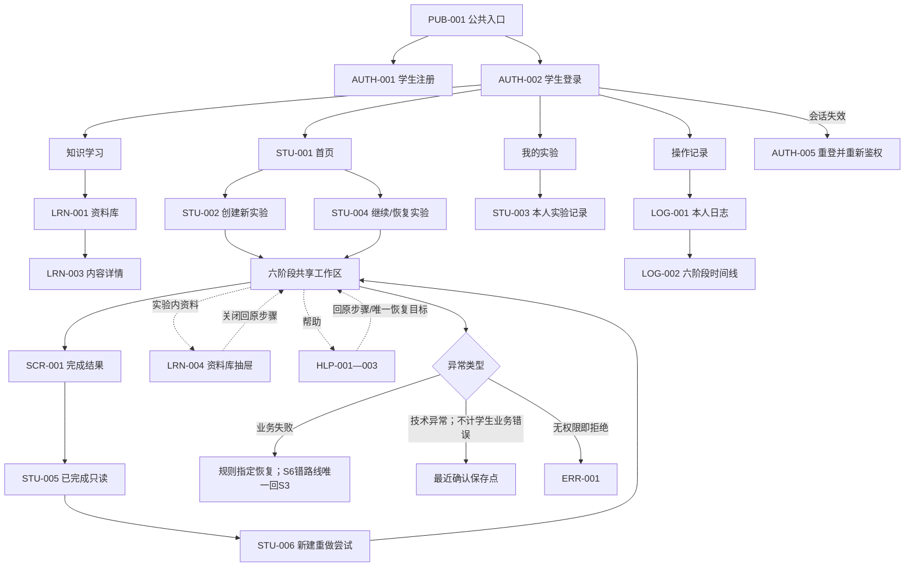
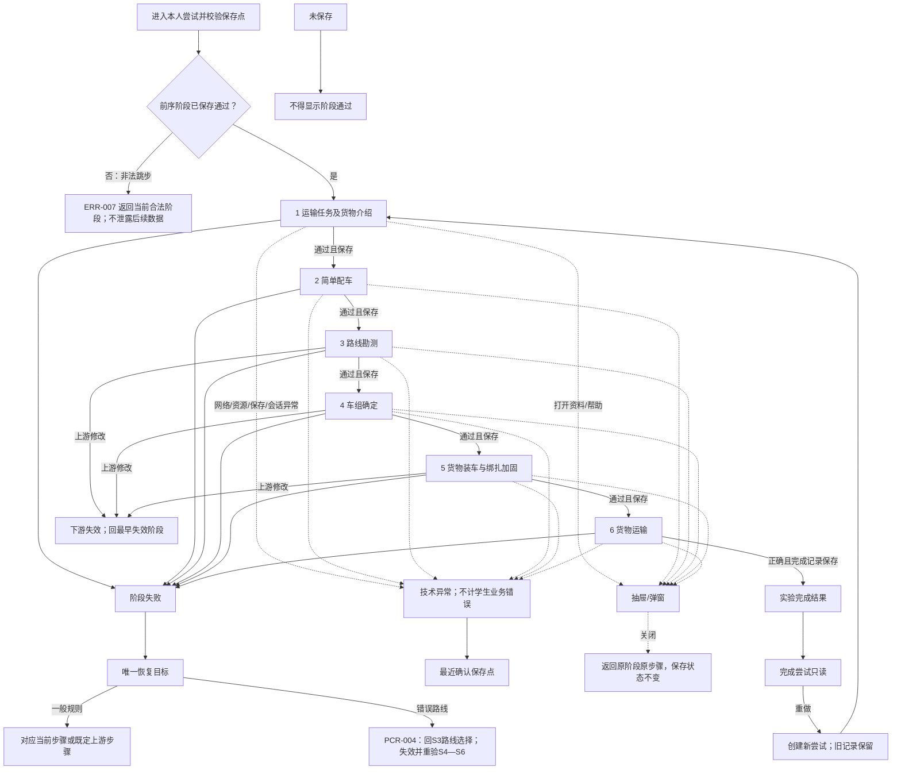

# 学生端信息架构

> 编制日期：2026-06-23
> 任务：第2周第1天（总第8天）学生端信息架构
> 基线状态：第7天复盘通过、G1预审不通过；本文件不是G1冻结结论。
> 专业边界：所有运输判断仅用于教学，不替代真实工程勘测、设计、审查或安全论证。

## 1. 文档目标与设计范围

本文件只定义学生端导航、层级、入口、页面关系、权限边界、状态去向和恢复目标，不设计视觉稿、具体技术路由、数据库字段或业务代码。目标是让学生从登录进入系统、学习知识、创建或继续实验、按固定顺序完成六阶段、处理失败与恢复、查看本人记录及完成结果，且从登录到最终实验完成结果最多两层主导航。

本日只新增本文件；不修改前7天文档，不合并Day 4分支，不补造公式、案例参数、阈值、容差、评价分档或权限规则。需要改变候选基线的事项仅登记CR建议。

## 2. 依据与候选基线状态

| 依据 | 读取位置 | 本日用法 | 状态 |
|---|---|---|---|
| `docs/论文功能映射.md` | 当前分支 | 功能、角色、数据对象、论文来源 | 已完整审查 |
| `docs/用户与场景.md` | 当前分支 | STU/ERR场景、权限、Q原编号 | 已完整审查 |
| `docs/六阶段实验主流程.md` | 当前分支 | 15状态、54转换、六阶段与恢复 | 已完整审查 |
| `docs/通用功能与页面清单.md` | `ai/week1-day4-page-list`提交`b693921`，只读 | 复用50项台账中的学生端页面编号 | 已完整审查；未合并/复制 |
| `docs/专业规则目录.md` | 当前分支 | 44条规则、Q原编号、保守门禁 | 已完整审查 |
| `docs/范围排除清单与变更流程.md` | 当前分支 | IN/SUP/OUT/TBD/BAN/FUT边界 | 已完整审查 |
| `docs/第1周需求复盘与G1预审.md` | 当前分支 | CON/GAP/RISK/BLOCK/ACT与治理主题 | 已完整审查 |
| 126天实施计划 | 当前工作树 | Day 8—14、G1、严格范围与最终验收 | 已完整审查 |

当前候选基线只能表述为“Day 6候选基线＋Day 4只读页面分支＋Day 7预审文档”。Day 7结论保持为“第7天复盘通过、G1预审不通过”；8个BLOCK、6个CON、6个GAP、3个RISK、15个ACT及18个待确认治理主题均未因本文件关闭。

## 3. 信息架构原则

1. 第1层为学生端顶级栏目，第2层为栏目内任务、列表或内容入口；实验阶段、步骤、标签、抽屉、弹窗与状态反馈不额外计主导航层级。
2. 顶级栏目固定为“首页、知识学习、我的实验、操作记录”，共4个；同一业务对象只设一个受控节点，快捷入口仅深链到该节点，不复制页面或状态。
3. 六阶段共用一个实验工作区外壳，名称和顺序固定，不成为六个顶级栏目。
4. 前序阶段未保存通过不得进入后序；非法深链返回当前合法阶段且不泄露后续数据。
5. 学生仅访问本人尝试、本人日志、本人学习记录及获准展示的本人结果；教师端、管理端、评价配置、他人数据和未发布成绩一律拒绝。
6. 完成结果不等于成绩发布；学生默认可看完成状态、六阶段摘要和本人记录，不可看未发布最终成绩。
7. 已完成尝试只读；重做创建新尝试并保留旧记录。
8. 业务失败回规则指定唯一目标；技术异常回最近确认保存点，且不计学生业务错误。
9. 未保存不得显示阶段通过、六阶段完成或实验完成；日志待重试使用原事件标识，具体技术方案留待后续设计。
10. 实验内资料库和帮助以抽屉/弹窗打开，关闭回原阶段原步骤，不改变实验状态。
11. OUT、BAN、FUT不设入口、占位页、隐藏菜单、预留业务路由或数据对象；TBD只显示来源规定的保守处理。
12. 首版只涉及桌面浏览器；不设计移动端专用页面或导航。

## 4. Day 7问题约束

### 4.1 CON、GAP与RISK影响

| 编号 | 对学生端IA的影响 | 本日保守处理 | 状态/ACT |
|---|---|---|---|
| CON-001 | Day 4页面清单不在当前主链 | PCR-002已完成受控历史整合并保留来源提交 | 已关闭；ACT-001完成 |
| CON-002 | 错误路线恢复目标在阶段3选线与阶段6重试间冲突 | PCR-004确定唯一回阶段3路线选择，阶段4—6失效并重验；阶段6重试仅是重验后的旅程结果 | Day12后已关闭 |
| CON-003 | 梯子/安全带顺序表述不一致 | IA只指向阶段5当前工具步骤，不固化新的工具步骤 | 未关闭；ACT-003 |
| CON-004 | G1资产清单门槛与计划时序冲突 | PCR-005区分G1资产需求基线与Day29执行清单 | 已关闭；ACT-004完成 |
| CON-005 | 学习进度计划天数引用错误 | 不改引用；学习记录入口不依赖该天数 | 未关闭；ACT-005 |
| CON-006 | 教师只读视图与尝试生命周期混用 | 学生业务状态与只读视图模式分列；查看不改变生命周期 | 已关闭；ACT-006完成 |
| GAP-001 | 评价取数所需提问、讨论、互动、笔记、报告入口缺失 | PCR-006已批准；采用LRN-005/006最小异步入口并关联TEA-008/009 | 已关闭；ACT-007完成 |
| GAP-002 | 预G1候选基线CR入口缺失 | PCR-001/PDEC-001已建立预G1候选基线变更机制 | 已关闭；ACT-008完成 |
| GAP-003 | 专业公式/案例参数不足 | PCR-009冻结判定契约；未发布案例配置返回RULE_CONFIG_INCOMPLETE，不计学生错误 | 已关闭；ACT-009完成 |
| GAP-004 | 评价分档/方向未冻结 | PCR-008/EVAL-POL-001已冻结唯一分档、方向、周期、缺项与舍入 | 已关闭；ACT-010完成 |
| GAP-005 | 六阶段样例链未统一 | 本日建立页面—场景—状态—规则—数据—范围追踪，供Day 13继续 | 未关闭；ACT-011 |
| GAP-006 | 数据库设计输入不全 | 只列数据对象，不设计字段、表或关系 | 未关闭；ACT-012 |
| RISK-001 | 多文档Q/TBD编号重名 | 所有引用均写“来源文档＋原编号” | 未关闭；ACT-013 |
| RISK-002 | 保存、续传、计时、幂等细节未定 | 明确保存失败、断网、恢复、原键重试入口，不补技术方案 | 未关闭；ACT-014 |
| RISK-003 | P0集中导致G1排期风险 | 本日通过不改变G1结论；保持每日复核 | 未关闭；ACT-015 |

### 4.2 BLOCK与待确认治理主题

Day 7历史文档不回写。其8个BLOCK均已有追加式关闭证据；专业规则/参数BLOCK-007由PCR-009以“判定契约G1冻结、案例配置按第50—91天形成并受发布门禁控制”关闭。本文件不把未发布案例配置包装为可提交成功。

18个治理主题继续沿用Day 7 §17的来源和保守处理：角色/教师账号、教师授权、成绩发布复核撤回/历史重算、密码找回/锁定、管理员权限、案例货物数据、车辆/挂车/路面参数、三路线真值、专业公式、阈值容差精度单位、路线经济性与处置成本、重心/液压/绑扎点、评价分档方向、时间与提示计数、日志保存与断网续传、基线/规则版本、变更批准通知撤销回滚、资产及异步评价内容。IA不得为其生成默认规则。

## 5. 学生端能力范围

| 能力组 | 覆盖节点 | 范围 | 处理 |
|---|---|---|---|
| 公共入口/注册/登录/会话 | PUB-001、AUTH-001—005 | IN-001、SUP-001 | 首版正式入口 |
| 首页/创建/继续/恢复 | STU-001/002/004 | IN-014/015/017 | 首页任务入口 |
| 知识学习 | LRN-001—006 | IN-003、SUP-003、SUP-005 | 顶级栏目＋实验内抽屉＋最小异步活动/报告 |
| 六阶段 | EXP-S1-001—EXP-S6-001 | IN-004—015 | 我的实验内共享工作区 |
| 记录/日志/时间线 | STU-003、LOG-001—003 | IN-015/017 | 本人只读 |
| 完成/只读/重做 | STU-005/006、SCR-001—004 | IN-014/016/017 | 完成状态开放，成绩默认拒绝 |
| 异常/恢复 | ERR-001—008 | IN-015、SUP-001/004/008 | 状态或兜底页 |
| 最小异步活动 | LRN-005/006、TEA-008/009 | SUP-005、GAP-001 | PCR-006批准的最小异步入口；不含即时聊天 |

## 6. 学生端主导航方案

| 顶级栏目 | 目标 | 入口条件 | 二级页面/任务 | 状态提示 | 与六阶段关系 | 权限边界 | 返回路径 |
|---|---|---|---|---|---|---|---|
| 首页 | 聚合当前首要任务 | 有效学生会话 | 创建新实验、继续最近实验 | 未完成阶段、最近保存、待重试、异常；不显示未发布成绩 | 创建进S1；继续进合法保存点 | 仅本人摘要 | 任一受保护页可回首页 |
| 知识学习 | 查找并阅读已发布资料 | 有效学生会话 | 资料库目录、内容详情 | 已读/资源失败；不造学习评价结论 | 独立学习；实验内使用LRN-004 | 仅本人学习记录 | 内容→目录→知识学习 |
| 我的实验 | 管理本人尝试和结果 | 有效学生会话 | 本人实验记录、恢复、完成结果/只读 | 进行中、保存中、未保存、完成、评价待生成/失败 | 六阶段共享工作区属于本栏目 | 仅本人；完成只读 | 工作区/结果→记录列表 |
| 操作记录 | 查看本人过程证据 | 有效学生会话且尝试存在 | 本人操作记录、六阶段时间线 | 日志待重试、技术异常标识、无数据 | 不改变阶段，只读观察 | 仅本人只读 | 日志→来源尝试或记录列表 |

顶级栏目共4个；二级任务节点共9个：首页2个、知识学习2个、我的实验3个、操作记录2个。未读仅用于已发布学习内容；未完成用于尝试；保存/异常状态只显示在相关尝试和工作区，不作为新导航栏目。

深链接规则：先鉴权，再校验角色、对象归属、生命周期、阶段顺序、版本/失效与只读模式；任一失败只去唯一安全目标。未知URL进ERR-002；移动端首版不涉及。

## 7. 导航层级定义

- 第0层：PUB/AUTH公共认证入口，不计入登录后的学生主导航层级。
- 第1层：4个学生顶级栏目。
- 第2层：栏目内任务入口、列表项或内容入口。
- 工作区内部：阶段、步骤、标签、抽屉、弹窗、浮层和异常反馈均为上下文内结构，不新增主导航层级。
- “不超过两层”以主导航信息层级验收，不以浏览器请求次数替代；页面跳转次数另行记录。
- 快捷卡、列表项和深链若指向同一页面编号/尝试ID，视为同一受控节点，不构成重复IA入口；其鉴权与返回目标必须一致。

## 8. 学生端信息架构树

```text
公共入口 PUB-001
├─ 学生注册 AUTH-001
└─ 统一登录 AUTH-002 ─ 会话失效 AUTH-005
   └─ 学生端
      ├─ 首页 STU-001
      │  ├─ 创建新实验 STU-002 → 六阶段工作区
      │  └─ 继续实验 STU-004 → 最近保存点
      ├─ 知识学习 LRN-001
      │  ├─ 章节目录 LRN-002
      │  ├─ 内容详情 LRN-003
      │  ├─ 学习活动中心 LRN-005
      │  └─ 报告提交 LRN-006
      ├─ 我的实验 STU-003
      │  ├─ 六阶段共享工作区 EXP-S1—S6
      │  └─ 完成结果 SCR-001 → 已完成只读 STU-005 → 重做 STU-006
      └─ 操作记录 LOG-001
         └─ 六阶段时间线 LOG-002
通用上下文：LRN-004、HLP-001—003、LOG-003、SCR-003—004、ERR-001—008
```

## 9. 公共入口与认证架构

PUB-001只提供学生登录、学生注册和教师登录分流，不显示业务数据或管理员入口。AUTH-001成功后回AUTH-002；AUTH-002按认证角色分流，学生只进STU-001；AUTH-004留在原认证页；AUTH-005阻断受保护操作，清除受保护展示后重登，学生重登成功经ERR-006校验后进入STU-004或最近合法保存点。安全返回地址必须重新校验，不能凭旧URL恢复越权目标。

## 10. 学生首页架构

首页只承担两项唯一主任务：创建新实验、继续最近未完成实验。资料库、实验记录和操作记录通过顶级栏目进入，不在首页制造第二套栏目；若显示摘要卡，卡片只深链到对应受控节点。无尝试时显示ERR-008并提供创建；创建失败留首页或以原请求重试；继续时必须先进入STU-004恢复校验。

## 11. 知识学习架构

LRN-001是知识学习栏目根，LRN-002为目录标签，LRN-003为内容详情。章节不存在或资源失败转ERR-004，恢复到目录或最近可用内容。LRN-004只在实验工作区打开，不改变路由、阶段、步骤或保存状态；关闭返回原步骤。PCR-006批准LRN-005学习活动中心与LRN-006报告提交页，只实现异步提问、讨论/回复、笔记、预习报告和实验报告；不含即时聊天，局部活动状态不得改变实验生命周期。

## 12. 我的实验架构

STU-003列本人全部尝试。未完成项进入STU-004校验后恢复；完成项进入SCR-001/STU-005只读组合视图。列表状态至少区分未开始、进行中、等待恢复、已完成、评价待生成/失败；技术异常不冒充业务失败。创建入口仍以首页STU-002为规范任务入口，记录页的“无数据下一步”深链到同一STU-002，不新建页面。

## 13. 六阶段工作区架构

### 13.1 共享外壳与状态表达

六阶段采用共享工作区外壳，六个EXP页面是同一栏目下按状态机切换的阶段内容，不是六个顶级页面。外壳固定显示：六阶段进度、当前阶段、当前步骤、业务状态、保存状态、操作区、规则/反馈区、资料库、帮助和安全离开入口。

- 当前阶段：六阶段中的合法阶段；当前步骤：阶段内部恢复点；保存状态：未改动/保存中/已保存/保存失败/待重试，三者不得混写。
- 未保存不得显示阶段通过；阶段通过必须同时满足规则通过与保存确认。
- 前序未通过或版本失效时，后续阶段不可点击/不可深链；ERR-007返回当前合法阶段。
- 上游修改后按FLW-002标记下游失效，显示原因、来源版本和最早失效阶段；旧日志保留。
- 业务失败进入HLP-002/003并回唯一规则目标；PCR-004规定运输失败唯一回阶段3路线选择，并显示阶段4—6失效与重验说明。
- 网络/资源/保存/会话异常进入ERR-003—006，回最近确认保存点，不增加业务错误。
- LRN-004与HLP-001关闭后回原步骤；提示不填值、不代做、不自动提交。
- 第六阶段成功且完成记录保存后进SCR-001；完成尝试进入只读视图模式，生命周期不因查看改变。

### 13.2 逐阶段架构

| 阶段/入口 | 页面目标 | 关键内容区 | 学生操作区 | 规则与反馈区 | 保存状态区 | 帮助 | 成功去向 | 失败去向 | 未关闭问题 | 保守处理 |
|---|---|---|---|---|---|---|---|---|---|---|
| 1 EXP-S1-001 | 理解任务货物 | 任务、参数、360° | 查看、确认、提交 | DAT、FLW；缺字段/资源分离 | 确认与阶段快照 | HLP/LRN-004 | S2 | 本阶段或保存点 | GAP-003、CON-004 | 缺数据/资源不通过 |
| 2 EXP-S2-001 | 形成初步车组 | 组合、挂车、牵引车 | 选择、提交、重试 | VEH/SLP | 草稿与通过快照 | 同上 | S3 | 本阶段选择 | GAP-003 | 参数不足显示规则待确认 |
| 3 EXP-S3-001 | 完成三路线五类勘测 | 路线、障碍、测量、选线 | 测量、判断、处置、选线 | HGT/ARC/ORT/SLP/BRG/RTE | 单项草稿/勘测快照 | 同上 | S4 | 对应测量或选线 | GAP-003/005；PCR-004 | 不造经济排序；S6错路线回此处并失效4—6 |
| 4 EXP-S4-001 | 确定正式车组 | 配置、拼接、液压、轴载 | 调整、编点、阀门、校核 | CFG/AXL | 步骤快照/正式车组 | 同上 | S5 | 当前步骤；超载回挂车参数 | GAP-003/005 | 缺参数不出确定结果 |
| 5 EXP-S5-001 | 完成装车绑扎 | 位置、液压、工具、点位、角度 | 调位、选工具/点、提交 | LOD/TLS/LSH | 正确步骤/失败即时日志/通过快照 | 同上 | S6 | 位置、当前工具或绑扎点 | CON-003、GAP-003/005 | 不固化新工具顺序；阈值空则阻断 |
| 6 EXP-S6-001 | 复验并完成运输 | 全阶段摘要、路线、动画 | 复验、开始运输 | RTE-004/FLW-005 | 复验/动画/完成幂等状态 | 同上 | SCR-001 | 业务错唯一回阶段3路线选择；技术错回保存点 | PCR-004、GAP-005 | 只呈现阶段3一个业务恢复入口 |

## 14. 操作日志与记录架构

LOG-001是操作记录栏目根，只读展示本人事件；LOG-002按固定六阶段顺序形成时间线；LOG-003显示待重试而不把未确认日志当已保存。业务错误、提示、回退、重试与技术异常必须分类显示。无日志且查询成功使用ERR-008；加载失败使用ERR-004；无权限使用ERR-001，三者不得混用。

## 15. 实验完成、只读与重做架构

SCR-001在完成记录保存成功后展示完成状态、完成时间、六阶段摘要和评价状态；SCR-002展开摘要。SCR-003/004仅告诉学生“待生成/生成失败”的概括状态，不泄露教师评价、配置、冲突细节或未发布成绩。STU-005是完成尝试只读视图；任何编辑深链拒绝。STU-006以旧尝试ID和新请求创建独立新尝试，成功后从S1开始，旧尝试、日志和结果不变。

## 16. 异常与恢复架构

| 状态 | 类型 | 学生可执行动作 | 唯一恢复目标 | 状态/计错约束 |
|---|---|---|---|---|
| AUTH-004登录失败 | 认证错误 | 修正重试 | 原认证页 | 不建会话、不枚举账号 |
| AUTH-005会话失效 | 技术/安全 | 重新登录 | 校验后的最近合法保存点 | 失效后不展示受保护数据 |
| ERR-001无权限 | 权限 | 返回 | 当前角色首页/登录 | 不泄露资源存在性 |
| ERR-002 404 | 路由 | 返回首页 | 登录角色首页或PUB-001 | 不展示受保护导航 |
| ERR-003保存失败 | 技术 | 原键重试 | 最近成功保存点 | 不显示通过，不计业务错 |
| ERR-004资源失败 | 技术 | 重试/返回 | 原入口或最近保存点 | 不进入空场景 |
| ERR-005网络中断 | 技术 | 等待/重试安全请求 | ERR-006 | 未确认写入待重试 |
| ERR-006恢复加载 | 技术 | 等待/安全返回 | 原合法页/最近保存点 | 重新鉴权与版本校验 |
| ERR-007非法跳步 | 流程拒绝 | 返回 | 当前合法阶段 | 不泄露后续数据，不计专业错 |
| ERR-008无数据 | 空状态 | 创建/清筛选/返回 | 原列表或STU-002 | 必须已鉴权且查询成功 |
| LOG-003日志待重试 | 技术 | 原事件重试 | 原业务状态 | 不重复记录/计分 |
| SCR-004评价失败 | 后台异常/规则不足 | 刷新/返回 | SCR-001 | 不补0、不显示伪成绩 |

## 17. 权限与深链接检查

| 输入 | 鉴权或状态判断 | 页面结果 | 泄露数据 | 恢复目标 | 日志要求 | 验收标准 |
|---|---|---|---|---|---|---|
| 未登录直访学生页 | 会话无效 | AUTH-002；不渲染学生数据 | 否 | 登录后重验安全返回地址 | auth_required | 登录前响应无业务数据 |
| 学生直访教师页 | 角色非教师 | ERR-001 | 否 | STU-001 | access_denied | 教师导航/数据均不可见 |
| 替换URL访问他人实验 | 尝试归属不符 | ERR-001或等价拒绝 | 否，含存在性 | STU-001 | access_denied含目标类型不含内容 | A无法读取B任何字段 |
| 直访未通过后续阶段 | 前序状态/版本门禁失败 | ERR-007 | 否 | 当前合法阶段 | illegal_transition_rejected | 状态不前移、后续数据不返回 |
| 访问完成尝试编辑URL | 完成锁定 | STU-005只读或ERR-001 | 否 | STU-005 | readonly_write_rejected | 任意写入拒绝 |
| 访问未发布成绩URL | 发布权限默认关闭 | ERR-001；仍可看SCR-001 | 否 | SCR-001 | access_denied | 不返回分数/分项/教师评价 |
| 会话失效访问受保护页 | AUTH-005 | 登录页 | 否 | ERR-006→最近合法页 | session_expired/recovery | 重登后重新鉴权，不凭旧缓存放行 |
| 断网恢复返回原页面 | 网络、归属、版本、保存点 | ERR-006后原合法页 | 否 | 最近保存点 | interrupted/restored | 不重复日志/计分 |
| 未知URL | 路由不匹配 | ERR-002 | 否 | 角色首页/PUB-001 | 404可审计 | 可恢复且无路由数据泄露 |
| 合法查询0条 | 已鉴权、查询成功、数量0 | ERR-008 | 否 | 创建或原列表 | query_empty | 不显示为无权限或加载失败 |

## 18. 页面入口与追踪矩阵

### 18.1 字段约定

为保持台账可读，以下缩写均为受控引用：角色`S`=学生、`T`=教师、`V`=访客、`SYS`=系统；生命周期使用《六阶段实验主流程》原状态名；`保存点`=最近服务端确认快照；`本人`=学生ID与尝试归属同时通过。数据对象只列对象名称，不代表数据库字段。

### 18.2 公共、首页、学习与记录

| 页面编号 | 页面名称 | 所属导航 | 层级 | 页面类型 | 使用角色 | 进入入口 | 前置条件 | 页面目标 | 核心展示 | 核心操作 | 对应用户场景 | 对应六阶段 | 对应生命周期状态 | 对应状态转换 | 对应规则 | 所需数据对象 | 日志事件 | 成功去向 | 失败状态 | 唯一返回或恢复目标 | 权限要求 | 保存要求 | 是否首版 | 范围编号 | 待确认事项 | 验收标准 | 备注 |
|---|---|---:|---|---|---|---|---|---|---|---|---|---|---|---|---|---|---|---|---|---|---|---|---|---|---|---|---|
| PUB-001 | 系统入口与角色分流 | 公共 | 0 | 独立页 | V | 根入口 | 系统可用 | 认证分流 | 学生登录/注册、教师登录 | 选入口 | STU-001 | 无 | 未开始 | — | SUP-001 | 入口配置 | 可选访问 | AUTH-001/002/003 | ERR-004 | 本页 | 公开无业务数据 | 无 | 是 | IN-001,SUP-001 | 无 | 三入口可达无泄露 | 无管理员入口 |
| AUTH-001 | 学生注册 | 公共 | 0 | 独立页 | V | PUB-001/AUTH-002 | 未登录 | 建立学生账户 | 学号/密码/说明 | 提交/返回 | STU-001,ERR-001 | 无 | 未开始 | — | DAT-002 | 用户 | register_result | AUTH-002 | AUTH-004 | 本页 | 仅访客 | 成功保存用户且不存明文 | 是 | IN-001 | 用户Q-06 | 空/重复拒绝，合法成功 | 不提供找回锁定 |
| AUTH-002 | 统一登录 | 公共 | 0 | 独立页 | V | PUB-001/AUTH-005 | 未登录/失效 | 认证分流 | 凭据 | 登录/注册 | STU-001,ERR-001/005 | 无 | 未开始/等待恢复 | ENT-004 | SUP-001 | 用户/会话 | login_result | STU-001 | AUTH-004 | 本页 | 成功后最小权限 | 保存会话 | 是 | IN-001,SUP-001 | 无 | 学生只进学生首页 | 教师入口不属学生导航 |
| AUTH-003 | 教师登录边界节点 | 公共 | 0 | 独立页 | T/V | PUB-001/AUTH-002 | 已有教师账号 | 明确角色分流边界 | 教师凭据/返回统一登录 | 登录/返回 | 权限场景 | 无 | 未开始/等待恢复 | ENT-005 | SUP-001 | 用户/会话 | teacher_login_result | 教师端（学生不可达） | AUTH-004/ERR-001 | AUTH-002 | 必须为教师；学生拒绝 | 保存教师会话 | 是 | IN-002,SUP-001 | 用户Q-01 | 学生凭据不能进入教师端 | 非学生主导航节点 |
| AUTH-004 | 登录失败 | 公共 | 0 | 错误状态 | V | 认证提交失败 | 校验失败 | 安全反馈 | 通用/字段错误 | 修正重试 | ERR-001 | 无 | 未开始 | — | SUP-001 | 失败类型 | auth_failed | 原认证成功路径 | 重复失败 | 原认证页 | 不枚举账号 | 不保存错误会话 | 是 | IN-001 | 用户Q-06 | 无错误身份会话 | — |
| AUTH-005 | 会话失效重登 | 上下文 | 内部 | 弹窗 | S | 受保护页 | 会话失效 | 阻断并重登 | 失效/保存点 | 去登录 | ERR-005 | 1—6 | 暂停或等待恢复 | ERR-003 | ERR-001 | 会话/尝试/快照 | session_expired | AUTH-002 | 重登失败 | ERR-006后保存点 | 不展示受保护数据 | 保存点不前移 | 是 | IN-001/015 | 主流程Q-07 | 失效后不能写 | — |
| STU-001 | 学生首页 | 首页 | 1 | 独立页 | S | AUTH-002 | 有效会话 | 聚合首要任务 | 最近尝试/状态 | 创建/继续 | STU-001/003 | 1—6 | 未开始/进行中/等待恢复 | ENT-001/003 | FLW-001 | 尝试摘要/保存点 | home_view/action | STU-002/004 | ERR-004/008 | 刷新/登录 | 仅本人 | 只读聚合 | 是 | IN-001/014/017 | 无 | 创建继续一步可达 | 不显示未发布成绩 |
| STU-002 | 创建新实验确认 | 首页 | 2 | 弹窗 | S | STU-001 | 案例可用 | 新建尝试 | 案例摘要 | 确认/取消 | STU-003 | 1 | 未开始→创建实验 | ENT-001/002 | FLW-004 | 案例/尝试/请求 | attempt_create | EXP-S1-001 | ERR-003/004 | STU-001或原键重试 | 仅本人创建 | 创建确认后持久化 | 是 | IN-004/010/014/015 | 专业规则Q-01等 | 同请求仅一个尝试 | 单案例 |
| STU-003 | 本人实验记录 | 我的实验 | 2 | 独立页 | S | 顶级导航 | 有效会话 | 查看本人尝试 | 状态/阶段/时间 | 筛选/打开 | STU-003/006 | 1—6 | 任意本人状态 | — | SUP-001 | 尝试列表 | attempts_view | STU-004/005/SCR-001 | ERR-004/008 | STU-001 | 仅本人 | 只读 | 是 | IN-017 | 无 | 无他人记录，状态去向正确 | 创建深链同STU-002 |
| STU-004 | 未完成实验恢复 | 我的实验 | 2 | 独立页 | S | 首页/记录/重登 | 本人未完成 | 校验恢复点 | 阶段/保存/待重试 | 继续/返回 | STU-003,ERR-005 | 1—6 | 等待恢复→加载→进行 | ENT-003/004,ERR-003 | FLW-003/004 | 尝试/版本/快照/队列 | resume | 对应EXP | ERR-001/003/004/006 | 最近保存点 | 本人未完成 | 不改通过状态 | 是 | IN-014/015 | 主流程Q-07/08 | 三类恢复一致不重复计分 | — |
| STU-005 | 已完成实验只读 | 我的实验 | 2 | 独立页 | S | STU-003/SCR-001 | 本人已完成 | 查看锁定结果 | 摘要/时间/日志 | 查看/重做 | STU-006 | 1—6 | 已提交实验只读 | END-003/004 | FLW-005 | 尝试/阶段快照 | readonly_view/reject | LOG-001/STU-006 | ERR-001/004 | STU-003 | 仅本人只读 | 禁止写旧尝试 | 是 | IN-014/017 | 用户Q-04/05 | 编辑拒绝旧记录不变 | 视图模式≠生命周期变更 |
| STU-006 | 新建重做确认 | 我的实验 | 内部 | 弹窗 | S | STU-005 | 本人完成 | 创建新尝试 | 新旧隔离 | 确认/取消 | STU-006 | 1 | 只读→新建重做→加载 | END-004/005 | FLW-004 | 旧/新尝试/请求 | redo | EXP-S1-001 | ERR-003/004 | STU-005或原键重试 | 仅本人 | 新记录；旧记录不变 | 是 | IN-014/017 | 流程Q-10 | 新ID从S1开始 | 不是撤回 |
| LRN-001 | 资料库首页 | 知识学习 | 1 | 独立页 | S | 顶级导航 | 有效会话 | 主题入口 | 已发布目录/状态 | 选主题 | STU-002 | 无 | 状态不变 | — | LOG-002 | 内容目录/学习记录 | learning_enter | LRN-002/003 | ERR-004/008 | 知识学习根 | 本人学习记录 | 可记进入 | 是 | IN-003 | Day4页面Q-12 | 四类主题可读 | 视频按合法素材 |
| LRN-002 | 章节目录 | 知识学习 | 2 | 页内标签 | S | LRN-001 | 目录加载 | 定位章节 | 章节/已读 | 选择 | STU-002 | 无 | 状态不变 | — | LOG-002 | 章节/进度 | chapter_select | LRN-003 | ERR-004 | LRN-001 | 本人进度 | 保存已读按基线 | 是 | IN-003 | GAP-001 | 准确定位可返回 | 异步活动不进导航 |
| LRN-003 | 内容详情 | 知识学习 | 2 | 独立页 | S | LRN-001/002 | 章节可访问 | 阅读内容 | 图文/来源 | 阅读/前后章/返回 | STU-002 | 无 | 状态不变 | — | LOG-002 | 章节/资源/进度 | learning_view | 下一章/LRN-001 | ERR-004 | 目录/可用内容 | 学生 | 保存阅读进度 | 是 | IN-003 | 用户Q-10,GAP-001 | 失败不记有效学习 | 不新增笔记页 |
| LRN-004 | 实验内资料库 | 工作区 | 内部 | 抽屉 | S | EXP资料按钮 | 本人进行中 | 不离开实验查阅 | 目录/推荐内容 | 阅读/关闭 | STU-002/004 | 1—6 | 原状态不变 | HLP-001 | LOG-002 | 章节/返回上下文 | in_exp_learning | 原EXP原步骤 | ERR-004 | 原步骤/保存点 | 本人尝试 | 不改实验状态 | 是 | IN-003 | GAP-001 | 关闭后状态不丢 | — |
| LOG-001 | 本人操作记录 | 操作记录 | 1 | 独立页 | S | 顶级导航/STU-005 | 本人尝试存在 | 查看过程证据 | 事件分类/时间 | 筛选/展开 | STU-004/005 | 1—6 | 任意本人状态 | — | LOG-001/002 | 操作日志/尝试 | logs_view | LOG-002 | ERR-004/008 | 来源尝试/记录列表 | 仅本人只读 | 禁止修改 | 是 | IN-015/017 | 用户Q-14 | 顺序稳定不可编辑 | 技术异常单列 |
| LOG-002 | 六阶段时间线 | 操作记录 | 2 | 页内标签 | S | LOG-001 | 有日志 | 还原六阶段 | 阶段节点/缺口 | 展开证据 | STU-005 | 1—6 | 状态不变 | — | LOG-001/002 | 日志/阶段快照 | timeline_view | LOG-001 | ERR-004/008 | LOG-001 | 仅本人只读 | 无写入 | 是 | IN-015/017 | GAP-005 | 顺序固定、缺口明示 | — |
| LOG-003 | 日志待重试 | 上下文 | 内部 | 错误状态 | S/SYS | 写入失败 | 有事件ID | 安全重试 | 数量/结果 | 原事件重试 | ERR-007 | 1—6 | 原状态/等待恢复 | ERR-006/007 | FLW-004,LOG-001 | 日志批次/事件 | log_retry | 原业务状态 | 持续失败 | 原业务状态 | 不扩大权限 | 原事件仅一条 | 是 | IN-015 | 主流程Q-07 | 不丢不重复 | 技术方案待Day11/12 |

### 18.3 六阶段、帮助、结果与异常

| 页面编号 | 页面名称 | 所属导航 | 层级 | 页面类型 | 使用角色 | 进入入口 | 前置条件 | 页面目标 | 核心展示 | 核心操作 | 对应用户场景 | 对应六阶段 | 对应生命周期状态 | 对应状态转换 | 对应规则 | 所需数据对象 | 日志事件 | 成功去向 | 失败状态 | 唯一返回或恢复目标 | 权限要求 | 保存要求 | 是否首版 | 范围编号 | 待确认事项 | 验收标准 | 备注 |
|---|---|---:|---|---|---|---|---|---|---|---|---|---|---|---|---|---|---|---|---|---|---|---|---|---|---|---|---|
| EXP-S1-001 | 运输任务及货物介绍工作区 | 我的实验 | 2 | 工作区 | S | STU-002/004/006 | 本人S1 | 理解任务货物 | 目标/参数/模型/状态 | 查看/确认/提交 | STU-003/004 | 1 | 进行→校验→通过/失败 | S1-001—004 | DAT,FLW | 案例/货物/快照 | s1_* | EXP-S2 | 业务失败/ERR-003/004 | 本阶段/保存点 | 本人可编辑 | 通过快照必存 | 是 | IN-004/010/014/015 | 规则Q-01 | 缺项不继续 | — |
| EXP-S2-001 | 简单配车工作区 | 我的实验 | 2 | 工作区 | S | S1通过 | S1已保存通过 | 初步车组 | 组合/车辆/结果 | 选择/提交/重试 | STU-003/005 | 2 | 进行→校验→通过/失败 | S2-001—004 | VEH/SLP/FLW | 货物/车辆/车组 | s2_* | EXP-S3 | 规则待确认/保存失败 | 本阶段选择/保存点 | 本人可编辑 | 草稿/通过快照 | 是 | IN-005/012/014/015 | 规则Q-02—05 | 未通过不可进S3 | 不造参数 |
| EXP-S3-001 | 路线勘测工作区 | 我的实验 | 2 | 工作区 | S | S2通过或S6错误路线回退 | S2已保存通过；回退时S6失败证据已存 | 三路线五类勘测 | 路线/障碍/测量/选线 | 测量/判断/提交 | STU-003/005 | 3 | 进行→校验→通过/失败 | S3-001—006、S6-003 | HGT/ARC/ORT/SLP/BRG/RTE | 路线/障碍/测量/结论/失效链 | s3_*、s6_rollback_route | EXP-S4 | 规则待确认/保存失败 | 对应测量或选线 | 本人可编辑 | 单项/阶段快照 | 是 | IN-006/009/011/014/015 | 规则Q-06—12；PCR-004 | 15类记录齐；S6回退时4—6失效 | PCR-004已裁决唯一目标 |
| EXP-S4-001 | 车组确定工作区 | 我的实验 | 2 | 工作区 | S | S3通过 | S3已保存通过 | 正式车组 | 配置/拼接/液压/轴载 | 调整/校核 | STU-003/005 | 4 | 进行→待提交→校验→通过/失败 | S4-001—006 | CFG/AXL/FLW | 路线/车组/回路/轴载 | s4_* | EXP-S5 | 规则待确认/保存失败 | 当前步骤；超载回挂车参数 | 本人可编辑 | 步骤/正式车组 | 是 | IN-007/012/014/015 | 规则Q-13/14 | 全轴通过且保存才继续 | — |
| EXP-S5-001 | 货物装车与绑扎加固工作区 | 我的实验 | 2 | 工作区 | S | S4通过 | S4已保存通过 | 完成装车绑扎 | 位置/液压/工具/点/角 | 调位/选工具点/提交 | STU-003/004/005 | 5 | 进行→校验→通过/失败 | S5-001—007 | LOD/TLS/LSH/FLW | 位置/读数/工具/点位/角度 | s5_* | EXP-S6 | 规则待确认/保存失败 | 位置/当前工具/绑扎点 | 本人可编辑 | 正确步骤/失败日志/快照 | 是 | IN-008/013/014/015 | 规则Q-15—18,CON-003 | 未确认阈值不通过 | 不新增顺序 |
| EXP-S6-001 | 货物运输工作区 | 我的实验 | 2 | 工作区 | S | S5通过 | 前五阶段有效 | 复验完成运输 | 汇总/路线/动画/保存 | 复验/开始运输 | STU-003/005 | 6 | 进行→校验→通过→完成或失败→S3 | S6-001—005 | RTE-004/FLW-002/005 | 全阶段版本/路线/完成记录/失效链 | s6_* | SCR-001 | 路线失败/技术异常 | 业务错唯一回S3并失效4—6；技术错保存点 | 本人可编辑 | 复验/动画/完成幂等保存 | 是 | IN-009/014/015 | PCR-004 | 正确路线唯一完成；错误路线唯一回S3 | 不给双恢复入口 |
| HLP-001 | 主动帮助 | 工作区 | 内部 | 抽屉 | S | EXP帮助 | 当前步骤可识别 | 方法提示 | 目标/知识/资料 | 查看/关闭 | STU-004 | 1—6 | 原状态 | HLP-001 | TLS-002/LOG-002 | 提示/上下文 | help_requested | 原步骤 | ERR-004 | 原步骤 | 本人尝试 | 不改业务值 | 是 | IN-003/015 | 用户Q-10 | 不代做 | — |
| HLP-002 | 阻断错误提示 | 工作区 | 内部 | 弹窗 | S | 业务失败 | 规则可定位 | 解释并恢复 | 原因/方法/目标 | 关闭返回 | STU-004/ERR-002 | 1—6 | 失败→回退修改 | HLP-002 | 失败规则/LOG | 规则结果/错误 | error_hint | 指定步骤 | 提示资源失败 | 唯一规则目标；S6路线错误为S3路线选择 | 本人尝试 | 失败日志先存 | 是 | IN-003/014/015 | PCR-004 | 不可绕过，目标唯一 | — |
| HLP-003 | 同类错误升级 | 工作区 | 内部 | 弹窗 | S | 再次同类失败 | 同尝试同规则 | 更具体提示 | 方法/资料/目标 | 关闭/查资料 | STU-004 | 1—6 | 失败→回退修改 | HLP-003 | TLS-002/LOG | 错误计数/提示 | escalated_hint | 指定步骤/LRN-004 | ERR-004 | 指定步骤 | 本人尝试 | 不自动提交 | 是 | IN-003/015 | 用户Q-10 | 更具体但不代做 | — |
| SCR-001 | 实验完成结果 | 我的实验 | 2 | 独立页 | S | S6成功/STU-005 | 完成记录已保存 | 确认完成 | 状态/时间/摘要/评价态 | 看摘要/日志/返回 | STU-006 | 1—6 | 六阶段完成→评价待生成→已完成 | END-001—003 | FLW-005 | 尝试/快照/评价任务 | result_view | SCR-002/003/004/STU-005 | ERR-003/004 | STU-005/原键重试 | 本人只读 | 完成记录唯一 | 是 | IN-016/017 | 用户Q-04/05,GAP-004 | 未保存不显示完成 | 不等于成绩发布 |
| SCR-002 | 六阶段结果摘要 | 我的实验 | 内部 | 页内标签 | S | SCR-001 | 本人完成/只读 | 汇总阶段结果 | 六阶段顺序/版本 | 展开/去日志 | STU-006 | 1—6 | 完成后状态不变 | — | FLW-002/005 | 阶段快照/失效链 | summary_view | LOG-002 | SCR-004 | SCR-001 | 本人只读 | 无写入 | 是 | IN-017 | GAP-005 | 六阶段可追溯 | 不显示伪成绩 |
| SCR-003 | 评价待生成 | 我的实验 | 内部 | 加载状态 | S/SYS | SCR-001 | 评价任务存在 | 显示等待 | 状态/触发时间 | 刷新/返回 | STU-006 | 无 | 评价数据待生成 | END-001/002 | LOG-002 | 评价任务 | evaluation_pending | SCR-001状态更新 | SCR-004 | SCR-001 | 学生只见状态 | 不重复任务 | 是 | IN-016 | GAP-004 | 刷新不重复，不显示分数 | — |
| SCR-004 | 评价生成失败 | 我的实验 | 内部 | 错误状态 | S/SYS | SCR-003 | 缺项/冲突/失败 | 阻止伪结果 | 学生概括状态 | 刷新/返回 | ERR-009 | 无 | 评价数据待生成 | END-002失败支路 | ERR-002/LOG-002 | 问题记录/评价任务 | evaluation_failed | SCR-003/001 | 持续失败 | SCR-001 | 不泄露敏感细节 | 不补0不写伪分 | 是 | IN-016 | GAP-004 | 不展示旧结果为当前 | 无人工处理入口 |
| ERR-001 | 无权限 | 通用 | 兜底 | 独立页 | S/V | 鉴权失败 | 请求拒绝 | 安全拒绝 | 通用说明 | 返回 | 权限场景 | 无 | 状态不变 | ENT-005/ERR-008 | SUP-001 | 角色/目标类型 | access_denied | STU-001/AUTH-002 | 重复越权 | 当前角色首页/登录 | 零数据泄露 | 无 | 是 | IN-001,SUP-001 | 用户Q-02/03 | 教师/他人/成绩均拒绝 | — |
| ERR-002 | 404 | 通用 | 兜底 | 独立页 | 全部 | 未知URL | 无匹配 | 可恢复 | 404 | 返回 | 无 | 无 | 状态不变 | — | SUP-001 | 原URL/会话角色 | route_not_found | 角色首页/PUB | 返回失败 | PUB-001 | 不泄露路由 | 无 | 是 | SUP-001/008 | 无 | 未知URL可恢复 | — |
| ERR-003 | 保存失败 | 工作区 | 内部 | 错误状态 | S/SYS | 写入未确认 | 有请求键 | 明示未保存 | 对象/状态 | 原键重试 | ERR-007 | 1—6 | 等待恢复/原状态 | ERR-005 | FLW-003/004 | 请求/快照/保存点 | save_failed | 原成功路径 | 持续失败 | 最近保存点 | 原权限 | 未确认不通过 | 是 | IN-015 | RISK-002 | 重试仅一次结果 | — |
| ERR-004 | 资源加载失败 | 通用 | 内部 | 错误状态 | S | 加载失败 | 有安全返回点 | 恢复资源 | 资源/版本 | 重试/返回 | ERR-006 | 1—6/学习 | 加载/等待恢复 | ERR-004 | ERR-003 | 资源/版本/上下文 | resource_failed | 原页/阶段 | 持续失败 | 原入口/保存点 | 沿用原权限 | 不改业务状态 | 是 | IN-003/015,SUP-003 | CON-004 | 不进空场景不计业务错 | — |
| ERR-005 | 网络中断 | 通用 | 内部 | 浮层 | S | 网络变化 | 页面已加载 | 全局反馈 | 离线/待同步 | 等待/安全重试 | ERR-005 | 1—6 | 暂停或等待恢复 | ERR-002 | ERR-001/FLW-004 | 网络/待重试 | connection_interrupted | ERR-006 | 长期离线 | 最近保存点 | 原权限 | 未确认写入待重试 | 是 | IN-015 | RISK-002 | 离线不显示成功 | — |
| ERR-006 | 恢复加载 | 通用 | 内部 | 加载状态 | S | 重连/重登/恢复 | 网络身份恢复 | 校验恢复点 | 身份/资源/版本进度 | 等待/返回 | ERR-005 | 1—6 | 加载中 | ERR-003 | FLW-003/004 | 尝试/版本/队列 | recovery_* | 原合法页/EXP | ERR-001/003/004 | 最近保存点 | 重新完整鉴权 | 不前移未确认状态 | 是 | IN-015,SUP-001/004 | RISK-002 | 无越权无重复计分 | — |
| ERR-007 | 非法跳步 | 工作区 | 内部 | 错误状态 | S | 直访后续 | 门禁失败 | 拒绝前进 | 原因/合法阶段 | 返回 | STU-003 | 1—6 | 状态不变 | ERR-008 | FLW-001/002 | 尝试/阶段/版本 | illegal_transition | 当前合法EXP | 重复请求 | 当前合法阶段 | 本人也须顺序合法 | 无 | 是 | IN-014,SUP-001 | 无 | 后续数据不返回 | — |
| ERR-008 | 无数据 | 通用 | 内部 | 空状态 | S | 合法查询0条 | 已鉴权查询成功 | 给下一步 | 无记录说明 | 创建/清筛选/返回 | STU-001/003 | 无 | 状态不变 | — | SUP-001 | 查询条件/空结果 | query_empty | STU-002/原列表 | 查询失败→ERR-004 | 原页/创建 | 仅本人范围 | 无 | 是 | IN-017 | 无 | 不冒充权限/加载失败 | — |

页面追踪条目共40项；其中独立页面14项、页面内标签3项、工作区6项、弹窗/抽屉/浮层8项、错误/加载/空状态9项。需要改变Day 4页面类型或新增正式页面的事项均未直接实施。

## 19. 导航深度验收

| 起点 | 操作路径 | 顶级导航点击次数 | 页面跳转次数 | 当前层级 | 超过两层 | 重复入口 | 可能迷路 | 返回路径 | 结论 |
|---|---|---:|---:|---:|---|---|---|---|---|
| 登录 | AUTH-002→首页→创建STU-002 | 0 | 2 | 2 | 否 | 否；规范节点唯一 | 否 | 取消回首页 | 通过 |
| 登录 | AUTH-002→首页→继续STU-004 | 0 | 2 | 2 | 否 | 否 | 否 | 回首页 | 通过 |
| 登录 | AUTH-002→知识学习→LRN-001 | 1 | 2 | 1 | 否 | 否 | 否 | 回首页/栏目根 | 通过 |
| 登录 | AUTH-002→我的实验→STU-003 | 1 | 2 | 2 | 否 | 否 | 否 | 回首页 | 通过 |
| 登录 | AUTH-002→我的实验→完成项→SCR-001 | 1 | 3 | 2 | 否 | 同一结果节点 | 否 | 回记录列表 | 通过 |
| 工作区 | EXP→LRN-004 | 0 | 0 | 内部 | 否 | 否 | 否 | 关闭回原步骤 | 通过 |
| 工作区 | EXP→HLP-001 | 0 | 0 | 内部 | 否 | 否 | 否 | 关闭回原步骤 | 通过 |
| 已完成 | STU-005→STU-006→新尝试S1 | 0 | 1 | 2 | 否 | 否 | 否 | 取消回只读页 | 通过 |
| 登录 | AUTH-002→操作记录→LOG-001→LOG-002 | 1 | 2 | 2 | 否 | 否 | 否 | 时间线回日志 | 通过 |
| S6成功 | EXP-S6→SCR-001 | 0 | 1 | 2 | 否 | 否 | 否 | 回记录列表 | 通过 |

最大主导航层级为2；10条路径均未超过。页面跳转次数可大于主导航层级，但不会产生第三层栏目。

## 20. 范围与排除检查

| 检查 | 结果 | 证据/保守处理 |
|---|---|---|
| 所有IN学生能力有入口或后台职责 | 通过 | IN-001/003—017映射至AUTH/STU/LRN/EXP/LOG/SCR；IN-002教师职责不进学生导航；IN-018为后台验收 |
| SUP可触发状态/恢复入口 | 通过 | SUP-001/003/004/008有鉴权、资源、保存、恢复；SUP-002后台版本门禁；SUP-005待CR；SUP-006教师端；SUP-007运维后台 |
| OUT无页面入口 | 通过 | OUT-001—022均无节点/占位 |
| BAN无隐藏操作 | 通过 | BAN-001—008无菜单、写入口或默认值 |
| TBD仅保守处理 | 通过 | 引用Day 6 TBD-001—014与来源Q，不转默认功能 |
| FUT不进导航/数据/估时/验收 | 通过 | FUT-001—004均未出现为节点 |
| 无未登记学生功能 | 通过 | 异步活动仅按PCR-006批准范围进入LRN-005/006 |
| 无教师/管理员/成绩权限扩张 | 通过 | 学生深链拒绝；未发布成绩拒绝 |
| 无即时聊天/排行榜/AI辅导/移动端/多案例编辑器 | 通过 | 无入口、占位或预留路由 |

## 21. 问题与CR建议

| 问题编号 | 问题标题 | 严重级别 | 涉及页面 | 涉及场景 | 涉及状态 | 涉及规则 | 涉及范围编号 | 问题描述 | 证据 | 当前保守处理 | 需要CR | 建议责任人 | 关闭条件 | 验收方式 | 当前状态 | 备注 |
|---|---|---|---|---|---|---|---|---|---|---|---|---|---|---|---|---|
| IA-001 | Day8“最终成绩”与学生成绩默认关闭语义冲突 | P1 | SCR-001/005/006 | STU-006 | 完成/只读 | 评价权限 | IN-016/017 | 计划Day8用词易被误解为必须开放学生成绩 | 计划Day8；用户Q-04；Day7 | 以完成结果作为可达终点，成绩URL拒绝 | 是 | 产品经理/课程负责人 | 明确“结果/成绩”口径并更新基线 | 登录到结果与成绩深链权限测试 | 未关闭 | 不影响本日两层验收 |
| IA-002 | 最小异步学习活动缺少正式架构节点 | P0 | LRN-005/006、TEA-008/009 | STU-002/006 | 草稿/已提交（局部） | LOG-002/EVA | SUP-005 | PCR-006已补齐评价取数入口 | GAP-001、ASYNC-001 | 已纳入最小异步导航和数据链 | 是（已执行） | 产品经理/课程负责人 | 每类指标有获批最小入口、状态、恢复与范围 | 指标→页面→数据追踪 | 已关闭 | 不含即时聊天 |
| IA-003 | 学生可见评价失败信息粒度未冻结 | P1 | SCR-004 | ERR-009 | 评价待生成 | ERR-002 | IN-016/017 | 学生应知失败但不可见教师/配置敏感细节 | Day4 SCR-004；用户Q-04/05 | 仅显示概括状态和返回 | 是 | 产品经理/评价负责人 | 学生/教师错误信息边界获批 | 双角色字段可见性检查 | 未关闭 | — |
| NAV-001 | 快捷入口与栏目入口可能被误判为重复入口 | P1 | STU-001/003/004 | STU-003 | 多状态 | SUP-001 | IN-014/017 | 首页快捷卡和记录列表可能指向同一尝试 | Day4入口关系 | 统一页面编号/对象节点/鉴权/返回，不复制状态 | 否 | 信息架构师 | Day9原型沿用同一节点且无第二状态源 | 入口图与深链测试 | 未关闭 | IA规范问题 |
| TRACE-001 | 非生命周期页面仍需显式记录状态不变 | P1 | LRN/HLP/LOG/SCR-002 | STU-002/004/005 | 状态不变 | LOG/FLW | IN-003/015/017 | Day4用“—”可能被误读为无状态转换 | Day4 §16；GAP-005 | 本矩阵写“状态不变/原状态” | 是 | 测试负责人 | Day13矩阵为每项给出转换或“不改变状态”断言 | 追踪矩阵空值扫描 | 未关闭 | 为GAP-005输入 |
| TRACE-002 | CON-002导致S6失败无法绑定唯一转换 | P0 | EXP-S6/HLP-002 | ERR-003 | 阶段失败/回退修改 | RTE-004/FLW-002/005 | IN-009/014 | Day8时无法合法选择阶段3或阶段6恢复 | CON-002；PCR-004 | 已统一到阶段3路线选择，4—6失效重验 | 是（已执行） | 产品经理/专业教师 | 全文唯一目标、下游失效与测试一致 | 状态转换E2E/追踪审查 | Day12后已关闭 | 历史编号保留 |
| CR-SUG-001 | 纳入Day4页面清单至单一候选基线 | P0 | 全部 | 全部 | 全部 | 全部 | 全范围 | 建议按ACT-001形成受控合并/基线清单 | CON-001 | 只读引用 | 是 | 仓库负责人/产品经理 | 单一签署链且历史保留 | Git图与文件清单 | 建议 | 不执行 |
| CR-SUG-002 | 统一错误路线恢复目标 | P0 | EXP-S3/S6/HLP | ERR-003 | 失败/回退 | RTE-004/FLW | IN-009/014 | 唯一回阶段3选线并失效4—6 | CON-002；PCR-004 | 已执行 | 是 | 产品经理/专业教师 | 页面/状态/规则/日志唯一一致 | E2E | Day12后已完成 | 阶段6重试仅为重验旅程结果 |
| CR-SUG-003 | 建立SUP-005最小异步活动入口 | P0 | LRN-005/006、TEA-008/009 | STU-002/006 | 草稿/已提交（局部） | LOG/EVA | SUP-005 | 补齐但不得扩成即时聊天 | GAP-001、PCR-006 | 已执行并进入候选基线 | 是 | 产品经理/课程负责人 | 入口、状态、恢复、数据对象与指标齐 | 26项追踪 | 已完成 | 即时聊天仍排除 |
| CR-SUG-004 | 分离只读视图模式与业务生命周期 | P0 | STU-005/教师详情 | 权限场景 | 任意业务状态/只读模式 | FLW/权限 | IN-002/014/017 | 避免查看动作把进行中尝试写成已提交 | CON-006 | 本文分列表达 | 是 | 状态机负责人 | 查看前后生命周期完全相同 | 状态测试 | 建议 | 不执行 |
| CR-SUG-005 | 统一Day8结果与成绩验收术语 | P1 | SCR | STU-006 | 完成/评价 | EVA/权限 | IN-016/017 | 将“最终成绩”明确为受发布权限控制 | IA-001 | 默认只见完成 | 是 | 产品经理/课程负责人 | 计划/场景/页面一致 | 文档审查+权限测试 | 建议 | 不执行 |

新发现：IA 3项、NAV 1项、TRACE 2项；CR建议5项。所有P0/P1均列责任人、关闭条件和验收方式。

## 22. Mermaid信息架构图

### 22.1 学生端信息架构总图



### 22.2 六阶段工作区导航与恢复图



## 23. 信息架构验收样例

| 样例 | 输入 | 前置条件 | 操作路径 | 系统判断 | 页面结果 | 返回/恢复目标 | 权限结果 | 日志结果 | 导航层级 | 通过 | 关联页面 | 关联场景 | 范围编号 |
|---|---|---|---|---|---|---|---|---|---:|---|---|---|---|
| IA-AC-01 | 登录后创建 | 有效学生会话 | 首页→创建 | 角色/案例/幂等 | STU-002→S1 | 取消回首页 | 本人创建 | attempt_create | 2 | 是 | STU-001/002,S1 | STU-003 | IN-001/004/014 |
| IA-AC-02 | 登录后继续 | 本人未完成 | 首页→继续 | 归属/版本/保存点 | STU-004→EXP | 最近保存点 | 允许本人 | resume | 2 | 是 | STU-001/004 | STU-003,ERR-005 | IN-014/015 |
| IA-AC-03 | 首页进资料详情 | 已发布章节 | 知识学习→目录→详情 | 章节/资源 | LRN-003 | 回目录 | 本人学习记录 | learning_view | 2 | 是 | LRN-001—003 | STU-002 | IN-003 |
| IA-AC-04 | 查看本人记录 | 有尝试 | 我的实验→记录 | 会话/归属 | STU-003 | 回首页 | 仅本人 | attempts_view | 2 | 是 | STU-003 | STU-003 | IN-017 |
| IA-AC-05 | 工作区打开资料 | 本人进行中 | EXP→LRN-004→关闭 | 返回上下文 | 原步骤不变 | 原步骤 | 允许本人 | 打开/关闭 | 内部 | 是 | EXP/LRN-004 | STU-002/004 | IN-003 |
| IA-AC-06 | 直访下一阶段 | 前序未通过 | 深链S4 | FLW-001失败 | ERR-007 | 当前合法阶段 | 拒绝 | illegal_transition | 2 | 是 | ERR-007/EXP | STU-003 | IN-014,SUP-001 |
| IA-AC-07 | 上游修改 | 下游已有结果 | 修改S3 | FLW-002 | 4—6失效标识 | 最早失效阶段 | 本人合法 | 失效/回退 | 2 | 是 | EXP-S3—S6 | STU-005 | IN-014 |
| IA-AC-08 | 保存失败 | 规则校验通过 | 提交阶段 | 持久化未确认 | ERR-003且不显示通过 | 保存点/原键重试 | 原权限 | save_failed/retry | 内部 | 是 | ERR-003/EXP | ERR-007 | IN-015 |
| IA-AC-09 | 资源/网络异常 | 操作合法 | EXP触发技术异常 | ERR分类 | 等待恢复 | 最近保存点 | 原权限 | 技术异常独立 | 内部 | 是 | ERR-004—006 | ERR-005/006 | IN-015 |
| IA-AC-10 | 完成后编辑/重做 | 本人完成 | 编辑URL；STU-006 | 完成锁定/新请求 | 编辑拒绝；新ID进S1 | STU-005或新S1 | 只读/本人新建 | reject/redo | 2 | 是 | STU-005/006 | STU-006 | IN-014/017 |
| IA-AC-11 | 教师页/他人数据 | 学生会话 | 深链/替换ID | 角色/归属失败 | ERR-001 | STU-001 | 拒绝且零泄露 | access_denied | 兜底 | 是 | ERR-001 | 权限场景 | IN-001,SUP-001 |
| IA-AC-12 | 未发布成绩 | 本人已完成 | 深链成绩 | 发布权限关闭 | ERR-001；SCR-001仍可看 | SCR-001 | 成绩拒绝/完成允许 | access_denied/result_view | 2 | 是 | SCR-001,ERR-001 | STU-006 | IN-016/017 |
| IA-AC-13 | 扫描OUT/BAN | 有效学生会话 | 检查四栏目 | 范围分类 | 无相关节点 | 无 | 无入口 | 无 | 1 | 是 | 全导航 | 无 | OUT-001—022,BAN-001—008 |
| IA-AC-14 | 页面有场景无转换 | LRN/HLP等 | 检查矩阵 | 转换字段 | 登记TRACE-001并写状态不变 | 原页/原步骤 | 原权限 | 查看事件 | 内部 | 是 | LRN/HLP/LOG | STU-002/004 | IN-003/015 |

## 24. 与第9天任务的衔接

第9天低保真原型应直接使用本文件节点和Day 4编号：每个六阶段页呈现目标、可操作项、规则待确认态、保存状态、提示、继续条件和唯一恢复；不得把本日树图当视觉布局。PCR-004已在Day12后统一CON-002；CON-003及SUP-005按各自PCR处理。原型必须保留桌面端、完成只读、未发布成绩拒绝、实验内资料/帮助原状态返回和技术异常独立表达。

## 25. 第8天验收结果

| 验收项 | 结果 | 证据 |
|---|---|---|
| 核心学生能力均有入口 | 通过 | §5—§18；SUP-005明确待CR且未入导航 |
| 登录到完成结果不超过两层 | 通过 | §7、§19共10条路径，最大2层 |
| 六阶段名称顺序与关系一致 | 通过 | §13、§22.2 |
| 六阶段不是六个顶级栏目 | 通过 | §6、§13 |
| 页面可追溯到场景/状态/规则/数据/范围 | 通过 | §18共40项 |
| 成功、失败与恢复路径明确 | 通过；CON-002已于Day12后经PCR-004统一 | §13、§16、§18 |
| 越权、跳步、未保存、技术异常明确 | 通过 | §16—§17 |
| 资料库/帮助不破坏实验状态 | 通过 | §11、§13、§22 |
| 完成只读、重做新尝试 | 通过 | §15 |
| 未发布最终成绩默认拒绝 | 通过 | §15、§17 |
| OUT/BAN/FUT无入口，TBD保守 | 通过 | §20 |
| Day 7问题未擅自关闭 | 通过 | §4、§21 |
| 基线修改仅登记CR建议 | 通过 | §21共5项 |
| 未补造专业参数/评价口径 | 通过 | §4、§13 |
| Mermaid闭合 | 通过 | §22共2张 |
| 不修改前7天文档/不写代码 | 通过 | Git差异最终核验 |

**第8天结论：第8天学生端信息架构通过。** 该结论只表示本日IA产物完成；不表示G1通过，不表示Day 7任何CON、GAP、RISK、BLOCK、ACT或待确认主题已经关闭。G1预审状态仍为不通过。

统计口径：审查文档8份；顶级导航4个；二级任务节点9个；独立页面14个；页面内标签3个；弹窗/抽屉/浮层8个；异常与恢复状态12个；页面追踪40项；导航深度路径10条；新发现IA 3项、NAV 1项、TRACE 2项；CR建议5项；验收样例14个；Mermaid图2张；最大主导航层级2。
