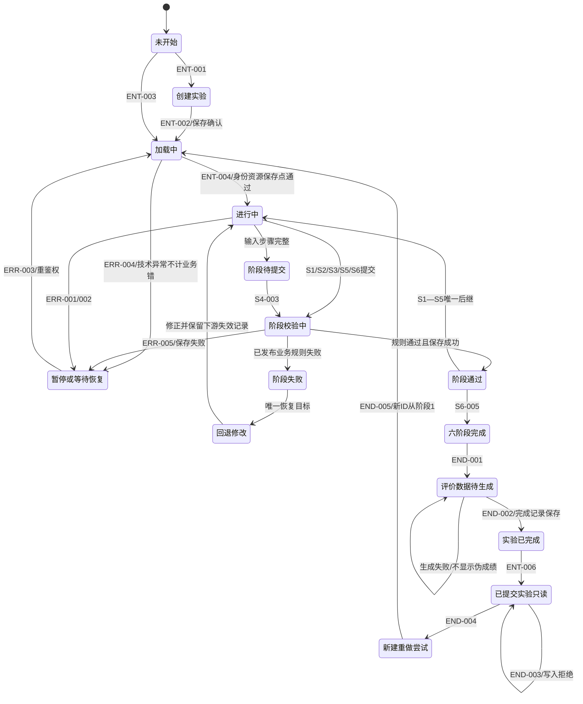
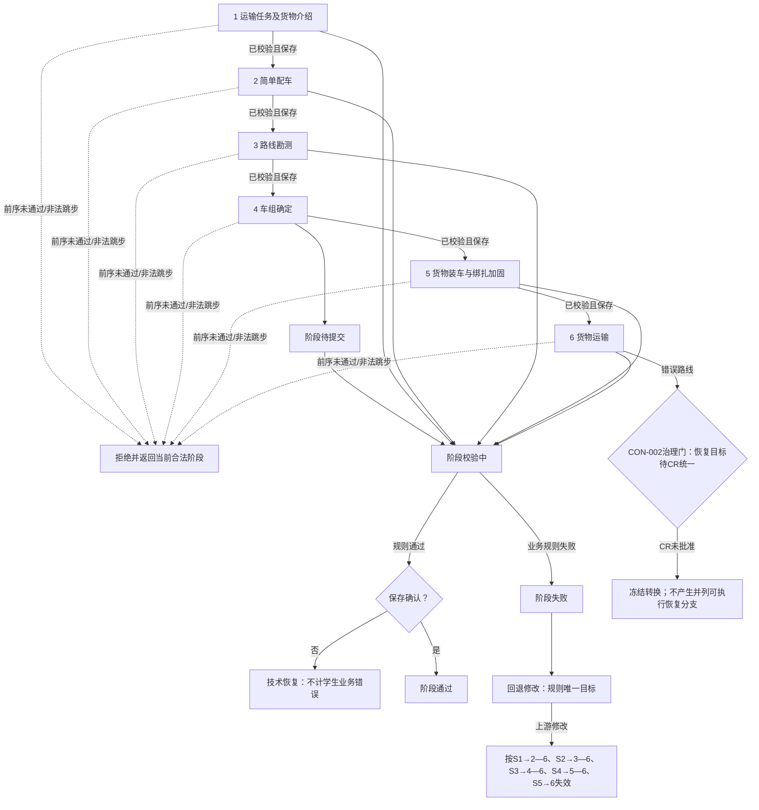
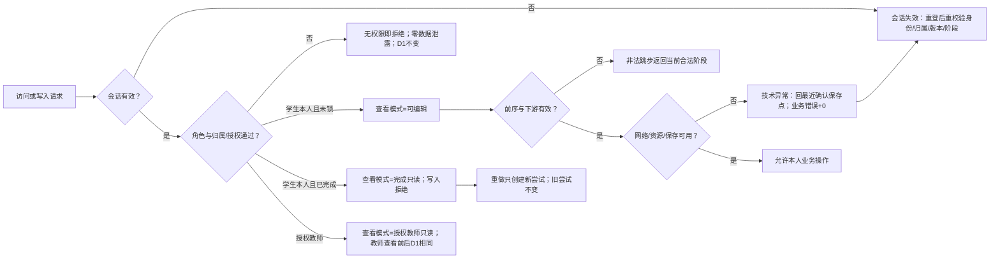

# 实验状态机设计

> 编制日期：2026-06-24
>
> 任务：第2周第5天（总第12天）
>
> 分支：`ai-ds/week2-day12-experiment-state-machine`
> 结论边界：本文只完成状态机设计，不表示G1通过、G1冻结或任何既有问题关闭。第7天结论保持“复盘通过、G1预审不通过”。

## 1. 文档目标与设计范围

本文为一次实验尝试建立唯一、可追踪、可恢复的状态转换规则，覆盖创建、加载、六阶段推进、校验、失败、回退、保存、恢复、完成、只读和重做。设计对象止于业务与验收语义，不设计页面原型、数据库字段、缓存、队列、冲突算法、幂等键组成或业务代码。

固定六阶段及顺序为：①运输任务及货物介绍；②简单配车；③路线勘测；④车组确定；⑤货物装车与绑扎加固；⑥货物运输。任何前序未通过或未确认保存的尝试均不得进入后序阶段。

首版只使用范围文档中的IN/SUP；OUT、BAN、FUT不产生状态、转换、占位节点或隐藏流程。专业判断仅用于教学，不替代工程勘测、设计、审查或安全论证。

## 2. 依据与候选基线状态

### 2.1 审查依据

| 序号 | 文档 | 读取位置 | 用途 | 状态 |
|---:|---|---|---|---|
| 1 | `docs/论文功能映射.md` | Day 11工作树 | 论文功能、规则、评价与边界 | 已完整审查 |
| 2 | `docs/用户与场景.md` | Day 11工作树 | 角色、场景、权限与异常 | 已完整审查 |
| 3 | `docs/六阶段实验主流程.md` | Day 11工作树 | 15状态、54转换、六阶段与恢复 | 已完整审查 |
| 4 | `docs/通用功能与页面清单.md` | `origin/ai/week1-day4-page-list`只读 | 50个页面条目与入口 | 已完整审查；未合并 |
| 5 | `docs/专业规则目录.md` | `origin/ai/week1-day5-rule-catalog`只读 | 44条规则、错误码与保守门禁 | 已完整审查 |
| 6 | `docs/范围排除清单与变更流程.md` | `origin/ai/week1-day6-scope-change-control`只读 | IN/SUP/OUT/TBD/BAN/FUT与CR治理 | 已完整审查 |
| 7 | `docs/第1周需求复盘与G1预审.md` | `origin/ai/week1-day7-review`只读 | CON/GAP/RISK/BLOCK/ACT与18主题 | 已完整审查 |
| 8 | `docs/学生端信息架构.md` | `origin/ai/week2-day1-student-ia`只读 | 学生导航、深链接与恢复 | 已完整审查 |
| 9 | `docs/六阶段低保真原型.md` | `origin/ai-ds/week2-day9-six-stage-wireframe`只读 | 六阶段页面状态与反馈 | 已完整审查；未合并 |
| 10 | `docs/教师端低保真原型.md` | `origin/ai-ds/week2-day10-teacher-wireframe`只读 | 教师授权只读与评价入口 | 已完整审查；未合并 |
| 11 | `docs/数据库实体关系设计.md` | Day 11工作树，提交`7e3e86b` | 既有数据对象与RLS边界 | 已完整审查 |
| 12 | `大件运输虚拟仿真实验教学系统_单人复刻126天计划.md` | Day 11工作树 | Day 12、G1、严格范围、最终验收 | 已完整审查 |

### 2.2 候选基线结论

- Day12编制起点为Day 11远程提交`7e3e86b`；当时Day 4、7—10材料仅跨分支只读回查。Day12之后经PCR-002受控合并，CBL-002已形成单一候选文档链，原提交历史与内容哈希保留。
- 当前不是正式基线`BL-001`，不得称为正式冻结。
- Day 7历史统计为CON 6、GAP 6、RISK 3、BLOCK 8、ACT 15、治理主题18；Day12之后GAP-002、CON-001及CON-006分别经PCR-001—003整改，不回写Day7历史结论。
- 本文复用主流程15个状态和54个转换编号。任何语义冲突只登记TRANS/TRACE与CR-SUG，不静默改写。

## 3. 状态机设计原则

1. 服务端已确认的业务状态是唯一事实源；路由、页面文案、数据库枚举名均不能反向创造状态。
2. 生命周期、阶段、步骤、校验、保存、连接恢复、权限结果、查看模式、评价生成、下游有效性十个维度正交。
3. 业务失败由已发布且输入完整的教学规则产生，可计学生专业错误；技术异常、配置缺失、权限拒绝、非法跳步均不计专业错误。
4. 每个失败只有一个可执行恢复出口；无法统一时冻结该转换，并将唯一出口写为“恢复目标待CR统一”。
5. 保存确认是阶段通过与实验完成的必要门禁；日志写入失败只进入日志待重试维度，不反转已确认业务结论。
6. 重复提交返回既有结果，不新增日志、错误、提示、分数、完成记录或评价任务。
7. 上游修改只使规定的下游当前结论失效，不删除历史输入、日志、规则结果、成绩或版本。
8. 教师授权只读与学生完成只读是查看模式；教师查看前后尝试生命周期必须相同。
9. 专业规则或评价口径未确认时使用来源规定的`RULE_CONFIG_INCOMPLETE`或“评价数据待生成”阻断，不伪造通过、失败或成绩。
10. 所有Q/TBD引用均带来源文档及原编号。

## 4. Day 7及后续问题约束

| 原问题 | 状态机影响 | 本日保守处理 | 是否关闭 |
|---|---|---|---|
| CON-001 | 页面追踪文件不在Day 11链 | Day12后经PCR-002受控合并并发布CBL-002，原提交与哈希保留 | Day12后已关闭 |
| CON-002 | S6错误路线恢复目标冲突 | S6-002/003只有“恢复目标待CR统一”一个受控出口，转换冻结；图中不画并列恢复 | 否 |
| CON-003 | 梯子/安全带顺序表达不一致 | 仅引用“阶段5当前工具步骤”，不固化新工具状态序列 | 否 |
| CON-006 | 教师只读与生命周期混用 | Day12后经PCR-003修正ENT-005；生命周期与view mode分离 | Day12后已关闭 |
| GAP-001 | 最小异步活动缺状态闭环 | 不建详细状态机，仅登记CR-SUG-005 | 否 |
| GAP-002 | 预G1候选基线CR路径缺失 | Day12后经PCR-001建立CBL/PCR/PDEC并由PCR-002完成流程演练 | Day12后已关闭 |
| GAP-003 | 专业公式/参数不足 | 相关提交由专业规则目录ERR-002输出`RULE_CONFIG_INCOMPLETE`并停在校验前合法状态 | 否 |
| GAP-004 | 评价口径未冻结 | 不进入确定成绩展示；保持“评价数据待生成”，学生不见伪成绩 | 否 |
| GAP-005 | 追踪链缺口 | 本文§18建立页面—场景—状态—转换—规则—数据—范围矩阵 | 否 |
| GAP-006 | 数据对象覆盖不足 | 只使用Day 11对象；缺对象登记TRACE-002—007 | 否 |
| RISK-001 | Q/TBD编号歧义 | 每次引用写“来源文档+原编号” | 否 |
| RISK-002 | 保存/恢复/幂等细节未冻结 | 固化去向和验收，不设计缓存、队列、冲突或键组成 | 否 |

其余CON-004/005、RISK-003、BLOCK-001—008、ACT-001—015及18个治理主题均不因本文变化。

## 5. 状态维度与职责边界

| 维度 | 允许值/来源 | 职责 | 禁止冒充 |
|---|---|---|---|
| D1业务生命周期 | 15个固定中文状态 | 尝试总体业务进度 | 页面、权限、保存状态 |
| D2当前阶段 | 固定1—6及固定名称 | 顺序门禁与失效范围 | 生命周期“进行中” |
| D3当前步骤 | 阶段内来源步骤；阶段5只称当前工具步骤 | 唯一回退粒度 | 自创业务状态 |
| D4阶段校验 | 未提交/待提交/校验中/通过/失败（映射固定生命周期） | 规则判断 | 保存结果 |
| D5保存 | 未保存/保存中/已保存/保存失败/待重试 | 持久化确认 | 阶段通过/失败 |
| D6连接与恢复 | 在线/中断/会话失效/恢复校验/资源异常 | 技术可用性 | 学生业务失败 |
| D7权限结果 | 允许本人编辑/允许授权只读/拒绝 | 数据与动作边界 | 生命周期写入 |
| D8查看模式 | 可编辑/完成只读/授权教师只读 | 页面交互能力 | “已提交实验只读”生命周期 |
| D9评价生成 | 未触发/待生成/生成成功/生成失败待重试 | 评价输入与结果可用性 | 实验阶段状态 |
| D10下游有效性 | 有效/失效 | 版本相容和重验门禁 | 删除历史 |

组合不变量：`D7=允许授权只读`时`D8=授权教师只读`且D1不变；`D5≠已保存`时不能形成D4=通过；D6异常不改变专业错误计数；D10=失效时相关页面不可继续使用旧结论。

## 6. 生命周期状态总览

| 编号 | 固定状态 | 类别 | 主体 | 核心出口 |
|---|---|---|---|---|
| LS-01 | 未开始 | 初始 | 学生 | ENT-001/003 |
| LS-02 | 创建实验 | 创建 | 学生/系统 | ENT-002或未开始 |
| LS-03 | 加载中 | 技术过渡 | 系统 | ENT-004或ERR-004 |
| LS-04 | 进行中 | 可编辑 | 学生 | Sx/HLP/ERR |
| LS-05 | 阶段待提交 | 可编辑门禁 | 学生 | S4-003或返回编辑 |
| LS-06 | 阶段校验中 | 系统判断 | 系统 | 通过/失败/ERR-005 |
| LS-07 | 阶段通过 | 成功门禁 | 系统 | 下一阶段或S6-005 |
| LS-08 | 阶段失败 | 业务失败 | 系统 | HLP/Sx回退 |
| LS-09 | 回退修改 | 可编辑恢复 | 学生 | 当前阶段进行中/待提交 |
| LS-10 | 暂停或等待恢复 | 技术恢复 | 学生/系统 | ERR-003 |
| LS-11 | 六阶段完成 | 业务终点 | 系统 | END-001 |
| LS-12 | 评价数据待生成 | 评价过渡 | 系统 | END-002成功；失败保持 |
| LS-13 | 实验已完成 | 完成记录 | 系统 | ENT-006 |
| LS-14 | 已提交实验只读 | 锁定 | 学生 | END-004 |
| LS-15 | 新建重做尝试 | 新尝试创建 | 学生/系统 | END-005 |

## 7. 生命周期状态定义

### 7.1 定义表A：身份、进入与操作（全部单元格非空）

| 状态编号 | 状态名称 | 状态类别 | 状态含义 | 可进入角色 | 进入事件 | 来源状态 | 进入条件 | 守卫条件 | 进入动作 | 允许操作 | 禁止操作 | 页面表现 | 当前阶段要求 | 当前步骤要求 | 保存状态要求 |
|---|---|---|---|---|---|---|---|---|---|---|---|---|---|---|---|
| LS-01 | 未开始 | 初始 | 登录后尚无本次尝试 | 学生 | 初始化/创建失败返回 | 无、创建实验 | 有效学生会话 | 角色=学生；案例入口可见 | 展示创建/继续入口 | 创建、继续 | 写阶段、查看他人 | STU-001/002 | 无 | 无 | 无 |
| LS-02 | 创建实验 | 过渡 | 绑定本人、案例和新尝试 | 学生、系统 | ENT-001 | 未开始 | 创建请求有效 | 本人、案例可用、请求幂等 | 创建attempt及六阶段初始记录 | 等待/取消前返回 | 阶段写入、重复创建 | STU-002加载反馈 | 1 | 无 | 保存中→已保存 |
| LS-03 | 加载中 | 技术过渡 | 加载身份、版本、快照、资源 | 系统 | ENT-002/003、ERR-003、END-005 | 创建实验、未开始、暂停或等待恢复、新建重做尝试 | 尝试ID可校验 | 身份、归属、版本、合法阶段 | 读取最近确认点 | 等待、资源重试 | 编辑、提交、前移状态 | WF-COM-002/ERR-006 | 保存点阶段 | 保存点步骤 | 已保存点可读 |
| LS-04 | 进行中 | 可编辑 | 本人操作当前合法阶段 | 学生 | ENT-004/Sx进入/回退完成 | 加载中、阶段通过、回退修改 | 页面资源与保存点就绪 | 本人、未锁、前序通过、版本相容 | 激活当前阶段/步骤 | 当前步编辑、帮助、保存、提交 | 跳步、改他人/已完成 | EXP-S1—S6 | 唯一当前阶段 | 唯一当前步骤 | 草稿可未保存；通过须已保存 |
| LS-05 | 阶段待提交 | 可编辑门禁 | 输入表面完整等待提交 | 学生 | S4-002等完成事件 | 进行中、回退修改 | 必需步骤完成 | 本人、顺序/版本合法 | 展示提交确认 | 提交、返回编辑 | 直接标记通过 | WF-MOD/EXP提交区 | 当前阶段 | 提交步骤 | 最近步骤已保存或按转换保存 |
| LS-06 | 阶段校验中 | 系统判断 | 校验权限、完整性、规则、版本 | 系统 | Sx提交 | 进行中、阶段待提交 | 提交快照已接收 | 身份/顺序/输入/规则配置/版本 | 运行既有规则并保存结果 | 等待、查看状态 | 编辑、重复计错、绕过 | 校验中/保存中 | 当前阶段 | 已提交步骤 | 保存中；通过前须已保存 |
| LS-07 | 阶段通过 | 成功门禁 | 当前阶段校验且保存成功 | 系统 | Sx通过 | 阶段校验中 | 全部必需规则通过 | 保存确认、前序版本有效、无失效 | 锁定阶段快照 | 进入唯一后继 | 回改而不触发失效、跳级 | WF-MOD-001 | 已通过阶段 | 阶段完成步 | 已保存 |
| LS-08 | 阶段失败 | 业务失败 | 已发布规则判定不满足 | 系统 | Sx失败 | 阶段校验中、进行中 | 可定位业务失败 | 规则配置完整；非技术异常 | 保存失败依据/错误事件 | 查看提示、进入唯一回退 | 进入后序、把异常计错 | WF-MOD-002/004 | 失败阶段 | 规则指定步骤 | 失败证据已保存；日志可待重试 |
| LS-09 | 回退修改 | 业务恢复 | 在唯一目标修正并使下游失效 | 学生 | Sx/HLP回退 | 阶段失败 | 失败与目标已确认 | 本人、目标唯一、失效范围已标记 | 定位步骤、保留历史 | 修改、重提、帮助 | 使用失效结果、跳至后序 | WF-MOD-005/COM-010 | 恢复目标阶段 | 唯一恢复步骤 | 最近确认点；新改动未保存 |
| LS-10 | 暂停或等待恢复 | 技术恢复 | 主动暂停或技术条件未满足 | 学生、系统 | ERR-001/002/004/005 | 任意可编辑、加载中、校验中 | 有尝试或可重试资源 | 不把技术异常判业务失败 | 冻结可编辑提交、显示恢复 | 重连、重登、原键重试 | 前移、伪造已提交 | AUTH-005/WF-COM-003/004/007 | 最近合法阶段 | 最近保存步骤 | 仅承认已保存；失败/待重试可见 |
| LS-11 | 六阶段完成 | 业务完成 | 第六阶段通过并形成完整快照 | 系统 | S6-005 | 阶段通过 | 六阶段均有效 | 完成键唯一、运输结果已保存 | 锁定六阶段业务快照 | 触发评价准备、查看摘要 | 改阶段、重复完成 | WF-RES-001/SCR-001 | 6 | 完成 | 六阶段完成快照已保存 |
| LS-12 | 评价数据待生成 | 评价过渡 | 评价输入/结果尚未可靠生成 | 系统、评价系统 | END-001或生成失败 | 六阶段完成、评价数据待生成 | 六阶段快照完整 | 任务幂等；规则/日志版本可读 | 创建/重试评价处理 | 查看完成状态、重试 | 显示伪成绩、补0 | SCR-003/004 | 6已完成 | 无 | 评价状态已保存；失败待重试 |
| LS-13 | 实验已完成 | 完成记录 | 完成记录唯一保存 | 系统 | END-002成功 | 评价数据待生成 | END-002规定输入成功 | GAP-004未关闭时仅完成记录成立，成绩不开放 | 保存完成时间/记录 | 查看完成摘要 | 编辑、伪成绩展示 | SCR-001 | 1—6均有效 | 无 | 完成记录已保存 |
| LS-14 | 已提交实验只读 | 锁定 | 本人已完成尝试不可写 | 学生、系统 | ENT-006 | 实验已完成 | 完成记录一致 | 本人；锁定标记有效 | 进入完成只读模式 | 查看摘要/日志、发起重做 | 任意原尝试写入 | STU-005/SCR-001 | 1—6历史 | 无 | 全部已确认；日志重试独立 |
| LS-15 | 新建重做尝试 | 创建 | 基于旧只读页创建新ID | 学生、系统 | END-004 | 已提交实验只读 | 本人请求重做 | 旧尝试锁定；请求幂等 | 创建全新attempt，阶段1起始 | 等待创建、取消 | 复制旧通过/覆盖旧记录 | STU-006 | 新尝试=1 | 无 | 新记录保存中；旧记录不变 |

### 7.2 定义表B：数据、结果、恢复与验收

| 状态编号 | 所需数据对象 | 对应页面 | 对应用户场景 | 对应规则 | 对应范围编号 | 成功完成条件 | 成功目标状态 | 失败条件 | 失败目标状态 | 唯一恢复目标 | 下游失效范围 | 日志事件 | 幂等要求 | 权限要求 | 验收标准 | 待确认事项 | 备注 |
|---|---|---|---|---|---|---|---|---|---|---|---|---|---|---|---|---|---|
| LS-01 | profiles、cases、attempts | STU-001/002 | STU-003 | FLW-004 | IN-001/014 | 创建/继续请求合法 | 创建实验/加载中 | 创建失败 | 未开始 | 原入口 | 无 | attempt_create_requested | 同请求唯一 | 学生本人 | 无请求不建尝试 | 无 | 初始 |
| LS-02 | profiles、cases、attempts、attempt_steps | STU-002 | STU-003 | DAT-003/FLW-004 | IN-004/014/015 | 尝试归属与初始记录保存 | 加载中 | 保存/案例失败 | 未开始 | 未开始 | 无 | attempt_created/create_failed | 一个请求一个ID | 学生本人/系统写 | 重复创建返回同ID | Day11 Q-20 | 技术失败不计错 |
| LS-03 | attempts、attempt_steps、cases、resources、operation_logs | WF-COM-002/ERR-006 | ERR-005/006 | DAT-003/ERR-003 | IN-015/SUP-003/004 | 身份资源快照一致 | 进行中 | 资源/会话/版本失败 | 暂停或等待恢复 | 最近确认保存点 | 无 | attempt_loaded/resource_load_failed | 同恢复不重复事件 | 本人或授权只读读取 | 不加载越权内容 | Day11 Q-22/23 | 教师查看不写D1 |
| LS-04 | attempts、attempt_steps、operation_logs、rule_check_results | EXP-S1—S6 | STU-003/004 | FLW-001—004 | IN-004—015 | 当前阶段满足待提交条件 | 阶段待提交/校验中 | 业务失败/技术异常 | 阶段失败/暂停或等待恢复 | 当前规则步骤/保存点 | 按上游变更矩阵 | action/help/submit | 事件ID唯一 | 本人可编辑 | 非法跳步拒绝 | 主流程Q-08 | 通用业务态 |
| LS-05 | attempts、attempt_steps、operation_logs | EXP/WF-MOD | STU-003 | FLW-001/003 | IN-014/015 | 学生提交且快照可校验 | 阶段校验中 | 完整性或保存失败 | 回退修改/暂停或等待恢复 | 当前缺失步骤/保存点 | 依修改阶段 | stage_submit_requested | 重复提交返既有 | 本人 | 未提交不校验 | 无 | 主流程仅S4显式使用 |
| LS-06 | attempt_steps、rule_check_results、operation_logs、cases | EXP校验态 | STU-003/005 | 阶段规则+ERR-002 | IN-004—015 | 规则通过且保存确认 | 阶段通过 | 业务不通过/配置或技术异常 | 阶段失败/暂停或等待恢复 | 规则步骤/原保存点 | 依失败规则 | rule_check/save_* | 同快照同结果 | 系统判断 | 未确认配置不出结论 | GAP-003 | 校验与保存分离 |
| LS-07 | attempts、attempt_steps、rule_check_results | WF-MOD-001 | STU-003 | FLW-001/003 | IN-014 | 已保存且唯一后继可进入 | 进行中/六阶段完成 | 后继加载或保存异常 | 阶段通过/暂停或等待恢复 | 当前已通过阶段 | 无 | sN_passed/sN+1_entered | 通过记录唯一 | 系统写、本人读 | 未保存绝不显示通过 | 无 | 修改须走失效 |
| LS-08 | rule_check_results、operation_logs、attempt_steps | WF-MOD-002/004 | ERR-002/003/004 | 对应专业规则 | IN-005—014 | 失败证据保存且目标明确 | 回退修改 | 日志保存技术失败 | 阶段失败（业务不变） | 规则指定步骤；CON-002例外冻结 | 对应阶段以后 | sN_failed/error_hint | 同失败不重复计错 | 系统写、本人才可恢复 | 技术异常不进入此态 | CON-002/GAP-003 | 仅业务失败 |
| LS-09 | attempts、attempt_steps、rule_check_results、operation_logs | WF-MOD-005/COM-010 | STU-005 | FLW-002 | IN-014 | 修正后回当前阶段 | 进行中/阶段待提交 | 保存异常 | 暂停或等待恢复 | 最近保存点 | S1→2—6；S2→3—6；S3→4—6；S4→5—6；S5→6 | rollback/invalidated | 同修改版本一次失效 | 本人 | 旧结论不可继续 | CON-002 | 历史不删 |
| LS-10 | attempts、attempt_steps、operation_logs、resources | AUTH-005/WF-COM-003/004/007 | ERR-005—007 | ERR-001/003、FLW-003/004 | IN-015 | 身份/网络/资源恢复 | 加载中 | 持续异常 | 暂停或等待恢复 | 最近确认保存点 | 无 | connection_interrupted/recovery_started | 重试不重复业务结果 | 重新鉴权 | 未保存草稿不冒充服务端 | RISK-002、Day11 Q-20/21 | 日志失败正交见§13 |
| LS-11 | attempts、attempt_steps、operation_logs、rule_check_results | WF-RES-001 | STU-006 | FLW-005 | IN-009/014/016 | 评价准备请求已确认 | 评价数据待生成 | 评价触发技术失败 | 六阶段完成 | 六阶段完成 | 无 | six_stages_completed | 完成键唯一 | 系统写；本人/授权读 | 重复完成不新增记录 | 无 | 非成绩状态 |
| LS-12 | attempts、operation_logs、rule_check_results、scores | SCR-003/004 | STU-006/SYS-001 | EVA、ERR-002 | IN-016 | END-002要求的数据生成成功 | 实验已完成 | 缺项/冲突/生成失败 | 评价数据待生成 | 原评价待生成状态 | 无 | evaluation_pending/failed/retry | 一个尝试/版本一个结果 | 学生仅见概况；教师授权 | 失败不显示伪成绩 | 用户与场景Q-08—10/13；Day11 Q-10—17 | 评价失败非学生错误 |
| LS-13 | attempts、scores、operation_logs | SCR-001 | STU-006 | FLW-005/EVA | IN-016/017 | 完成记录唯一保存 | 已提交实验只读 | 锁定保存失败 | 实验已完成/暂停或等待恢复 | 完成记录保存点 | 无 | attempt_completed | 一个完成键 | 系统写 | 未保存不显示完成 | GAP-004 | 成绩权限独立 |
| LS-14 | attempts、attempt_steps、operation_logs、rule_check_results、scores | STU-005/SCR-001 | STU-006 | FLW-004 | IN-014/017 | 重做请求合法或持续查看 | 新建重做尝试/本状态 | 写请求/越权 | 已提交实验只读 | 本只读页 | 无 | readonly_write_rejected/redo_requested | 拒绝/重做幂等 | 本人只读；教师授权只读模式不改D1 | 所有写入拒绝 | 用户与场景Q-04/05 | 教师查看用D8非改态 |
| LS-15 | attempts、attempt_steps、cases、operation_logs | STU-006 | STU-006 | FLW-004 | IN-014/017 | 新attempt与阶段1保存 | 加载中 | 新建失败 | 已提交实验只读 | 旧尝试只读页 | 新尝试无；旧尝试无 | redo_created/failed | 一个请求一个新ID | 本人 | 新尝试从1开始，旧记录不变 | 无 | 不复制成绩/日志 |

## 8. 实验创建与加载

创建顺序固定为：权限与案例检查→幂等检查→创建本人尝试→创建六阶段初始记录→确认保存→加载。任一步技术失败均不形成学生业务错误；创建未确认时回“未开始”，加载失败进入“暂停或等待恢复”。继续实验必须重新校验本人归属、未完成、案例/规则版本、保存点与当前阶段合法性；旧版本深链接不得直接恢复页面状态。

教师查看不执行创建/继续转换，而是对目标尝试做授权只读投影：`D7=允许授权只读`、`D8=授权教师只读`，D1保持读取前的值。

## 9. 六阶段通用状态模板

本日只有一个通用模板，六阶段各实例化一次：

`进行中 →（输入/步骤完整）→ 阶段待提交或直接提交 → 阶段校验中 →（业务规则通过且保存确认）→ 阶段通过 → 唯一后继`。

失败分流：已发布规则不满足→阶段失败→唯一恢复目标→回退修改；规则配置缺失→`RULE_CONFIG_INCOMPLETE`并停在当前合法状态；网络/会话/资源/保存异常→暂停或等待恢复/原业务状态，且不计业务错误。未保存成功、前序失效、版本不相容、无权限均不得进入“阶段通过”。

## 10. 六阶段逐阶段状态设计

| 阶段 | 进入条件/合法来源 | 当前步骤来源 | 可编辑/待提交条件 | 校验与规则通过条件 | 保存/阶段通过条件 | 业务失败→唯一恢复 | 技术异常目标 | 上游修改失效范围 | 成功后 | 非法跳步/页面反馈/日志 | 未关闭问题与保守处理 |
|---|---|---|---|---|---|---|---|---|---|---|---|
| 1 运输任务及货物介绍 | 新尝试或S1保存点；加载中→进行中 | 任务/货物查看与确认 | 本人、资源可用；必需字段和确认齐全 | DAT-001—003通过 | S1快照已保存才通过 | 缺确认留当前步；业务缺失回任务/货物步骤 | 加载/保存点 | 修改使2—6失效 | 2 简单配车 | 返回S1；缺项/保存态明确；记查看/确认/提交 | 案例数据缺失按GAP-003阻断 |
| 2 简单配车 | S1已保存通过；阶段通过→进行中 | 组合/挂车/牵引车选择 | 本人；三类选择完整 | VEH-001—003、SLP相关已发布规则通过 | 初步车组快照已保存 | 回本阶段对应选择步骤 | 原保存点 | 修改使3—6失效 | 3 路线勘测 | 返回S2；解释失败项；记选择/规则/重试 | 参数不足输出RULE_CONFIG_INCOMPLETE |
| 3 路线勘测 | S2已保存通过 | 三路线×五类障碍及路线选择 | 每项数据/单位完整后可提交 | HGT/ARC/ORT/SLP/BRG/RTE当前版本通过；不伪造经济排序 | 勘测与选线快照已保存 | 测量错回对应步骤；不可处置选线回路线选择 | 原保存点 | 修改使4—6失效 | 4 车组确定 | 返回S3；精确提示路线/障碍；记测量/结论 | GAP-003及经济性主题未关闭 |
| 4 车组确定 | S3已保存通过 | 配置、拼接、编点、阀门、挂车参数 | 前序步骤完成；轴载前进入待提交 | CFG/AXL已发布规则全通过 | 正式车组快照已保存 | 当前交互错回当前步；轴载超限唯一回挂车参数 | 原保存点 | 修改使5—6失效 | 5 货物装车与绑扎加固 | 返回S4；显示超限轴；记配置/回退/重算 | 案例参数不足阻断；不造数值 |
| 5 货物装车与绑扎加固 | S4已保存通过 | 位置调整、当前工具步骤、绑扎点 | 装车规则可用；当前步骤合法 | LOD/TLS/LSH已发布规则通过 | 装车绑扎快照已保存 | 装车回位置；工具错回当前工具步骤；点/角回绑扎点 | 原保存点 | 修改使6失效 | 6 货物运输 | 返回S5；对应反馈；记移动/工具/点角 | CON-003不固化新顺序；阈值缺失阻断 |
| 6 货物运输 | S5已保存通过且1—5当前有效 | 运输复验 | 汇总版本相容、无失效 | RTE-004/FLW-005满足；正确动画完成 | 运输结果和完成键已保存 | 错误路线：恢复目标待CR统一，转换冻结 | 第六阶段保存点 | 按最终CR；当前不得执行冲突回退 | 六阶段完成 | 非法直访回当前合法阶段；失败动画/技术提示分离 | CON-002未解决；不画双出口 |

## 11. 业务失败与唯一恢复

| 失败类别 | 失败状态 | 唯一恢复目标 | 是否计学生业务错误 | 下游处理 |
|---|---|---|---|---|
| S1已发布完整性规则失败 | 阶段失败 | 第一阶段缺失字段/确认步骤 | 是（资源异常除外） | 2—6不得有效 |
| S2组合/挂车/牵引规则失败 | 阶段失败 | 对应选择步骤 | 是 | 3—6失效（若已有） |
| S3测量/判断失败 | 阶段失败 | 对应路线与障碍步骤 | 是 | 4—6失效（若已有） |
| S3不可处置路线入选 | 阶段失败 | 第三阶段路线选择 | 是 | 4—6失效（若已有） |
| S4拼接/编点/阀门失败 | 阶段失败 | 当前错误步骤 | 是 | 受影响后序重做 |
| S4轴载超限 | 阶段失败 | 第四阶段挂车参数选择 | 是 | 受影响配置、AXL及5—6失效 |
| S5装车失败 | 阶段失败 | 第五阶段货物位置调整 | 是 | 绑扎当前结论与6失效 |
| S5工具错误 | 阶段失败 | 第五阶段当前工具步骤 | 是 | 当前步后序重做 |
| S5点位/倒八字/角度失败 | 阶段失败 | 第五阶段绑扎点选择 | 是 | 当前绑扎与6失效 |
| S6错误路线 | 阶段失败 | 恢复目标待CR统一（唯一受控出口） | 是 | 在CR批准前不执行失效传播 |
| 配置缺失/公式冲突 | 不形成业务失败 | 当前合法输入/校验前状态 | 否 | 阻断确定结论 |

## 12. 技术异常与恢复

| 技术异常 | 业务状态变化 | 技术/保存维度 | 页面结果 | 唯一恢复目标 | 业务错误增量 | 日志 |
|---|---|---|---|---|---:|---|
| 会话失效 | 可编辑动作停止；D1不判失败 | D6=会话失效 | AUTH-005 | 重登后加载最近保存点 | 0 | session_expired/recovery_started |
| 网络中断/刷新 | 按ERR-002进入等待恢复；不前移 | D6=中断；D5未确认项待重试 | WF-COM-007 | 最近确认保存点 | 0 | connection_interrupted |
| 必需资源失败 | 加载中→暂停或等待恢复 | D6=资源异常 | WF-COM-004 | 原阶段加载入口 | 0 | resource_load_failed |
| 阶段保存失败 | 不显示阶段通过 | D5=保存失败/待重试 | WF-COM-003 | 原阶段保存点、原请求重试 | 0 | stage_save_failed |
| 完成记录保存失败 | 不显示实验完成 | D5=保存失败/待重试 | SCR/保存失败 | 六阶段完成保存点 | 0 | completion_save_failed（TRACE：既有事件枚举待确认） |
| 日志保存失败 | 已确认业务结论不变 | D5(日志)=待重试 | LOG-003 | 原业务状态 | 0 | log_save_failed；原事件重试 |
| 评价生成失败 | 保持评价数据待生成 | D9=生成失败待重试 | SCR-004 | 评价数据待生成 | 0 | evaluation_failed/retry |

## 13. 保存、日志与幂等

1. 保存确认前不得显示阶段通过；完成记录确认前不得显示实验完成。
2. 刷新、断网和重登恢复到最近确认保存点；本地未保存内容只能标为草稿，不能冒充服务端提交。
3. 重复提交必须返回既有业务结果；日志、错误、提示、分数、完成记录和评价任务增量均为0。
4. 日志失败进入日志保存维度“待重试”，不改变已确认的业务生命周期、阶段结论或错误计数。主流程ERR-006将成功目标写成“暂停或等待恢复”，与本约束存在语义风险，登记TRANS-003/CR-SUG-003，不静默改写既有转换。
5. 恢复必须重新校验身份、归属、版本、当前阶段、前序通过、下游有效性和只读锁定。
6. 技术异常只写技术事件，学生业务错误增量为0。
7. 具体缓存、离线队列、冲突解决、自动保存频率和幂等键组成留待技术设计（来源：主流程Q-07/Q-08、用户与场景Q-14、Day11 Q-20/Q-21）。

Day 11映射：尝试与保存快照使用`attempts`/`attempt_steps`；日志与重试使用`operation_logs`；规则结论用`rule_check_results`；不存在独立保存点、评价任务、幂等或审计实体，见TRACE-002/004/005。

## 14. 上游修改与下游失效

| 修改来源 | 当前结论失效范围 | 安全返回目标 | 可否使用旧结果 | 历史处理 | 对象 |
|---|---|---|---|---|---|
| 阶段1任务/货物关键数据 | 2—6 | 阶段1当前修改步骤 | 否 | 旧快照/日志保留 | attempts、attempt_steps、rule_check_results、operation_logs |
| 阶段2初步车组 | 3—6 | 阶段2对应选择 | 否 | 同上 | 同上 |
| 阶段3测量/结论/选线 | 4—6 | 阶段3对应步骤 | 否 | 同上 | 同上 |
| 阶段4正式车组 | 5—6 | 阶段4对应步骤 | 否 | 同上 | 同上 |
| 阶段5装车/绑扎 | 6 | 阶段5对应步骤 | 否 | 同上 | 同上 |

深链接进入已失效页面时，先鉴权再查尝试与版本，再查`attempt_steps`/`rule_check_results`有效性；返回最早合法阶段，不返回旧结论作为当前值，不计专业错误，并记录`illegal_transition_rejected`或失效访问审计。

## 15. 权限、深链接与非法转换

### 15.1 权限与深链接检查

| 场景 | 输入 | 判断顺序 | 业务状态变化 | 查看模式 | 页面结果 | 泄露数据 | 恢复目标 | 日志 | 验收标准 |
|---|---|---|---|---|---|---|---|---|---|
| 未登录访问学生实验 | URL/attemptID | 会话→角色→归属→阶段 | 否 | 无 | AUTH-002 | 否 | 登录后重新全检 | access_denied/session | 不返回尝试摘要 |
| 学生访问教师端 | 教师URL | 会话→角色 | 否 | 无 | ERR-001/403 | 否 | STU-001 | access_denied | 教师组件与数据为0 |
| 学生访问他人尝试 | 他人ID | 会话→角色→归属 | 否 | 无 | ERR-001 | 否 | STU-001/003 | access_denied | 不区分不存在/无权 |
| 学生访问未通过后续阶段 | 后续URL | 会话→归属→锁定→前序→有效性 | 否 | 可编辑当前阶段 | ERR-007并返回当前合法阶段 | 否 | 当前合法阶段 | illegal_transition_rejected | 后续数据不返回 |
| 学生修改已完成尝试 | 写请求 | 会话→归属→锁定 | 否 | 完成只读 | 拒绝 | 否 | STU-005 | readonly_write_rejected | 原数据字节/版本不变 |
| 学生访问未发布成绩 | 成绩URL | 会话→归属→发布权限 | 否 | 完成只读 | ERR-001；完成摘要仍可见 | 否 | SCR-001 | access_denied | 分数/分项为0字段返回 |
| 教师查看进行中尝试 | attemptID | 会话→教师角色→授权范围→目标存在 | 否 | 授权教师只读 | TEA-EXP-001 | 仅授权最小数据 | 原教师页 | access_checked | 查看前后D1相同 |
| 教师修改学生阶段或日志 | 写请求 | 会话→角色→授权→动作权限 | 否 | 授权教师只读 | TEA-ERR-003/403 | 否 | TEA-EXP-001 | readonly_write_rejected | 原日志不可改 |
| 会话失效后提交 | 提交请求 | 会话先于业务校验 | 否 | 无/原模式冻结 | AUTH-005 | 否 | 重登→加载保存点 | session_expired | 不执行规则、不计错 |
| 断网后重复提交 | 原请求 | 网络→身份→幂等→版本 | 既有状态 | 原模式 | 返回既有结果 | 否 | 原业务状态 | duplicate_ignored/重试状态 | 所有计数增量0 |
| 旧版本深链接 | URL版本 | 会话→归属→锁定→版本 | 否 | 依目标权限 | 版本提示/安全返回 | 否 | 当前版本合法页 | version_mismatch | 不加载旧版本为当前 |
| 下游已失效页面深链接 | 下游URL | 会话→归属→前序→有效性 | 否 | 当前合法模式 | ERR-007/失效提示 | 否 | 最早失效阶段 | invalidated_access | 旧结果不可继续 |
| 未知URL | URL | 路由匹配→会话角色 | 否 | 无 | ERR-002/404 | 否 | 角色首页 | route_not_found | 不泄露路由结构 |
| 合法查询无数据 | 合法筛选 | 会话→权限→查询成功→0条 | 否 | 原模式 | ERR-008空状态 | 否 | 原页/创建入口 | query_empty | 不冒充403/加载失败 |
| 评价数据尚未生成 | 本人完成ID | 会话→归属→完成→评价状态 | 否 | 完成只读 | SCR-003 | 否（仅状态） | SCR-001 | evaluation_pending | 不显示分数 |

## 16. 完成、评价、只读与重做

第六阶段保存通过后执行S6-005进入“六阶段完成”；END-001以唯一键建立评价准备语义并进入“评价数据待生成”。评价生成成功按既有END-002进入“实验已完成”，但GAP-004未关闭时只表示完成记录可靠，不等于学生成绩已发布。评价生成失败保持“评价数据待生成”，显示SCR-004并用原任务语义重试，不产生伪成绩。

完成记录保存后ENT-006锁定为“已提交实验只读”。学生至少可查看完成状态与六阶段摘要；最终成绩默认不开放（用户与场景Q-04、Day11 Q-15/Q-16）。任何学生或教师对已完成尝试的阶段、日志、规则结果写入均拒绝。重做只允许END-004→END-005创建新attempt，新尝试从阶段1开始；旧尝试、阶段快照、日志、规则结果、评价结果和版本保持不变。

## 17. 教师只读查看模式

教师查看是D7/D8投影，不是生命周期转换：

`读取D1=x → 校验教师角色与teacher_student_scopes → D8=授权教师只读 → 展示x的快照 → 退出 → D1仍=x`。

无授权立即拒绝；授权教师可读Day11 RLS允许的`attempts`、`attempt_steps`、`operation_logs`、`rule_check_results`及按权限开放的评价对象，但不能修改学生阶段或原始日志。Day12之后PCR-003已将主流程ENT-005修正为权限与查看模式检查：成功或拒绝均不写实验生命周期。

## 18. 状态—页面—场景—规则—数据追踪

### 18.1 主追踪矩阵

| 追踪ID | 页面 | 场景 | 生命周期/阶段 | 转换 | 规则 | Day11数据对象 | 范围 | 受控问题 |
|---|---|---|---|---|---|---|---|---|
| TR-01 | STU-002 | STU-003 | 未开始/创建实验 | ENT-001/002 | DAT-003/FLW-004 | profiles、cases、attempts、attempt_steps | IN-001/004/014 | 无 |
| TR-02 | STU-004 | ERR-005 | 加载中/等待恢复 | ENT-003/004、ERR-002/003 | FLW-003/004、ERR-001 | attempts、attempt_steps、operation_logs | IN-015/SUP-004 | RISK-002 |
| TR-03 | EXP-S1-001/WF-S1-001 | STU-003 | S1进行/校验/通过 | S1-001—004 | DAT-001—003、FLW-001/003 | cases、resources、attempts、attempt_steps、operation_logs、rule_check_results | IN-004/010/014/015 | GAP-003 |
| TR-04 | EXP-S2-001/WF-S2-001 | STU-003/005 | S2进行/失败/通过 | S2-001—004 | VEH-001—003、SLP-002/003 | attempts、attempt_steps、operation_logs、rule_check_results、cases | IN-005/012/014 | GAP-003 |
| TR-05 | EXP-S3-001/WF-S3-001 | STU-003/005 | S3进行/失败/通过 | S3-001—006 | HGT/ARC/ORT/SLP/BRG/RTE | attempts、attempt_steps、operation_logs、rule_check_results、cases | IN-006/011/014 | GAP-003 |
| TR-06 | EXP-S4-001/WF-S4-001 | STU-003/005、ERR-004 | S4进行/待提交/失败/通过 | S4-001—006 | CFG-001—004、AXL-001—003 | attempts、attempt_steps、operation_logs、rule_check_results、cases | IN-007/012/014 | GAP-003 |
| TR-07 | EXP-S5-001/WF-S5-001 | STU-003/004/005 | S5进行/失败/通过 | S5-001—007 | LOD-001/002、TLS-001/002、LSH-001/002 | attempts、attempt_steps、operation_logs、rule_check_results、cases | IN-008/013/014 | CON-003/GAP-003 |
| TR-08 | EXP-S6-001/WF-S6-001 | STU-003/005、ERR-003 | S6进行/失败/通过 | S6-001—005 | RTE-004、FLW-005 | attempts、attempt_steps、operation_logs、rule_check_results | IN-009/014 | CON-002 |
| TR-09 | HLP-001—003/WF-TIP-001 | STU-004 | 进行中/阶段失败 | HLP-001—003 | TLS-002、LOG-002 | operation_logs、learning_progress、resources | IN-003/015 | 提示计数主题 |
| TR-10 | LOG-003/WF-COM-011 | ERR-007 | 原业务态+日志待重试 | ERR-006/007 | FLW-004、LOG-001 | operation_logs | IN-015/SUP-004 | TRANS-003 |
| TR-11 | AUTH-005/WF-COM-004/007 | ERR-005/006 | 等待恢复/加载中 | ERR-001—005 | ERR-001/003、FLW-003 | attempts、attempt_steps、operation_logs、resources | IN-015/SUP-003/004 | RISK-002 |
| TR-12 | ERR-001/007 | 权限与非法跳步场景 | D1不变 | ENT-005、ERR-008 | SUP权限门禁、FLW-001 | profiles、teacher_student_scopes、attempts、attempt_steps | IN-001/002/014/SUP-001 | PCR-003已统一 |
| TR-13 | SCR-001—004/WF-RES-001 | STU-006/SYS-001 | 六阶段完成/评价待生成/完成 | END-001/002、ENT-006 | FLW-005、EVA、ERR-002 | attempts、attempt_steps、operation_logs、rule_check_results、scores | IN-016/017 | GAP-004 |
| TR-14 | STU-005/006 | STU-006 | 已提交只读/重做 | END-003—005 | FLW-004 | attempts、attempt_steps、operation_logs、rule_check_results、scores | IN-014/017 | 无 |
| TR-15 | TEA-EXP-001/TIM/LOG | TEA-002 | 任意D1不变；教师只读 | ENT-005（权限与查看模式检查） | ERR-001权限原则 | profiles、teacher_student_scopes、attempts、attempt_steps、operation_logs、rule_check_results | IN-002/SUP-001 | PCR-003已统一 |
| TR-16 | TEA-SYS/REV/SCR | TEA-003—005 | 评价维度；不改学生D1 | END-002关联 | EVA/LOG-002 | scores、teacher_reviews、operation_logs | IN-016/017 | GAP-004 |

### 18.2 Day 11数据对象映射（不设计字段）

| 映射ID | 业务称谓 | Day11既有对象 | 读/写用途 | 缺口处理 |
|---|---|---|---|---|
| DO-01 | 用户与角色 | profiles | 读角色/本人；认证另属auth | 无 |
| DO-02 | 查看授权关系 | teacher_student_scopes（classes待确认） | 读教师授权范围 | Day11 Q-06/Q-07保守拒绝 |
| DO-03 | 案例/规则版本 | cases | 读案例与版本 | 未发布配置阻断 |
| DO-04 | 实验尝试 | attempts | 创建、生命周期/锁定/完成 | 数据枚举与15状态不等同，见SM-004 |
| DO-05 | 阶段快照/当前阶段 | attempt_steps、attempts | 读写阶段快照与阶段序号 | “当前步骤”无独立对象，TRACE-003 |
| DO-06 | 保存点 | attempt_steps、attempts | 读取最近确认快照语义 | 无独立对象，TRACE-002 |
| DO-07 | 操作/错误/提示/技术/审计日志 | operation_logs | 追加、待重试、只读查询 | 无独立审计对象，TRACE-005 |
| DO-08 | 专业规则与路线/车组/装车/绑扎结果 | rule_check_results、attempt_steps | 保存规则与阶段快照、失效标记 | 无独立结果实体，TRACE-006/007 |
| DO-09 | 下游失效记录 | attempt_steps、rule_check_results | 标记当前结果失效 | 无独立对象，TRACE-006 |
| DO-10 | 评价任务/结果 | scores | 保存待生成/生成/失败/结果语义 | 无独立任务对象，TRACE-004 |
| DO-11 | 教师评价 | teacher_reviews | 教师评价；不改学生日志 | 权限仍待确认 |
| DO-12 | 学习进度/资源 | learning_progress、resources | 帮助/资料状态与资源加载 | GAP-001活动对象仍缺 |

## 19. 完整状态转换矩阵

本节逐条复用主流程54个编号。为保证可读性，矩阵按同一转换编号拆成A/B两部分；两表合起来构成一条完整记录。“原失败目标”忠实记录既有语义，“唯一恢复目标”记录本日受控执行口径，二者不一致即登记TRANS/CR，不静默改写。

### 19.1 转换矩阵A：触发、守卫、动作、保存与日志

| 编号 | 转换名称 | 触发角色 | 来源状态 | 触发事件 | 前置条件 | 守卫条件 | 输入对象 | 执行动作 | 保存要求 | 日志要求 |
|---|---|---|---|---|---|---|---|---|---|---|
| ENT-001 | 创建新实验 | 学生 | 未开始 | 确认创建 | 已登录/案例可用 | 学生、案例、幂等 | cases、请求语义 | 创建本人尝试 | 尝试及初始阶段确认 | attempt_create_requested |
| ENT-002 | 创建成功 | 系统 | 创建实验 | 创建持久化成功 | 归属已保存 | 尝试版本有效 | attempts、attempt_steps | 转加载 | 必须已保存 | attempt_created |
| ENT-003 | 继续未完成实验 | 学生 | 未开始 | 选择继续 | 本人未完成尝试 | 归属、未完成、版本 | attempts | 发起加载 | 不改既有快照 | attempt_resume_requested |
| ENT-004 | 加载完成 | 系统 | 加载中 | 身份资源快照完成 | 保存点可用 | 归属、资源、快照一致 | attempts、attempt_steps、resources | 恢复当前合法阶段 | 只认已确认点 | attempt_loaded |
| ENT-005 | 访问权限与查看模式检查 | 学生、教师 | 任意生命周期状态 | 请求目标尝试 | 目标存在或请求受保护资源 | 本人按当前状态访问、授权教师只读、其余拒绝 | profiles、授权、attempts | 设置查看模式或拒绝；不写生命周期 | 不写生命周期 | access_checked/denied |
| ENT-006 | 锁定尝试 | 系统 | 实验已完成 | 完成记录确认 | 完成记录唯一 | 状态一致 | attempts | 锁定原尝试 | 锁定确认 | attempt_locked |
| S1-001 | 提交任务介绍确认 | 学生 | 进行中 | 提交阶段1 | 当前阶段1 | 必需字段、资源、顺序 | cases、attempt_steps | 建校验请求 | 提交快照待确认 | s1_submitted |
| S1-002 | 第一阶段校验通过 | 系统 | 阶段校验中 | 校验通过 | 输入完整 | DAT规则与模型绑定 | rule_check_results、attempt_steps | 保存通过快照 | 成功后才可通过 | s1_passed |
| S1-003 | 任务数据缺失 | 系统 | 阶段失败 | 失败已定位 | 失败证据存在 | 业务缺失/技术分流 | rule_check_results、resources | 指向恢复 | 失败证据保存；技术待恢复 | s1_failed/technical |
| S1-004 | 进入简单配车 | 系统 | 阶段通过 | 阶段后继 | S1已保存 | 顺序合法 | attempts、attempt_steps | 当前阶段=2 | S1保存确认 | s2_entered |
| S2-001 | 提交初步配车 | 学生 | 进行中 | 提交方案 | 当前阶段2 | 组合/挂车/牵引完整 | attempt_steps | 建校验请求 | 提交快照 | s2_submitted |
| S2-002 | 配车校验通过 | 系统 | 阶段校验中 | 规则通过 | 教学规则可用 | VEH/SLP当前版通过 | rule_check_results、cases | 保存初步车组 | 保存后通过 | s2_passed |
| S2-003 | 配车方案错误 | 系统 | 阶段失败 | 明确失败项 | 原方案可追溯 | 原因可解释 | rule_check_results、attempt_steps | 回对应选择 | 失败与原方案保存 | s2_failed |
| S2-004 | 进入路线勘测 | 系统 | 阶段通过 | 阶段后继 | 初步车组已保存 | 顺序/版本有效 | attempts、attempt_steps | 当前阶段=3 | 保存确认 | s3_entered |
| S3-001 | 保存单项测量 | 学生 | 进行中 | 保存测量 | 当前阶段3 | 字段/单位合法 | attempt_steps、rule_check_results | 保存当前测量 | 确认后显示已存 | s3_measurement_saved |
| S3-002 | 提交路线勘测 | 学生 | 进行中 | 提交全量 | 三路线记录已填 | 必填/顺序/候选范围 | attempt_steps | 建校验请求 | 提交快照 | s3_submitted |
| S3-003 | 测量/判断错误 | 系统 | 阶段校验中 | 规则失败 | 可定位障碍 | 当前规则比较失败 | rule_check_results | 形成业务失败 | 失败结论保存 | s3_rule_failed |
| S3-004 | 路线不可处置 | 系统 | 阶段校验中 | 淘汰结论 | 处置结论有效 | 路线不可处置 | rule_check_results | 阻止该路线入选 | 淘汰结论保存 | s3_route_eliminated |
| S3-005 | 勘测与选线通过 | 系统 | 阶段校验中 | 全量通过 | 三路线完整 | 可通行且不伪造经济规则 | rule_check_results、attempt_steps | 保存路线快照 | 保存后通过 | s3_passed |
| S3-006 | 进入车组确定 | 系统 | 阶段通过 | 阶段后继 | 路线结果已保存 | 顺序/版本有效 | attempts、attempt_steps | 当前阶段=4 | 保存确认 | s4_entered |
| S4-001 | 提交路线适配配置 | 学生 | 进行中 | 保存配置 | 当前阶段4 | 满足路线约束 | attempt_steps、rule_check_results | 保存配置版 | 确认配置 | s4_config_saved |
| S4-002 | 完成拼接编点阀门 | 学生 | 进行中 | 完成交互 | 配置有效 | 步骤顺序/结果正确 | attempt_steps | 转待提交 | 步骤快照保存 | s4_assembly_completed |
| S4-003 | 提交轴载校核 | 学生 | 阶段待提交 | 提交校核 | 参数/步骤齐全 | 完整性、单位、版本 | attempt_steps、cases | 建AXL校验请求 | 请求与输入快照 | s4_axle_submitted |
| S4-004 | 轴载超限 | 系统 | 阶段校验中 | 任一轴超限 | 已计算逐轴 | AXL-003失败 | rule_check_results | 形成业务失败 | 逐轴结果保存 | s4_axle_failed |
| S4-005 | 全轴校核通过 | 系统 | 阶段校验中 | 全轴合格 | 步骤/参数有效 | 任一轴均不超限 | rule_check_results、attempt_steps | 保存正式车组 | 保存后通过 | s4_passed |
| S4-006 | 进入装车绑扎 | 系统 | 阶段通过 | 阶段后继 | 正式车组已保存 | 顺序/版本有效 | attempts、attempt_steps | 当前阶段=5 | 保存确认 | s5_entered |
| S5-001 | 提交货物位置 | 学生 | 进行中 | 提交装车 | 当前阶段5 | 规则已发布、输入完整 | attempt_steps、cases | 建LOD校验 | 位置快照 | s5_loading_submitted |
| S5-002 | 装车检查失败 | 系统 | 阶段校验中 | LOD失败 | 有位置/液压反馈 | 不满足已确认配置 | rule_check_results | 形成业务失败 | 失败反馈保存 | s5_loading_failed |
| S5-003 | 选择绑扎工具 | 学生 | 进行中 | 选择工具 | 装车检查通过 | 工具匹配当前步骤 | attempt_steps、operation_logs | 正确推进/错误阻断 | 正确步或失败事件保存 | s5_tool_selected |
| S5-004 | 提交绑扎点和角度 | 学生 | 进行中 | 提交绑扎 | 工具到相应步骤 | 点位/倒八字/≤60° | attempt_steps | 建LSH校验 | 绑扎快照 | s5_lashing_submitted |
| S5-005 | 绑扎校验失败 | 系统 | 阶段失败 | 失败已定位 | 工具或点角错误 | 类型映射唯一步骤 | rule_check_results | 指向回退 | 失败/目标保存 | s5_lashing_failed |
| S5-006 | 装车绑扎全部通过 | 系统 | 阶段校验中 | 全部规则通过 | 全结果有效 | LOD/TLS/LSH通过 | rule_check_results、attempt_steps | 保存阶段结果 | 保存后通过 | s5_passed |
| S5-007 | 进入货物运输 | 系统 | 阶段通过 | 阶段后继 | S5已保存 | 顺序/版本有效 | attempts、attempt_steps | 当前阶段=6 | 保存确认 | s6_entered |
| S6-001 | 提交运输复验 | 学生 | 进行中 | 提交汇总 | 前五阶段有效 | 完整/版本相容 | attempts、attempt_steps、rule_check_results | 建复验请求 | 复验请求快照 | s6_review_submitted |
| S6-002 | 错误路线 | 系统 | 阶段校验中 | 路线不可通行 | 汇总完整 | RTE-004失败 | rule_check_results | 播失败反馈并冻结恢复 | 失败证据保存 | s6_route_failed |
| S6-003 | 返回路线选择 | 学生、系统 | 阶段失败 | 请求回退 | 错误路线已保存 | 原文“回阶段3”与CON-002冲突 | rule_check_results、attempt_steps | 本日不执行，待CR | 不产生新失效写入 | s6_rollback_route（冻结） |
| S6-004 | 正确路线动画完成 | 系统 | 阶段校验中 | 动画完成 | 关键结果齐全 | 路线正确/保存可用 | attempts、attempt_steps | 保存运输结果 | 成功后通过 | s6_passed |
| S6-005 | 第六阶段结束 | 系统 | 阶段通过 | 形成六阶段快照 | 运输通过已保存 | 六阶段均有效 | attempts、attempt_steps | 标记六阶段完成 | 完成快照唯一 | six_stages_completed |
| HLP-001 | 主动点击帮助 | 学生 | 进行中 | 点击帮助 | 当前步骤可识别 | 上下文匹配 | resources、learning_progress | 展示方法不代做 | 学习/提示事件可独立保存 | help_requested |
| HLP-002 | 首次阻断错误提示 | 系统 | 阶段失败 | 首次提示 | 有业务失败规则 | 原因/方法/目标明确 | rule_check_results、operation_logs | 展示并指向目标 | 提示事件保存/待重试 | error_hint_shown |
| HLP-003 | 同类错误再次发生 | 系统 | 阶段失败 | 升级提示 | 同尝试同规则已有失败 | 次数≥2且幂等 | operation_logs | 更具体但不代做 | 提示事件唯一 | escalated_hint_shown |
| ERR-001 | 暂停或离开 | 学生 | 进行中 | 主动暂停 | 有尝试/保存点 | 关键事件已确认 | attempts、attempt_steps | 停止编辑 | 只认已保存点 | attempt_paused |
| ERR-002 | 刷新或短断网 | 系统 | 任意可编辑状态 | 中断/页面重建 | 有尝试ID | 网络不可用/页面重建 | attempts、operation_logs | 进入恢复等待 | 未确认项待重试 | connection_interrupted |
| ERR-003 | 重连或重登 | 学生、系统 | 暂停或等待恢复 | 身份恢复 | 尝试可定位 | 归属、保存点、版本 | profiles、attempts、attempt_steps | 重新加载 | 不前移保存点 | recovery_started |
| ERR-004 | 资源加载失败 | 系统 | 加载中 | 必需资源失败 | 资源请求发生 | 必需资源不可用 | resources、operation_logs | 等待恢复 | 业务快照不变 | resource_load_failed |
| ERR-005 | 阶段保存失败 | 系统 | 阶段校验中 | 持久化未确认 | 校验结果待保存 | 保存未确认 | attempt_steps、rule_check_results | 不显示通过 | 标失败/待重试 | stage_save_failed |
| ERR-006 | 日志保存失败 | 系统 | 任意状态 | 日志写失败 | 有事件ID | 未确认写入 | operation_logs | 原文投等待恢复；本日正交待重试 | 原事件待重试 | log_save_failed |
| ERR-007 | 重复提交 | 学生、系统 | 任意状态 | 同键再请求 | 已有结果 | 幂等命中 | 既有业务对象 | 返回既有结果 | 禁止新增 | duplicate_ignored（不得重复） |
| ERR-008 | 非法跳步 | 学生 | 任意可编辑状态 | 请求非法后继 | 目标非合法后继 | 前序未通过/失效 | attempts、attempt_steps | 拒绝并安全返回 | 不写业务状态 | illegal_transition_rejected |
| END-001 | 触发评价数据准备 | 系统 | 六阶段完成 | 创建评价准备 | 六阶段结果完整 | 完成键/版本唯一 | attempts、operation_logs、rule_check_results、scores | 标待生成 | 一次准备语义 | evaluation_pending |
| END-002 | 评价输入生成成功 | 评价系统 | 评价数据待生成 | 生成成功 | 日志/规则版本可用 | 数据完整；未决规则不猜 | scores、attempts | 保存完成记录/评价结果 | 成功后完成 | attempt_completed |
| END-003 | 请求修改已完成尝试 | 学生、教师 | 已提交实验只读 | 写请求 | 尝试已锁定 | 只读 | attempts及目标对象 | 拒绝 | 不写任何业务对象 | readonly_write_rejected |
| END-004 | 发起重做 | 学生 | 已提交实验只读 | 确认重做 | 本人已完成尝试 | 归属、幂等 | attempts、cases | 进入新尝试创建 | 旧尝试不变 | redo_requested |
| END-005 | 新尝试创建成功 | 系统 | 新建重做尝试 | 新ID保存 | 新ID唯一 | 归属/初始状态 | attempts、attempt_steps | 转加载阶段1 | 新尝试已保存 | redo_created |

### 19.2 转换矩阵B：目标、恢复、追踪与验收

| 编号 | 成功目标 | 原失败目标 | 唯一恢复目标 | 下游失效/范围 | 计学生业务错误 | 幂等 | 页面 | 场景 | 规则 | 数据对象 | 范围 | 待确认 | 验收标准 | 备注 |
|---|---|---|---|---|---|---|---|---|---|---|---|---|---|---|
| ENT-001 | 创建实验 | 未开始 | 未开始 | 否/无 | 否 | 是 | STU-002 | STU-003 | FLW-004 | profiles/cases/attempts | IN-001/014 | 无 | 同请求一个尝试 | — |
| ENT-002 | 加载中 | 未开始 | 未开始 | 否 | 否 | 是 | STU-002 | STU-003 | DAT-003 | attempts/attempt_steps | IN-004/015 | Day11 Q-20 | 保存后才加载 | — |
| ENT-003 | 加载中 | 未开始 | 本人记录页 | 否 | 否 | 是 | STU-004 | ERR-005 | FLW-004 | attempts | IN-015 | 无 | 已完成不编辑进入 | — |
| ENT-004 | 进行中 | 暂停或等待恢复 | 最近确认保存点 | 否 | 否 | 是 | STU-004/WF-COM-002 | ERR-005/006 | DAT-003/ERR-003 | attempts/steps/resources | IN-015 | RISK-002 | 恢复阶段一致 | — |
| ENT-005 | 当前生命周期状态 | 当前生命周期状态 | 学生本人安全页/授权教师原页 | 否 | 否 | 是 | ERR-001/TEA-EXP | TEA-002/越权场景 | ERR-001权限 | profiles/scopes/attempts | IN-002/SUP-001 | PCR-003已批准 | 教师查看前后D1相同；越权零数据 | 已统一 |
| ENT-006 | 已提交实验只读 | 实验已完成 | 完成记录保存点 | 否 | 否 | 是 | STU-005 | STU-006 | FLW-005 | attempts | IN-014/017 | 无 | 锁定后写入全拒 | — |
| S1-001 | 阶段校验中 | 进行中 | 第一阶段当前步骤 | 是/2—6（若修改） | 否（提交本身） | 是 | EXP-S1/WF-S1 | STU-003 | DAT-001—003 | steps/logs | IN-004 | GAP-003 | 缺项不后继 | — |
| S1-002 | 阶段通过 | 阶段失败 | 第一阶段当前步骤 | 否 | 否 | 是 | WF-MOD-001 | STU-003 | DAT-001—003/FLW-003 | rule_results/steps | IN-004/015 | GAP-003 | 保存确认才通过 | — |
| S1-003 | 回退修改 | 暂停或等待恢复 | 业务回S1；技术回加载入口 | 否 | 业务是/技术否 | 是 | WF-MOD-002/004 | ERR-002/006 | DAT/ERR-003 | rule_results/resources/logs | IN-004/015 | 无 | 业务技术分流 | — |
| S1-004 | 进行中(S2) | 阶段通过 | S1 | 否 | 否 | 是 | EXP-S2 | STU-003 | FLW-001 | attempts/steps | IN-014 | 无 | 仅S1保存通过进入 | — |
| S2-001 | 阶段校验中 | 进行中 | S2选择 | 是/3—6（修改） | 否 | 是 | EXP-S2 | STU-003 | VEH/SLP | steps/logs | IN-005/012 | GAP-003 | 选择完整才校验 | — |
| S2-002 | 阶段通过 | 阶段失败 | S2选择 | 否 | 否 | 是 | WF-MOD-001 | STU-003 | VEH/SLP/FLW-003 | rules/steps | IN-005/015 | GAP-003 | 规则发布且保存 | — |
| S2-003 | 回退修改 | 阶段失败 | 对应组合/挂车/牵引步骤 | 是/3—6 | 是 | 是 | WF-MOD-002 | ERR-002 | VEH/SLP | rules/logs | IN-005 | GAP-003 | 失败可解释 | — |
| S2-004 | 进行中(S3) | 阶段通过 | S2 | 否 | 否 | 是 | EXP-S3 | STU-003 | FLW-001 | attempts/steps | IN-014 | 无 | 未通过不进S3 | — |
| S3-001 | 进行中 | 回退修改 | 对应测量 | 是/4—6（若改已通过） | 格式业务错按规则；技术否 | 是 | EXP-S3 | STU-003 | DAT/HGT等 | rules/steps/logs | IN-006/011 | GAP-003 | 同事件仅一次 | — |
| S3-002 | 阶段校验中 | 回退修改 | 缺失测量步骤 | 是/4—6（若改） | 否（提交本身） | 是 | EXP-S3 | STU-003 | RTE/DAT | steps/logs | IN-006 | GAP-003 | 15类记录完整 | — |
| S3-003 | 阶段失败 | 暂停或等待恢复 | 对应测量/判断步骤 | 是/4—6 | 是；配置缺失否 | 是 | WF-MOD-004 | ERR-002 | HGT/ARC/ORT/SLP/BRG | rules/logs | IN-006/011 | GAP-003 | 可定位且唯一回退 | — |
| S3-004 | 阶段失败 | 暂停或等待恢复 | 第三阶段路线选择 | 是/4—6 | 是 | 是 | EXP-S3 | ERR-002 | RTE-002/003 | rules/logs | IN-006 | 经济性主题 | 不可处置路线不可选 | — |
| S3-005 | 阶段通过 | 阶段失败 | 第三阶段路线选择 | 否 | 否 | 是 | WF-MOD-001 | STU-003 | RTE/FLW-003 | rules/steps | IN-006 | GAP-003 | 不伪造排序 | — |
| S3-006 | 进行中(S4) | 阶段通过 | S3 | 否 | 否 | 是 | EXP-S4 | STU-003 | FLW-001 | attempts/steps | IN-014 | 无 | 路线保存且有效 | — |
| S4-001 | 进行中 | 回退修改 | 第四阶段配置选择 | 是/5—6（若改已通过） | 规则失败是 | 是 | EXP-S4 | STU-003 | CFG-001 | rules/steps/logs | IN-007/012 | GAP-003 | 路线约束被响应 | — |
| S4-002 | 阶段待提交 | 回退修改 | 当前错误步骤 | 是/受影响后序 | 错步是 | 是 | EXP-S4 | STU-003 | CFG-002—004 | steps/logs | IN-007 | CON-003无关 | 错步不进入轴载 | — |
| S4-003 | 阶段校验中 | 回退修改 | 挂车参数/缺失步骤 | 是/5—6 | 否（提交本身） | 是 | EXP-S4 | STU-003 | AXL/DAT | rules/steps | IN-007 | GAP-003 | 缺参数不显示成功 | — |
| S4-004 | 阶段失败 | 暂停或等待恢复 | 第四阶段挂车参数选择 | 是/受影响配置及5—6 | 是 | 是 | WF-MOD-004 | ERR-004 | AXL-003 | rules/logs | IN-007/012 | GAP-003 | 任一轴超限回同一目标 | — |
| S4-005 | 阶段通过 | 阶段失败 | 第四阶段挂车参数选择 | 否 | 否 | 是 | WF-MOD-001 | STU-003 | AXL/FLW-003 | rules/steps | IN-007 | GAP-003 | 全轴合格且保存 | — |
| S4-006 | 进行中(S5) | 阶段通过 | S4 | 否 | 否 | 是 | EXP-S5 | STU-003 | FLW-001 | attempts/steps | IN-014 | 无 | 正式车组已存 | — |
| S5-001 | 阶段校验中 | 进行中 | 货物位置调整 | 是/6（若改已通过） | 否（提交本身） | 是 | EXP-S5 | STU-003 | LOD-001/002 | rules/steps | IN-008/013 | GAP-003 | 阈值缺失不判通过 | — |
| S5-002 | 阶段失败 | 暂停或等待恢复 | 货物位置调整 | 是/绑扎及6 | 是；配置缺失否 | 是 | WF-MOD-004 | ERR-002 | LOD-002 | rules/logs | IN-008 | GAP-003 | 失败不进绑扎完成 | — |
| S5-003 | 进行中（正确）/阶段失败（错误） | 阶段失败 | 当前工具步骤 | 是/当前步后序与6 | 错选是 | 是 | EXP-S5 | STU-004 | TLS-001/002 | steps/logs | IN-008/013 | CON-003 | 只引用当前工具步骤 | 不固化新顺序 |
| S5-004 | 阶段校验中 | 阶段失败 | 绑扎点选择 | 是/6 | 否（提交） | 是 | EXP-S5 | STU-003 | LSH-001/002 | rules/steps | IN-008/013 | 点容差待确认 | 错点/布置/>60阻断 | — |
| S5-005 | 回退修改 | 阶段失败 | 当前工具步骤或绑扎点（按失败类型唯一） | 是/受影响后序及6 | 是 | 是 | WF-MOD-002 | ERR-002 | TLS/LSH | rules/logs | IN-008 | CON-003 | 每类失败只有一目标 | — |
| S5-006 | 阶段通过 | 阶段失败 | 货物位置调整（原文失败目标） | 否 | 否 | 是 | WF-MOD-001 | STU-003 | LOD/TLS/LSH/FLW-003 | rules/steps | IN-008 | GAP-003 | 全条件且保存 | — |
| S5-007 | 进行中(S6) | 阶段通过 | S5 | 否 | 否 | 是 | EXP-S6 | STU-003 | FLW-001 | attempts/steps | IN-014 | 无 | S5任一失败不进入 | — |
| S6-001 | 阶段校验中 | 回退修改 | 最早失效阶段 | 否（仅检测） | 否 | 是 | EXP-S6 | STU-003 | FLW-002/005 | attempts/steps/rules | IN-009/014 | CON-002 | 缺结果不开始 | — |
| S6-002 | 阶段失败 | 暂停或等待恢复 | 恢复目标待CR统一 | 待CR；当前不写 | 是 | 是 | EXP-S6/WF-MOD-002 | ERR-003 | RTE-004 | rules/logs | IN-009 | CON-002 | 只有一个冻结出口 | TRANS-002 |
| S6-003 | 原文：回退修改 | 阶段失败 | 恢复目标待CR统一 | 原文4—6；当前不执行 | 否（回退本身） | 是 | EXP-S6 | ERR-003 | RTE-004/FLW-002 | rules/steps/logs | IN-009/014 | CON-002 | CR前不可执行 | TRANS-002 |
| S6-004 | 阶段通过 | 暂停或等待恢复 | 第六阶段运输复验 | 否 | 否 | 是 | EXP-S6 | STU-003 | FLW-005/FLW-003 | attempts/steps | IN-009/015 | 无 | 重复只一个结果 | — |
| S6-005 | 六阶段完成 | 阶段通过 | 第六阶段保存点 | 否 | 否 | 是 | WF-RES-001 | STU-006 | FLW-005 | attempts/steps | IN-009/014 | 无 | 完成快照唯一 | — |
| HLP-001 | 进行中 | 进行中 | 当前步骤 | 否 | 否 | 是 | HLP-001/WF-TIP | STU-004 | LOG-002 | logs/resources/learning | IN-003 | 提示计数主题 | 关闭回原步不代做 | — |
| HLP-002 | 回退修改 | 阶段失败 | 规则指定步骤 | 按失败 | 否（提示） | 是 | HLP-002 | STU-004 | TLS-002/LOG-002 | logs/rules | IN-003/015 | 无 | 提示含唯一目标 | — |
| HLP-003 | 回退修改 | 阶段失败 | 规则指定步骤 | 按失败 | 否（提示） | 是 | HLP-003 | STU-004 | TLS-002/LOG-002 | logs | IN-003/015 | 计数口径主题 | 重复提示不重复计数 | — |
| ERR-001 | 暂停或等待恢复 | 进行中 | 最近确认保存点 | 否 | 否 | 是 | STU-004 | ERR-005 | FLW-003 | attempts/steps/logs | IN-015 | 主流程Q-09 | 恢复不前移 | — |
| ERR-002 | 暂停或等待恢复 | 当前状态 | 最近确认保存点 | 否 | 否 | 是 | WF-COM-007 | ERR-005 | ERR-001/FLW-003 | attempts/steps/logs | IN-015 | RISK-002 | 未保存不冒充提交 | — |
| ERR-003 | 加载中 | 暂停或等待恢复 | 最近确认保存点 | 否 | 否 | 是 | ERR-006 | ERR-005 | DAT-003/ERR-001 | profiles/attempts/steps | IN-015 | RISK-002 | 重新鉴权/归属/版本 | — |
| ERR-004 | 暂停或等待恢复 | 加载中 | 原阶段加载入口 | 否 | 否 | 是 | WF-COM-004 | ERR-006 | ERR-003 | resources/logs | IN-015/SUP-003 | Day11 Q-22/23 | 不计业务错 | — |
| ERR-005 | 暂停或等待恢复 | 阶段校验中 | 原阶段保存点 | 否 | 否 | 是 | WF-COM-003 | ERR-007 | FLW-003 | steps/rules/logs | IN-015 | RISK-002 | 页面不显示通过 | — |
| ERR-006 | 原文：暂停或等待恢复；本日业务D1不变 | 当前状态 | 原业务状态+日志待重试 | 否 | 否 | 是 | LOG-003 | ERR-007 | LOG-001/FLW-004 | logs | IN-015 | Day11 Q-21 | 业务结论不因日志失败改变 | TRANS-003 |
| ERR-007 | 当前既有状态 | 当前既有状态 | 无（返回原结果） | 否 | 否 | 是（核心） | 原页 | ERR-007 | FLW-004 | 既有对象 | IN-015 | 键组成后续 | 所有增量0 | — |
| ERR-008 | 当前状态 | 当前状态 | 当前合法阶段 | 否 | 否 | 是 | ERR-007 | 非法跳步 | FLW-001 | attempts/steps/logs | IN-014/SUP-001 | 无 | 不泄露后续数据 | — |
| END-001 | 评价数据待生成 | 六阶段完成 | 六阶段完成 | 否 | 否 | 是 | SCR-003 | STU-006/SYS-001 | FLW-005/EVA | attempts/logs/rules/scores | IN-016 | GAP-004 | 一个评价准备结果 | — |
| END-002 | 实验已完成 | 评价数据待生成 | 评价数据待生成 | 否 | 否 | 是 | SCR-001/003/004 | STU-006/SYS-001 | EVA/ERR-002 | scores/attempts | IN-016/017 | GAP-004/Day11 Q-10—17 | 缺项不伪造分数 | TRANS-004审查 |
| END-003 | 已提交实验只读 | 已提交实验只读 | 已提交实验只读页 | 否 | 否 | 是（拒绝不重复日志） | STU-005 | STU-006 | FLW-004 | attempts及被请求对象 | IN-014/017 | 无 | 任意写拒绝 | — |
| END-004 | 新建重做尝试 | 已提交实验只读 | 旧尝试只读页 | 否 | 否 | 是 | STU-006 | STU-006 | FLW-004 | attempts/cases | IN-014/017 | 无 | 旧尝试不变 | — |
| END-005 | 加载中 | 已提交实验只读 | 旧尝试只读页 | 新尝试初始无 | 否 | 是 | STU-006→EXP-S1 | STU-006 | DAT-003/FLW-004 | attempts/steps | IN-014/017 | 无 | 新ID从阶段1 | — |

分类计数：ENT 6、S1 4、S2 4、S3 6、S4 6、S5 7、S6 5、HLP 3、ERR 8、END 5，共54条。

## 20. 非法转换矩阵

| 编号 | 来源状态/输入 | 非法事件 | 拒绝原因 | 页面反馈 | 安全返回目标 | 业务状态变化 | 计专业错误 | 安全日志 | 泄露数据 | 验收标准 |
|---|---|---|---|---|---|---|---|---|---|---|
| IL-01 | 任意/未登录URL | 访问学生实验 | 无有效会话 | 登录页 | AUTH-002 | 否 | 否 | 是 | 否 | 不返回尝试内容 |
| IL-02 | 学生会话/教师URL | 访问教师端 | 角色不符 | 403 | STU-001 | 否 | 否 | 是 | 否 | 教师数据为0 |
| IL-03 | 学生会话/他人ID | 读他人尝试 | 归属不符 | 无权限 | STU-003 | 否 | 否 | 是 | 否 | 不区分不存在/无权 |
| IL-04 | 进行中S1—S5 | 直达未解锁后序 | 前序未保存通过 | 非法跳步 | 当前合法阶段 | 否 | 否 | 是 | 否 | 后序数据不返回 |
| IL-05 | 阶段校验中 | 校验未结束继续 | 无通过结论 | 校验中 | 当前校验页 | 否 | 否 | 是 | 否 | 不进入后序 |
| IL-06 | 校验通过但保存未确认 | 点击继续 | FLW-003失败 | 保存失败/保存中 | 原阶段保存点 | 否 | 否 | 是 | 否 | 不显示阶段通过 |
| IL-07 | 回退修改 | 使用已失效下游结果 | D10=失效 | 失效提示 | 最早失效阶段 | 否 | 否 | 是 | 否 | 旧结论不可提交 |
| IL-08 | 已提交实验只读 | 编辑阶段/日志 | 完成锁定 | 只读拒绝 | STU-005 | 否 | 否 | 是 | 否 | 原对象不变 |
| IL-09 | 实验已完成/只读 | 重复完成 | 完成键已存在 | 返回既有完成结果 | 完成摘要 | 否 | 否 | 否（返回既有，不新增） | 否 | 完成记录仍一条 |
| IL-10 | 评价数据待生成 | 读取分数 | 评价未生成/未发布 | 等待/拒绝 | SCR-001/003 | 否 | 否 | 是 | 否 | 不显示旧分或0分 |
| IL-11 | 已完成本人尝试 | 访问未发布成绩 | 发布权限关闭 | 无权限 | SCR-001 | 否 | 否 | 是 | 否 | 仅完成摘要可见 |
| IL-12 | 教师授权只读 | 修改学生阶段/原日志 | 动作权限禁止 | 教师无权限 | TEA-EXP-001 | 否 | 否 | 是 | 否 | 日志不可改 |
| IL-13 | 会话失效状态 | 提交业务操作 | 认证门禁优先失败 | 重登弹窗 | 登录→加载保存点 | 否 | 否 | 是 | 否 | 不执行规则 |
| IL-14 | 旧版本深链接 | 继续旧快照 | 版本不相容 | 版本提示 | 当前版本合法页 | 否 | 否 | 是 | 否 | 旧版本不冒充当前 |
| IL-15 | 未知URL/合法查询0条 | 把404/空数据当业务状态 | 路由或查询结果非业务状态 | 404或空状态 | 角色首页/原列表 | 否 | 否 | 是 | 否 | 两种反馈可区分 |

## 21. 问题与CR建议

### 21.1 本日问题台账

| 问题编号 | 问题标题 | 级别 | 涉及状态 | 涉及转换 | 页面 | 场景 | 规则 | 数据对象 | 范围 | 问题描述 | 证据 | 当前保守处理 | 需CR | 建议责任人 | 关闭条件 | 验收方式 | 当前状态 | 备注 |
|---|---|---|---|---|---|---|---|---|---|---|---|---|---|---|---|---|---|---|
| SM-001 | 未确认专业配置不能形成确定结论 | P0 | 校验中/通过/失败 | S2—S5相关 | EXP-S2—S5 | STU-003 | ERR-002及专业规则 | cases、rule_check_results | IN-005—013 | 配置缺失若误入通过/失败会伪造教学结论 | GAP-003；专业规则§21/23 | 输出RULE_CONFIG_INCOMPLETE，停当前合法态 | 是 | 专业教师/课程负责人 | BLOCK-007关闭且版本/边界样例齐 | 正常/失败/边界/配置缺失 | 未关闭 | 不关闭GAP-003 |
| SM-002 | 评价生成与实验完成/成绩可见语义需进一步拆清 | P0 | 评价数据待生成/实验已完成 | END-002 | SCR-001—004 | STU-006/SYS-001 | EVA/ERR-002 | scores、attempts | IN-016/017 | 完成记录、评价输入成功、最终成绩可见不是同一事实 | GAP-004；用户Q-04/05/13；Day11 Q-11/15/16 | 完成摘要可见，成绩默认拒绝，失败留待生成 | 是 | 产品经理/评价负责人 | 唯一评价/发布口径获批且全页面一致 | 生成成功/失败/未发布三路测试 | 未关闭 | 不伪成绩 |
| SM-003 | 数据库枚举不得反向增加生命周期 | P1 | 15状态全局 | 全部 | 全部 | STU-003/TEA-002 | 无 | attempts、attempt_steps | IN-014/SUP-004 | Day11含failed/abandoned等枚举，但固定生命周期无同名状态 | Day11§7/§16；本任务固定15状态 | 仅作数据设计TRACE，不在状态机建立节点 | 是 | 数据负责人/状态机负责人 | 经CR统一枚举与15状态映射且无新增业务态 | 枚举→状态单向映射审查 | 未关闭 | 数据名非业务状态源 |
| TRANS-001 | ENT-005改变生命周期的风险 | P0 | 任意生命周期/查看模式 | ENT-005 | TEA-EXP/ERR-001 | TEA-002 | 权限门禁 | profiles、scopes、attempts | IN-002/SUP-001 | 原定义将教师查看目标写为已提交只读 | CON-006；PCR-003 | ENT-005已改为权限与查看模式检查，D1不写 | 是（已执行） | 状态机负责人 | 查看前后生命周期一致，越权零数据 | 双角色进行中尝试测试+转换审查 | Day12后已关闭 | CR-SUG-001已执行 |
| TRANS-002 | S6错误路线恢复目标冲突 | P0 | 阶段失败/回退修改 | S6-002/003 | EXP-S3/S6 | ERR-003 | RTE-004/FLW-002/005 | steps、rules、logs | IN-009/014 | 回阶段3与阶段6重试冲突 | CON-002 | 唯一出口“恢复目标待CR统一”，冻结执行 | 是 | 产品经理/专业教师 | 页面/场景/规则/失效/验收唯一一致 | S6错误路线E2E | 未关闭 | 不画双分支 |
| TRANS-003 | ERR-006日志失败目标与业务正交性冲突 | P1 | 任意业务态/等待恢复 | ERR-006 | LOG-003 | ERR-007 | LOG-001/FLW-004 | operation_logs | IN-015 | 原转换成功目标为等待恢复，需求要求日志待重试不改业务结论 | 主流程ERR-006；本任务§十 | D1保持，日志维度待重试 | 是 | 状态机负责人/数据负责人 | ERR-006语义经CR统一且业务状态不反转 | 注入日志失败测试 | 未关闭 | CR-SUG-003 |
| TRANS-004 | END-002成功语义需与GAP-004边界一致 | P1 | 评价待生成/实验已完成 | END-002 | SCR/TEA-SYS | SYS-001/002 | EVA | scores、attempts | IN-016 | “评价输入生成成功”直接进入完成，易被误解为最终成绩已生成/发布 | 主流程END-002；GAP-004 | 仅完成记录，学生成绩仍拒绝 | 是 | 评价负责人/状态机负责人 | 完成、评分、发布的验收断言唯一 | 三状态权限测试 | 未关闭 | CR-SUG-002可一并处理 |
| TRACE-001 | Day4页面不在当前链 | P0 | 全部 | 全部 | Day4 50条 | 全部 | 全部 | 全部 | 全范围 | Day12编制时状态追踪依赖跨分支只读文件 | CON-001；PCR-002 | CBL-002已受控整合且原哈希一致 | 是（已执行） | 产品经理/仓库负责人 | 单一候选基线依法形成 | Git图+文件清单+哈希 | Day12后已关闭 | 原分支保留 |
| TRACE-002 | 无独立保存点对象 | P1 | 加载/恢复/校验 | ENT/ERR | STU-004/ERR | ERR-005/007 | FLW-003/004 | attempts、attempt_steps | IN-015/SUP-004 | Day11仅能用快照表达保存点语义 | Day11§7/8/18 | 不增字段/对象，登记映射缺口 | 是 | 数据负责人 | Day13/后续技术设计确认映射 | 恢复数据走查 | 未关闭 | 不设计技术方案 |
| TRACE-003 | 无独立当前步骤对象 | P1 | 进行中/回退修改 | S1—S6/HLP | EXP工作区 | STU-003/005 | 各阶段规则 | attempts、attempt_steps | IN-014 | Day11有当前阶段，步骤粒度主要在快照/日志 | Day11§7—10 | 本文仅逻辑引用当前步骤 | 是 | 数据负责人 | 步骤来源可唯一恢复且不造业务态 | 六阶段回退走查 | 未关闭 | 不增字段 |
| TRACE-004 | 无独立评价任务对象 | P1 | 评价数据待生成 | END-001/002 | SCR-003/004 | SYS-001 | EVA | scores | IN-016 | 评价任务幂等/重试仅能抽象映射scores | Day11§11 | 不新增对象，保持待生成语义 | 是 | 数据负责人/评价负责人 | 任务语义与scores映射获批 | 重复触发/失败重试测试 | 未关闭 | — |
| TRACE-005 | 无独立幂等与审计对象 | P1 | 全部 | ERR-007等 | LOG/ERR | ERR-007 | FLW-004/LOG-001 | operation_logs及各对象 | IN-015/SUP-004 | Day11使用client_id/日志表达但无独立对象 | Day11§9/18、Q-25 | 不增字段，按既有对象验收 | 是 | 数据负责人 | 幂等/审计落位可追踪 | 重复提交与审计查询 | 未关闭 | 键组成后续 |
| TRACE-006 | 下游失效无独立记录对象 | P1 | 回退修改 | FLW相关/S6-003 | WF-COM-010 | STU-005 | FLW-002 | attempt_steps、rule_check_results | IN-014 | 只能用既有失效标识表达 | Day11§8/10 | 仅引用既有对象，不新增表 | 是 | 数据负责人 | 失效原因/版本可追溯 | 上游修改测试 | 未关闭 | 历史不删 |
| TRACE-007 | 路线/车组/装车/绑扎无独立结果实体 | P1 | S2—S6 | S2—S6 | EXP-S2—S6 | STU-003 | 专业规则 | attempt_steps、rule_check_results | IN-005—013 | 用户示例对象在Day11以快照/规则结果承载 | Day11§8/10 | 只映射快照，不创造对象 | 是 | 数据负责人 | 每类结果可读写和版本追踪 | ER+场景走查 | 未关闭 | — |

### 21.2 CR建议

| 编号 | 建议 | 关联问题 | 建议修改候选基线 | 当前是否执行 | 责任人 | 关闭证据 |
|---|---|---|---|---|---|---|
| CR-SUG-001 | 拆分ENT-005为“权限检查结果/查看模式”，不改变15状态 | CON-006、TRANS-001 | 主流程/页面/权限矩阵 | 已由PCR-003执行 | 状态机负责人 | 教师查看D1前后一致 |
| CR-SUG-002 | 明确END-002的完成记录、评价结果和成绩发布语义 | GAP-004、SM-002、TRANS-004 | 主流程/评价/页面 | 否 | 评价负责人 | 成功/失败/未发布唯一断言 |
| CR-SUG-003 | 统一ERR-006为日志维度待重试且业务结论不变 | RISK-002、TRANS-003 | 主流程/日志/数据 | 否 | 状态机/数据负责人 | 注入日志失败不改D1 |
| CR-SUG-004 | 按预G1治理规则纳入Day4页面候选基线 | CON-001、TRACE-001 | 候选基线清单 | 已由PCR-001/002执行 | 项目负责人/仓库负责人 | 合法PCR/PDEC、Git图与哈希证据 |
| CR-SUG-005 | 确认SUP-005最小异步学习活动状态边界与数据对象 | GAP-001 | 页面/场景/数据/范围 | 否 | 产品经理/课程负责人 | 指标→入口→状态→数据闭环 |

Day12新增：SM 3、TRANS 4、TRACE 7、CR-SUG 5。Day12之后TRANS-001、TRACE-001已关闭，剩余未关闭SM/TRANS/TRACE为12个。Day7历史未关闭P0/P1原为14个；经PCR-001—003关闭CON-001、CON-006、GAP-002后，当前剩余11个（P0 5、P1 6）。历史编号不回收。

## 22. Mermaid状态图

### 22.1 实验生命周期总状态图

### 22.2 六阶段推进与失败恢复图

### 22.3 权限、只读与恢复并行状态图

## 23. 状态机验收样例

| 样例 | 输入/来源状态 | 触发事件 | 守卫条件 | 预期目标状态 | 保存结果 | 页面结果 | 恢复目标 | 权限 | 日志结果 | 计业务错 | 幂等 | 页面/场景 | 规则 | 数据对象 | 范围 |
|---|---|---|---|---|---|---|---|---|---|---|---|---|---|---|---|
| SM-AC-01 | 有效学生+案例/未开始 | 创建实验 | 本人、案例、请求新 | 加载中 | 尝试/初始阶段已存 | 加载态 | 未开始（失败时） | 允许本人 | create requested/created | 否 | 是 | STU-002/STU-003 | FLW-004 | profiles/cases/attempts/steps | IN-001/004/014 |
| SM-AC-02 | 同请求/加载中 | 重复创建 | 幂等命中 | 既有状态 | 不新增 | 返回既有ID | 原页 | 允许本人 | 不新增或duplicate_ignored | 否 | 是 | STU-002/STU-003 | FLW-004 | attempts | IN-015 |
| SM-AC-03 | 必需资源不可用/加载中 | 加载失败 | 资源失败 | 暂停或等待恢复 | 业务快照不变 | 资源重试 | 原阶段加载入口 | 原权限 | resource_load_failed | 否 | 是 | WF-COM-004/ERR-006 | ERR-003 | resources/logs | IN-015/SUP-003 |
| SM-AC-04 | S1校验通过但未保存/校验中 | 直达S2 | FLW-003失败 | 校验中或等待恢复 | 保存失败/未确认 | 不显示通过 | S1保存点 | 本人 | stage_save_failed | 否 | 是 | EXP-S1/非法跳步 | FLW-003 | steps/logs | IN-004/015 |
| SM-AC-05 | S2完整且规则发布/进行中 | 合法提交推进 | 前序保存、规则全过 | S2阶段通过→S3进行中 | 已保存 | 通过后进S3 | S2 | 本人 | submit/pass/entered | 否 | 是 | EXP-S2/STU-003 | VEH/SLP/FLW | steps/rules/logs | IN-005/014 |
| SM-AC-06 | S3测量判断错误/校验中 | 规则失败 | 配置完整且失败可定位 | 阶段失败→回退修改 | 失败证据已存 | 指向当前测量 | 对应路线障碍步骤 | 本人 | s3_rule_failed/hint | 是 | 是 | EXP-S3/ERR-002 | 对应HGT等 | rules/logs | IN-006/011 |
| SM-AC-07 | S2未通过/直访S4 | 非法跳步 | 前序门禁失败 | 原状态不变 | 不写 | ERR-007 | 当前合法阶段 | 拒绝 | illegal_transition_rejected | 否 | 是 | ERR-007/IA-AC-06 | FLW-001 | attempts/steps/logs | IN-014/SUP-001 |
| SM-AC-08 | S3已改且4—6有结果/回退修改 | 保存上游修改 | 本人、变更版本新 | S3进行中 | 新S3保存后才生效 | 下游失效提示 | S3当前步 | 允许本人 | invalidated/rollback | 否 | 是 | WF-COM-010/IA-AC-07 | FLW-002 | steps/rules/logs | IN-014 |
| SM-AC-09 | 任一轴超限/S4校验中 | 轴载失败 | AXL配置完整 | 阶段失败→回退修改 | 逐轴结果已存 | 显示超限轴 | S4挂车参数 | 本人 | s4_axle_failed | 是 | 是 | EXP-S4/ERR-004 | AXL-003 | rules/steps/logs | IN-007/012 |
| SM-AC-10 | 阶段5工具错误/进行中 | 选错工具 | 当前工具步骤不匹配 | 阶段失败/回退修改 | 错误事件存 | 当前工具提示 | 当前工具步骤 | 本人 | tool error/hint | 是 | 是 | EXP-S5/STU-004 | TLS-001/002 | steps/logs | IN-008/013 |
| SM-AC-11 | S6错误路线/校验中 | 路线失败 | RTE-004失败 | 阶段失败（转换冻结） | 失败证据已存 | 失败反馈+受控阻断 | 恢复目标待CR统一 | 本人 | s6_route_failed | 是 | 是 | EXP-S6/ERR-003 | RTE-004 | rules/logs | IN-009/014 |
| SM-AC-12 | 业务规则过但保存失败/校验中 | 保存失败 | 持久化未确认 | 暂停或等待恢复 | 失败/待重试 | 不显示阶段通过 | 原阶段保存点 | 原权限 | stage_save_failed | 否 | 是 | WF-COM-003/ERR-007 | FLW-003 | steps/rules/logs | IN-015 |
| SM-AC-13 | 业务结论已确认/任意状态 | 日志保存失败 | 事件未保存 | 业务状态不变 | 日志待重试 | LOG-003 | 原业务状态 | 原权限 | log_save_failed | 否 | 是 | LOG-003/ERR-007 | LOG-001/FLW-004 | logs | IN-015 |
| SM-AC-14 | 有保存点/网络中断 | 重连 | 身份归属版本阶段全过 | 加载中→原合法进行中 | 恢复已保存点 | 恢复加载 | 最近确认保存点 | 重新允许本人 | interrupted/recovery_started | 否 | 是 | ERR-005/006 | ERR-001/FLW-003 | attempts/steps/logs | IN-015 |
| SM-AC-15 | 会话失效/提交中 | 提交 | 会话先失败 | 原业务状态不变→等待恢复 | 不写业务提交 | 重登 | 登录后保存点 | 暂拒 | session_expired | 否 | 是 | AUTH-005/ERR-005 | 权限门禁 | profiles/attempts/logs | IN-001/015 |
| SM-AC-16 | 同提交键/既有阶段通过 | 重复提交 | 既有结果存在 | 既有状态 | 不新增 | 返回既有结果 | 无 | 原权限 | 增量0 | 否 | 是 | 原EXP/ERR-007 | FLW-004 | 既有对象 | IN-015 |
| SM-AC-17 | S6正确且保存/阶段通过 | 第六阶段结束 | 六阶段有效 | 六阶段完成 | 完成快照已存 | 完成结果入口 | S6保存点 | 本人 | six_stages_completed | 否 | 是 | WF-RES-001/STU-006 | FLW-005 | attempts/steps/logs | IN-009/014 |
| SM-AC-18 | 六阶段完成 | 触发评价 | 完成键唯一 | 评价数据待生成 | 待生成状态已存 | SCR-003 | 六阶段完成 | 学生仅见状态 | evaluation_pending | 否 | 是 | SCR-003/STU-006 | EVA | attempts/scores/logs | IN-016 |
| SM-AC-19 | 评价待生成 | 生成失败 | 缺项/冲突/技术失败 | 评价数据待生成 | 失败待重试 | SCR-004无伪成绩 | 评价待生成 | 学生概况/教师授权 | evaluation_failed | 否 | 是 | SCR-004/SYS-001 | ERR-002/EVA | scores/logs | IN-016 |
| SM-AC-20 | 已提交只读/写请求 | 编辑阶段 | 锁定 | 已提交实验只读 | 不写 | 拒绝 | STU-005 | 本人只读 | readonly_write_rejected | 否 | 是 | STU-005/STU-006 | FLW-004 | attempts/目标对象/logs | IN-014/017 |
| SM-AC-21 | 本人已完成/只读 | 发起重做 | 归属、幂等、旧锁定 | 新建重做尝试→加载中 | 新ID初始记录已存 | 新S1加载 | 旧只读页（失败时） | 允许本人 | redo_requested/created | 否 | 是 | STU-006/STU-006 | FLW-004 | attempts/steps | IN-014/017 |
| SM-AC-22 | 学生A/学生B ID | 读取他人数据 | 归属失败 | A原状态不变 | 不写 | 无权限 | A本人页 | 拒绝 | access_denied | 否 | 是 | ERR-001/越权场景 | SUP-001 | profiles/attempts/scopes | IN-001/SUP-001 |
| SM-AC-23 | 学生会话/教师URL | 访问教师页 | 角色失败 | 原状态不变 | 不写 | 403 | STU-001 | 拒绝 | access_denied | 否 | 是 | ERR-001/权限场景 | SUP-001 | profiles | IN-001/002 |
| SM-AC-24 | 授权教师/进行中尝试 | 打开详情 | 角色与授权通过 | 生命周期保持进行中 | 不写学生对象 | TEA-EXP只读 | 原教师页 | 授权只读 | access_checked | 否 | 是 | TEA-EXP/TEA-002 | ERR-001权限 | profiles/scopes/attempts/steps/logs | IN-002 |
| SM-AC-25 | 本人已完成/成绩URL | 访问未发布成绩 | 发布权限关闭 | 已提交实验只读不变 | 不写 | 拒绝成绩；摘要可见 | SCR-001 | 成绩拒绝 | access_denied/result_view | 否 | 是 | SCR-001/未发布成绩场景 | EVA权限 | attempts/scores/logs | IN-016/017 |

## 24. 与第13天任务的衔接

第13天总体验收清单应直接复用：15状态定义、54转换编号、10维不变量、15条非法转换、16条主追踪、12条数据对象映射、25个SM-AC样例和3张Mermaid图。重点把CON-002、CON-006、GAP-003、GAP-004、RISK-002及本日SM/TRANS/TRACE逐项转为可执行验收断言；不得把本日CR建议当作已批准基线。

## 25. 第12天验收结果

| 验收项 | 结果 | 证据 |
|---|---|---|
| 规定12份文档已审查 | 通过 | §2.1 |
| 15个固定状态完整且未改名 | 通过 | §6—7、§22.1 |
| 54个既有转换全部追踪 | 通过 | §19，分类总和54 |
| 每状态进入/完成/失败/恢复等字段完整 | 通过 | §7两张关联表 |
| 六阶段前序与保存门禁明确 | 通过 | §9—10、§22.2 |
| 业务失败与技术异常分离 | 通过 | §11—13 |
| 非法跳步、越权、深链接、只读明确 | 通过 | §15、§20 |
| 教师查看不改变生命周期 | 通过；既有冲突已于Day12后经PCR-003关闭 | §17、ENT-005、TRANS-001 |
| 完成只读且重做新尝试 | 通过 | §16、END-003—005 |
| CON-002未擅自裁决 | 通过 | §4、§11、§19、§22.2 |
| 未新增首版范围/未补造专业评价规则 | 通过 | §1、§3、SM-001/002 |
| 新问题连续登记且P0/P1有责任/关闭条件 | 通过 | §21 |
| Mermaid三图闭合 | 通过 | §22 |
| Markdown表格列数一致 | 通过 | 自动校验0处列数不一致 |
| 前11天文档未修改；无代码/依赖 | 通过 | Git差异仅新增本文；用户既有`.claude/`保持不动 |

**第12天实验状态机设计通过。** 该结论只表示本日设计产物完成；G1预审仍不通过，Day 7全部阻断与待确认项仍未关闭。

统计口径：审查文档12；生命周期状态15；状态维度10；转换54；非法转换15；六阶段设计6（共用1个模板）；主追踪条目16；Day11数据对象映射12；验收样例25；Mermaid图3；新增SM 3、TRANS 4、TRACE 7、CR建议5；新增未关闭P0/P1 14，另继承Day 7未关闭P0/P1 14。
