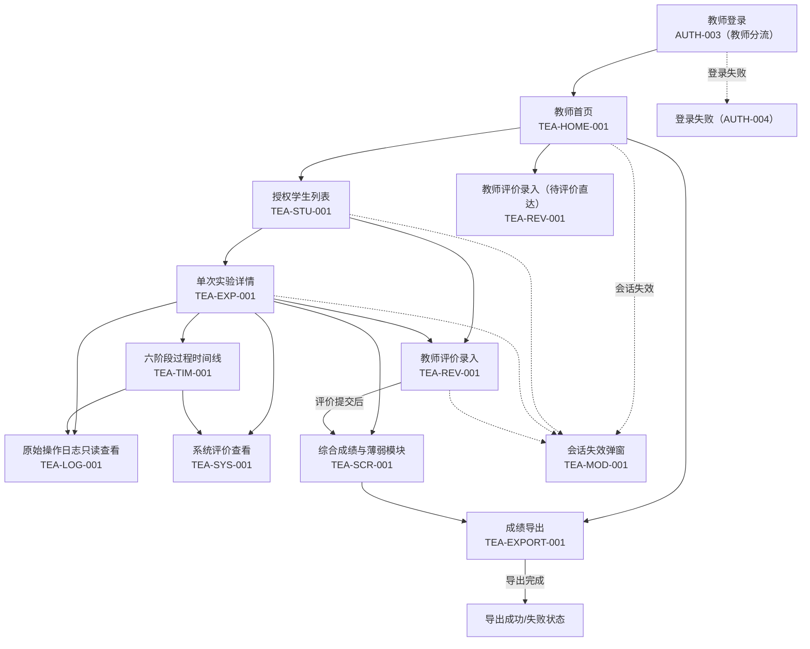
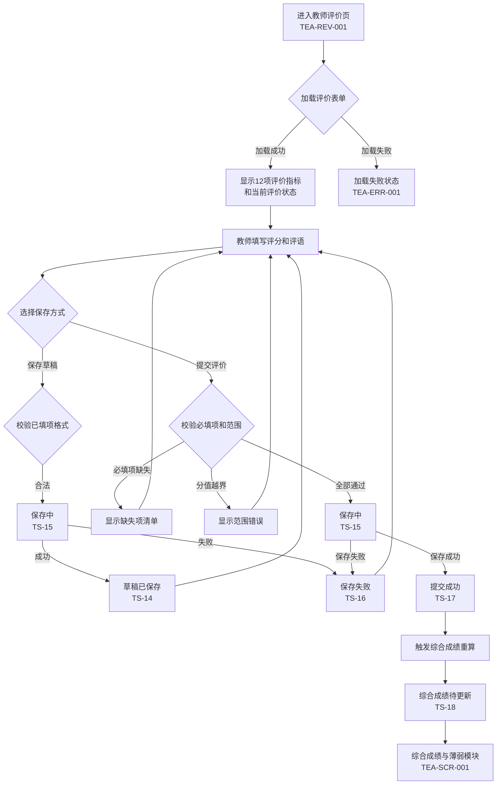

# 教师端低保真原型

> 编制日期：2026-06-23
> 任务：第2周第10天（总第10天）教师端低保真原型
> 基线状态：基于第8天学生端信息架构、第9天六阶段低保真原型
> 专业边界：所有运输判断仅用于教学，不替代真实工程勘测、设计、审查或安全论证。

---

## 1. 文档目标与依据

### 1.1 文档目标

本文档为教师端建立低保真原型，明确教师首页、授权学生列表、学生筛选、单次实验详情、六阶段过程时间线、原始操作日志只读查看、系统评价查看、教师评价录入、综合成绩与薄弱模块、成绩导出等页面和状态，为后续前端页面、路由权限、数据库、日志追溯、评分和教师评价功能开发提供页面基线。

### 1.2 文档依据

| 序号 | 依据文档 | 用法 |
|---|---|---|
| 1 | `docs/论文功能映射.md` | 教师端功能编号、角色权限、评价指标 |
| 2 | `docs/用户与场景.md` | TEA场景、教师角色定义、权限边界 |
| 3 | `docs/六阶段实验主流程.md` | 生命周期、阶段名称与顺序、转换规则 |
| 4 | `docs/专业规则目录.md` | 规则编号、日志与评价取数映射 |
| 5 | `docs/学生端信息架构.md` | 学生页面对照、权限矩阵 |
| 6 | `docs/六阶段低保真原型.md` | 学生端页面编号、阶段内容对照 |
| 7 | 126天实施计划 | 第10天要求与验收标准 |

### 1.3 需求属性

- **论文明确要求**：论文第2—4章直接描述
- **根据论文合理推导**：为实现数据隔离、只读查看、评价流程完整性而补充的最小规则
- **实施计划要求**：126天实施计划明确纳入首版
- **论文未明确**：现有文档均不能确定，须后续确认
- **首版暂不实现**：实施计划明确排除

---

## 2. 教师端设计原则

### 2.1 页面与组件边界

| 边界类型 | 定义 | 路由/状态要求 | 示例 |
|---|---|---|---|
| 独立页面 | 具有独立路由，URL可直接访问 | 完整鉴权与权限校验 | TEA-HOME-001 |
| 页面内标签页 | 同一页面内的标签切换 | 切换不改变路由 | 学生列表/待评价标签 |
| 弹窗 | 模态覆盖，阻断背景操作 | 关闭不改变服务端数据 | 导出确认弹窗 |
| 抽屉 | 侧边滑出面板 | 不改变路由 | 实验详情抽屉 |
| 浮层提示 | 轻量信息或错误提示 | 自动消失或手动关闭 | 保存失败提示 |
| 加载状态 | 数据加载中 | 显示进度 | 学生列表加载 |
| 空状态 | 查询成功但无数据 | 显示说明与下一步 | 无搜索结果 |
| 错误状态 | 技术/权限/数据失败 | 明确错误类型和恢复 | 日志加载失败 |
| 无权限状态 | 角色或授权不通过 | 返回首页或登录 | 越权访问 |
| 只读状态 | 数据不可修改 | 所有写操作禁用 | 日志只读查看 |

### 2.2 状态覆盖要求

| 编号 | 状态名称 | 类型 | 说明 |
|---|---|---|---|
| TS-01 | 加载中 | 技术 | 数据/资源正在加载 |
| TS-02 | 加载失败 | 技术 | 数据/资源加载出错 |
| TS-03 | 空数据 | 业务 | 合法查询但无内容 |
| TS-04 | 无权限 | 权限 | 角色或授权不通过 |
| TS-05 | 授权学生为空 | 业务 | 教师当前无授权学生 |
| TS-06 | 搜索无结果 | 业务 | 筛选/搜索匹配0条 |
| TS-07 | 实验记录为空 | 业务 | 学生无实验记录 |
| TS-08 | 实验详情缺失 | 业务 | 实验数据不完整 |
| TS-09 | 日志缺失 | 业务 | 操作日志数据不存在 |
| TS-10 | 日志加载失败 | 技术 | 日志数据加载异常 |
| TS-11 | 系统评价待生成 | 业务 | 评价系统尚未完成计算 |
| TS-12 | 系统评价生成失败 | 业务 | 评价数据缺失或规则冲突 |
| TS-13 | 教师评价未填写 | 业务 | 教师尚未填写评价 |
| TS-14 | 教师评价草稿 | 业务 | 已保存但未正式提交 |
| TS-15 | 教师评价保存中 | 技术 | 正在持久化教师评价 |
| TS-16 | 教师评价保存失败 | 技术 | 持久化未确认 |
| TS-17 | 教师评价提交成功 | 业务 | 评价已确认保存 |
| TS-18 | 综合成绩待生成 | 业务 | 等待系统+教师评价齐全 |
| TS-19 | 成绩导出中 | 技术 | 正在生成导出文件 |
| TS-20 | 成绩导出失败 | 技术 | 导出过程异常 |
| TS-21 | 网络中断 | 技术 | 网络连接断开 |
| TS-22 | 网络恢复 | 技术 | 网络重连成功 |
| TS-23 | 会话失效 | 权限 | 登录会话已过期 |
| TS-24 | 技术异常 | 技术 | 系统服务异常 |

### 2.3 教师端权限边界

| 权限 | 规则 | 属性 |
|---|---|---|
| 教师登录 | 必须使用教师角色完成认证；账号创建方式论文未明确 | 论文明确要求；创建方式未明确 |
| 查看学生范围 | 只能查看授权范围内学生；授权依据论文未明确 | 根据论文合理推导 |
| 查看实验详情 | 只能只读查看授权学生的实验尝试 | 论文明确要求；只读为合理推导 |
| 查看操作日志 | 只能只读查看，不可修改、删除原始日志 | 论文明确要求；不可修改为合理推导 |
| 填写教师评价 | 对授权学生填写12项1-5分量表评价 | 论文明确要求 |
| 查看系统评价 | 只读查看，不可修改系统评价结果 | 论文明确要求 |
| 查看综合成绩 | 只读查看授权学生的综合成绩 | 论文明确要求 |
| 成绩导出 | 按授权范围导出成绩 | 实施计划要求 |
| 修改学生实验 | 禁止 | 根据论文合理推导 |
| 替学生操作 | 禁止 | 根据论文合理推导 |

---

## 3. 教师角色与权限边界

### 3.1 教师角色定义

| 项目 | 内容 |
|---|---|
| 角色性质 | 自然人、教学评价者 |
| 主要目标 | 查看学生学习过程，完成主观评价，结合系统评价诊断薄弱点 |
| 首版定位 | 首版核心角色 |
| 关键边界 | 仅查看授权范围内学生；不得改写学生原始操作日志 |

来源：论文2.1、4.3.3—4.3.4；用户与场景§4

### 3.2 教师可访问功能

| 功能 | 权限 | 说明 |
|---|---|---|
| 学生管理 | 允许（授权范围） | 查看学生列表、实验状态 |
| 实验详情 | 允许（授权范围，只读） | 查看单次实验和六阶段时间线 |
| 操作日志 | 允许（授权范围，只读） | 查看原始操作日志 |
| 系统评价 | 允许（授权范围，只读） | 查看14项系统评价及依据 |
| 教师评价 | 允许（授权范围） | 填写12项主观评价 |
| 综合成绩 | 允许（授权范围，只读） | 查看成绩和薄弱模块 |
| 成绩导出 | 允许（授权范围） | 导出授权范围内成绩 |
| 修改权限 | 禁止 | 不得修改学生数据或日志 |

### 3.3 教师禁止行为

| 禁止行为 | 说明 |
|---|---|
| 查看未授权学生 | 授权范围外学生的任何数据不可见 |
| 修改学生原始日志 | 操作日志为只读，不可编辑、删除、覆盖 |
| 替学生完成实验 | 不可进入学生可操作实验页面 |
| 修改系统评价 | 系统评价为只读，不可人工覆盖 |
| 伪造评价数据 | 数据缺失时显示对应状态而非伪造成已评价 |

---

## 4. 教师端页面范围

### 4.1 首版必须包含

| 序号 | 页面 | 编号范围 | 优先级 |
|---|---|---|---|
| 1 | 教师首页 | TEA-HOME-001 | P0 |
| 2 | 授权学生列表 | TEA-STU-001 | P0 |
| 3 | 学生筛选和搜索 | TEA-STU-002 | P0 |
| 4 | 单次实验详情 | TEA-EXP-001 | P0 |
| 5 | 六阶段过程时间线 | TEA-TIM-001 | P0 |
| 6 | 原始操作日志只读查看 | TEA-LOG-001 | P0 |
| 7 | 系统评价查看 | TEA-SYS-001 | P0 |
| 8 | 教师评价录入 | TEA-REV-001 | P0 |
| 9 | 综合成绩与薄弱模块 | TEA-SCR-001 | P0 |
| 10 | 成绩导出 | TEA-EXPORT-001 | P1 |

### 4.2 首版不得纳入

| 排除项 | 说明 |
|---|---|
| 教师修改学生实验记录 | 学生实验过程不可被教师修改 |
| 教师修改学生原始日志 | 操作日志只读 |
| 教师代替学生完成实验 | 教师不可进入学生可操作页面 |
| 多课程复杂管理后台 | 首版不实现课程/班级管理 |
| 管理员用户管理后台 | 管理员角色论文未明确 |
| 德尔菲问卷管理 | 首版暂不实现 |
| AHP现场计算工具 | 首版使用论文固定权重 |
| 即时聊天 | 实施计划明确排除 |
| 排行榜 | 实施计划明确排除 |
| 多案例编辑器 | 实施计划明确排除 |
| AI自动评价 | 实施计划明确排除 |
| 移动端专用教师端 | 实施计划明确排除 |

---

## 5. 教师端通用布局

### 5.1 通用框架说明

教师端采用侧边导航+内容区的布局，侧边导航固定显示主要功能入口，内容区根据选择切换页面。

| 项目 | 内容 |
|---|---|
| 页面编号 | TEA-COM-FRAME |
| 页面名称 | 教师端通用布局框架 |
| 页面类型 | 共享框架 |
| 所属端 | 教师端 |
| 使用角色 | 教师 |
| 页面目标 | 提供教师端所有页面的共享外壳，统一导航和操作入口 |
| 进入入口 | 教师登录成功 |

### 5.2 布局草图

```text
┌─────────────────────────────────────────────────────────────┐
│ 🏫 大件运输虚拟仿真实验教学系统       教师：王老师  [退出]  │
├────────────┬────────────────────────────────────────────────┤
│            │                                                 │
│  📋 学生管理│  内容区                                         │
│  📊 待评价  │  （根据左侧导航切换内容）                        │
│  📈 成绩总览│                                                 │
│  📤 成绩导出│                                                 │
│            │                                                 │
│            │                                                 │
│            │                                                 │
├────────────┴────────────────────────────────────────────────┤
│ 系统时间：2026-06-23 10:45        连接状态：🟢 已连接       │
└─────────────────────────────────────────────────────────────┘
```

### 5.3 区域说明

| 区域 | 位置 | 内容 |
|---|---|---|
| 顶部栏 | 页面顶部 | 系统标题、教师姓名/身份、退出登录按钮、会话状态 |
| 左侧导航 | 页面左侧 | 学生管理、待评价、成绩总览、成绩导出四个导航项，当前选中高亮 |
| 内容区 | 页面右侧 | 根据导航项切换展示对应页面内容 |
| 底部状态栏 | 页面底部 | 系统时间、网络连接状态 |

### 5.4 状态提示

| 状态 | 显示方式 |
|---|---|
| 加载中 | 内容区显示骨架屏/进度指示 |
| 网络中断 | 底部状态栏显示🔴 网络已断开 |
| 会话失效 | 弹窗提示并跳转到登录页 |
| 技术异常 | 内容区显示错误状态和重试入口 |

---

## 6. 教师首页原型（TEA-HOME-001）

### 6.1 页面基本信息

| 项目 | 内容 |
|---|---|
| 页面编号 | TEA-HOME-001 |
| 页面名称 | 教师首页 |
| 页面类型 | 独立页面 |
| 所属端 | 教师端 |
| 使用角色 | 教师 |
| 页面目标 | 聚合教师当前核心任务：查看授权学生概览、待评价实验入口、最近实验记录、异常/缺失数据提示 |
| 进入入口 | 教师登录成功后进入 |
| 前置条件 | 教师身份认证有效、已配置授权学生范围 |

### 6.2 布局草图

```text
┌─────────────────────────────────────────────────────────────┐
│ 🏫 大件运输虚拟仿真实验教学系统       教师：王老师  [退出]  │
├────────────┬────────────────────────────────────────────────┤
│  📋 学生管理│  👋 欢迎回来，王老师                            │
│  📊 待评价  │                                                 │
│  📈 成绩总览│  ─── 概览 ────                                  │
│  📤 成绩导出│  授权学生总数：36人                              │
│            │  已完成实验：12人  进行中：8人  未开始：16人     │
│            │  待评价实验：5人                                  │
│            │  系统评价待生成：3人                              │
│            │                                                 │
│            │  ─── 待评价实验 ────                              │
│            │  ┌────────────────────────────────────┐         │
│            │  │ 张三  | 实验2 | ✅已完成 | [去评价] │         │
│            │  │ 李四  | 实验1 | ✅已完成 | [去评价] │         │
│            │  │ 王五  | 实验2 | ✅已完成 | [去评价] │         │
│            │  │ ...更多 >                              │         │
│            │  └────────────────────────────────────┘         │
│            │                                                 │
│            │  ─── 最近实验记录 ────                            │
│            │  ┌────────────────────────────────────┐         │
│            │  │ 赵六 实验2  06-23 10:30  已完成    │         │
│            │  │ 张三 实验2  06-23 09:15  已完成    │         │
│            │  │ 李四 实验1  06-22 16:40  已完成    │         │
│            │  └────────────────────────────────────┘         │
│            │                                                 │
│            │  ─── 提示 ────                                  │
│            │  ⚠️ 3名学生的系统评价数据待生成                  │
│            │  ⚠️ 授权学生范围为临时配置，请确认是否准确       │
├────────────┴────────────────────────────────────────────────┤
│ 系统时间：2026-06-23 10:45        连接状态：🟢 已连接       │
└─────────────────────────────────────────────────────────────┘
```

### 6.3 区域说明

| 区域 | 内容 |
|---|---|
| 欢迎区 | 教师姓名、登录问候 |
| 概览区 | 授权学生总数、实验完成状态分布、待评价/系统评价待生成数量 |
| 待评价实验区 | 最近待评价学生列表（姓名、实验次数、状态、去评价入口） |
| 最近实验记录区 | 最近完成的实验记录（姓名、时间、状态） |
| 提示区 | 异常数据或缺失数据提示 |

### 6.4 核心操作

| 操作 | 说明 |
|---|---|
| 查看概览 | 浏览学生完成情况统计 |
| 进入待评价 | 点击[去评价]跳转到教师评价页 |
| 查看实验详情 | 点击学生记录进入实验详情 |
| 查看提示 | 点击提示查看详情 |
| 退出登录 | 退出教师端 |

### 6.5 输入/输出数据

| 数据 | 类型 | 来源 |
|---|---|---|
| 输入 | 教师ID、授权范围 | 会话/配置 |
| 输出 | 学生统计、待评价列表、最近记录列表 | 数据库聚合查询 |

### 6.6 成功去向

| 操作 | 去向 |
|---|---|
| 点击[去评价] | TEA-REV-001 教师评价录入 |
| 点击学生记录 | TEA-EXP-001 单次实验详情 |
| 点击更多 | TEA-STU-001 授权学生列表 |
| 点击导航 | 对应功能页面 |

### 6.7 失败状态

| 失败类型 | 显示 |
|---|---|
| 加载失败 | 概览区显示骨架+重试按钮 |
| 无授权学生 | 显示"暂无授权学生，请联系管理员配置" |
| 数据异常 | 对应区域显示"数据异常，请联系技术支持" |

### 6.8 权限要求

- 教师已认证
- 授权范围存在（即使为空）
- 退出登录后不可访问

### 6.9 验收标准

| 验收项 | 标准 |
|---|---|
| 首页可正常加载 | 教师登录后进入首页 |
| 学生统计数据准确 | 授权范围内学生数、完成状态分布正确 |
| 待评价实验列表可点击进入评价 | 点击去评价进入教师评价页 |
| 最近实验记录可点击进入详情 | 点击进入实验详情页 |
| 无授权学生时显示空状态 | 不显示错误或越权数据 |

| 需求属性 | 需求来源 |
|---|---|
| 论文明确要求 | 论文4.3.4；映射TEA-001—002 |

---

## 7. 授权学生列表原型（TEA-STU-001）

### 7.1 页面基本信息

| 项目 | 内容 |
|---|---|
| 页面编号 | TEA-STU-001 |
| 页面名称 | 授权学生列表 |
| 页面类型 | 独立页面（含筛选区+列表标签页） |
| 所属端 | 教师端 |
| 使用角色 | 教师 |
| 页面目标 | 展示授权范围内所有学生及其实验状态，提供进入详情的入口 |
| 进入入口 | 左侧导航「学生管理」 |
| 前置条件 | 教师已认证、授权范围已配置 |

### 7.2 布局草图

```text
┌─────────────────────────────────────────────────────────────┐
│ 🏫 大件运输虚拟仿真实验教学系统       教师：王老师  [退出]  │
├────────────┬────────────────────────────────────────────────┤
│  📋 学生管理│  ─── 搜索与筛选 ────                            │
│  📊 待评价  │  [姓名/学号搜索框______________] [搜索]        │
│  📈 成绩总览│  完成状态：[全部▼]  评价状态：[全部▼]  成绩：[全部▼]│
│  📤 成绩导出│                                                 │
│            │  ─── 学生列表 ────                              │
│            │  [全部学生] [待评价] [已完成] [进行中]           │
│            │                                                 │
│  📋 学生管理│  ┌────┬────┬────┬────┬────┬────┬────┬────┐   │
│  📊 待评价  │  │姓名│班级│实验│完成│系统│教师│综合│操作│   │
│            │  │    │    │次数│状态│评价│评价│成绩│    │   │
│            │  ├────┼────┼────┼────┼────┼────┼────┼────┤   │
│            │  │张三│交通│ 2  │ ✅ │ ✅ │待评│待生│详情│   │
│            │  │    │211 │    │完成│完成│    │成  │    │   │
│            │  ├────┼────┼────┼────┼────┼────┼────┼────┤   │
│            │  │李四│交通│ 1  │ ▶  │ —  │ —  │ —  │详情│   │
│            │  │    │211 │    │进行│    │    │    │    │   │
│            │  ├────┼────┼────┼────┼────┼────┼────┼────┤   │
│            │  │王五│交通│ 2  │ ✅ │待生│待评│—  │详情│   │
│            │  │    │212 │    │完成│成  │    │    │    │   │
│            │  └────┴────┴────┴────┴────┴────┴────┴────┘   │
│            │                                                 │
│            │  共 36 人  第 1/4 页  [1] [2] [3] [4]          │
├────────────┴────────────────────────────────────────────────┤
│ 系统时间：2026-06-23 10:45        连接状态：🟢 已连接       │
└─────────────────────────────────────────────────────────────┘
```

### 7.3 核心展示内容

| 展示项 | 内容 |
|---|---|
| 学生姓名/编号 | 学生姓名或学号 |
| 班级或课程归属 | 待确认字段（论文未明确），标注"待确认" |
| 实验次数 | 该学生的实验尝试次数 |
| 完成状态 | 未开始/进行中/已完成/等待恢复 |
| 系统评价状态 | 已完成/待生成/生成失败/—（未完成） |
| 教师评价状态 | 已评价/待评价/草稿/—（未完成） |
| 综合成绩状态 | 已生成/待生成/—（条件不足） |
| 操作入口 | [详情]按钮进入实验详情 |

### 7.4 核心操作

| 操作 | 说明 |
|---|---|
| 搜索学生 | 按姓名或学号搜索 |
| 筛选状态 | 按完成状态、评价状态、成绩状态筛选 |
| 切换标签 | 全部学生/待评价/已完成/进行中 |
| 查看详情 | 点击[详情]进入实验详情页 |
| 分页导航 | 翻页浏览学生列表 |

### 7.5 系统判断

| 判断 | 条件 |
|---|---|
| 授权校验 | 当前学生是否在教师授权范围内 |
| 搜索匹配 | 姓名/学号是否匹配搜索关键词 |
| 筛选条件 | 完成/评价/成绩状态是否匹配 |

### 7.6 失败状态

| 失败类型 | 显示 |
|---|---|
| 加载中 | 表格骨架屏 |
| 加载失败 | "学生数据加载失败，请重试" |
| 授权学生为空 | "暂无授权学生，请联系管理员" |
| 搜索无结果 | "未找到匹配的学生" |
| 无权限 | 跳转至登录页或权限提示页 |

### 7.7 权限要求

- 教师必须已认证
- 只返回授权范围内学生（不做越权展示）

### 7.8 验收标准

| 验收项 | 标准 |
|---|---|
| 学生列表可正常加载 | 教师授权范围内学生均展示 |
| 搜索筛选功能有效 | 按姓名/状态筛选结果准确 |
| 分页正常 | 超过一页时分页控件可操作 |
| 无授权学生时显示空状态 | 不显示越权或错误数据 |
| 越权学生不出现在列表 | 替换学生ID直访也被拒绝 |

| 需求属性 | 需求来源 |
|---|---|
| 论文明确要求；实施计划要求 | 论文4.3.4；用户与场景TEA-001 |

---

## 8. 学生筛选与搜索原型（TEA-STU-002）

### 8.1 页面基本信息

| 项目 | 内容 |
|---|---|
| 页面编号 | TEA-STU-002 |
| 页面名称 | 学生筛选与搜索 |
| 页面类型 | 页面内区域（隶属于TEA-STU-001） |
| 所属端 | 教师端 |
| 使用角色 | 教师 |
| 页面目标 | 在授权学生列表中通过关键词、状态筛选快速定位目标学生 |
| 进入入口 | TEA-STU-001学生列表页顶部筛选区 |

### 8.2 布局草图

```text
┌──────────────────────────────────────────────────────────────┐
│ ─── 搜索与筛选 ───────────────────────────                    │
│                                                              │
│ [姓名或学号搜索框______________________] [搜索] [重置]       │
│                                                              │
│ 完成状态：[全部 ▼]  评价状态：[全部 ▼]  成绩状态：[全部 ▼] │
│                                                              │
│ 筛选结果：找到 12 人（当前筛选条件下）                       │
│                                                              │
│ ─── 搜索结果为空时 ───                                        │
│                                                              │
│  ┌────────────────────────────────────────┐                  │
│  │ 未找到匹配的学生                         │                  │
│  │ 请尝试修改搜索关键词或筛选条件。         │                  │
│  │ [重置筛选条件]                          │                  │
│  └────────────────────────────────────────┘                  │
│                                                              │
│ ─── 无权限时 ───                                              │
│  ┌────────────────────────────────────────┐                  │
│  │ 你无权查看该筛选范围内的学生数据。       │                  │
│  │ [返回学生列表]                          │                  │
│  └────────────────────────────────────────┘                  │
└──────────────────────────────────────────────────────────────┘
```

### 8.3 核心展示内容

| 展示项 | 内容 |
|---|---|
| 搜索框 | 姓名/学号输入框，搜索和重置按钮 |
| 完成状态筛选 | 全部/未开始/进行中/已完成/等待恢复 |
| 评价状态筛选 | 全部/待评价/已评价/草稿/待生成 |
| 成绩状态筛选 | 全部/已生成/待生成/条件不足 |
| 搜索结果数 | 当前筛选条件下的匹配人数 |
| 空结果 | 搜索无匹配时的提示和重置入口 |

### 8.4 核心操作

| 操作 | 说明 |
|---|---|
| 输入搜索关键词 | 按姓名或学号输入 |
| 点击搜索 | 执行搜索 |
| 选择状态筛选 | 下拉选择过滤条件 |
| 重置筛选 | 清空所有搜索和筛选条件 |
| 组合筛选 | 搜索+多状态筛选同时生效 |

### 8.5 系统判断

| 判断 | 条件 |
|---|---|
| 关键词匹配 | 姓名或学号包含关键词 |
| 状态匹配 | 完成/评价/成绩状态与选中条件一致 |
| 权限校验 | 筛选结果是否在教师授权范围内 |

### 8.6 保存要求

筛选和搜索条件为页面级状态，切换页面后重置。

### 8.7 验收标准

| 验收项 | 标准 |
|---|---|
| 关键字搜索可精确和模糊匹配 | 输入姓名部分文字可匹配到对应学生 |
| 状态筛选结果准确 | 选择不同状态条件筛选结果正确 |
| 组合筛选有效 | 搜索+状态筛选同时生效 |
| 空结果有明确提示 | 显示"未找到匹配的学生"+重置入口 |
| 重置后回到完整列表 | 点击重置后清空条件和结果 |

| 需求属性 | 需求来源 |
|---|---|
| 实施计划要求 | 用户与场景TEA-001 |

---

## 9. 单次实验详情原型（TEA-EXP-001）

### 9.1 页面基本信息

| 项目 | 内容 |
|---|---|
| 页面编号 | TEA-EXP-001 |
| 页面名称 | 单次实验详情 |
| 页面类型 | 独立页面 |
| 所属端 | 教师端 |
| 使用角色 | 教师 |
| 页面目标 | 展示学生的单次实验完整状态，提供进入时间线、日志、评价、成绩的入口 |
| 进入入口 | TEA-STU-001学生列表中点击[详情] |
| 前置条件 | 教师有该学生授权、实验尝试存在 |

### 9.2 布局草图

```text
┌─────────────────────────────────────────────────────────────┐
│ 🏫 大件运输虚拟仿真实验教学系统       教师：王老师  [退出]  │
├────────────┬────────────────────────────────────────────────┤
│  📋 学生管理│  ← 返回学生列表                                 │
│  📊 待评价  │                                                 │
│  📈 成绩总览│  ─── 学生信息 ────                              │
│  📤 成绩导出│  姓名：张三  学号：202406001  班级：交通211    │
│            │  实验次数：2  当前查看：第2次实验                │
│            │  [切换到第1次实验 ▼]                             │
│            │                                                 │
│            │  ─── 实验摘要 ────                               │
│            │  创建时间：2026-06-23 08:30                      │
│            │  完成时间：2026-06-23 10:15                      │
│            │  当前状态：✅ 已完成                             │
│            │  总用时：01:45:23                                │
│            │  是否为只读：是（已提交实验不可修改）            │
│            │                                                 │
│            │  ─── 六阶段完成状态 ────                          │
│            │  ┌────┬────────────┬──────┬──────┬──────┐      │
│            │  │阶段│名称        │状态  │错误  │提示  │      │
│            │  ├────┼────────────┼──────┼──────┼──────┤      │
│            │  │ 1  │运输任务介绍│ ✅通过│ 0   │ 0   │      │
│            │  │ 2  │简单配车    │ ✅通过│ 2   │ 1   │      │
│            │  │ 3  │路线勘测    │ ✅通过│ 3   │ 2   │      │
│            │  │ 4  │车组确定    │ ✅通过│ 1   │ 0   │      │
│            │  │ 5  │装车绑扎    │ ✅通过│ 2   │ 1   │      │
│            │  │ 6  │货物运输    │ ✅通过│ 0   │ 0   │      │
│            │  └────┴────────────┴──────┴──────┴──────┘      │
│            │                                                 │
│            │  ─── 系统规则摘要 ────                            │
│            │  规则总数：44  通过：44  不通过：0               │
│            │                                                 │
│            │  ─── 操作入口 ────                               │
│            │  [查看时间线] [查看操作日志]                     │
│            │  [查看系统评价] [填写教师评价]                    │
│            │  [查看综合成绩]                                  │
├────────────┴────────────────────────────────────────────────┤
│ 系统时间：2026-06-23 10:45        连接状态：🟢 已连接       │
└─────────────────────────────────────────────────────────────┘
```

### 9.3 核心展示内容

| 展示项 | 内容 |
|---|---|
| 学生信息 | 姓名、学号、班级（待确认） |
| 实验尝试信息 | 实验次数、当前查看第几次、切换实验入口 |
| 实验摘要 | 创建时间、完成时间、状态、总用时、是否只读 |
| 六阶段完成状态 | 各阶段名称、状态、错误次数、提示次数 |
| 规则摘要 | 规则总通过/不通过数量 |
| 操作入口 | 进入时间线、日志、系统评价、教师评价、综合成绩 |

### 9.4 核心操作

| 操作 | 说明 |
|---|---|
| 切换实验尝试 | 学生有多次实验时切换查看不同尝试 |
| 查看时间线 | 进入TEA-TIM-001 |
| 查看操作日志 | 进入TEA-LOG-001 |
| 查看系统评价 | 进入TEA-SYS-001 |
| 填写教师评价 | 进入TEA-REV-001 |
| 查看综合成绩 | 进入TEA-SCR-001 |
| 返回学生列表 | 回到TEA-STU-001 |

### 9.5 失败状态

| 失败类型 | 显示 |
|---|---|
| 实验详情加载失败 | "实验数据加载失败，请重试" |
| 实验记录为空 | "该学生暂无实验记录" |
| 实验详情缺失 | "部分实验数据不完整" |
| 无权限 | 跳转权限提示或登录页 |
| 尝试切换失败 | "无法加载指定实验尝试" |

### 9.6 权限要求

- 教师有该学生授权
- 实验尝试归属学生本人
- 只读查看，无编辑入口

### 9.7 验收标准

| 验收项 | 标准 |
|---|---|
| 实验详情展示完整 | 学生信息、六阶段状态、摘要信息齐全 |
| 六阶段名称和顺序正确 | 与学生端完全一致 |
| 不同实验尝试可切换 | 多次实验可切换查看 |
| 操作入口可进入对应功能 | 每个入口按钮可跳转 |
| 越权访问被拒绝 | 教师不能查看未授权学生实验 |
| 实验数据为只读 | 无编辑/删除控件 |

| 需求属性 | 需求来源 |
|---|---|
| 论文明确要求 | 论文4.3.4；用户与场景TEA-002 |

---

## 10. 六阶段过程时间线原型（TEA-TIM-001）

### 10.1 页面基本信息

| 项目 | 内容 |
|---|---|
| 页面编号 | TEA-TIM-001 |
| 页面名称 | 六阶段过程时间线 |
| 页面类型 | 独立页面 |
| 所属端 | 教师端 |
| 使用角色 | 教师 |
| 页面目标 | 按时间顺序展示学生六阶段实验的关键过程，包括各阶段起止时间、状态、错误/提示/回退/重试统计 |
| 进入入口 | TEA-EXP-001中点击[查看时间线] |
| 前置条件 | 实验尝试存在且教师有授权 |

### 10.2 布局草图

```text
┌──────────────────────────────────────────────────────────────┐
│  ← 返回实验详情          六阶段过程时间线                     │
│  学生：张三  学号：202406001  实验：第2次                     │
├──────────────────────────────────────────────────────────────┤
│ ─── 六阶段时间线 ─────────────────────────────                │
│                                                              │
│ ① 运输任务及货物介绍                                         │
│    开始：08:30   结束：08:35   用时：5min                     │
│    状态：✅ ✅ 通过                                           │
│    错误：0次    提示：0次    回退：0次    重试：0次          │
│   ─────────────────────────────────────────                   │
│                                                              │
│ ② 简单配车                                                   │
│    开始：08:35   结束：08:52   用时：17min                    │
│    状态：✅ ✅ 通过                                           │
│    错误：2次    提示：1次    回退：1次    重试：2次          │
│    规则不通过：VEH-003（牵引力不足）                          │
│   ─────────────────────────────────────────                   │
│                                                              │
│ ③ 路线勘测                                                   │
│    开始：08:52   结束：09:28   用时：36min                    │
│    状态：✅ ✅ 通过                                           │
│    错误：3次    提示：2次    回退：0次    重试：3次          │
│    规则不通过：HGT-002（高度不足，调整后通过）                │
│   ─────────────────────────────────────────                   │
│                                                              │
│ ④ 车组确定                                                   │
│    开始：09:28   结束：09:50   用时：22min                    │
│    状态：✅ ✅ 通过                                           │
│    错误：1次    提示：0次    回退：0次    重试：1次          │
│   ─────────────────────────────────────────                   │
│                                                              │
│ ⑤ 货物装车与绑扎加固                                         │
│    开始：09:50   结束：10:05   用时：15min                    │
│    状态：✅ ✅ 通过                                           │
│    错误：2次    提示：1次    回退：1次    重试：2次          │
│   ─────────────────────────────────────────                   │
│                                                              │
│ ⑥ 货物运输                                                   │
│    开始：10:05   结束：10:15   用时：10min                    │
│    状态：✅ ✅ 通过                                           │
│    错误：0次    提示：0次    回退：0次    重试：0次          │
│                                                              │
│ ─── 实验总览 ─────────────────────────                         │
│  总用时：01:45:23                                             │
│  总错误：8次    总提示：4次    总回退：2次    总重试：8次    │
│                                                              │
│  [查看操作日志] [查看系统评价]                                │
└──────────────────────────────────────────────────────────────┘
```

### 10.3 核心展示内容

| 展示项 | 内容 |
|---|---|
| 阶段名称及顺序 | 六阶段名称，与学生端完全一致 |
| 每阶段起止时间 | 开始时间、结束时间、用时 |
| 每阶段状态 | 通过/失败/进行中/未开始 |
| 错误次数 | 本阶段规则失败次数 |
| 提示次数 | 主动提示+自动提示次数 |
| 回退次数 | 本阶段回退操作次数 |
| 重试次数 | 本阶段重试提交次数 |
| 规则不通过详情 | 具体规则编号和简要说明 |
| 实验总览 | 全阶段合计的错误/提示/回退/重试次数 |

### 10.4 核心操作

| 操作 | 说明 |
|---|---|
| 查看阶段详情 | 点击阶段条目可展开更多信息 |
| 查看操作日志 | 跳转TEA-LOG-001 |
| 查看系统评价 | 跳转TEA-SYS-001 |
| 返回实验详情 | 回到TEA-EXP-001 |

### 10.5 失败状态

| 失败类型 | 显示 |
|---|---|
| 时间线加载失败 | "时间线数据加载失败，请重试" |
| 阶段数据缺失 | 对应阶段显示"数据缺失"并标注 |
| 无日志数据 | "该实验暂无操作日志数据" |

### 10.6 权限要求

- 教师有该学生授权
- 只读查看

### 10.7 验收标准

| 验收项 | 标准 |
|---|---|
| 六阶段名称顺序与学生端一致 | 严格对应1—6阶段 |
| 每阶段时间、状态、统计数据展示完整 | 开始/结束/用时/状态/错误/提示/回退/重试均展示 |
| 规则不通过可定位到具体规则 | 显示规则编号和说明 |
| 时间线可稳定还原实验过程 | 从头到尾查看顺序稳定 |
| 无日志数据时有明确提示 | 不显示空数据为正常 |

| 需求属性 | 需求来源 |
|---|---|
| 论文明确要求 | 论文2.2、3.4.1；用户与场景TEA-002 |

---

## 11. 原始操作日志只读查看原型（TEA-LOG-001）

### 11.1 页面基本信息

| 项目 | 内容 |
|---|---|
| 页面编号 | TEA-LOG-001 |
| 页面名称 | 原始操作日志查看 |
| 页面类型 | 独立页面（含筛选标签） |
| 所属端 | 教师端 |
| 使用角色 | 教师 |
| 页面目标 | 教师以只读方式查看学生原始操作日志，支持按阶段和事件类型筛选，区分技术异常和学生业务错误 |
| 进入入口 | TEA-EXP-001/TEA-TIM-001中点击[查看操作日志] |
| 前置条件 | 实验尝试存在、教师有授权 |

### 11.2 布局草图

```text
┌──────────────────────────────────────────────────────────────┐
│  ← 返回实验详情          原始操作日志（只读）                 │
│  学生：张三  学号：202406001  实验：第2次                     │
├──────────────────────────────────────────────────────────────┤
│  ─── 筛选条件 ─────────────────────────                       │
│  阶段：[全部 ▼]  事件类型：[全部 ▼]                          │
│  时间范围：[2026-06-23 08:30] 至 [2026-06-23 10:15]          │
│  [应用筛选] [重置]                                            │
├──────────────────────────────────────────────────────────────┤
│  共 127 条日志  第 1/5 页                                     │
├──────────────────────────────────────────────────────────────┤
│  ┌─────┬──────────┬──────────┬──────────┬──────────┬─────┐  │
│  │时间 │ 阶段      │ 事件类型 │ 动作      │ 结果      │ 对象│  │
│  ├─────┼──────────┼──────────┼──────────┼──────────┼─────┤  │
│  │08:30│阶段1-任务│ 进入     │ 进入阶段  │ 成功      │ S1  │  │
│  │08:31│阶段1-任务│ 查看     │ 查看货物  │ —         │ 模型│  │
│  │08:32│阶段1-任务│ 交互     │ 360°旋转  │ —         │ 模型│  │
│  │08:34│阶段1-任务│ 提交     │ 确认任务  │ ✅通过    │ S1  │  │
│  │08:35│阶段2-配车│ 进入     │ 进入阶段  │ 成功      │ S2  │  │
│  │08:36│阶段2-配车│ 查看     │ 查看动画  │ —         │ 组合│  │
│  │08:40│阶段2-配车│ 选择     │ 组合方式  │ 自行式    │ 组合│  │
│  │08:42│阶段2-配车│ 提交     │ 初步配车  │ ❌失败    │ VEH │  │
│  │    │          │          │          │ 牵引力不足│     │  │
│  │08:42│阶段2-配车│ 帮助     │ 查看提示  │ 提示计1次 │ HLP │  │
│  │08:43│阶段2-配车│ 修改     │ 增加牵引车│ 6×6×2     │ 车辆│  │
│  │08:44│阶段2-配车│ 提交     │ 初步配车  │ ✅通过    │ S2  │  │
│  │08:45│阶段2-配车│ 保存     │ 阶段通过  │ ✅已保存  │ 快照│  │
│  │...  │          │          │          │          │     │  │
│  └─────┴──────────┴──────────┴──────────┴──────────┴─────┘  │
│                                                              │
│  ─── 技术异常日志（与学生业务错误分开显示） ────              │
│  08:52  阶段3   ⚠️ 技术异常  资源加载失败  已恢复  不计业务错│
│  09:15  阶段4   ⚠️ 技术异常  保存重试一次   已恢复  不计业务错│
│                                                              │
│  [1] [2] [3] [4] [5]                                        │
├──────────────────────────────────────────────────────────────┤
│ ⚠️ 此页面为只读视图，不可编辑或删除任何日志记录               │
└──────────────────────────────────────────────────────────────┘
```

### 11.3 核心展示内容

| 展示项 | 内容 |
|---|---|
| 日志列表 | 时间、阶段、事件类型、动作、结果、对象 |
| 事件类型 | 进入/查看/选择/交互/提交/修改/帮助/错误/保存 |
| 结果标识 | ✅通过 / ❌失败 / ⚠️技术异常 / —（无判断） |
| 技术异常 | 单独区域展示，标注"不计学生业务错误" |
| 筛选条件 | 阶段筛选、事件类型筛选、时间范围 |
| 日志统计 | 总日志数、分页 |

### 11.4 核心操作

| 操作 | 说明 |
|---|---|
| 筛选日志 | 按阶段、事件类型、时间范围过滤 |
| 翻页浏览 | 分页查看全部日志 |
| 查看技术异常 | 单独区域展示技术异常事件 |
| 返回实验详情 | 回到TEA-EXP-001 |

### 11.5 系统判断

| 判断 | 条件 |
|---|---|
| 日志归属 | 日志属于当前查看的实验尝试 |
| 事件类型分类 | 业务事件/技术异常正确区分 |
| 日志完整性 | 检查是否有缺失记录 |

### 11.6 失败状态

| 失败类型 | 显示 |
|---|---|
| 日志加载失败 | "操作日志加载失败，请重试" |
| 日志缺失 | "该实验阶段操作日志数据不完整" |
| 筛选无结果 | "当前筛选条件下无匹配日志" |
| 日志空白 | "该实验暂无操作日志记录" |

### 11.7 权限要求

- 教师有该学生授权
- **严格只读**：无任何编辑、删除、导出日志的控件或接口

### 11.8 验收标准

| 验收项 | 标准 |
|---|---|
| 日志可完整显示 | 按时间顺序展示全部操作记录 |
| 事件类型可区分 | 业务错误/技术异常/正常操作明确区分 |
| 筛选功能有效 | 按阶段和事件类型筛选结果准确 |
| 日志不可编辑 | 页面无编辑/删除/修改控件 |
| 技术异常独立标识 | 不与学生业务错误混同 |
| 日志加载失败有重试入口 | 显示错误和重试按钮 |

| 需求属性 | 需求来源 |
|---|---|
| 论文明确要求 | 论文2.2、3.4.1；用户与场景TEA-002 |

---

## 12. 系统评价查看原型（TEA-SYS-001）

### 12.1 页面基本信息

| 项目 | 内容 |
|---|---|
| 页面编号 | TEA-SYS-001 |
| 页面名称 | 系统评价查看 |
| 页面类型 | 独立页面 |
| 所属端 | 教师端 |
| 使用角色 | 教师 |
| 页面目标 | 展示14项系统评价项的结果、依据和状态，教师只读查看 |
| 进入入口 | TEA-EXP-001中点击[查看系统评价] |
| 前置条件 | 实验已完成、教师有授权 |

### 12.2 布局草图

```text
┌──────────────────────────────────────────────────────────────┐
│  ← 返回实验详情          系统评价查看（只读）                 │
│  学生：张三  学号：202406001  实验：第2次                     │
├──────────────────────────────────────────────────────────────┤
│  评价状态：✅ 已生成    规则版本：v1.0（2026-06-01）         │
├──────────────────────────────────────────────────────────────┤
│ ─── 14项系统评价 ─────────────────────────────                │
│                                                              │
│  ┌──────────┬──────────┬──────┬──────┬──────────┬──────┐    │
│  │ 指标     │ 原始值    │ 区间  │ 分值 │ 权重     │ 证据 │    │
│  ├──────────┼──────────┼──────┼──────┼──────────┼──────┤    │
│  │ B1 测量  │ 2次错误  │ 0-1  │ 4分  │ 0.0425   │[日志]│    │
│  │ 分析错误 │          │      │      │          │      │    │
│  ├──────────┼──────────┼──────┼──────┼──────────┼──────┤    │
│  │ B2 操作  │ 5次错误  │ 4-5  │ 3分  │ 0.2516   │[日志]│    │
│  │ 错误     │          │      │      │          │      │    │
│  ├──────────┼──────────┼──────┼──────┼──────────┼──────┤    │
│  │ B3 工具  │ 1次错误  │ 0-1  │ 5分  │ 0.0643   │[日志]│    │
│  │ 选择错误 │          │      │      │          │      │    │
│  ├──────────┼──────────┼──────┼──────┼──────────┼──────┤    │
│  │ ...      │ ...      │ ...  │ ...  │ ...      │ ...  │    │
│  │ （剩余11项同一格式） │      │      │          │      │    │
│  └──────────┴──────────┴──────┴──────┴──────────┴──────┘    │
│                                                              │
│ ─── 评价状态：待生成 ─────────────────────                     │
│  ┌────────────────────────────────────────┐                  │
│  │ 📊 系统评价正在生成中                     │                  │
│  │ 系统正在从操作日志聚合评价数据，           │                  │
│  │ 请稍后查看。                             │                  │
│  │ [刷新状态]                               │                  │
│  └────────────────────────────────────────┘                  │
│                                                              │
│ ─── 评价状态：生成失败 ─────────────────────                    │
│  ┌────────────────────────────────────────┐                  │
│  │ ⚠️ 系统评价生成失败                      │                  │
│  │ 失败原因：部分规则数据缺失/区间冲突。    │                  │
│  │ 请联系技术支持处理。                     │                  │
│  │ [重试生成] [查看详情]                    │                  │
│  └────────────────────────────────────────┘                  │
└──────────────────────────────────────────────────────────────┘
```

### 12.3 核心展示内容

| 展示项 | 内容 |
|---|---|
| 评价状态 | 已生成/待生成/生成失败 |
| 规则版本 | 当前使用的权重大版本 |
| 评价指标 | 14项系统评价（B1—B3、B5—B6、C1—C5、D1—D3、D5） |
| 每一项展示 | 原始值、命中区间、1—5分、权重、日志证据入口 |
| 生成失败原因 | 缺失数据清单或区间冲突说明（仅限技术展示，不虚构分值） |

### 12.4 核心操作

| 操作 | 说明 |
|---|---|
| 查看每项评价详情 | 查看指标、原始值、区间、分值、权重 |
| 查看日志证据 | 点击[日志]跳转到对应日志条目 |
| 刷新状态 | 待生成时手动刷新 |
| 重试生成（技术操作） | 生成失败时重新触发评价计算 |

### 12.5 待确认项

| 项目 | 处理方式 |
|---|---|
| 14项系统评价具体名称 | 使用"B1 测量分析错误""B2 操作错误"等编号占位 |
| 评价计算口径 | 论文未明确边界，标注"论文未明确，待确认" |
| 权重 | 使用论文图4.3权重，标注"论文明确要求" |

### 12.6 失败状态

| 失败类型 | 显示 |
|---|---|
| 评价待生成 | "系统评价正在生成中"+刷新按钮 |
| 评价生成失败 | 显示失败原因+重试/详情入口 |
| 数据缺失 | 标注缺失的指标和原因 |

### 12.7 权限要求

- 教师有该学生授权
- 严格只读：教师不可修改系统评价结果

### 12.8 验收标准

| 验收项 | 标准 |
|---|---|
| 系统评价项可查看 | 每项展示原始值、区间、分值和权重 |
| 评价状态正确反映 | 已生成/待生成/生成失败三种状态 |
| 评价依据可追溯 | 点击证据可查看对应日志 |
| 教师不可修改 | 无编辑控件，无覆盖接口 |
| 生成失败有明确反馈 | 显示失败原因和恢复入口 |

| 需求属性 | 需求来源 |
|---|---|
| 论文明确要求 | 论文4.3.3—4.3.4；用户与场景TEA-004 |

---

## 13. 教师评价录入原型（TEA-REV-001）

### 13.1 页面基本信息

| 项目 | 内容 |
|---|---|
| 页面编号 | TEA-REV-001 |
| 页面名称 | 教师评价录入 |
| 页面类型 | 独立页面 |
| 所属端 | 教师端 |
| 使用角色 | 教师 |
| 页面目标 | 教师对授权学生的12项主观指标评分并填写评语，支持草稿保存和正式提交 |
| 进入入口 | TEA-EXP-001中点击[填写教师评价]或首页待评价列表 |
| 前置条件 | 学生实验已完成、教师有授权、12项量表已加载 |

### 13.2 布局草图

```text
┌──────────────────────────────────────────────────────────────┐
│  ← 返回实验详情          教师评价录入                          │
│  学生：张三  学号：202406001  实验：第2次                     │
├──────────────────────────────────────────────────────────────┤
│  评价状态：未填写                                             │
│  （或：草稿已保存 2026-06-23 10:30 / 已提交 2026-06-23 10:35）│
├──────────────────────────────────────────────────────────────┤
│ ─── 12项教师评价 ────────────────────────────                  │
│                                                              │
│  评分说明：5=非常优秀 4=优秀 3=良好 2=及格 1=不及格          │
│  ⚠️ 分值与方向待课程负责人确认                                │
│                                                              │
│  ┌──────────┬──────────────────────┬──────┬────────┐        │
│  │ 指标     │ 评价内容              │ 分值  │ 评语    │        │
│  ├──────────┼──────────────────────┼──────┼────────┤        │
│  │  A1      │ 掌握实验安全知识      │ [5▼] │ ______ │        │
│  │  A2      │ 明确实验目的          │ [4▼] │ ______ │        │
│  │  A3      │ 掌握实验知识理论      │ [4▼] │ ______ │        │
│  │  A4      │ 熟练实验流程          │ [4▼] │ ______ │        │
│  │  A5      │ 实验结果总结          │ [3▼] │ ______ │        │
│  │  A6      │ 反思及心得体会        │ [3▼] │ ______ │        │
│  │  A7      │ 预习报告成绩          │ [—▼] │ 缺预习│        │
│  │  A8      │ 实验报告成绩          │ [—▼] │ 缺报告│        │
│  │  B4      │ 正确观察实验现象      │ [4▼] │ ______ │        │
│  │  D4      │ 预习报告完成时效度    │ [—▼] │ 缺预习│        │
│  │  D6      │ 实验报告完成时效度    │ [—▼] │ 缺报告│        │
│  │  D7      │ 虚拟仿真实验喜好程度  │ [4▼] │ ______ │        │
│  └──────────┴──────────────────────┴──────┴────────┘        │
│                                                              │
│  ─── 校验提示 ─────────────────────────                      │
│  ⚠️ A7、D4、D6因缺少预习报告/实验报告暂不可评                │
│  ⚠️ 当前已评9项，必填9/12（可评项9/9）                       │
│                                                              │
│  ─── 保存状态 ─────────────────────────                      │
│  💾 状态：未保存 | 草稿已保存 | 保存中 | 保存失败            │
│                                                              │
│  [保存草稿] [提交评价]                                       │
├──────────────────────────────────────────────────────────────┤
│ ⚠️ 教师评价仅反映教师对学生的主观评价，不修改学生操作日志。   │
│ 教师评价提交后是否可修改：[待确认]                            │
└──────────────────────────────────────────────────────────────┘
```

### 13.3 核心展示内容

| 展示项 | 内容 |
|---|---|
| 评价状态 | 未填写/草稿/已提交 |
| 评分说明 | 5分最好方向（待课程负责人确认） |
| 12项评价指标 | 编号、名称、评分下拉、评语输入 |
| 校验提示 | 必填项缺失、不可评原因 |
| 保存状态 | 未保存/草稿已保存/保存中/保存失败 |
| 操作按钮 | 保存草稿、提交评价 |

### 13.4 12项教师评价指标

| 编号 | 名称 | 来源 |
|---|---|---|
| A1 | 掌握实验安全知识 | 论文表4.2 |
| A2 | 明确实验目的 | 论文表4.2 |
| A3 | 掌握实验知识理论 | 论文表4.2 |
| A4 | 熟练实验流程 | 论文表4.2 |
| A5 | 实验结果总结 | 论文表4.2 |
| A6 | 实验反思及心得体会 | 论文表4.2 |
| A7 | 预习报告成绩 | 论文表4.2 |
| A8 | 实验报告成绩 | 论文表4.2 |
| B4 | 正确观察实验现象 | 论文表4.2 |
| D4 | 预习报告完成时效度 | 论文表4.2 |
| D6 | 实验报告完成时效度 | 论文表4.2 |
| D7 | 虚拟仿真实验喜好程度 | 论文表4.2 |

### 13.5 核心操作

| 操作 | 说明 |
|---|---|
| 选择分值 | 每项下拉选择1—5分或"无法评价" |
| 填写评语 | 每项可选输入文字评语 |
| 保存草稿 | 保存当前已填内容为草稿 |
| 提交评价 | 校验后正式提交 |
| 查看学生材料 | 点击学生名查看实验报告等材料 |

### 13.6 系统判断

| 判断 | 条件 |
|---|---|
| 必填项完整性 | 可评项是否全部已选择分值 |
| 分值范围 | 1—5分（或标记为无法评价） |
| 保存权限 | 教师是否有该学生的评价权限 |

### 13.7 失败状态

| 失败类型 | 显示 |
|---|---|
| 必填项缺失 | 显示缺失项列表 |
| 分值越界 | 提示分值必须在1—5之间 |
| 保存失败 | "保存失败，请重试" |
| 草稿恢复失败 | "草稿恢复失败，请重新填写" |

### 13.8 待确认事项

| 事项 | 当前处理 |
|---|---|
| 教师评价提交后是否允许修改 | 标注"待确认"，当前暂按可修改设计（修改后触发重算） |
| 是否需要草稿状态 | 标注"待确认"，当前提供保存草稿功能 |
| 5分方向 | 使用5=最好方向，标注待课程负责人确认 |
| 不可评项处理 | 标注"缺材料不可评"，不静默按0分 |

### 13.9 权限要求

- 教师有该学生授权
- 不可修改学生原始日志
- 评价修改后触发综合成绩重算

### 13.10 验收标准

| 验收项 | 标准 |
|---|---|
| 12项评价指标齐全 | 全部展示，与论文最终指标一致 |
| 分值范围校验有效 | 越界分值被拒绝 |
| 可保存草稿 | 保存后数据不丢失 |
| 正式提交后记录评分人和时间 | 日志可追溯 |
| 缺项不可提交 | 可评项未评完时提示缺失 |
| 修改后评分可更新 | 触发重新计算 |

| 需求属性 | 需求来源 |
|---|---|
| 论文明确要求 | 论文4.3.3—4.3.4；用户与场景TEA-003 |

---

## 14. 综合成绩与薄弱模块原型（TEA-SCR-001）

### 14.1 页面基本信息

| 项目 | 内容 |
|---|---|
| 页面编号 | TEA-SCR-001 |
| 页面名称 | 综合成绩与薄弱模块 |
| 页面类型 | 独立页面 |
| 所属端 | 教师端 |
| 使用角色 | 教师 |
| 页面目标 | 展示学生综合成绩、四维得分、薄弱模块和错误证据入口 |
| 进入入口 | TEA-EXP-001中点击[查看综合成绩] |
| 前置条件 | 系统评价和教师评价已齐全、教师有授权 |

### 14.2 布局草图

```text
┌──────────────────────────────────────────────────────────────┐
│  ← 返回实验详情          综合成绩与薄弱模块                    │
│  学生：张三  学号：202406001  实验：第2次                     │
├──────────────────────────────────────────────────────────────┤
│  ─── 综合成绩 ───────────────────────────                      │
│                                                              │
│                          ┌──────────┐                       │
│      综合成绩            │  82.5分   │                       │
│      等级：良好          └──────────┘                       │
│      评分版本：v1.0（2026-06-01）                            │
│      计算时间：2026-06-23 11:00                              │
│                                                              │
│  ─── 四维得分 ───────────────────────                         │
│                                                              │
│  知识发展A（权重0.3059）  ████████░░   18.5/30.6   ✅       │
│  实验技能B（权重0.4915）  ██████████   42.0/49.2   ✅       │
│  交流互动C（权重0.1249）  ████░░░░░░    8.5/12.5   ⚠️偏低  │
│  情感态度D（权重0.0777）  █████░░░░░    4.5/7.8    ⚠️偏低  │
│                                                              │
│  ─── 薄弱模块 ───────────────────────────                      │
│                                                              │
│  ⚠️ B2 操作错误（得分3/5，权重0.2516）                       │
│     操作错误5次（区间4-5次），错误集中在：                    │
│     • 简单配车—牵引车数量选择（2次）                         │
│     • 路线勘测—障碍判断（3次）                               │
│     [查看相关日志] [查看操作详情]                            │
│                                                              │
│  ⚠️ C1 提问频率（得分2/5，权重0.0615）                       │
│     提问次数3次（区间6-10次以下）                            │
│     [查看交流记录]                                           │
│                                                              │
│  ─── 26项分项详情 ─────────────────────                       │
│  [展开查看26项完整评分明细]                                  │
│                                                              │
│  ─── 成绩状态 ───────────────────────────                      │
│                                                              │
│  ✅ 综合成绩已生成                                            │
│  📊 系统评价：14项齐全  ✅                                   │
│  👨‍🏫 教师评价：12项齐全  ✅                                   │
│                                                              │
│  ⚠️ 学生最终成绩是否可见：🔒 待发布规则确认                    │
│  ⚠️ 成绩发布/复核/撤回流程：论文未明确，未实现                │
├──────────────────────────────────────────────────────────────┤
│  [返回学生列表]  [导出该生成绩]                               │
└──────────────────────────────────────────────────────────────┘
```

### 14.3 核心展示内容

| 展示项 | 内容 |
|---|---|
| 综合成绩 | 总分（百分制）、等级（待确认）、评分版本、计算时间 |
| 四维得分 | A知识发展/B实验技能/C交流互动/D情感态度的得分和权重 |
| 薄弱模块 | 低分指标及对应的错误证据入口 |
| 26项分项 | 可展开查看完整评分明细 |
| 成绩状态 | 系统评价状态、教师评价状态、综合成绩状态 |

### 14.4 核心操作

| 操作 | 说明 |
|---|---|
| 查看总分 | 综合成绩和四维得分 |
| 查看薄弱模块 | 低分指标及错误证据 |
| 查看日志证据 | 点击[查看相关日志]跳转到对应日志 |
| 展开分项详情 | 查看26项完整评分 |
| 导出该生成绩 | 跳转到成绩导出 |

### 14.5 待确认事项

| 事项 | 当前处理 |
|---|---|
| 学生最终成绩是否可见 | 🔒 默认关闭，待发布规则确认 |
| 成绩发布流程 | 论文未明确，不实现 |
| 成绩复核流程 | 论文未明确，不实现 |
| 成绩撤回流程 | 论文未明确，不实现 |
| 等级映射 | 论文未明确，不虚构 |

### 14.6 失败状态

| 失败类型 | 显示 |
|---|---|
| 成绩待生成 | 系统评价或教师评价未齐全 |
| 系统评价缺失/冲突 | 显示"系统评价待确认" |
| 教师评价缺失 | 显示"教师评价未完成" |
| 计算失败 | "成绩计算失败，请重试" |

### 14.7 权限要求

- 教师有该学生授权
- 综合成绩只读查看
- 默认不向学生开放最终成绩
- 不实现成绩发布/复核/撤回功能

### 14.8 验收标准

| 验收项 | 标准 |
|---|---|
| 综合成绩展示完整 | 总分、四维分、26项分项均展示 |
| 薄弱模块可追溯 | 低分项可查看相关日志证据 |
| 成绩状态正确反映 | 待生成/已生成/条件不足 |
| 成绩发布/复核/撤回未擅自实现 | 无对应功能入口 |
| 学生成绩查看权限默认关闭 | 学生端不可查看最终成绩 |

| 需求属性 | 需求来源 |
|---|---|
| 论文明确要求；论文未明确 | 论文2.1、4.3.4；用户与场景TEA-005；发布规则论文未明确 |

---

## 15. 成绩导出原型（TEA-EXPORT-001）

### 15.1 页面基本信息

| 项目 | 内容 |
|---|---|
| 页面编号 | TEA-EXPORT-001 |
| 页面名称 | 成绩导出 |
| 页面类型 | 独立页面 |
| 所属端 | 教师端 |
| 使用角色 | 教师 |
| 页面目标 | 教师按授权范围选择导出条件并导出学生成绩文件 |
| 进入入口 | 左侧导航「成绩导出」或TEA-SCR-001中[导出该生成绩] |
| 前置条件 | 教师已认证、授权范围内有可导出的成绩 |

### 15.2 布局草图

```text
┌──────────────────────────────────────────────────────────────┐
│  ← 返回                 成绩导出                              │
├──────────────────────────────────────────────────────────────┤
│  ─── 导出范围 ───────────────────────────                      │
│                                                              │
│  学生范围：[全部授权学生 ▼]                                   │
│  班级/课程：[全部 ▼]   （班级归属为待确认字段）               │
│  成绩状态：[仅已完成评价 ▼]                                   │
│  时间范围：从 [2026-06-01] 至 [2026-06-23]                  │
│                                                              │
│  ─── 导出字段 ───────────────────────────                      │
│                                                              │
│  ☑ 学号    ☑ 姓名    ☑ 班级    ☑ 实验次数                   │
│  ☑ 完成时间  ☑ 总用时  ☑ 综合成绩                            │
│  ☑ A知识发展得分  ☑ B实验技能得分                            │
│  ☑ C交流互动得分  ☑ D情感态度得分                            │
│  ☑ 系统评价各分项（14项）                                    │
│  ☑ 教师评价各分项（12项）                                    │
│  └── 导出字段以实际配置为准 ──                                │
│                                                              │
│  共匹配 12 名学生  导出格式：[CSV ▼]                         │
│                                                              │
│  ─── 导出状态 ───────────────────────────                      │
│                                                              │
│  📄 上次导出：2026-06-22 15:30  12条记录  成功               │
│                                                              │
│  [预览导出结果]  [开始导出]                                   │
│                                                              │
│  ─── 导出成功 ─────────────────────                          │
│  ✅ 导出完成！文件：成绩_2026-06-23.csv                       │
│  共导出 12 条记录                                             │
│  [下载文件]                                                   │
│                                                              │
│  ─── 导出失败 ─────────────────────                          │
│  ❌ 导出失败：生成文件时发生错误                              │
│  [重试导出] [检查导出条件]                                    │
│                                                              │
│  ─── 无数据不可导出 ─────────────                              │
│  ⚠️ 当前条件下没有可导出的成绩数据。                          │
│  请调整筛选范围后再试。                                       │
└──────────────────────────────────────────────────────────────┘
```

### 15.3 核心展示内容

| 展示项 | 内容 |
|---|---|
| 导出范围选择 | 学生范围、班级（待确认）、成绩状态、时间范围 |
| 导出字段选择 | 可勾选需要导出的数据字段 |
| 匹配学生数 | 当前筛选条件下的学生数量 |
| 导出格式 | CSV（首版） |
| 导出历史 | 上次导出时间、记录数、结果 |
| 导出状态 | 成功/失败/无数据 |

### 15.4 核心操作

| 操作 | 说明 |
|---|---|
| 选择导出范围 | 设置筛选条件 |
| 选择导出字段 | 勾选需要的数据列 |
| 预览导出结果 | 查看即将导出的数据摘要 |
| 开始导出 | 执行导出任务 |
| 下载文件 | 导出成功后下载 |
| 重试导出 | 失败后重试 |

### 15.5 系统判断

| 判断 | 条件 |
|---|---|
| 权限校验 | 每条记录是否在教师授权范围内 |
| 数据完整性 | 导出字段是否有对应数据 |
| 匹配结果 | 筛选条件下的学生数是否为0 |
| 生成状态 | 文件是否成功生成 |

### 15.6 失败状态

| 失败类型 | 显示 |
|---|---|
| 无数据不可导出 | "当前条件下没有可导出的成绩数据" |
| 导出失败 | "生成文件时发生错误"+重试入口 |
| 部分数据缺失 | 标注缺失字段（不生成不完整文件） |
| 越权记录 | 排除越权记录并提示 |

### 15.7 待确认事项

| 事项 | 当前处理 |
|---|---|
| 导出字段 | 使用通用字段集合，标注"以实际配置为准" |
| 导出格式 | 首版CSV，打印视图后续实现 |
| 班级字段 | 班级归属为待确认字段 |
| 中文编码 | 标注UTF-8编码，中文正常显示 |

### 15.8 权限要求

- 教师已认证
- 只能导出授权范围内学生
- 越权记录排除且不提示

### 15.9 验收标准

| 验收项 | 标准 |
|---|---|
| 导出范围选择有效 | 筛选条件影响匹配学生数 |
| 无数据时不可导出 | "无数据"状态阻止导出操作 |
| 导出成功可下载 | 生成文件可下载，中文不乱码 |
| 导出失败有提示 | 错误原因和重试入口 |
| 越权记录不导出 | 不包含未授权学生数据 |

| 需求属性 | 需求来源 |
|---|---|
| 实施计划要求 | 用户与场景TEA-006；实施计划第110天 |

---

## 16. 教师端状态与异常处理

### 16.1 通用加载状态（TEA-ERR-001）

```text
┌──────────────────────────────────────────────┐
│ 正在加载数据…                                 │
│ ████████░░░░ 80%                            │
│ [取消]                                       │
└──────────────────────────────────────────────┘
```

### 16.2 通用空数据状态（TEA-ERR-002）

```text
┌──────────────────────────────────────────────┐
│ 暂无数据                                       │
│ 当前没有可显示的内容。                         │
│ [返回上一页]                                   │
└──────────────────────────────────────────────┘
```

### 16.3 通用无权限状态（TEA-ERR-003）

```text
┌──────────────────────────────────────────────┐
│ 无权访问                                       │
│ 你没有权限访问该页面或数据。                   │
│ [返回首页] [返回登录]                          │
└──────────────────────────────────────────────┘
```

### 16.4 会话失效弹窗（TEA-MOD-001）

```text
┌──────────────────────────────────────────────┐
│ ⏰ 会话已过期                                  │
│ 你的登录会话已过期，请重新登录。               │
│ [去登录]                                       │
└──────────────────────────────────────────────┘
```

### 16.5 保存失败浮层（TEA-MOD-002）

```text
┌──────────────────────────────────────────────┐
│ ❌ 保存失败                                    │
│ 数据未保存成功，请重试。                       │
│ [重试] [稍后处理]                              │
└──────────────────────────────────────────────┘
```

### 16.6 技术异常状态（TEA-ERR-004）

```text
┌──────────────────────────────────────────────┐
│ 系统异常                                       │
│ 网络连接或系统服务暂时不可用。                 │
│ 原因：[具体异常类型]                          │
│ [重试] [返回上一页]                            │
└──────────────────────────────────────────────┘
```

---

## 17. 页面入口与跳转关系

### 17.1 Mermaid：教师端页面入口关系图



### 17.2 Mermaid：教师评价提交流程图



---

## 18. 教师端页面总台账

### 18.1 页面分类统计

| 分类 | 编号范围 | 数量 | 说明 |
|---|---|---|---|
| 通用框架与状态 | TEA-COM-FRAME、TEA-ERR-001~004 | 5 | 布局框架、加载/空数据/无权限/技术异常 |
| 教师首页 | TEA-HOME-001 | 1 | 教师首页 |
| 学生管理 | TEA-STU-001~002 | 2 | 学生列表、筛选搜索 |
| 实验详情 | TEA-EXP-001 | 1 | 单次实验详情 |
| 时间线 | TEA-TIM-001 | 1 | 六阶段过程时间线 |
| 操作日志 | TEA-LOG-001 | 1 | 原始操作日志只读查看 |
| 系统评价 | TEA-SYS-001 | 1 | 系统评价查看 |
| 教师评价 | TEA-REV-001 | 1 | 教师评价录入 |
| 综合成绩 | TEA-SCR-001 | 1 | 综合成绩与薄弱模块 |
| 成绩导出 | TEA-EXPORT-001 | 1 | 成绩导出 |
| 弹窗 | TEA-MOD-001~002 | 2 | 会话失效、保存失败 |
| **合计** | | **17** | |

### 18.2 完整页面编号清单

| 编号 | 名称 | 类型 | 所属模块 |
|---|---|---|---|
| TEA-COM-FRAME | 教师端通用布局框架 | 共享框架 | 通用 |
| TEA-HOME-001 | 教师首页 | 独立页面 | 首页 |
| TEA-STU-001 | 授权学生列表 | 独立页面 | 学生管理 |
| TEA-STU-002 | 学生筛选与搜索 | 页面内区域 | 学生管理 |
| TEA-EXP-001 | 单次实验详情 | 独立页面 | 实验详情 |
| TEA-TIM-001 | 六阶段过程时间线 | 独立页面 | 时间线 |
| TEA-LOG-001 | 原始操作日志只读查看 | 独立页面 | 操作日志 |
| TEA-SYS-001 | 系统评价查看 | 独立页面 | 系统评价 |
| TEA-REV-001 | 教师评价录入 | 独立页面 | 教师评价 |
| TEA-SCR-001 | 综合成绩与薄弱模块 | 独立页面 | 综合成绩 |
| TEA-EXPORT-001 | 成绩导出 | 独立页面 | 成绩导出 |
| TEA-ERR-001 | 通用加载状态 | 加载状态 | 通用 |
| TEA-ERR-002 | 通用空数据状态 | 空状态 | 通用 |
| TEA-ERR-003 | 通用无权限状态 | 错误状态 | 通用 |
| TEA-ERR-004 | 通用技术异常状态 | 错误状态 | 通用 |
| TEA-MOD-001 | 会话失效弹窗 | 弹窗 | 通用 |
| TEA-MOD-002 | 保存失败浮层 | 浮层/弹窗 | 通用 |

---

## 19. 待确认事项

### 19.1 待确认事项清单

| 编号 | 事项 | 当前基线处理 | 影响范围 | 建议责任人 |
|---|---|---|---|---|
| Q-01 | 教师账号创建方式 | 仅规定教师需认证，不定义自助注册/邀请/管理员创建 | 登录、用户表 | 课程负责人 |
| Q-02 | 教师登录入口是否与学生共用 | 当前设计与学生共用PUB-001，增加教师登录分流 | TEA-HOME-001 | 课程负责人 |
| Q-03 | 教师授权学生范围（班级/课程归属） | 使用"授权范围"抽象边界，不虚构实体关系 | TEA-STU-001 | 课程负责人 |
| Q-04 | 班级和课程归属实体 | 学生列表中班级字段标注"待确认" | TEA-STU-001 | 课程负责人 |
| Q-05 | 是否存在管理员角色 | 不作为首版独立业务端验收角色 | 全端 | 项目负责人 |
| Q-06 | 管理员是否需要单独页面 | 首版不实现管理员页面 | 全端 | 项目负责人 |
| Q-07 | 14项系统评价具体名称 | 使用编号占位（B1、B2等），不虚构名称 | TEA-SYS-001 | 课程负责人 |
| Q-08 | 14项系统评价计算口径 | 标记"论文未明确/表4.8存在端点冲突" | TEA-SYS-001 | 课程负责人 |
| Q-09 | 12项教师评价具体名称 | 使用论文表4.2名称 | TEA-REV-001 | 课程负责人 |
| Q-10 | 12项教师评价评分口径 | 使用5分最好方向，标注待确认 | TEA-REV-001 | 课程负责人 |
| Q-11 | 系统评价与教师评价综合权重 | 使用论文图4.3权重，配置化保存 | TEA-SCR-001 | 课程负责人 |
| Q-12 | 教师评价提交后是否允许修改 | 当前暂按可修改设计，标注"待确认" | TEA-REV-001 | 课程负责人 |
| Q-13 | 教师评价是否需要草稿状态 | 当前提供保存草稿功能，待确认 | TEA-REV-001 | 产品经理 |
| Q-14 | 学生最终成绩是否可见 | 默认关闭，待发布规则确认 | TEA-SCR-001 | 课程负责人 |
| Q-15 | 成绩是否需要教师发布 | 不实现发布工作流，标注"论文未明确" | TEA-SCR-001 | 课程负责人 |
| Q-16 | 成绩是否允许复核 | 不实现复核流程，标注"论文未明确" | TEA-SCR-001 | 课程负责人 |
| Q-17 | 已完成实验是否允许撤回 | 不实现撤回，标注"论文未明确" | TEA-EXP-001 | 课程负责人 |
| Q-18 | 成绩导出字段 | 使用通用字段集合，标注以实际配置为准 | TEA-EXPORT-001 | 产品经理 |
| Q-19 | 成绩导出格式 | 首版CSV，打印视图后续实现 | TEA-EXPORT-001 | 技术负责人 |
| Q-20 | 日志缺失后的人工处理流程 | 仅显示缺失状态，不实现人工补录 | TEA-LOG-001 | 技术负责人 |
| Q-21 | 系统评价生成失败后的人工处理入口 | 仅显示失败状态和重试入口 | TEA-SYS-001 | 技术负责人 |
| Q-22 | 教师是否能查看学生提示使用记录 | 当前可在日志中查看，统计入口待确认 | TEA-TIM-001 | 产品经理 |
| Q-23 | 教师是否能查看技术异常 | 当前在日志中独立展示技术异常 | TEA-LOG-001 | 产品经理 |
| Q-24 | 教师端是否需要打印视图 | 首版仅CSV导出，打印视图暂不实现 | TEA-EXPORT-001 | 产品经理 |

### 19.2 首版排除范围

| 排除项 | 说明 |
|---|---|
| 教师修改学生原始日志 | 操作日志为只读 |
| 教师代替学生完成实验 | 教师不可进入学生可操作页面 |
| 多课程复杂管理后台 | 首版不实现课程/班级管理 |
| 管理员完整后台 | 管理员角色论文未明确 |
| 德尔菲问卷管理 | 首版暂不实现 |
| AHP现场计算工具 | 首版使用论文固定权重 |
| 即时聊天 | 实施计划明确排除 |
| 排行榜 | 实施计划明确排除 |
| 多案例编辑器 | 实施计划明确排除 |
| AI自动评价 | 实施计划明确排除 |
| 移动端专用教师端 | 实施计划明确排除 |
| 工程级有限元或桥梁分析页面 | 教学简化，不作工程承诺 |
| 真实运输审批后台 | 不模拟实际运输审批 |
| 真实地图调度后台 | 使用预设路线数据 |

---

## 20. 第10天验收结果

| 验收项 | 结果 | 证据 |
|---|---|---|
| 已创建 docs/教师端低保真原型.md | 通过 | 本文档 |
| 文档包含规定的 20 个标题 | 通过 | §1—§20（待确认+首版排除为§19，验收为§20） |
| 教师首页、学生列表、实验详情、日志、成绩和教师评价都有明确入口 | 通过 | TEA-HOME-001至TEA-EXPORT-001 |
| 教师端能查看学生列表、实验详情、日志、成绩并填写评价 | 通过 | TEA-STU-001、TEA-EXP-001、TEA-LOG-001、TEA-SCR-001、TEA-REV-001 |
| 六阶段名称和顺序完全正确 | 通过 | §17.1/TEA-TIM-001严格按论文顺序 |
| 教师查看学生实验和原始日志为只读 | 通过 | TEA-LOG-001标注只读、TEA-EXP-001无编辑控件 |
| 教师不得修改学生原始操作日志 | 通过 | §2.3、§11.7、§19.2明确禁止 |
| 教师只能查看授权范围内学生 | 通过 | §2.3、§3.2权限矩阵 |
| 系统评价查看和教师评价录入边界清楚 | 通过 | TEA-SYS-001只读 vs TEA-REV-001可写 |
| 学生最终成绩查看权限、成绩发布和复核流程未被擅自开放或虚构 | 通过 | TEA-SCR-001标注"待发布规则确认""论文未明确" |
| 页面、抽屉、弹窗、浮层和状态边界清楚 | 通过 | §2.1组件边界、§18分类台账 |
| 至少包含两张 Mermaid 图 | 通过 | §17.1页面入口关系图、§17.2评价提交流程图 |
| Mermaid 代码块闭合且语法可渲染 | 通过 | §17两个代码块均闭合 |
| 页面编号唯一 | 通过 | §18.2共17项唯一编号 |
| Markdown 表格列数一致 | 通过 | 全文表格无列数不一致 |
| 每个首版页面都有验收标准和需求来源 | 通过 | 各页面末尾"验收标准"和"需求属性/来源" |
| 不修改既有参考文件 | 通过 | 仅新增 docs/教师端低保真原型.md |
| 不编写业务代码、不安装依赖、不创建脚手架 | 通过 | 本日仅编写本Markdown文档 |
| 不伪造论文未明确的评分项、权重或成绩流程 | 通过 | 未确认项明确标记待确认 |
| **统计口径** | | |
| 教师端原型页面/状态条目总数 | 17 | §18.2 |
| 独立页面数量 | 10 | TEA-HOME-001至TEA-EXPORT-001 |
| 页面内标签页数量 | 1 | TEA-STU-002（筛选区域） |
| 抽屉数量 | 0 | 教师端暂未使用抽屉 |
| 弹窗数量 | 2 | TEA-MOD-001~002 |
| 浮层提示数量 | 1 | TEA-MOD-002（保存失败浮层） |
| 通用状态数量 | 4 | TEA-ERR-001~004 |
| Mermaid 图数量 | 2 | §17.1、§17.2 |
| 待确认事项数量 | 24 | §19.1 |
| 首版排除项数量 | 14 | §19.2 |

### 第10天结论：通过验收
