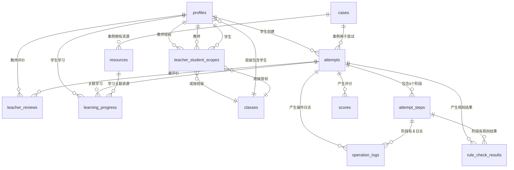
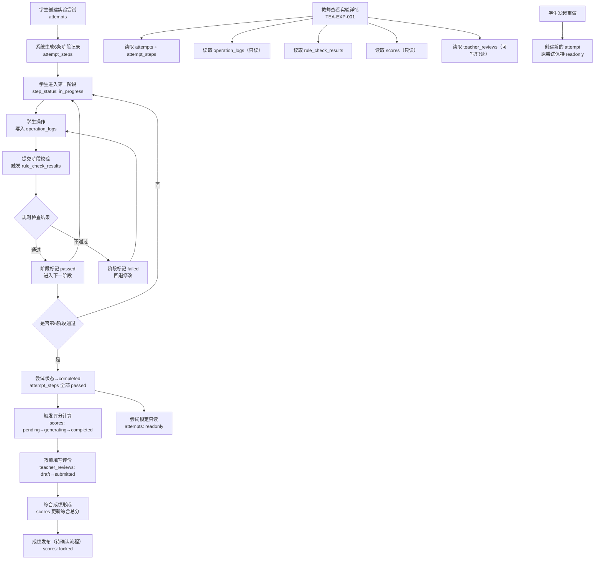

# 数据库实体关系设计

> 编制日期：2026-06-23
> 任务：第2周第11天（总第11天）数据库实体关系设计
> 基线状态：基于第9天六阶段低保真原型、第10天教师端低保真原型
> 专业边界：所有运输判断仅用于教学，不替代真实工程勘测、设计、审查或安全论证。

---

## 1. 文档目标与依据

### 1.1 文档目标

本文档为系统建立数据库实体关系设计，明确用户、角色、案例、实验尝试、六阶段步骤、操作日志、规则检查结果、系统评分、教师评价、知识学习进度、资源文件等核心实体及关系，为后续 Supabase PostgreSQL 表结构、RLS 权限策略、数据恢复、日志追溯、评分计算和教师端查询提供数据基线。

### 1.2 设计范围

本日只设计实体关系，不编写 SQL 迁移、不连接 Supabase、不创建数据库。真正写迁移是第 23 天任务。

### 1.3 文档依据

| 序号 | 依据文档 | 用法 |
|---|---|---|
| 1 | `docs/论文功能映射.md` | 功能编号、数据对象、评分指标 |
| 2 | `docs/用户与场景.md` | 用户角色、权限矩阵、数据对象规格 |
| 3 | `docs/六阶段实验主流程.md` | 生命周期状态、转换规则、日志事件 |
| 4 | `docs/专业规则目录.md` | 规则编号、输入输出结构、日志与评价映射 |
| 5 | `docs/学生端信息架构.md` | 页面追踪、数据对象列表 |
| 6 | `docs/六阶段低保真原型.md` | 学生端页面状态、操作日志要求 |
| 7 | `docs/教师端低保真原型.md` | 教师端页面状态、评价数据要求 |
| 8 | 126天实施计划 | 第11天要求、第22—27天数据库任务 |

### 1.4 需求属性

- **论文明确要求**：论文第2—4章直接描述
- **根据论文合理推导**：为实现数据隔离、流程闭环、可恢复和可验收而补充的最小规则
- **实施计划要求**：126天实施计划明确纳入首版
- **论文未明确**：现有文档均不能确定，须后续确认
- **首版暂不实现**：实施计划明确排除或属研究过程

---

## 2. 数据库设计原则

### 2.1 通用设计原则

1. **数据隔离**：所有学生业务数据必须以"学生 → 实验尝试 → 阶段 → 动作"追溯；学生仅访问本人数据。
2. **只读保护**：已完成尝试的过程数据只读；教师查看原始日志只读；原始日志禁止业务角色修改。
3. **幂等保存**：关键操作使用幂等键（业务对象+版本+事件ID），重复提交不重复记日志、计分或完成。
4. **不可否认**：保存原始输入快照、规则版本、计算过程和结论，支持成绩追溯和过程还原。
5. **失效传播**：上游数据修改后，受影响的 downstream 结果标记 invalidated 而非删除旧日志。
6. **技术异常分离**：技术异常使用独立异常类型字段，不与学生业务错误混同。
7. **版本化配置**：规则、权重、案例参数保存版本号，历史成绩使用原版本权重。
8. **字段约定**：所有表包含 id（UUID 主键）、created_at、updated_at；状态使用 VARCHAR 枚举或整数码，具体迁移时决定。

### 2.2 命名约定

| 项目 | 约定 | 示例 |
|---|---|---|
| 表名 | 全小写、下划线分隔、复数 | attempt_steps |
| 字段名 | 全小写、下划线分隔 | created_at |
| 主键 | id（UUID） | id UUID PRIMARY KEY |
| 外键 | 引用表名_id | attempt_id |
| 状态枚举 | 全小写、下划线 | in_progress |

### 2.3 字段类型建议

| 类型 | 用途 | 示例 |
|---|---|---|
| UUID | 主键、外键 | id UUID PRIMARY KEY DEFAULT gen_random_uuid() |
| VARCHAR | 短字符串、枚举码 | role VARCHAR(20) NOT NULL |
| TEXT | 长文本、JSON快照 | input_snapshot TEXT |
| INTEGER | 计数、顺序 | error_count INTEGER DEFAULT 0 |
| NUMERIC | 精确数值（成绩、权重、测量值） | score NUMERIC(5,2) |
| BOOLEAN | 标志 | is_passed BOOLEAN DEFAULT FALSE |
| TIMESTAMPTZ | 时间戳 | created_at TIMESTAMPTZ DEFAULT NOW() |
| JSONB | 结构化快照、灵活字段 | rule_input JSONB |

---

## 3. 实体范围总览

### 3.1 核心实体列表

| 序号 | 实体名 | 中文名 | 类型 | 首版是否实现 |
|---|---|---|---|---|
| 1 | profiles | 用户扩展信息 | 核心表 | 是 |
| 2 | cases | 实验案例 | 核心表 | 是 |
| 3 | attempts | 实验尝试 | 核心表 | 是 |
| 4 | attempt_steps | 六阶段步骤 | 核心表 | 是 |
| 5 | operation_logs | 操作日志 | 核心表 | 是 |
| 6 | rule_check_results | 规则检查结果 | 核心表 | 是 |
| 7 | scores | 系统评分与综合成绩 | 核心表 | 是 |
| 8 | teacher_reviews | 教师评价 | 核心表 | 是 |
| 9 | learning_progress | 知识学习进度 | 核心表 | 是 |
| 10 | resources | 教学资源元数据 | 核心表 | 是 |
| 11 | teacher_student_scopes | 教师授权学生范围 | 核心表 | 是 |
| 12 | classes / courses | 班级或课程 | 可选表 | 待确认 |

### 3.2 实体分类

| 分类 | 实体 | 说明 |
|---|---|---|
| 用户与权限 | profiles、teacher_student_scopes、classes | 身份、角色、授权范围 |
| 实验核心 | cases、attempts、attempt_steps | 案例、尝试、阶段 |
| 日志与规则 | operation_logs、rule_check_results | 操作记录、规则结果 |
| 评价与成绩 | scores、teacher_reviews | 系统评分、教师评价 |
| 学习与资源 | learning_progress、resources | 知识学习、教学资源 |

---

## 4. 核心实体关系说明

### 4.1 实体关系汇总

```text
profiles (student)  1──N  attempts  1──N  attempt_steps
                                      1──N  operation_logs
                                      1──N  rule_check_results
                                      1──N  learning_progress
                                      1──1  teacher_reviews（或1─N）
                                      1──N  scores

profiles (teacher)  1──N  teacher_reviews（评价人）
                    M──N  students（通过 teacher_student_scopes）

cases              1──N  attempts
                   1──N  resources

attempt_steps      1──N  operation_logs
                   1──N  rule_check_results

resources           N──1  cases（所属案例）
```

### 4.2 核心关系详细说明

| 关系 | 类型 | 说明 |
|---|---|---|
| profiles → attempts | 1:N | 一个学生可以多次实验（多次尝试） |
| cases → attempts | 1:N | 一个案例可以被多个实验尝试使用（首版只有一个案例） |
| attempts → attempt_steps | 1:N | 一次实验尝试包含6条固定阶段记录 |
| attempts → operation_logs | 1:N | 一次实验尝试产生多条操作日志 |
| attempts → rule_check_results | 1:N | 一次实验尝试产生多条规则检查结果 |
| attempts → scores | 1:N | 一次实验尝试可有多版本评分记录 |
| attempts → teacher_reviews | 1:1（或1:N） | 一次实验尝试对应一条教师评价（具体模式待确认） |
| attempts → learning_progress | 1:N | 一次实验尝试中的资料查阅记录 |
| attempt_steps → operation_logs | 1:N | 一个阶段有多条操作日志 |
| attempt_steps → rule_check_results | 1:N | 一个阶段有多条规则检查结果 |
| profiles (teacher) → teacher_reviews | 1:N | 一个教师可评价多个学生 |
| profiles (teacher) → teacher_student_scopes | 1:N | 一个教师有多个授权学生 |
| profiles (student) → teacher_student_scopes | 1:N | 一个学生可被多个教师授权 |
| cases → resources | 1:N | 一个案例关联多个教学资源 |

---

## 5. 用户与权限相关实体

### 5.1 profiles（用户扩展信息）

| 项目 | 内容 |
|---|---|
| 表名 | profiles |
| 中文名称 | 用户扩展信息 |
| 设计目的 | 存储用户非认证扩展信息，关联 Supabase auth.users；区分学生、教师角色 |
| 需求属性 | 论文明确要求 |
| 需求来源 | 论文2.3.5；映射§9、GEN-001—003 |

#### 主要字段

| 字段名 | 含义 | 类型建议 | 必填 | 默认值 |
|---|---|---|---|---|
| id | 主键（关联 auth.users.id） | UUID | 是 | — |
| student_id | 学号（学生角色时必填） | VARCHAR(50) | 否 | NULL |
| display_name | 显示姓名 | VARCHAR(100) | 是 | — |
| role | 用户角色（student/teacher） | VARCHAR(20) | 是 | 'student' |
| avatar_url | 头像地址 | TEXT | 否 | NULL |
| phone | 联系方式 | VARCHAR(30) | 否 | NULL |
| class_id | 班级ID（待确认字段） | UUID | 否 | NULL |
| created_at | 创建时间 | TIMESTAMPTZ | 是 | NOW() |
| updated_at | 更新时间 | TIMESTAMPTZ | 是 | NOW() |

#### 约束与关系

| 项目 | 内容 |
|---|---|
| 主键 | id（引用 auth.users.id） |
| 唯一约束 | student_id（学生角色时唯一） |
| 状态枚举 | role: student / teacher（admin 标注待确认） |
| 关联表 | classes（可选）、attempts（1:N）、teacher_student_scopes（N:M） |

#### 权限

| 操作 | 权限 | 说明 |
|---|---|---|
| 读取 | 本人可读；授权教师可读部分字段 | 教师仅查看姓名、学号、班级 |
| 写入 | 本人可写入非角色字段 | 角色由系统/管理员设置 |
| 更新 | 本人可更新 | 角色更新待确认 |
| 删除 | 禁止 | 账号注销流程论文未明确 |

#### 验收标准

- 学生/教师角色通过字段区分
- 学生无法读取教师 profile 的敏感字段
- 学生 ID 唯一（学号唯一）

### 5.2 teacher_student_scopes（教师授权学生范围）

| 项目 | 内容 |
|---|---|
| 表名 | teacher_student_scopes |
| 中文名称 | 教师授权学生范围 |
| 设计目的 | 记录教师可查看的学生授权范围；教师只能查看授权范围内的学生数据 |
| 需求属性 | 根据论文合理推导（授权方式论文未明确） |
| 需求来源 | 用户与场景§6权限矩阵；论文4.3.4 |

#### 主要字段

| 字段名 | 含义 | 类型建议 | 必填 | 默认值 |
|---|---|---|---|---|
| id | 主键 | UUID | 是 | — |
| teacher_id | 教师ID（引用 profiles.id） | UUID | 是 | — |
| student_id | 学生ID（引用 profiles.id） | UUID | 否 | NULL（班级授权时为空） |
| class_id | 班级ID（引用 classes.id） | UUID | 否 | NULL（学生授权时为空） |
| scope_type | 授权类型（individual/class） | VARCHAR(20) | 是 | 'individual' |
| created_at | 创建时间 | TIMESTAMPTZ | 是 | NOW() |

#### 约束与关系

| 项目 | 内容 |
|---|---|
| 主键 | id |
| 外键 | teacher_id → profiles.id；student_id → profiles.id；class_id → classes.id |
| 唯一约束 | (teacher_id, student_id) 唯一 |
| 关联表 | profiles（teacher、student）、classes |

#### 权限

| 操作 | 权限 |
|---|---|
| 读取 | 本人（教师）可读；管理员待定 |
| 写入 | 授权配置方式论文未明确，首版标注待确认 |
| 更新 | 同写入 |
| 删除 | 同写入 |

#### 验收标准

- 教师只能读取 scopes 表中关联学生的数据
- 授权方式配置化（班级/个人）
- 无授权学生时教师页面显示空状态不报错

### 5.3 classes / courses（班级或课程）

| 项目 | 内容 |
|---|---|
| 表名 | classes 或 courses |
| 中文名称 | 班级或课程 |
| 设计目的 | 记录学生所属班级或课程归属；可选实体，论文未明确 |
| 需求属性 | 论文未明确 |
| 需求来源 | 用户与场景Q-02 |

#### 主要字段

| 字段名 | 含义 | 类型建议 | 必填 | 默认值 |
|---|---|---|---|---|
| id | 主键 | UUID | 是 | — |
| name | 班级/课程名称 | VARCHAR(100) | 是 | — |
| code | 班级/课程编码 | VARCHAR(50) | 否 | NULL |
| description | 描述 | TEXT | 否 | NULL |
| created_at | 创建时间 | TIMESTAMPTZ | 是 | NOW() |

#### 约束与关系

| 项目 | 内容 |
|---|---|
| 主键 | id |
| 关联表 | profiles（class_id）、teacher_student_scopes（class_id） |

#### 权限

| 操作 | 权限 |
|---|---|
| 读取 | 教师可读；学生不可读 |
| 写入 | 首版暂不实现管理页面，数据待管理员/导入方式配置 |
| 更新/删除 | 同写入 |

#### 验收标准

- 首版至少有一个默认班级/课程占位
- 无班级/课程时系统不报错

---

## 6. 实验案例实体

### 6.1 cases（实验案例）

| 项目 | 内容 |
|---|---|
| 表名 | cases |
| 中文名称 | 实验案例 |
| 设计目的 | 存储实验案例配置，包括任务背景、货物参数、路线参数等；首版只做一个浙江石化气化炉运输案例 |
| 需求属性 | 论文明确要求 |
| 需求来源 | 论文2.2、3.4.2；映射SIM-001 |

#### 主要字段

| 字段名 | 含义 | 类型建议 | 必填 | 默认值 |
|---|---|---|---|---|
| id | 主键 | UUID | 是 | — |
| name | 案例名称 | VARCHAR(200) | 是 | — |
| description | 案例描述 | TEXT | 是 | — |
| origin | 运输起点 | VARCHAR(200) | 是 | — |
| destination | 运输终点 | VARCHAR(200) | 是 | — |
| transport_requirements | 运输要求（JSON结构：时间要求、特殊要求等） | JSONB | 否 | NULL |
| cargo_name | 货物名称 | VARCHAR(100) | 是 | — |
| cargo_weight_kg | 货物重量（kg） | NUMERIC(10,2) | 是 | — |
| cargo_length_m | 货物长度（m） | NUMERIC(8,2) | 是 | — |
| cargo_width_m | 货物宽度（m） | NUMERIC(8,2) | 是 | — |
| cargo_height_m | 货物高度（m） | NUMERIC(8,2) | 是 | — |
| cargo_center_of_gravity | 货物重心坐标（JSON：{x,y,z}） | JSONB | 是 | — |
| cargo_model_url | 货物3D模型资源URL | TEXT | 否 | NULL |
| route_config | 三条路线配置（JSON） | JSONB | 是 | — |
| rule_version | 规则版本号 | VARCHAR(20) | 是 | 'v1.0' |
| weight_version | 评分权重版本号 | VARCHAR(20) | 是 | 'v1.0' |
| is_active | 是否启用 | BOOLEAN | 是 | TRUE |
| created_at | 创建时间 | TIMESTAMPTZ | 是 | NOW() |
| updated_at | 更新时间 | TIMESTAMPTZ | 是 | NOW() |

#### route_config 结构建议

```json
{
  "routes": [
    {
      "id": "route_a",
      "name": "路线A",
      "description": "高速公路路线",
      "obstacles": {
        "height": { "clearance_m": 5.5 },
        "arc_curve": { "radius_m": 30 },
        "orthogonal_curve": { "angle_deg": 90, "entry_width_m": 8, "exit_width_m": 7, "corner_radius_m": 3 },
        "slope": { "horizontal_distance_m": 100, "vertical_distance_m": 5 },
        "bridge": { "capacity_tons": 200 }
      }
    }
  ]
}
```

#### 约束与关系

| 项目 | 内容 |
|---|---|
| 主键 | id |
| 关联表 | attempts（1:N）、resources（1:N） |

#### 权限

| 操作 | 权限 |
|---|---|
| 读取 | 所有已登录用户可读 |
| 写入 | 仅管理员/系统（首版固定案例） |
| 更新 | 仅管理员（首版不提供案例编辑页面） |
| 删除 | 禁止（影响历史尝试） |

#### 验收标准

- 首版唯一案例（浙江石化气化炉）可加载
- 案例数据与页面展示一致
- 案例参数修改后不影响进行中的尝试（版本隔离）

---

## 7. 实验尝试实体

### 7.1 attempts（实验尝试）

| 项目 | 内容 |
|---|---|
| 表名 | attempts |
| 中文名称 | 实验尝试 |
| 设计目的 | 记录学生一次独立实验尝试，支持创建、继续、完成、只读和重做 |
| 需求属性 | 论文明确要求 |
| 需求来源 | 论文2.3.5、4.2.2；六阶段实验主流程§3 |

#### 主要字段

| 字段名 | 含义 | 类型建议 | 必填 | 默认值 |
|---|---|---|---|---|
| id | 主键 | UUID | 是 | — |
| student_id | 学生ID（引用 profiles.id） | UUID | 是 | — |
| case_id | 案例ID（引用 cases.id） | UUID | 是 | — |
| current_step | 当前阶段序号（1-6） | INTEGER | 是 | 1 |
| status | 尝试状态 | VARCHAR(30) | 是 | 'not_started' |
| start_time | 开始时间 | TIMESTAMPTZ | 否 | NULL |
| completed_time | 完成时间 | TIMESTAMPTZ | 否 | NULL |
| total_duration_seconds | 总用时（秒） | INTEGER | 否 | NULL |
| error_count | 总错误次数 | INTEGER | 是 | 0 |
| hint_count | 总提示次数 | INTEGER | 是 | 0 |
| retry_count | 总重试次数 | INTEGER | 是 | 0 |
| attempt_number | 该学生的第几次尝试 | INTEGER | 是 | 1 |
| is_locked | 是否锁定（只读） | BOOLEAN | 是 | FALSE |
| client_id | 幂等键（防止重复创建） | VARCHAR(100) | 否 | NULL |
| created_at | 创建时间 | TIMESTAMPTZ | 是 | NOW() |
| updated_at | 更新时间 | TIMESTAMPTZ | 是 | NOW() |

#### 状态枚举

| 枚举值 | 含义 | 说明 |
|---|---|---|
| not_started | 未开始 | 刚创建，尚未进入第一阶段 |
| in_progress | 进行中 | 学生正在某一阶段操作 |
| paused | 等待恢复 | 网络中断、会话失效、暂停等 |
| completed | 已完成 | 六阶段全部通过，实验结束 |
| failed | 失败 | 实验最终失败（未完成） |
| abandoned | 已放弃 | 学生主动放弃（保留历史数据） |
| readonly | 只读锁定 | 已完成并锁定，不可修改 |

#### 约束与关系

| 项目 | 内容 |
|---|---|
| 主键 | id |
| 外键 | student_id → profiles.id；case_id → cases.id |
| 唯一约束 | (student_id, client_id) 防止重复创建 |
| 关联表 | profiles（N:1）、cases（N:1）、attempt_steps（1:N）、operation_logs（1:N）、rule_check_results（1:N）、scores（1:N）、teacher_reviews（1:N）、learning_progress（1:N） |

#### 权限

| 操作 | 权限 |
|---|---|
| 读取 | 本人（学生）可读；授权教师可读 |
| 写入 | 本人创建；本人操作进行中尝试 |
| 更新 | 本人（进行中）；系统（状态转换） |
| 删除 | 禁止 |

#### 验收标准

- 学生只能创建本人尝试
- 学生不能读取其他学生尝试
- 已完成尝试只读，修改请求被拒绝
- 重做创建新尝试（新ID保留旧记录）

---

## 8. 六阶段步骤实体

### 8.1 attempt_steps（六阶段步骤）

| 项目 | 内容 |
|---|---|
| 表名 | attempt_steps |
| 中文名称 | 六阶段步骤 |
| 设计目的 | 记录一次尝试中每个阶段的独立状态；六阶段名称和顺序固定 |
| 需求属性 | 论文明确要求；实施计划要求 |
| 需求来源 | 论文2.3.5、3.4.2；六阶段实验主流程§5—11 |

#### 主要字段

| 字段名 | 含义 | 类型建议 | 必填 | 默认值 |
|---|---|---|---|---|
| id | 主键 | UUID | 是 | — |
| attempt_id | 尝试ID（引用 attempts.id） | UUID | 是 | — |
| step_number | 阶段序号（1-6） | INTEGER | 是 | — |
| step_name | 阶段名称 | VARCHAR(100) | 是 | — |
| status | 步骤状态 | VARCHAR(30) | 是 | 'locked' |
| enter_time | 进入阶段时间 | TIMESTAMPTZ | 否 | NULL |
| completed_time | 阶段完成时间 | TIMESTAMPTZ | 否 | NULL |
| duration_seconds | 本阶段用时（秒） | INTEGER | 否 | NULL |
| error_count | 本阶段错误次数 | INTEGER | 是 | 0 |
| hint_count | 本阶段提示次数 | INTEGER | 是 | 0 |
| retry_count | 本阶段重试次数 | INTEGER | 是 | 0 |
| is_passed | 是否通过 | BOOLEAN | 是 | FALSE |
| is_invalidated | 是否已失效（上游修改导致） | BOOLEAN | 是 | FALSE |
| invalidated_reason | 失效原因 | TEXT | 否 | NULL |
| step_data_snapshot | 阶段提交数据快照（JSON） | JSONB | 否 | NULL |
| created_at | 创建时间 | TIMESTAMPTZ | 是 | NOW() |
| updated_at | 更新时间 | TIMESTAMPTZ | 是 | NOW() |

#### 状态枚举

| 枚举值 | 含义 | 说明 |
|---|---|---|
| locked | 未解锁 | 前序未通过，不可进入 |
| available | 可进入 | 前序已通过，等待学生进入 |
| in_progress | 进行中 | 学生正在该阶段操作 |
| passed | 已通过 | 阶段规则全部通过且保存 |
| failed | 未通过 | 阶段规则不通过 |
| invalidated | 已失效 | 上游修改使本阶段结论不可用 |
| readonly | 只读 | 已完成尝试锁定 |

#### 六阶段名称固定值

| step_number | step_name |
|---|---|
| 1 | 运输任务及货物介绍 |
| 2 | 简单配车 |
| 3 | 路线勘测 |
| 4 | 车组确定 |
| 5 | 货物装车与绑扎加固 |
| 6 | 货物运输 |

#### 约束与关系

| 项目 | 内容 |
|---|---|
| 主键 | id |
| 外键 | attempt_id → attempts.id |
| 唯一约束 | (attempt_id, step_number) 唯一 |
| 关联表 | attempts（N:1）、operation_logs（1:N）、rule_check_results（1:N） |

#### 权限

| 操作 | 权限 |
|---|---|
| 读取 | 本人/授权教师可读 |
| 写入 | 系统自动创建（每尝试创建6条） |
| 更新 | 系统（状态转换）、学生（进行中操作） |
| 删除 | 禁止 |

#### 验收标准

- 每个尝试创建时生成6条固定阶段的 attempt_steps
- 阶段名称与顺序不可修改
- 前序未通过时后续阶段 locked
- 上游修改后下游阶段标记 invalidated
- 已完成尝试步骤只读

---

## 9. 操作日志实体

### 9.1 operation_logs（操作日志）

| 项目 | 内容 |
|---|---|
| 表名 | operation_logs |
| 中文名称 | 操作日志 |
| 设计目的 | 记录学生的关键操作、错误、提示、回退、重试、保存和提交等事件；支持过程还原和评分证据 |
| 需求属性 | 论文明确要求 |
| 需求来源 | 论文2.2、3.4.1；映射§9、LOG-001—002 |

#### 主要字段

| 字段名 | 含义 | 类型建议 | 必填 | 默认值 |
|---|---|---|---|---|
| id | 主键 | UUID | 是 | — |
| attempt_id | 尝试ID（引用 attempts.id） | UUID | 是 | — |
| attempt_step_id | 步骤ID（引用 attempt_steps.id） | UUID | 否 | NULL |
| student_id | 学生ID（引用 profiles.id） | UUID | 是 | — |
| step_number | 阶段序号（1-6） | INTEGER | 是 | — |
| event_type | 事件类型 | VARCHAR(30) | 是 | — |
| action_name | 操作名称 | VARCHAR(100) | 是 | — |
| input_snapshot | 输入快照（JSON） | JSONB | 否 | NULL |
| output_snapshot | 输出/结果快照（JSON） | JSONB | 否 | NULL |
| is_success | 是否成功 | BOOLEAN | 否 | NULL |
| error_type | 错误类型 | VARCHAR(50) | 否 | NULL |
| error_message | 错误信息 | TEXT | 否 | NULL |
| hint_type | 提示类型（主动/自动/升级） | VARCHAR(20) | 否 | NULL |
| rule_id | 关联规则编号 | VARCHAR(20) | 否 | NULL |
| rule_check_result_id | 规则检查结果ID | UUID | 否 | NULL |
| client_timestamp | 客户端时间戳 | TIMESTAMPTZ | 否 | NULL |
| server_timestamp | 服务端时间戳 | TIMESTAMPTZ | 是 | NOW() |
| client_id | 幂等键（客户端生成，防重复） | VARCHAR(100) | 否 | NULL |
| client_status | 客户端状态（online/offline/pending_retry） | VARCHAR(20) | 否 | 'online' |
| network_status | 网络状态 | VARCHAR(20) | 否 | 'connected' |
| save_status | 保存状态（saved/pending/failed） | VARCHAR(20) | 是 | 'saved' |
| is_retry | 是否为重试提交 | BOOLEAN | 是 | FALSE |
| retry_sequence | 重试序号 | INTEGER | 是 | 0 |
| metadata | 扩展元数据 | JSONB | 否 | NULL |
| created_at | 创建时间 | TIMESTAMPTZ | 是 | NOW() |

#### 事件类型枚举

| 枚举值 | 含义 | 说明 |
|---|---|---|
| action | 操作 | 正常业务操作（查看、选择、输入等） |
| hint | 提示 | 主动帮助或自动提示 |
| error | 错误 | 学生业务错误（规则不通过） |
| retry | 重试 | 重试操作 |
| rollback | 回退 | 回退到指定步骤 |
| save | 保存 | 保存操作 |
| submit | 提交 | 提交阶段校验 |
| rule_check | 规则检查 | 系统执行规则检查 |
| system_exception | 系统异常 | 技术异常（不计学生业务错误） |
| network_event | 网络事件 | 网络中断/恢复 |

#### 错误类型区分

| 错误类型 | 含义 | 说明 |
|---|---|---|
| business_error | 学生业务错误 | 计入错误计数 |
| rule_not_pass | 专业规则不通过 | 计入规则失败计数 |
| technical_exception | 技术异常 | 不计学生业务错误 |
| network_error | 网络异常 | 不计学生业务错误 |
| resource_load_failed | 资源加载失败 | 不计学生业务错误 |

#### 约束与关系

| 项目 | 内容 |
|---|---|
| 主键 | id |
| 外键 | attempt_id → attempts.id；attempt_step_id → attempt_steps.id；student_id → profiles.id |
| 唯一约束 | (client_id) 防止重复提交（有值时） |
| 索引 | (attempt_id, created_at) 时间线查询；(student_id, attempt_id) 学生追溯 |
| 关联表 | attempts（N:1）、attempt_steps（N:1）、rule_check_results（N:1） |

#### 权限

| 操作 | 权限 |
|---|---|
| 读取 | 本人（学生）只读；授权教师只读 |
| 写入 | 系统自动写入（学生操作触发） |
| 更新 | 严禁（原始日志不可修改） |
| 删除 | 严禁 |

#### 验收标准

- 每个关键业务操作至少生成一条完整日志
- 技术异常使用独立类型，不计入学生错误计数
- 学生不能删除或修改本人日志
- 教师只能只读查看
- 重复提交使用幂等键不重复记录
- 刷新后日志不丢失

---

## 10. 规则检查结果实体

### 10.1 rule_check_results（规则检查结果）

| 项目 | 内容 |
|---|---|
| 表名 | rule_check_results |
| 中文名称 | 规则检查结果 |
| 设计目的 | 记录每次专业规则检查的输入快照、计算过程、输出结果和状态；支撑页面反馈、日志追溯和评分证据 |
| 需求属性 | 论文明确要求 |
| 需求来源 | 论文3.4.2；专业规则目录；映射§5 |

#### 主要字段

| 字段名 | 含义 | 类型建议 | 必填 | 默认值 |
|---|---|---|---|---|
| id | 主键 | UUID | 是 | — |
| attempt_id | 尝试ID（引用 attempts.id） | UUID | 是 | — |
| attempt_step_id | 步骤ID（引用 attempt_steps.id） | UUID | 否 | NULL |
| step_number | 阶段序号（1-6） | INTEGER | 是 | — |
| rule_id | 规则编号（如 VEH-003、HGT-002） | VARCHAR(20) | 是 | — |
| rule_version | 规则版本号 | VARCHAR(20) | 是 | 'v1.0' |
| status | 检查状态 | VARCHAR(20) | 是 | — |
| input_data | 规则输入快照（JSON，包含所有输入值和单位） | JSONB | 是 | — |
| output_data | 规则输出快照（JSON，包含计算中间值和结果） | JSONB | 是 | — |
| result_value | 结果值（数值型，如最大坡度、轴载值） | NUMERIC | 否 | NULL |
| result_unit | 结果单位 | VARCHAR(30) | 否 | NULL |
| threshold_value | 阈值/上限值 | NUMERIC | 否 | NULL |
| threshold_unit | 阈值单位 | VARCHAR(30) | 否 | NULL |
| is_passed | 是否通过 | BOOLEAN | 是 | FALSE |
| conclusion | 结论描述（人类可读） | TEXT | 否 | NULL |
| error_message | 失败原因 | TEXT | 否 | NULL |
| recovery_target | 唯一恢复目标（规则指定） | TEXT | 否 | NULL |
| is_invalidated | 是否已失效（上游修改导致） | BOOLEAN | 是 | FALSE |
| invalidated_by_rule | 使失效的规则/变更 | VARCHAR(50) | 否 | NULL |
| client_id | 幂等键 | VARCHAR(100) | 否 | NULL |
| created_at | 创建时间 | TIMESTAMPTZ | 是 | NOW() |

#### 状态枚举

| 枚举值 | 含义 | 说明 |
|---|---|---|
| passed | 通过 | 规则校验通过 |
| failed | 不通过 | 规则校验失败 |
| warning | 警告 | 规则通过但有注意事项 |
| missing_input | 输入缺失 | 必要输入数据不完整 |
| not_applicable | 不适用 | 当前条件下规则不适用 |
| config_incomplete | 配置不完整 | 规则配置缺失，ERR-002 |

#### 约束与关系

| 项目 | 内容 |
|---|---|
| 主键 | id |
| 外键 | attempt_id → attempts.id；attempt_step_id → attempt_steps.id |
| 索引 | (attempt_id, rule_id) 规则维度查询；(attempt_step_id) 阶段维度查询 |
| 关联表 | attempts（N:1）、attempt_steps（N:1）、operation_logs（1:N） |

#### 权限

| 操作 | 权限 |
|---|---|
| 读取 | 本人/授权教师可读 |
| 写入 | 系统规则引擎写入 |
| 更新 | 系统（失效标记） |
| 删除 | 严禁 |

#### 验收标准

- 每条规则检查保存完整的输入/输出快照
- 规则版本号记录
- 历史失败日志保留，不因重试覆盖
- 上游修改后下游结果标记 invalidated

---

## 11. 系统评分实体

### 11.1 scores（系统评分与综合成绩）

| 项目 | 内容 |
|---|---|
| 表名 | scores |
| 中文名称 | 系统评分与综合成绩 |
| 设计目的 | 保存14项系统评价原始值、分档、分值、权重和综合成绩计算结果；支持版本追溯 |
| 需求属性 | 论文明确要求 |
| 需求来源 | 论文4.3.2—4.3.4；映射EVA-001—009 |

#### 主要字段

| 字段名 | 含义 | 类型建议 | 必填 | 默认值 |
|---|---|---|---|---|
| id | 主键 | UUID | 是 | — |
| attempt_id | 尝试ID（引用 attempts.id） | UUID | 是 | — |
| version | 评分版本号 | VARCHAR(20) | 是 | 'v1.0' |
| status | 评分状态 | VARCHAR(20) | 是 | 'pending' |
| total_score | 综合总分（百分制） | NUMERIC(5,2) | 否 | NULL |
| dimension_a_score | 知识发展A得分 | NUMERIC(5,2) | 否 | NULL |
| dimension_b_score | 实验技能B得分 | NUMERIC(5,2) | 否 | NULL |
| dimension_c_score | 交流互动C得分 | NUMERIC(5,2) | 否 | NULL |
| dimension_d_score | 情感态度D得分 | NUMERIC(5,2) | 否 | NULL |
| rule_items | 14项系统评价明细（JSON：{item_id: {raw, tier, score, weight}}） | JSONB | 否 | NULL |
| teacher_items | 12项教师评价明细（JSON：{item_id: {score, comment}}） | JSONB | 否 | NULL |
| weight_version | 权重版本号 | VARCHAR(20) | 是 | 'v1.0' |
| error_message | 失败原因 | TEXT | 否 | NULL |
| calculated_at | 计算时间 | TIMESTAMPTZ | 否 | NULL |
| is_locked | 是否锁定（成绩发布后） | BOOLEAN | 是 | FALSE |
| created_at | 创建时间 | TIMESTAMPTZ | 是 | NOW() |
| updated_at | 更新时间 | TIMESTAMPTZ | 是 | NOW() |

#### 状态枚举

| 枚举值 | 含义 | 说明 |
|---|---|---|
| pending | 待生成 | 日志数据齐全，等待评分计算 |
| generating | 生成中 | 评分计算进行中 |
| completed | 已生成 | 评分计算完成 |
| failed | 生成失败 | 数据缺失或区间冲突 |
| reviewed | 已审核 | 教师已审阅（待确认） |
| locked | 已锁定 | 成绩发布后锁定 |

#### rule_items JSON 结构建议

```json
{
  "B1": { "raw_value": 2, "tier": "0-1", "score": 4, "weight": 0.0425 },
  "B2": { "raw_value": 5, "tier": "4-5", "score": 3, "weight": 0.2516 },
  "B6": { "raw_value": 25, "tier": "20-25", "score": 3, "weight": 0.3805 }
}
```

#### 约束与关系

| 项目 | 内容 |
|---|---|
| 主键 | id |
| 外键 | attempt_id → attempts.id |
| 唯一约束 | (attempt_id, version) 同一版本唯一 |
| 关联表 | attempts（N:1）、teacher_reviews（引用） |

#### 权限

| 操作 | 权限 |
|---|---|
| 读取 | 授权教师可读；学生默认不可见（待发布规则确认） |
| 写入 | 系统评分引擎写入 |
| 更新 | 系统（教师评分修改后重算） |
| 删除 | 严禁 |

#### 验收标准

- 每次评分生成带版本号的完整记录
- 14项系统评价明细可追溯
- 综合成绩可按公式复算
- 教师评分修改后触发新版本重算
- 学生默认不可见最终成绩

---

## 12. 教师评价实体

### 12.1 teacher_reviews（教师评价）

| 项目 | 内容 |
|---|---|
| 表名 | teacher_reviews |
| 中文名称 | 教师评价 |
| 设计目的 | 保存教师对学生的12项主观评价和评语；教师评价不修改学生原始日志 |
| 需求属性 | 论文明确要求 |
| 需求来源 | 论文4.3.3—4.3.4；映射EVA-004 |

#### 主要字段

| 字段名 | 含义 | 类型建议 | 必填 | 默认值 |
|---|---|---|---|---|
| id | 主键 | UUID | 是 | — |
| attempt_id | 尝试ID（引用 attempts.id） | UUID | 是 | — |
| teacher_id | 教师ID（引用 profiles.id） | UUID | 是 | — |
| status | 评价状态 | VARCHAR(20) | 是 | 'draft' |
| items | 12项评价明细（JSON） | JSONB | 是 | — |
| overall_comment | 总评语 | TEXT | 否 | NULL |
| submitted_at | 提交时间 | TIMESTAMPTZ | 否 | NULL |
| score_version | 关联评分版本号 | VARCHAR(20) | 否 | NULL |
| is_retractable | 是否可撤回（待确认） | BOOLEAN | 是 | FALSE |
| created_at | 创建时间 | TIMESTAMPTZ | 是 | NOW() |
| updated_at | 更新时间 | TIMESTAMPTZ | 是 | NOW() |

#### items JSON 结构建议

```json
{
  "A1": { "score": 5, "comment": "安全知识掌握扎实" },
  "A2": { "score": 4, "comment": "实验目的明确" },
  "A3": { "score": 4, "comment": "" },
  "A4": { "score": 4, "comment": "" },
  "A5": { "score": 3, "comment": "总结可以更详细" },
  "A6": { "score": 3, "comment": "" },
  "A7": { "score": null, "comment": "缺预习报告" },
  "A8": { "score": null, "comment": "缺实验报告" },
  "B4": { "score": 4, "comment": "" },
  "D4": { "score": null, "comment": "缺预习报告" },
  "D6": { "score": null, "comment": "缺实验报告" },
  "D7": { "score": 4, "comment": "" }
}
```

#### 12项教师评价指标

| 编号 | 名称 | 来源 |
|---|---|---|
| A1 | 掌握实验安全知识 | 论文表4.2 |
| A2 | 明确实验目的 | 论文表4.2 |
| A3 | 掌握实验知识理论 | 论文表4.2 |
| A4 | 熟练实验流程 | 论文表4.2 |
| A5 | 实验结果总结 | 论文表4.2 |
| A6 | 实验反思及心得体会 | 论文表4.2 |
| A7 | 预习报告成绩 | 论文表4.2 |
| A8 | 实验报告成绩 | 论文表4.2 |
| B4 | 正确观察实验现象 | 论文表4.2 |
| D4 | 预习报告完成时效度 | 论文表4.2 |
| D6 | 实验报告完成时效度 | 论文表4.2 |
| D7 | 虚拟仿真实验喜好程度 | 论文表4.2 |

#### 状态枚举

| 枚举值 | 含义 | 说明 |
|---|---|---|
| draft | 草稿 | 教师已保存但未正式提交 |
| submitted | 已提交 | 教师正式提交评价 |
| returned | 已退回（待确认） | 是否需要退回修改，论文未明确 |
| locked | 已锁定（待确认） | 提交后是否锁定，论文未明确 |

#### 约束与关系

| 项目 | 内容 |
|---|---|
| 主键 | id |
| 外键 | attempt_id → attempts.id；teacher_id → profiles.id |
| 唯一约束 | (attempt_id, teacher_id) 同一教师对同一尝试只能有一条评价 |
| 关联表 | attempts（N:1）、profiles（teacher）（N:1）、scores（1:1引用） |

#### 权限

| 操作 | 权限 |
|---|---|
| 读取 | 本人（教师）可读写；授权查看的教师可读；学生不可读（待确认） |
| 写入 | 本人（教师）创建 |
| 更新 | 本人（教师）（是否可二次修改标注待确认） |
| 删除 | 禁止（保留审计痕迹） |

#### 验收标准

- 12项评价指标齐全
- 越界分值被拒绝
- 保存后记录评分人和时间
- 不可修改学生原始操作日志
- 修改后触发综合成绩重算

---

## 13. 知识学习进度实体

### 13.1 learning_progress（知识学习进度）

| 项目 | 内容 |
|---|---|
| 表名 | learning_progress |
| 中文名称 | 知识学习进度 |
| 设计目的 | 保存学生在资料库中的学习进度，包括已读章节、阅读时长、笔记等；支持实验中不丢状态返回 |
| 需求属性 | 论文明确要求 |
| 需求来源 | 论文2.2、3.4.1；映射GEN-004—006 |

#### 主要字段

| 字段名 | 含义 | 类型建议 | 必填 | 默认值 |
|---|---|---|---|---|
| id | 主键 | UUID | 是 | — |
| student_id | 学生ID（引用 profiles.id） | UUID | 是 | — |
| resource_id | 资源ID（引用 resources.id） | UUID | 否 | NULL |
| chapter_id | 章节标识 | VARCHAR(50) | 是 | — |
| chapter_title | 章节标题 | VARCHAR(200) | 否 | NULL |
| status | 学习状态 | VARCHAR(20) | 是 | 'unread' |
| progress_percent | 进度百分比 | INTEGER | 是 | 0 |
| total_duration_seconds | 累计学习时长（秒） | INTEGER | 是 | 0 |
| last_position | 最后阅读位置（章节内滚动位置等） | TEXT | 否 | NULL |
| note_count | 笔记次数 | INTEGER | 是 | 0 |
| notes | 笔记内容（JSON数组） | JSONB | 否 | NULL |
| is_from_experiment | 是否从实验中进入 | BOOLEAN | 是 | FALSE |
| experiment_context | 实验上下文（JSON，记录返回实验的状态） | JSONB | 否 | NULL |
| created_at | 创建时间 | TIMESTAMPTZ | 是 | NOW() |
| updated_at | 更新时间 | TIMESTAMPTZ | 是 | NOW() |

#### 状态枚举

| 枚举值 | 含义 | 说明 |
|---|---|---|
| unread | 未读 | 尚未打开 |
| reading | 阅读中 | 正在阅读 |
| completed | 已完成 | 已阅读完成 |

#### 约束与关系

| 项目 | 内容 |
|---|---|
| 主键 | id |
| 外键 | student_id → profiles.id；resource_id → resources.id |
| 唯一约束 | (student_id, chapter_id) 每章节每人一条进度 |
| 关联表 | profiles（N:1）、resources（N:1） |

#### 权限

| 操作 | 权限 |
|---|---|
| 读取 | 本人（学生）可读；授权教师可读统计信息 |
| 写入 | 本人 |
| 更新 | 本人 |
| 删除 | 禁止 |

#### 验收标准

- 学生每次学习记录保存
- 从实验中打开资料库，关闭后返回原步骤
- 刷新后已读章节进度不丢失

---

## 14. 教学资源实体

### 14.1 resources（教学资源元数据）

| 项目 | 内容 |
|---|---|
| 表名 | resources |
| 中文名称 | 教学资源元数据 |
| 设计目的 | 存储教学资料、三维模型、图片、文档等资源的元数据（非文件内容）；支撑知识学习和实验场景加载 |
| 需求属性 | 论文明确要求 |
| 需求来源 | 论文2.2、2.3.3、3.2；映射MOD-001—008、GEN-005 |

#### 主要字段

| 字段名 | 含义 | 类型建议 | 必填 | 默认值 |
|---|---|---|---|---|
| id | 主键 | UUID | 是 | — |
| case_id | 所属案例ID（引用 cases.id） | UUID | 否 | NULL |
| resource_type | 资源类型 | VARCHAR(30) | 是 | — |
| name | 资源名称 | VARCHAR(200) | 是 | — |
| description | 资源描述 | TEXT | 否 | NULL |
| file_path | 文件路径或URL | TEXT | 是 | — |
| file_size_bytes | 文件大小（字节） | INTEGER | 否 | NULL |
| file_format | 文件格式（glb/png/pdf/mp4等） | VARCHAR(20) | 否 | NULL |
| thumbnail_url | 缩略图URL | TEXT | 否 | NULL |
| status | 资源状态 | VARCHAR(20) | 是 | 'available' |
| version | 资源版本 | VARCHAR(20) | 是 | 'v1.0' |
| tags | 标签（JSON数组） | JSONB | 否 | NULL |
| metadata | 扩展元数据 | JSONB | 否 | NULL |
| created_at | 创建时间 | TIMESTAMPTZ | 是 | NOW() |
| updated_at | 更新时间 | TIMESTAMPTZ | 是 | NOW() |

#### 资源类型枚举

| 枚举值 | 含义 |
|---|---|
| model_3d | 三维模型（GLB） |
| document | 文本文档（PDF/Markdown） |
| image | 图片 |
| video | 视频 |
| texture | 贴图/材质 |
| audio | 音频 |

#### 状态枚举

| 枚举值 | 含义 | 说明 |
|---|---|---|
| available | 可用 | 资源正常 |
| missing | 缺失 | 资源文件丢失 |
| loading_failed | 加载失败 | 加载时出错 |
| deprecated | 已废弃 | 旧版本已废弃 |

#### 约束与关系

| 项目 | 内容 |
|---|---|
| 主键 | id |
| 外键 | case_id → cases.id |
| 关联表 | cases（N:1）、learning_progress（N:1 可选） |

#### 权限

| 操作 | 权限 |
|---|---|
| 读取 | 所有已登录用户可读元数据；实际文件权限按类型设计 |
| 写入 | 仅管理员 |
| 更新 | 仅管理员 |
| 删除 | 禁止（影响历史引用） |

#### 验收标准

- 首版案例关联的核心资源元数据可查询
- 加载失败有状态记录
- 不存储实际文件内容（只存路径）

---

## 15. 班级、课程与授权范围实体

（classes/courses 已在 §5.3 中设计，其关联关系已在 teacher_student_scopes 中体现。）

### 15.1 实体关系汇总

```text
classes (1) ──N── profiles (students)
classes (1) ──N── teacher_student_scopes（班级授权）
profiles (teacher) (1) ──N── teacher_student_scopes
profiles (student) (1) ──N── teacher_student_scopes
```

### 15.2 授权方式说明

授权方式有两种模式（论文未明确，标注待确认）：

1. **个人授权**：teacher_student_scopes.scope_type='individual'，直接关联 student_id
2. **班级授权**：teacher_student_scopes.scope_type='class'，关联 class_id，该班级所有学生自动授权

首版实现至少支持个人授权模式。

---

## 16. 状态枚举设计

### 16.1 状态枚举总表

| 枚举所属 | 枚举值 | 含义 | 是否首版实现 |
|---|---|---|---|
| **role** | student | 学生 | 是 |
| | teacher | 教师 | 是 |
| | admin | 管理员 | 待确认 |
| **attempt status** | not_started | 未开始 | 是 |
| | in_progress | 进行中 | 是 |
| | paused | 等待恢复 | 是 |
| | completed | 已完成 | 是 |
| | failed | 失败 | 是 |
| | abandoned | 已放弃 | 是 |
| | readonly | 只读锁定 | 是 |
| **step status** | locked | 未解锁 | 是 |
| | available | 可进入 | 是 |
| | in_progress | 进行中 | 是 |
| | passed | 已通过 | 是 |
| | failed | 未通过 | 是 |
| | invalidated | 已失效 | 是 |
| | readonly | 只读 | 是 |
| **event_type** | action | 操作 | 是 |
| | hint | 提示 | 是 |
| | error | 错误 | 是 |
| | retry | 重试 | 是 |
| | rollback | 回退 | 是 |
| | save | 保存 | 是 |
| | submit | 提交 | 是 |
| | rule_check | 规则检查 | 是 |
| | system_exception | 系统异常 | 是 |
| | network_event | 网络事件 | 是 |
| **error_type** | business_error | 学生业务错误 | 是 |
| | rule_not_pass | 规则不通过 | 是 |
| | technical_exception | 技术异常 | 是 |
| | network_error | 网络异常 | 是 |
| | resource_load_failed | 资源加载失败 | 是 |
| **rule_check status** | passed | 通过 | 是 |
| | failed | 不通过 | 是 |
| | warning | 警告 | 是 |
| | missing_input | 输入缺失 | 是 |
| | not_applicable | 不适用 | 是 |
| | config_incomplete | 配置不完整 | 是 |
| **score status** | pending | 待生成 | 是 |
| | generating | 生成中 | 是 |
| | completed | 已生成 | 是 |
| | failed | 生成失败 | 是 |
| | reviewed | 已审核 | 待确认 |
| | locked | 已锁定 | 待确认 |
| **review status** | draft | 草稿 | 是 |
| | submitted | 已提交 | 是 |
| | returned | 已退回 | 待确认 |
| | locked | 已锁定 | 待确认 |
| **learning status** | unread | 未读 | 是 |
| | reading | 阅读中 | 是 |
| | completed | 已完成 | 是 |
| **resource status** | available | 可用 | 是 |
| | missing | 缺失 | 是 |
| | loading_failed | 加载失败 | 是 |
| | deprecated | 已废弃 | 是 |
| **client_status** | online | 在线 | 是 |
| | offline | 离线 | 是 |
| | pending_retry | 等待重试 | 是 |
| **save_status** | saved | 已保存 | 是 |
| | pending | 待保存 | 是 |
| | failed | 保存失败 | 是 |

### 16.2 枚举分类统计

| 分类 | 数量 |
|---|---|
| 角色枚举 | 3（1个待确认） |
| 尝试状态 | 7 |
| 步骤状态 | 7 |
| 事件类型 | 10 |
| 错误类型 | 5 |
| 规则检查状态 | 6 |
| 评分状态 | 6（2个待确认） |
| 评价状态 | 4（2个待确认） |
| 学习状态 | 3 |
| 资源状态 | 4 |
| 客户端状态 | 3 |
| 保存状态 | 3 |
| **合计** | **61**（其中5个待确认） |

---

## 17. 权限与 RLS 设计原则

### 17.1 通用原则

1. 所有数据库请求必须附带用户身份（通过 Supabase auth.uid() 获取）。
2. 角色用 profiles.role 字段区分，不依赖 auth.users 元数据。
3. RLS 策略在表级别实施，不依赖应用层过滤。
4. 行级安全基于 user_id、student_id、teacher_id 等外键关联。

### 17.2 各实体 RLS 策略

| 实体 | SELECT | INSERT | UPDATE | DELETE | 说明 |
|---|---|---|---|---|---|
| profiles | 本人；授权教师（有限字段） | 注册时创建 | 本人 | 禁止 | 教师可查看授权学生的姓名/学号 |
| cases | 全部已登录 | 仅管理员 | 仅管理员 | 禁止 | 案例数据公开 |
| attempts | 本人/授权教师 | 本人 | 本人（进行中）/系统 | 禁止 | 已完成只读 |
| attempt_steps | 本人/授权教师 | 系统自动 | 系统自动 | 禁止 | 只读 |
| operation_logs | 本人只读/授权教师只读 | 系统自动 | 严禁 | 严禁 | 原始日志不可修改 |
| rule_check_results | 本人/授权教师 | 系统自动 | 系统（失效标记） | 严禁 | — |
| scores | 授权教师；学生待发布确认 | 系统自动 | 系统（重算） | 严禁 | 学生默认不可见 |
| teacher_reviews | 本人（教师）/授权教师 | 本人（教师） | 本人（教师）（待确认） | 禁止 | — |
| learning_progress | 本人/授权教师（统计） | 本人 | 本人 | 禁止 | — |
| resources | 全部已登录 | 仅管理员 | 仅管理员 | 禁止 | 文件级权限另设 |
| teacher_student_scopes | 本人（教师） | 待确认配置方式 | 待确认 | 待确认 | 授权配置方式待确认 |
| classes | 教师可读 | 待确认 | 待确认 | 待确认 | — |

### 17.3 核心 RLS 规则

1. **学生隔离**：学生 SELECT attempts WHERE student_id = auth.uid()
2. **教师授权**：教师 SELECT attempts WHERE attempt.student_id IN (SELECT student_id FROM teacher_student_scopes WHERE teacher_id = auth.uid())
3. **只读日志**：operation_logs 禁止 UPDATE 和 DELETE 策略
4. **已提交锁定**：attempts.status = 'readonly' 时禁止 UPDATE
5. **成绩默认关闭**：scores 表对学生 SELECT 策略默认返回空（待发布规则确认后开放）

---

## 18. 数据恢复与一致性设计

### 18.1 刷新/断网恢复

| 场景 | 恢复机制 | 数据要求 |
|---|---|---|
| 页面刷新 | 根据 attempts.current_step 和 attempt_steps 状态恢复 | 最新 attempt_steps 记录 |
| 短暂断网 | 从最近成功保存的 attempt_steps 和 operation_logs 恢复 | 保存点幂等 |
| 重新登录 | 校验尝试归属后，根据 attempt_steps 状态回到对应阶段 | 会话+归属校验 |
| 保存失败重试 | 使用同一 client_id 幂等重试 | 不重复写入 |

### 18.2 数据一致性规则

| 规则 | 说明 |
|---|---|
| 保存确认 | 只有服务端确认持久化成功后，才展示"已保存"或"阶段通过" |
| 幂等提交 | 使用 client_id/幂等键，重复提交只返回已保存结果 |
| 完成唯一性 | 实验完成记录使用唯一完成键，防止重复完成 |
| 失效传播 | 上游修改后，下游 attempt_steps 和 rule_check_results 标记 invalidated |
| 只读锁定 | completed 或 readonly 状态的尝试禁止任何写操作 |

### 18.3 日志待重试设计

operation_logs 中 save_status='pending' 表示日志尚未成功保存到服务端；客户端可维护本地待提交队列，使用幂等键重试。具体缓存和同步机制留待后续设计。

---

## 19. ER 关系图

### 19.1 Mermaid ER 关系图



### 19.2 Mermaid 数据生命周期图



---

## 20. 数据表总台账

| 表名 | 中文名称 | 所属模块 | 设计目的 | 主要关联表 | 核心状态字段 | 需要RLS | 学生可读 | 学生可写 | 教师可读 | 教师可写 | 记日志 | 首版实现 | 需求属性 | 需求来源 | 验收标准 | 备注 |
|---|---|---|---|---|---|---|---|---|---|---|---|---|---|---|---|---|
| profiles | 用户扩展信息 | 用户权限 | 存储用户角色和扩展信息 | auth.users, attempts, teacher_reviews | role | 是 | 本人 | 本人 | 授权范围 | 否 | 否 | 是 | 论文明确 | 论文2.3.5 | 角色可区分，学号唯一 | 关联Supabase auth |
| classes | 班级课程 | 用户权限 | 学生班级课程归属 | profiles, teacher_student_scopes | — | 是 | 否 | 否 | 可读 | 待确认 | 否 | 待确认 | 论文未明确 | 用户场景Q-02 | 至少默认占位 | 可选实体 |
| teacher_student_scopes | 教师授权范围 | 用户权限 | 教师可查看的学生范围 | profiles (teacher), profiles (student), classes | scope_type | 是 | 否 | 否 | 本人 | 待确认 | 否 | 是 | 合理推导 | 论文4.3.4 | 授权学生可查，越权拒绝 | 授权方式待确认 |
| cases | 实验案例 | 实验核心 | 实验案例配置数据 | attempts, resources | is_active | 是 | 全部 | 否 | 全部 | 否 | 否 | 是 | 论文明确 | 论文2.2、3.4.2 | 唯一案例可加载 | 首版只做一个 |
| attempts | 实验尝试 | 实验核心 | 学生实验尝试记录 | profiles, cases, attempt_steps | status | 是 | 本人 | 创建 | 授权范围 | 否 | 否 | 是 | 论文明确 | 论文2.3.5、4.2.2 | 本人创建，完成只读 | 重做新ID |
| attempt_steps | 六阶段步骤 | 实验核心 | 每阶段独立状态 | attempts, operation_logs | status | 是 | 本人 | 否 | 授权范围 | 否 | 否 | 是 | 论文明确 | 论文2.3.5、3.4.2 | 6条固定阶段，名称顺序一致 | 上游影响invalidated |
| operation_logs | 操作日志 | 日志规则 | 关键操作事件记录 | attempts, attempt_steps, rule_check_results | event_type, save_status | 是 | 本人只读 | 系统 | 授权只读 | 严禁 | 本表自记录 | 是 | 论文明确 | 论文2.2、3.4.1 | 事件完整，不可修改 | 幂等键去重 |
| rule_check_results | 规则检查结果 | 日志规则 | 专业规则输入输出快照 | attempts, attempt_steps, operation_logs | status | 是 | 本人 | 系统 | 授权范围 | 否 | 否 | 是 | 论文明确 | 论文3.4.2 | 规则快照可追溯 | 失效标记 |
| scores | 系统评分成绩 | 评价成绩 | 系统评价与综合成绩 | attempts, teacher_reviews | status | 是 | 待发布确认 | 系统 | 授权范围 | 系统重算 | 否 | 是 | 论文明确 | 论文4.3.2—4.3.4 | 版本可追溯，可复算 | 学生默认不可见 |
| teacher_reviews | 教师评价 | 评价成绩 | 教师主观评价记录 | attempts, profiles (teacher), scores | status | 是 | 否 | 否 | 评价教师可读写 | 本人 | 否 | 是 | 论文明确 | 论文4.3.3—4.3.4 | 12项齐全，不修改日志 | 修改权限待确认 |
| learning_progress | 学习进度 | 学习知识 | 资料库学习进度 | profiles, resources | status | 是 | 本人 | 本人 | 授权统计 | 否 | 否 | 是 | 论文明确 | 论文2.2、3.4.1 | 进度可恢复，不丢状态 | 实验中返回 |
| resources | 资源元数据 | 学习知识 | 教学资源目录 | cases, learning_progress | status | 是 | 全部 | 否 | 全部 | 否 | 否 | 是 | 论文明确 | 论文2.2、2.3.3 | 元数据可查 | 不存文件内容 |

---

## 21. 待确认事项

| 编号 | 事项 | 当前基线处理 | 影响范围 | 建议责任人 |
|---|---|---|---|---|
| Q-01 | 教师账号创建方式 | 仅规定教师需认证，不定义创建流程 | profiles、auth | 课程负责人 |
| Q-02 | 学生账号注册方式 | 学号+密码注册，审批规则未明确 | profiles、auth | 课程负责人 |
| Q-03 | 教师和学生是否共用 auth 用户表 | 共用 auth.users，role 字段区分 | profiles、auth | 技术负责人 |
| Q-04 | 是否存在管理员角色 | admin 角色标注待确认 | profiles | 项目负责人 |
| Q-05 | 管理员是否需要单独数据表 | 首版不实现管理员 | 全端 | 项目负责人 |
| Q-06 | 教师授权学生范围的确定方式 | 使用 teacher_student_scopes 抽象 | 权限RLS | 课程负责人 |
| Q-07 | 班级和课程归属 | classes 表可选设计，标注待确认 | classes、profiles | 课程负责人 |
| Q-08 | 首版是否只支持一个课程 | 是，首版只有一个案例 | cases | 项目负责人 |
| Q-09 | 首版是否只支持一个实验案例 | 是，浙江石化气化炉 | cases | 项目负责人 |
| Q-10 | 14项系统评价具体名称 | 使用 B1—B6、C1—C5、D1—D3、D5 编号 | scores | 课程负责人 |
| Q-11 | 14项系统评价计算口径 | 论文表4.8存在端点冲突，标注待确认 | scores | 课程负责人 |
| Q-12 | 12项教师评价具体名称 | 使用论文表4.2名称 | teacher_reviews | 课程负责人 |
| Q-13 | 12项教师评价评分口径 | 使用5分最好方向，标注待确认 | teacher_reviews | 课程负责人 |
| Q-14 | 系统评分与教师评分综合权重 | 使用论文图4.3权重，配置化保存 | scores | 课程负责人 |
| Q-15 | 学生最终成绩是否可见 | 默认关闭，待发布规则确认 | scores RLS | 课程负责人 |
| Q-16 | 成绩是否需要教师发布 | 不实现发布流程，标注论文未明确 | scores | 课程负责人 |
| Q-17 | 成绩是否允许复核 | 不实现复核流程，标注论文未明确 | scores | 课程负责人 |
| Q-18 | 已完成实验是否允许撤回 | 不实现撤回，标注论文未明确 | attempts | 课程负责人 |
| Q-19 | 教师评价提交后是否允许修改 | 暂按可修改设计，标注待确认 | teacher_reviews | 课程负责人 |
| Q-20 | 自动保存频率 | 留待实现时设计 | 全端 | 技术负责人 |
| Q-21 | 日志断网续传策略 | 仅设计 save_status 和 client_id，具体机制待设计 | operation_logs | 技术负责人 |
| Q-22 | 资源文件存储位置 | 资源元数据在 resources 表，文件位置待定 | resources | 技术负责人 |
| Q-23 | 资源访问权限 | 全部已登录用户可读元数据，文件级权限待设计 | resources | 技术负责人 |
| Q-24 | 技术异常是否对教师可见 | 当前教师日志页可见，标注待确认 | operation_logs | 产品经理 |
| Q-25 | 是否需要单独审计日志表 | 当前使用 operation_logs 含审计信息，单独表待确认 | — | 技术负责人 |

---

## 22. 首版范围与排除范围

### 22.1 首版实现

12 个核心/核心实体全部在首版实现：

- profiles、cases、attempts、attempt_steps、operation_logs、rule_check_results
- scores（不含未确认的发布/复核流程）
- teacher_reviews（不含未确认的修改/锁定流程）
- learning_progress、resources、teacher_student_scopes
- classes（可选实体，至少默认占位）

### 22.2 首版排除范围

| 排除项 | 说明 |
|---|---|
| 复杂多校区组织架构 | 首版不实现 |
| 完整管理员后台数据表 | 管理员角色待确认 |
| 多案例编辑器相关表 | 首版单案例 |
| 多课程复杂排课系统 | 首版不实现 |
| 德尔菲问卷管理 | 首版暂不实现 |
| AHP现场计算工具 | 首版使用论文固定权重 |
| 即时聊天数据表 | 实施计划明确排除 |
| 排行榜数据表 | 实施计划明确排除 |
| 多人同步实验数据表 | 实施计划明确排除 |
| VR设备数据表 | 实施计划明确排除 |
| 真实运输审批流程表 | 不模拟实际审批 |
| 真实地图导航轨迹表 | 使用预设路线数据 |
| 工程级有限元分析结果表 | 教学简化不存工程数据 |
| 真实桥梁结构验算表 | 教学简化判断 |
| AI辅导会话表 | 实施计划明确排除 |

---

## 23. 与后续任务的衔接

| 后续任务 | 所需内容 | 对接说明 |
|---|---|---|
| 第22天 Supabase 项目创建 | 实体列表、关系 | 本设计为创建迁移的输入 |
| 第23天 编写核心数据表迁移 | 表结构、字段、约束、枚举 | 以本文实体定义为准 |
| 第24天 配置 RLS 策略 | RLS 设计原则 | 使用 §17 的规则编写策略 |
| 第25—27天 登录、权限、实验接口 | profiles、attempts 操作逻辑 | 实体关系定义 API 行为 |
| 第99—100天 日志与评分 | operation_logs、rule_check_results、scores | 本文提供数据底座 |
| 第106—111天 教师端 | teacher_reviews、teacher_student_scopes、scores | 本文提供数据约束 |

---

## 24. 第11天验收结果

| 验收项 | 结果 | 证据 |
|---|---|---|
| 已创建 docs/数据库实体关系设计.md | 通过 | 本文档 |
| 文档包含规定的 24 个标题 | 通过 | §1—§24连续 |
| 明确 profiles/cases/attempts/attempt_steps/operation_logs/scores/teacher_reviews 关系 | 通过 | §4、§19 ER 图 |
| 明确 rule_check_results、learning_progress、resources、teacher_student_scopes 的作用和关系 | 通过 | §10、§13、§14、§5.2 |
| 六阶段名称和顺序完全正确 | 通过 | §8.1 attempt_steps 六阶段固定 |
| 每个核心实体有字段说明、关系说明、权限说明和验收标准 | 通过 | §5—§15 各实体完整说明（24字段） |
| 学生只能访问本人数据 | 通过 | §2.1、§17.3 |
| 教师只能查看授权学生数据 | 通过 | §5.2、§17.2 |
| 教师不能修改学生原始操作日志 | 通过 | §9.1 "更新：严禁；删除：严禁" |
| 已完成实验只读，重做创建新 attempt | 通过 | §7.1 status readonly + §19 数据生命周期 |
| 刷新、断网、重新登录后的恢复数据设计 | 通过 | §18.1 |
| 系统评价和教师评价边界清楚，不伪造具体评分算法 | 通过 | §11（scores）、§12（teacher_reviews） |
| 至少包含两张 Mermaid 图 | 通过 | §19.1 ER 关系图、§19.2 数据生命周期图 |
| Mermaid 代码块闭合且语法可渲染 | 通过 | §19 |
| 数据表总台账 Markdown 表格列数一致 | 通过 | §20 共12条×17列 |
| 待确认事项不少于 20 项 | 通过 | §21 共25项 |
| 不修改既有参考文件 | 通过 | 仅新增 docs/数据库实体关系设计.md |
| 不编写 SQL、不连接数据库、不安装依赖 | 通过 | 本日仅编写本Markdown文档 |
| 不伪造论文未明确的评分项、权重、成绩发布流程或管理员权限 | 通过 | 未确认项明确标记待确认 |
| **统计口径** | | |
| 数据实体总数 | 12 | 核心10+可选2 |
| 核心数据表数量 | 10 | profiles/cases/attempts/attempt_steps/operation_logs/rule_check_results/scores/teacher_reviews/learning_progress/resources |
| 可选数据表数量 | 2 | classes、teacher_student_scopes（授权） |
| 状态枚举总数 | 61 | §16.1 |
| Mermaid 图数量 | 2 | §19.1、§19.2 |
| 待确认事项数量 | 25 | §21 |
| 首版排除项数量 | 15 | §22.2 |

### 第11天结论：通过验收
