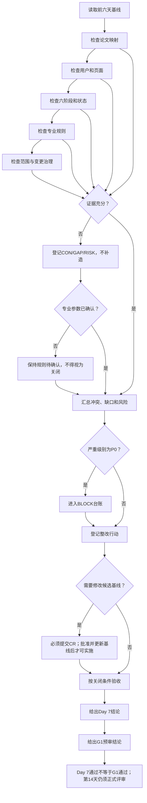

# 第1周需求复盘与G1预审

> 审查日期：2026-06-23
>
> 审查性质：第1周第7天复盘与G1预审，不是第14天正式G1冻结。
>
> 当前结论：第7天复盘通过；G1预审不通过。
> 专业边界：本文及被审文档中的运输判断仅用于教学，不替代真实工程勘测、设计、审查或安全论证。

## 1. 文档目标与审查范围

本文件对第1—6天形成的需求候选基线作只读复盘，检查论文功能、用户场景、六阶段流程、页面入口、专业规则、数据/日志/评价、范围边界及变更治理的一致性、完整性、可追溯性和可验收性。发现项只登记问题、阻断、责任、关闭条件和CR建议，不直接修改前6天文档，不补造专业参数，不关闭既有待确认事项。

审查对象共7份：实施计划1份、前6天需求文档6份。另以论文原文页码和前6天已校对摘录作为证据源。本次新增且只新增本文件。

## 2. 审查依据与基线状态

| 依据 | Git位置/版本 | 审查状态 | 说明 |
|---|---|---|---|
| 126天实施计划 | 当前工作树 | 已完整阅读 | 核对第1周1—7天、严格范围、必须/禁止、G1和最终验收 |
| `docs/论文功能映射.md` | `main`及当前分支共同祖先8099ae4 | 已完整阅读 | 85条功能、论文页码、评价体系与未明确事项 |
| `docs/用户与场景.md` | 同上 | 已完整阅读 | 4角色、25场景、权限、14项Q |
| `docs/六阶段实验主流程.md` | 同上 | 已完整阅读 | 15状态、54转换、16失败恢复、11项Q |
| `docs/通用功能与页面清单.md` | `ai/week1-day4-page-list`提交b693921，只读 | 已完整阅读 | 50页面条目；未合并到Day6链 |
| `docs/专业规则目录.md` | `ai/week1-day5-rule-catalog`提交0581290 | 已完整阅读 | 44规则、72个P0结构样例、25项Q |
| `docs/范围排除清单与变更流程.md` | `ai/week1-day6-scope-change-control`提交aa375a9 | 已完整阅读 | 74范围项、13状态、15决策规则、14项TBD |

Git核查结果：审查开始分支为`ai/week1-day6-scope-change-control`，远程有`main`、Day4、Day5、Day6分支；Day5→Day6线性继承，Day4从`main`独立分叉。Day7已从最新Day6提交创建`ai/week1-day7-review`。既存未跟踪`.claude/`属于用户内容，保持不动。当前不存在正式`BL-001`；当前基线只能表述为“Day6候选基线+Day4只读页面分支”，不得称为G1已冻结。

## 3. 审查原则与问题分级

- P0：使范围、专业结论、权限/隔离、数据历史、六阶段闭环或G1无法成立；必须进入BLOCK。
- P1：不阻断全部流程，但导致页面、规则、评价、恢复或验收不一致。
- P2：引用、编号、文案等不改变业务结果的问题。
- 所有未确认事项沿用来源文档的保守处理；本文件只用“来源文档+原编号”引用，不另造TBD编号。
- 需要改动候选基线的发现一律标记需要CR；批准后仍须更新基线，不能直接开发。
- 技术异常与学生业务失败、治理决策彼此独立；历史实验、日志、评价和成绩只追加版本，不静默覆盖。

## 4. 第1周任务完成情况

| 天 | 计划产物 | 只读审查结果 | Day 7判定 |
|---:|---|---|---|
| 1 | 论文功能映射 | 已形成，论文2—4章功能、六阶段、评价和边界可追溯 | 完成，有后续问题 |
| 2 | 用户与场景 | 已形成，学生/教师路径和权限保守边界明确 | 完成，有后续问题 |
| 3 | 六阶段主流程 | 已形成，状态、失败、回退、恢复和结束均覆盖 | 完成，有冲突待CR |
| 4 | 页面清单 | 已形成50条，但仅在分叉分支 | 内容完成，基线未统一 |
| 5 | 专业规则目录 | 已形成44条；冲突公式和参数缺失已保守阻断 | 完成，专业阻断未关闭 |
| 6 | 范围与变更流程 | 74范围项和治理流程已形成 | 完成，预G1 CR入口有缺口 |
| 7 | 周复盘与需求审查 | 本文件登记全部发现、责任、行动和预审 | 通过；不等于G1通过 |

本次设置`REV-001—REV-045`共45项检查：

| REV范围 | 数量 | 检查主题 | 结果摘要 |
|---|---:|---|---|
| REV-001—REV-015 | 15 | 用户要求的15组跨文档映射 | 8通过、4条件通过、3不通过 |
| REV-016—REV-021 | 6 | 六阶段逐阶段完整性 | 名称顺序通过；恢复/样例引用有问题 |
| REV-022—REV-040 | 19 | 指定专业规则专项 | 编号和结构齐；公式、参数、边界存在阻断 |
| REV-041—REV-043 | 3 | 范围分类、排除、隐藏入口 | 编号连续；未见OUT/BAN/FUT混入首版入口 |
| REV-044—REV-045 | 2 | 变更治理、G1/最终验收输入 | 流程主体完整；预G1入口与资产时序不成立 |

逐项结果如下（“条件”表示已有保守处理但仍需关闭问题）：

| 编号 | 检查项 | 结果 | 关联发现 |
|---|---|---|---|
| REV-001 | 论文功能→角色和场景 | 通过 | 无 |
| REV-002 | 用户场景→页面和入口 | 不通过 | GAP-001 |
| REV-003 | 页面→六阶段状态和转换 | 不通过 | CON-006 |
| REV-004 | 六阶段步骤→专业规则 | 条件 | GAP-003 |
| REV-005 | 规则→输入/输出/单位/边界/失败/恢复 | 条件 | GAP-003 |
| REV-006 | 页面和规则→数据/日志/评价 | 不通过 | GAP-001/006 |
| REV-007 | 失败场景→唯一恢复目标 | 不通过 | CON-002 |
| REV-008 | 上游修改→下游失效范围 | 通过 | 无 |
| REV-009 | 首版功能→IN/SUP | 通过 | 无 |
| REV-010 | 排除功能→OUT/BAN | 通过 | 无 |
| REV-011 | 论文未明确→来源Q/TBD及保守处理 | 通过 | RISK-001 |
| REV-012 | 新需求→CR/DEC/BL | 不通过 | GAP-002 |
| REV-013 | 14/12/26评价数量与归属 | 条件 | GAP-004 |
| REV-014 | 学生/教师/评价系统/管理员边界 | 条件 | CON-006 |
| REV-015 | 保存/恢复/幂等/只读/历史/异常 | 条件 | RISK-002 |
| REV-016 | 阶段1完整性 | 条件 | GAP-003/005 |
| REV-017 | 阶段2完整性 | 条件 | GAP-003/005 |
| REV-018 | 阶段3完整性 | 不通过 | CON-002、GAP-003/005 |
| REV-019 | 阶段4完整性 | 条件 | GAP-003/005 |
| REV-020 | 阶段5完整性 | 条件 | CON-003、GAP-003/005 |
| REV-021 | 阶段6完整性 | 不通过 | CON-002、GAP-005 |
| REV-022 | 高度规则 | 条件 | GAP-003 |
| REV-023 | 圆弧弯道规则 | 不通过 | GAP-003 |
| REV-024 | 直交弯道规则 | 不通过 | GAP-003 |
| REV-025 | 坡度和牵引力 | 条件 | GAP-003 |
| REV-026 | 桥梁教学简化 | 条件 | GAP-003 |
| REV-027 | 车组调整 | 条件 | GAP-003 |
| REV-028 | 液压编点和阀门 | 条件 | GAP-003 |
| REV-029 | 轴线载荷 | 条件 | GAP-003 |
| REV-030 | 装车重心 | 不通过 | GAP-003 |
| REV-031 | 液压反馈 | 不通过 | GAP-003 |
| REV-032 | 绑扎工具顺序 | 条件 | CON-003 |
| REV-033 | 绑扎点 | 不通过 | GAP-003 |
| REV-034 | 倒八字 | 条件 | GAP-003 |
| REV-035 | 60°规则 | 条件 | GAP-003 |
| REV-036 | 阶段继续 | 通过 | 无 |
| REV-037 | 唯一回退 | 不通过 | CON-002 |
| REV-038 | 下游失效 | 通过 | 无 |
| REV-039 | 保存与幂等 | 条件 | RISK-002 |
| REV-040 | 技术异常 | 通过 | 无 |
| REV-041 | IN/SUP/OUT/TBD/BAN/FUT编号与主分类 | 通过 | 无 |
| REV-042 | 排除项无首版隐藏入口 | 通过 | 无 |
| REV-043 | 未登记范围项和纳入/排除冲突 | 条件 | GAP-001 |
| REV-044 | CR字段/状态/决策/历史治理 | 条件 | GAP-002 |
| REV-045 | G1及最终验收设计输入 | 不通过 | CON-004、GAP-003—006 |

## 5. 论文功能覆盖检查

论文功能→角色/场景→范围的主链总体完整：登录、学习、提示、日志、六阶段、系统评价、教师评价和成绩导出分别落入STU/TEA/SYS场景及IN-001—018/SUP-001—008。论文研究过程中的德尔菲问卷和AHP现场计算工具分别落入OUT-017/018；VR、多人、移动端、工程级分析等落入OUT/BAN，没有被暗中提升为首版功能。

未通过点：论文评价体系要求C1—C5、D3、报告类指标取数，映射和SUP-005要求最小异步能力，但Day4页面台账没有对应的提问、讨论、师生互动、笔记、预习报告、实验报告入口，形成GAP-001。

## 6. 用户与权限一致性检查

学生、教师、评价系统、管理员四类边界总体一致：学生仅本人；教师仅授权范围且原日志只读；评价系统后台计算，不接受人工覆盖日志；管理员未确认前无独立业务端和业务数据写权。无授权即拒绝，学生最终成绩默认不开放，发布/复核/撤回不实现。

但主流程ENT-005把“教师查看或学生越权访问”成功目标统一写为“已提交实验只读”，可能把进行中尝试的业务生命周期语义误写为已提交状态，与页面TEA-003“任意尝试状态只读查看、生命周期不改变”冲突，登记CON-006并阻断G1。

## 7. 六阶段流程一致性检查

六阶段名称、顺序在六份文档中一致：

1. 运输任务及货物介绍
2. 简单配车
3. 路线勘测
4. 车组确定
5. 货物装车与绑扎加固
6. 货物运输

| 阶段 | 进入条件 | 学生输入/操作 | 系统判断与通过 | 失败与页面反馈 | 唯一回退 | 保存/日志 | 下游失效 | 页面/规则/数据/样例 | 结果 |
|---|---|---|---|---|---|---|---|---|---|
| 1 | 本人新尝试加载成功 | 阅读任务、货物参数、360°查看、确认 | DAT完整、模型绑定、保存成功 | 缺字段留本阶段；资源异常待恢复 | 本阶段或加载入口 | 确认、快照、查看/异常事件 | 改动失效2—6 | EXP-S1；DAT；任务/货物版本；DAT-001-N/F | 条件通过 |
| 2 | 阶段1已保存通过 | 组合、轴线/纵列、牵引车 | VEH/SLP满足且保存 | 逐项解释失败 | 本阶段选择 | 选择、重试、初步车组版本 | 改动失效3—6 | EXP-S2；VEH/SLP；车组；VEH-003-N/F/B/I | 条件通过 |
| 3 | 阶段2已保存通过 | 3路线×5障碍测量、处置、选线 | HGT/ARC/ORT/SLP/BRG/RTE有效 | 精确到路线/障碍；未决规则阻断 | 对应测量/判断或路线选择 | 单项草稿、勘测快照、B1 | 改动失效4—6 | EXP-S3；五类规则；测量/路线版本；对应P0四类样例 | 不通过：专业阻断 |
| 4 | 阶段3已保存通过 | 调车、拼接、编点、阀门、轴载 | CFG/AXL全通过且保存 | 显示失败步骤/超限轴 | 当前步骤；超载回挂车参数 | 步骤快照、逐轴结果、B2 | 改动失效5—6 | EXP-S4；CFG/AXL；正式车组；CFG/AXL样例 | 条件通过 |
| 5 | 阶段4已保存通过 | 调位、液压、六工具、点位、倒八字、角度 | LOD/TLS/LSH全通过且保存 | 调整方向/当前工具/点角错误 | 位置、当前工具或绑扎点 | 正确步骤、失败即时保存、B2/B3/B5 | 改动失效6 | EXP-S5；LOD/TLS/LSH；位置/读数/点角；对应样例 | 条件通过 |
| 6 | 前五阶段当前版本有效 | 汇总、选线复验、开始运输 | 完整、版本相容、正确路线、完成保存 | 错路线失败动画；技术异常不计业务错 | 文档冲突：阶段3选线或阶段6重试 | 复验、动画、完成幂等日志 | 回阶段3则4—6失效 | EXP-S6；RTE-004/FLW-005；汇总/完成键；FLW-005样例 | 不通过：CON-002 |

## 8. 页面与入口一致性检查

Day4的50条页面台账覆盖登录、学习、帮助、日志、六阶段、结果、教师端与异常状态；所有六阶段均有唯一工作区，加载/空/403/断网/保存失败/非法跳步可恢复。OUT/BAN/FUT未发现首版入口。

问题是：页面清单尚未进入当前Day6链（CON-001）；评价取数所需异步能力没有页面入口（GAP-001）；页面清单对规则验收样例只作章节引用，没有逐阶段固定样例ID（GAP-005）。

## 9. 专业规则完整性检查

| 专项 | 唯一规则 | 输入/输出/单位 | 来源页码 | 相等边界/冲突 | 案例参数与确认 | 当前可否确定教学结论 | 工程边界 |
|---|---|---|---|---|---|---|---|
| 高度 | HGT-001/002 | 有 | 论文50—52/PDF57—59 | `=`未明确 | 课程负责人确认 | 否，争议边界阻断 | 仅教学 |
| 圆弧弯道 | ARC-001/002 | 有 | 论文19、50/PDF26、57 | 式2.16—2.17冲突 | 课程负责人/专业教师 | 否 | 仅教学 |
| 直交弯道 | ORT-001/002 | 有 | 论文19—21、50/PDF26—28、57 | 式2.24/2.26/2.29等冲突 | 课程负责人/专业教师 | 否 | 仅教学 |
| 坡度与牵引 | SLP-001—004 | 有 | 论文16—18、52/PDF23—25、59 | 牵引比较等号通过；多车系数未定 | 车辆/路面参数待确认 | 仅结构可定 | 仅教学 |
| 桥梁简化 | BRG-001 | 有 | 论文51/PDF58 | 等于通过 | 承载来源待确认 | 参数齐全后可定 | 明示非结构分析 |
| 车组调整 | CFG-001/002 | 有 | 论文52/PDF59 | 无数值边界 | 路线约束/拓扑待确认 | 否 | 仅教学 |
| 液压编点/阀门 | CFG-003/004 | 有 | 论文42、52/PDF49、59 | 顺序明确 | 三点/回路/阀门答案待确认 | 否 | 仅教学 |
| 轴线载荷 | AXL-001—003 | 有 | 论文15—16、53/PDF22—23、60 | `≤`通过；精度未定 | 坐标、轴重、上限待确认 | 否 | 仅教学 |
| 装车重心 | LOD-001 | 有 | 论文53/PDF60 | 容差未定 | 坐标系/偏差待确认 | 否 | 仅教学 |
| 液压反馈 | LOD-002 | 有 | 论文53/PDF60 | 区间端点未定 | 正确区间待确认 | 否 | 仅教学 |
| 工具顺序 | TLS-001/002 | 有 | 论文42—43、53—54/PDF49—50、60—61 | 六步可确定，但上游“梯子/安全带”表述含混 | 课程负责人确认文案 | 是，按TLS六步 | 仅教学 |
| 绑扎点 | LSH-001 | 有 | 论文54/PDF61 | 命中容差未定 | 四点坐标/正确点待确认 | 否 | 仅教学 |
| 倒八字 | LSH-001 | 有 | 同上 | 拓扑判定明确 | 点位参数待确认 | 结构可定 | 仅教学 |
| 60° | LSH-002 | 有 | 论文54/PDF61 | 60°通过；精度未定 | 算法/显示精度待确认 | 逻辑可定，争议精度阻断 | 仅教学 |
| 阶段继续 | FLW-001/005 | 有 | 主流程/计划 | 全P0+保存成功 | 必需规则集待固化 | 结构可定 | 无工程扩张 |
| 唯一回退 | 各规则+FLW | 有 | 主流程§13 | 运输回退冲突 | 产品经理确认 | 除CON-002外可定 | 无工程扩张 |
| 下游失效 | FLW-002 | 有 | 主流程§5/14 | 明确 | 字段影响矩阵待细化 | 阶段级可定 | 无工程扩张 |
| 保存与幂等 | FLW-003/004 | 有 | 计划G2/第100天 | 重复增量0 | 键组成待设计 | 原则可定 | 无工程扩张 |
| 技术异常 | ERR-001—003 | 有 | 计划/主流程 | 不计学生错 | 异常枚举待设计 | 原则可定 | 不产生专业结论 |

结论：44条规则编号连续、输入输出结构充分，但ARC/ORT公式冲突、案例参数、真值、阈值、容差和单位精度未关闭，登记GAP-003并阻断G1；不得使用§22测试假设值替代案例参数。

## 10. 数据、日志与评价检查

- 14项系统评价、12项教师评价、26项综合评价在映射、场景、页面、范围文档数量与归属一致；总分公式一致。
- 原始日志→分档→权重→贡献→四维→总分具备追溯要求，历史版本不可覆盖。
- 论文表4.8端点重叠、0次活动、B6统计口径、教师量表方向、舍入和缺项策略仍未获课程负责人确认，登记GAP-004。
- 计划第11天核心实体未覆盖异步提问/讨论/互动/笔记/报告及规则/基线版本实体，当前只具备概念输入，登记GAP-006；第11天不得据此猜字段。

## 11. 保存、恢复、幂等与异常检查

已一致固化：保存确认前不得显示通过；刷新/短断网回最近保存点；事件ID和业务键幂等；完成只读；重做新尝试；技术异常不计B1—B3/B5；失败日志追加不删除；新规则不静默重算历史。

仍需治理：自动保存频率、断网队列/冲突、日志保存期限、暂停计时、幂等键组成尚无冻结设计（RISK-002）。保守处理为关键事件即时提交、失败待重试、原键重试、未确认不前移状态。

## 12. 范围分类与排除检查

| 分类 | 数量/编号 | 唯一连续 | 主分类唯一 | 本次结论 |
|---|---:|---|---|---|
| IN | 18，IN-001—018 | 是 | 是 | 首版主能力完整 |
| SUP | 8，SUP-001—008 | 是 | 是 | 支撑能力完整，但SUP-005入口缺口 |
| OUT | 22，OUT-001—022 | 是 | 是 | 指定排除项齐全，无暗中入口 |
| TBD | 14，TBD-001—014 | 是（文档内） | 是 | 均有保守处理；与其他文档Q需来源限定 |
| BAN | 8，BAN-001—008 | 是 | 是 | 均有可验证禁止条件 |
| FUT | 4，FUT-001—004 | 是 | 是 | 未进入首版页面、数据、估时和验收 |

不存在同一功能同时IN和OUT的实质冲突：OUT-022排除的是“未经确认的值/公式”，IN-011—013纳入的是规则结构、已明确常数和获批后配置。不得把结构纳入误解为允许默认数值。

## 13. 变更治理流程检查

CR 33字段、13状态、17维影响分析、15条决策规则覆盖关联BL、专业确认、权限/数据/安全确认、默认拒绝扩围、批准≠开发、基线更新门禁、下游失效、历史保留、重复去重、技术异常分离、验收失败不可关闭、历史版本不改写。

治理缺口：正式BL只在G1通过后建立，但Day7发现又被要求必须走CR，而CR审批又强制关联当前有效BL，形成预G1修订无法合法审批的闭环缺口（GAP-002）。当前保守处理：只登记ACT和CR建议；在候选基线建立明确的“pre-G1候选基线/CR”规则前，不直接改文档。

## 14. 文档冲突清单

| 编号 | 标题 | 级别 | 证据 | 核心冲突 | G1阻断 |
|---|---|---|---|---|---|
| CON-001 | Day4页面基线未进入Day6链 | P0 | Git图；Day6§1 | 逻辑引用有效但当前分支缺文件，无法形成单一可签署基线 | 是 |
| CON-002 | 错误路线唯一恢复目标不一致 | P0 | 用户场景ERR-003“阶段6重试”；主流程FR-10/S6-003、页面EXP-S6、RTE-004“回阶段3” | 状态机、失效范围和页面去向不唯一 | 是 |
| CON-003 | 梯子与安全带顺序表达不一致 | P1 | 映射§5.5、主流程§10“梯子/安全带”；TLS-001“梯子→安全带” | 五组表达与六步规则可能导致验收口径不同 | 否 |
| CON-004 | G1资产清单门槛与计划时序冲突 | P0 | 计划G1要求资产清单无待定；第29天才建立资产清单 | 第14天无法按现计划取得该门槛证据 | 是 |
| CON-005 | 学习进度保存引用天数错误 | P2 | 用户与场景§3.8引用第27天；计划实际为第47天 | 引用错误，不改变业务语义 | 否 |
| CON-006 | 教师只读查看被写成业务已提交状态 | P0 | 主流程ENT-005；页面TEA-003/权限矩阵 | 展示模式与尝试生命周期混用，可能静默锁定进行中尝试 | 是 |

## 15. 需求缺口清单

| 编号 | 标题 | 级别 | 证据 | 缺口 | G1阻断 |
|---|---|---|---|---|---|
| GAP-001 | 评价取数最小异步页面缺失 | P0 | 映射§9/14、SUP-005；Day4无对应条目 | C1—C5、D3、A7/A8、D4/D6无明确入口/状态/恢复 | 是 |
| GAP-002 | 预G1候选基线CR路径缺失 | P0 | Day6§12/17要求关联有效BL；§18称G1后才有BL-001 | Day7整改既必须CR又无可关联BL | 是 |
| GAP-003 | 专业公式与案例参数不足 | P0 | 专业规则§21.2/23 | ARC/ORT冲突及车辆、路线真值、轴载、液压、点位等不足 | 是 |
| GAP-004 | 评价分档与量表方向未冻结 | P0 | 映射§10.3/10.4；用户Q-08/09/10/13 | 边界可多重命中，0次和统计周期不明，总分不可确定 | 是 |
| GAP-005 | 六阶段验收样例未形成统一引用矩阵 | P1 | 主流程各阶段验收标准、专业规则§22、页面§16分散 | 页面—状态—规则—数据—样例尚无一条固定ID链 | 否 |
| GAP-006 | 数据库设计输入未覆盖全部首版对象 | P1 | 计划第11天7实体；映射§9、SUP-002/005 | 版本、异步活动、报告、CR/DEC/BL、幂等审计对象未明确落位 | 否 |

## 16. 风险与G1阻断项

| 编号 | 风险 | 级别 | 当前控制 | 责任人 | G1阻断 |
|---|---|---|---|---|---|
| RISK-001 | Q/TBD编号在不同文档重复但语义不同 | P1 | 所有引用强制带来源文档和原编号 | 产品经理 | 否 |
| RISK-002 | 保存、续传、计时和幂等细节未冻结 | P1 | 原始事件保留、未确认不前移、不聚合猜测 | 技术负责人/数据负责人 | 否 |
| RISK-003 | 7天内关闭专业、资产、原型和数据输入的排期集中 | P1 | P0按先专业证据、再基线统一排序；每日检查 | 项目负责人 | 否 |

P0均进入BLOCK：

| BLOCK | 关联问题 | 解除条件 | 责任人 | 目标日期 | 状态 |
|---|---|---|---|---|---|
| BLOCK-001 | CON-001 | 获批CR把Day4页面文件纳入同一候选基线并保留历史 | 产品经理/仓库负责人 | 2026-06-25 | 未关闭 |
| BLOCK-002 | CON-002 | 唯一恢复目标、失效范围、页面/状态/规则/验收全部一致 | 产品经理/状态机负责人 | 2026-06-26 | 未关闭 |
| BLOCK-003 | CON-004 | 调整G1资产门槛或在G1前提供经批准资产清单，二选一写入基线 | 项目负责人/资产负责人 | 2026-06-27 | 未关闭 |
| BLOCK-004 | CON-006 | 分离“只读视图模式”与业务生命周期，转换表无状态副作用 | 产品经理/状态机负责人 | 2026-06-26 | 未关闭 |
| BLOCK-005 | GAP-001 | 为SUP-005补齐最小入口、权限、状态、数据、异常和验收 | 产品经理/课程负责人 | 2026-06-27 | 未关闭 |
| BLOCK-006 | GAP-002 | 发布获批的预G1候选基线与CR关联规则 | 项目负责人/需求负责人 | 2026-06-25 | 未关闭 |
| BLOCK-007 | GAP-003 | 冲突公式和G1必需案例参数有来源、单位、确认、版本、边界样例 | 课程负责人/专业教师 | 2026-06-29 | 未关闭 |
| BLOCK-008 | GAP-004 | 14项分档、教师方向、统计周期、0次、舍入形成唯一可测配置 | 课程负责人/评价负责人 | 2026-06-29 | 未关闭 |

### 问题台账字段（A：识别与证据）

| 问题编号 | 问题标题 | 分类 | 严重级别 | 模块 | 阶段 | 角色 | 问题描述 | 证据文件/章节 | 论文依据 | 当前基线版本 | 是否阻断G1 | 当前状态 | 备注 |
|---|---|---|---|---|---|---|---|---|---|---|---|---|
| CON-001 | Day4未入当前链 | 文档冲突 | P0 | 基线 | 全局 | 全角色 | 单一分支缺页面基线 | Git；Day6§1 | 无 | 候选aa375a9+b693921 | 是 | 未关闭 | 不擅自合并 |
| CON-002 | 路线回退冲突 | 文档冲突 | P0 | 流程 | 3/6 | 学生/系统 | 唯一恢复目标不唯一 | 场景ERR-003；主流程S6；RTE-004 | 论文54/PDF61仅要求重选 | 候选 | 是 | 未关闭 | 保守阻止该转换冻结 |
| CON-003 | 工具序列表述 | 文档冲突 | P1 | 绑扎 | 5 | 学生 | “/”与先后箭头不一致 | 映射§5.5；TLS-001 | 论文42—43、53—54 | 候选 | 否 | 未关闭 | 暂按六步但不关闭 |
| CON-004 | 资产门槛时序 | 文档冲突 | P0 | G1/资产 | 全局 | 项目团队 | 门槛早于计划产物 | 计划G1、Day29 | 无 | 计划当前版 | 是 | 未关闭 | 不提前造资产清单 |
| CON-005 | 日数引用错误 | 文档冲突 | P2 | 引用 | 通用 | 学生 | 第27应为第47天 | 场景§3.8；计划Day47 | 无 | 候选 | 否 | 未关闭 | 纠错也需CR |
| CON-006 | 查看改变生命周期 | 文档冲突 | P0 | 状态/权限 | 全局 | 教师/学生 | 只读展示与业务状态混用 | ENT-005；TEA-003 | 无 | 候选 | 是 | 未关闭 | 保守不得执行ENT-005状态写入 |
| GAP-001 | 异步页面缺失 | 需求缺口 | P0 | 评价/页面 | 通用 | 学生/教师 | 指标有数据要求但无入口闭环 | 映射§9/14；SUP-005；Day4§16 | 论文62/PDF69 | 候选 | 是 | 未关闭 | 不删除26项指标 |
| GAP-002 | 预G1 CR缺口 | 需求缺口 | P0 | 治理 | 全局 | 项目团队 | 无有效BL可关联 | Day6§12/17/18 | 无 | 未建立BL | 是 | 未关闭 | 当前只登记，不改基线 |
| GAP-003 | 专业依据不足 | 需求缺口 | P0 | 专业规则 | 2—5 | 学生/系统 | 公式冲突和参数/真值缺失 | 规则§21.2/23 | 论文15—21、49—54 | 候选v0.1 | 是 | 未关闭 | RULE_CONFIG_INCOMPLETE |
| GAP-004 | 评价口径未定 | 需求缺口 | P0 | 评价 | 完成后 | 教师/系统 | 分档可能重叠且方向冲突 | 映射§10.3/10.4 | 论文66—68/PDF73—75 | 候选 | 是 | 未关闭 | 不生成伪总分 |
| GAP-005 | 样例链未统一 | 需求缺口 | P1 | 验收 | 1—6 | 测试 | 样例分散无统一ID映射 | 主流程§6—11；规则§22；页面§16 | 各阶段论文页 | 候选 | 否 | 未关闭 | 第13天前补齐 |
| GAP-006 | 数据输入不足 | 需求缺口 | P1 | 数据 | 全局 | 全角色 | 计划7实体不足以表达全部首版对象 | 计划Day11；映射§9；SUP-002/005 | 论文62、66—69 | 候选 | 否 | 未关闭 | 不提前设计字段 |
| RISK-001 | 待确认编号歧义 | 风险 | P1 | 治理 | 全局 | 项目团队 | 多文档Q-01/TBD-001语义不同 | 各文档待确认节 | 无 | 候选 | 否 | 未关闭 | 来源限定引用 |
| RISK-002 | 恢复细节风险 | 风险 | P1 | 保存/日志 | 全局 | 学生/系统 | 队列、频率、冲突、计时未定 | 主流程§14/18；页面§17 | 论文未明确 | 候选 | 否 | 未关闭 | 保守策略已定义 |
| RISK-003 | G1排期风险 | 风险 | P1 | 项目 | 全局 | 项目团队 | 多个P0集中在第2周 | 计划Day8—14；BLOCK表 | 无 | 候选 | 否 | 未关闭 | 每日复核 |

### 问题台账字段（B：影响、处置与关闭）

| 问题编号 | 影响范围 | 页面影响 | 规则影响 | 数据影响 | 状态机影响 | 日志与评价影响 | 首版范围影响 | 当前保守处理 | 建议处理方式 | 需要CR | 建议责任人 | 计划关闭时间 | 关闭条件 | 验收方式 |
|---|---|---|---|---|---|---|---|---|---|---|---|---|---|---|
| CON-001 | 全基线 | 全页面 | 全规则引用 | 版本清单 | 无法签署统一状态 | 证据链断点 | IN/SUP | 分支只读 | 统一候选基线 | 是 | 产品经理/仓库负责人 | 06-25 | 文件同链且历史保留 | Git图+文件清单 |
| CON-002 | 阶段3—6 | EXP-S3/S6 | RTE-004/FLW-002/005 | 路线/失效版本 | 回退目标冲突 | 回退/重验日志 | IN-009/014 | 阻止冻结 | 专业与产品联合决策 | 是 | 产品经理/专业教师 | 06-26 | 全文唯一目标 | 状态转换E2E |
| CON-003 | 阶段5 | EXP-S5/HLP | TLS-001 | 工具序列 | 当前步推进 | B3/B5 | IN-008/013 | 按六事件分别记录 | 统一六步表述 | 是 | 课程负责人 | 06-28 | 文案/规则/样例一致 | 六步正误样例 |
| CON-004 | G1 | 无/资产清单 | 资产依赖规则 | 资产版本 | 加载前置 | 资源异常证据 | SUP-003 | 不造清单 | 调整门槛或提前获批产物 | 是 | 项目负责人 | 06-27 | G1证据可执行 | 计划与清单复核 |
| CON-005 | 引用 | 无业务变化 | 无 | 无 | 无 | 无 | 无 | 按Day47理解 | 纠错CR | 是 | 产品经理 | 06-30 | 引用与计划一致 | 链接检查 |
| CON-006 | 权限/流程 | TEA-003/ERR-001 | FLW/权限门禁 | 尝试状态 | 可能错误锁定 | 查看审计 | IN-002/014 | 查看只读且不写状态 | 引入viewMode或等价概念 | 是 | 状态机负责人 | 06-26 | 教师查看前后业务状态相同 | 进行中尝试只读测试 |
| GAP-001 | 评价闭环 | 新/复用最小入口待决策 | LOG-002/EVA | 活动/报告记录 | 页面状态待定义 | 8类指标来源 | SUP-005/IN-016 | 不补0、不删指标 | 原型前补页面基线 | 是 | 产品经理/课程负责人 | 06-27 | 每指标有入口和恢复 | 指标→页面→数据追踪 |
| GAP-002 | 治理 | 无 | 无 | CR/BL链 | CR状态无法推进 | 审计链 | 全范围 | 仅登记ACT | 建候选基线标识/预G1流程 | 是 | 项目负责人 | 06-25 | Day7问题可合法进CR | AC类流程演练 |
| GAP-003 | 专业结论 | EXP-S2—S5 | ARC/ORT等 | 案例/规则配置 | 相关提交阻断 | B1/B2等无确定值 | IN-005—013 | ERR-002 | 获取来源、双签、版本化 | 是 | 专业教师/课程负责人 | 06-29 | BLOCK-007条件全满 | 正常/失败/边界/非法 |
| GAP-004 | 成绩 | SCR/TEA | EVA分档 | 评价配置/版本 | 评价待生成 | 14/12/26 | IN-016 | 停止总分 | 冻结唯一半开区间与方向 | 是 | 评价负责人 | 06-29 | 每值唯一命中且手算一致 | 边界+固定样例 |
| GAP-005 | 验收 | 六工作区 | 全阶段P0 | 样例数据 | 54转换 | 日志断言 | SUP-008 | 分散引用可查 | 建追踪矩阵 | 是 | 测试负责人 | 06-29 | 每阶段固定样例ID | 追踪矩阵审查 |
| GAP-006 | Day11设计 | 数据页/治理 | 版本/日志 | 实体关系 | 保存/只读/重算 | 全评价链 | SUP-002/004/005 | 不猜字段 | Day11补实体与关系 | 是 | 数据负责人 | 06-29 | 所有首版对象有归属/版本/RLS | ER审查+场景走查 |
| RISK-001 | 引用追踪 | 无 | 无 | 编号引用 | 无 | 审计 | 无 | 来源限定 | 建全局引用键 | 是 | 产品经理 | 06-29 | 无裸Q/TBD引用 | 自动扫描+人工抽查 |
| RISK-002 | 恢复/评分 | LOG/ERR | FLW/LOG | 队列/事件 | 暂停恢复 | 计时/提示可能重复 | IN-015 | 原键重试、不聚合 | Day11/12基线化细节 | 是 | 技术/数据负责人 | 06-29 | 四条恢复路径可验收 | 刷新/断网/重复/冲突 |
| RISK-003 | G1时间 | 无 | 全部P0 | 证据计划 | 无 | 无 | 全局 | P0优先 | 每日燃尽与超期升级 | 否 | 项目负责人 | 06-30 | BLOCK按期关闭或G1延期 | 每日台账复核 |

## 17. 待确认事项汇总

去除重复语义后形成18个治理主题；来源记录不删除。

| 治理主题 | 来源文档和原编号 | 重复情况 | 当前保守处理 | 建议责任人 | 阻断G1 | 关闭证据 |
|---|---|---|---|---|---|---|
| 角色和教师账号 | 用户Q-01；页面Q-01 | 重复 | 仅教师登录，不提供教师注册 | 项目负责人 | 否 | 账号创建决策 |
| 教师授权范围 | 用户Q-02/03；页面Q-02/03 | 重复 | 无授权即拒绝 | 课程负责人 | 是 | 授权模型+越权样例 |
| 成绩发布复核撤回/历史重算 | 用户Q-04/05/13；流程Q-10/11；页面Q-04—06；范围OUT-020、TBD-008—010 | 高度重复 | 学生仅见完成；无发布/撤回；不改历史 | 课程负责人 | 是 | 状态、权限、双版本政策 |
| 密码找回/锁定 | 用户Q-06；范围OUT-021 | 重复 | 不实现，失败不枚举账户 | 安全负责人 | 否 | 安全决策或确认排除 |
| 管理员业务权限 | 用户Q-07；页面Q-07；范围OUT-019 | 重复 | 无独立业务端、无业务写权 | 项目负责人 | 否 | 权限矩阵 |
| 案例原始货物数据 | 映射§13.3；规则Q-01 | 重复 | 缺项阻断 | 专业教师 | 是 | 来源、单位、版本、签署 |
| 车辆/挂车/路面参数 | 规则Q-02—05 | 相关合并 | 不作确定配车/牵引/轴载结论 | 专业教师 | 是 | 参数包及来源 |
| 三条路线测量真值 | 规则Q-08；映射§13.3 | 重复 | 无真值不出案例结论 | 专业教师 | 是 | 3×5真值与单位 |
| 专业公式冲突 | 规则Q-06/07 | 两类公式 | ARC/ORT阻断 | 课程负责人/专业教师 | 是 | 勘误版公式及边界样例 |
| 阈值、容差、精度、单位 | 规则Q-09/14/18/23/24；流程Q-05 | 相关合并 | 已明确边界外均阻断争议值 | 专业教师 | 是 | 配置字典+签署 |
| 路线经济性与处置成本 | 用户Q-12；流程Q-01/02；规则Q-11/12 | 高度重复 | 仅可通行性，不自动排序 | 课程负责人 | 是 | 处置集合/成本/并列规则 |
| 装车重心、液压、绑扎点 | 用户Q-11；流程Q-03—05；规则Q-15—17 | 高度重复 | 只存原值，阈值空则阻断 | 专业教师 | 是 | 坐标/区间/命中样例 |
| 评价分档与方向 | 用户Q-08/09/13；映射§10.3/10.4 | 重复 | 不静默选档/总分 | 评价负责人 | 是 | 唯一区间配置+手算 |
| 时间与提示计数 | 用户Q-10；流程Q-09；页面Q-11；规则Q-19—21 | 高度重复 | 分类型、存原始时间，不聚合猜测 | 课程负责人 | 是 | 统计周期/暂停/B5/B6口径 |
| 日志保存与断网续传 | 用户Q-14；流程Q-07/08；页面Q-08/09 | 高度重复 | 关键事件、原键重试、幂等 | 技术负责人 | 否 | 数据/状态/异常设计 |
| 基线、规则版本和生效时间 | 规则Q-22；范围TBD-005/008/009 | 重复 | 未发布不生效；尝试创建锁定 | 项目负责人 | 是 | 版本政策+生效时间 |
| 变更批准、通知、撤销、回滚 | 范围TBD-001—004/011/012/014 | 相关合并 | 项目负责人终决、无旁路、反向CR回滚 | 项目负责人 | 是 | RACI、通知和回滚规则 |
| 资产及异步评价内容 | 映射§13.10/13；页面LRN-003备注；SUP-003/005；计划Day29 | 非重复、同属G1输入 | 不造资产/内容，不删指标 | 产品经理/资产负责人 | 是 | 资产清单+最小内容/入口 |

## 18. 整改行动计划

每个未关闭问题至少关联一个ACT：

| 行动编号 | 关联问题 | 行动内容 | 责任人 | 输入材料 | 输出文件 | 需要CR | 前置条件 | 完成条件 | 验收人 | 目标日期 | 未完成后果 |
|---|---|---|---|---|---|---|---|---|---|---|---|
| ACT-001 | CON-001 | 形成单一候选基线文件清单并纳入Day4 | 产品经理/仓库负责人 | 各分支提交 | 基线清单/受控合并 | 是 | GAP-002关闭 | 页面文件同链 | 质量负责人 | 06-25 | G1不可评 |
| ACT-002 | CON-002 | 决策路线失败回退及4—6重验 | 产品经理/专业教师 | 论文、S6、RTE | CR及更新清单 | 是 | 候选CR可用 | 唯一目标一致 | 状态机/测试负责人 | 06-26 | 六阶段闭环不成立 |
| ACT-003 | CON-003 | 固化六件工具逐步顺序 | 课程负责人 | 论文图文、TLS | 术语决策记录 | 是 | 无 | 所有文档同一六步 | 专业教师 | 06-28 | B3验收不一致 |
| ACT-004 | CON-004 | 决策资产门槛/时序 | 项目负责人 | 计划G1/Day29 | 计划纠错CR或资产清单 | 是 | 资产负责人确认 | G1证据可获得 | G1主持人 | 06-27 | G1必然失败 |
| ACT-005 | CON-005 | 修正Day27为Day47引用 | 产品经理 | 计划原文 | 纠错CR | 是 | GAP-002关闭 | 引用一致 | 质量负责人 | 06-30 | 保留P2开放 |
| ACT-006 | CON-006 | 分离查看模式与业务状态 | 状态机负责人 | ENT-005/TEA-003 | 状态决策记录 | 是 | 无 | 查看前后状态相同 | 权限测试负责人 | 06-26 | 数据可能误锁 |
| ACT-007 | GAP-001 | 设计SUP-005最小页面/状态闭环 | 产品经理/课程负责人 | 26项指标、页面清单 | 页面基线CR | 是 | 内容边界确认 | 8类指标来源可追溯 | 评价负责人 | 06-27 | 评价闭环缺失 |
| ACT-008 | GAP-002 | 建立预G1候选基线与CR规则 | 项目负责人 | Day6治理文档 | 治理补充CR/DEC规则 | 是 | 无 | Day7问题可合法审批 | 需求审计负责人 | 06-25 | 所有整改无法合规进入基线 |
| ACT-009 | GAP-003 | 收集并双签专业公式/参数包 | 专业教师/课程负责人 | 论文、案例原始资料 | 参数与公式确认包 | 是 | 原始资料可得 | BLOCK-007全部满足 | 专业边界审查员 | 06-29 | G1不通过 |
| ACT-010 | GAP-004 | 冻结评价配置 | 评价负责人/课程负责人 | 表4.7/4.8、权重 | 评价决策与边界样例 | 是 | 课程政策确认 | 唯一命中、手算一致 | 测试负责人 | 06-29 | 总分不可验收 |
| ACT-011 | GAP-005 | 建立六阶段追踪与样例矩阵 | 测试负责人 | 页面/状态/规则/数据 | 第13天验收清单 | 是 | 关键规则决策 | 每阶段样例ID齐 | 质量负责人 | 06-29 | G1只能凭描述 |
| ACT-012 | GAP-006 | 扩充Day11实体关系输入 | 数据负责人 | 映射§9、SUP-002/005 | 数据库设计文档 | 是 | 页面/评价口径明确 | 对象、版本、RLS、幂等可设计 | 技术负责人 | 06-29 | 数据库返工 |
| ACT-013 | RISK-001 | 建立来源限定的待确认索引 | 产品经理 | 各文档Q/TBD | 追踪索引 | 是 | 无 | 无裸编号歧义 | 质量负责人 | 06-29 | 错关事项 |
| ACT-014 | RISK-002 | 固化保存/续传/计时/幂等设计输入 | 技术/数据负责人 | 主流程、日志规则 | Day11/12设计决策 | 是 | 评价口径明确 | 四恢复路径可测 | 测试负责人 | 06-29 | 重复计分/丢日志风险 |
| ACT-015 | RISK-003 | 每日更新P0燃尽与升级 | 项目负责人 | BLOCK/ACT表 | 每日审查记录 | 否 | 无 | 逾期当天明确延期G1 | G1主持人 | 06-30 | 不得宣称G1通过 |

## 19. G1预审矩阵

| 检查项 | 预审结果 | 证据 | 未关闭问题 | 阻断G1 | G1前必须动作 |
|---|---|---|---|---|---|
| 功能清单完整性 | 条件通过 | 映射85项、IN18 | GAP-001 | 是 | ACT-007 |
| 用户角色完整性 | 条件通过 | 4角色、权限矩阵 | CON-006、教师授权主题 | 是 | ACT-006及授权决策 |
| 六阶段流程一致性 | 不通过 | 主流程15状态/54转换 | CON-002/006 | 是 | ACT-002/006 |
| 页面入口完整性 | 不通过 | Day4 50条 | CON-001、GAP-001 | 是 | ACT-001/007 |
| 专业规则完整性 | 不通过 | 44规则、公式台账 | GAP-003 | 是 | ACT-009 |
| 数据需求可设计性 | 条件通过 | 映射§9、计划Day11 | GAP-006 | 否 | ACT-012 |
| 状态机可设计性 | 不通过 | 主流程§17 | CON-002/006 | 是 | ACT-002/006 |
| 权限和隔离可验收性 | 条件通过 | 权限矩阵、SUP-001 | 教师授权主题 | 是 | 固化授权模型 |
| 日志和评价可追溯性 | 不通过 | LOG/EVA、14/12/26 | GAP-001/004 | 是 | ACT-007/010 |
| 保存恢复和幂等可验收性 | 条件通过 | FR/ERR/FLW | RISK-002 | 否 | ACT-014 |
| 范围排除完整性 | 通过 | 74项连续，无隐藏入口 | 无 | 否 | 维持扫描 |
| 变更流程可执行性 | 不通过 | 13状态/17维 | GAP-002 | 是 | ACT-008 |
| 专业参数确认状态 | 不通过 | 规则§23共25项Q | GAP-003 | 是 | ACT-009 |
| 资产清单准备状态 | 不通过 | G1门槛与Day29冲突 | CON-004 | 是 | ACT-004 |
| 数据库设计输入准备状态 | 条件通过 | 计划7实体+映射对象 | GAP-006 | 否 | ACT-012 |
| 总体验收设计输入准备状态 | 条件通过 | 专业72样例、流程标准 | GAP-005 | 否 | ACT-011 |

## 20. 审查流程图

## 21. 复盘验收样例

| 样例 | 输入 | 检查依据 | 发现结果 | 分类/级别 | 当前保守处理 | 需要CR | 阻断G1 | 建议行动 | 验收结果 |
|---|---|---|---|---|---|---|---|---|---|
| RV-AC-01 | 六文档六阶段名称 | 固定六名称/顺序 | 完全一致 | REV/— | 保持 | 否 | 否 | 无 | 通过 |
| RV-AC-02 | 页面有入口但无转换 | 页面§16 vs 主流程§17 | 登记缺口 | GAP/P1 | 禁用无转换入口 | 是 | 视入口关键性 | 补状态与样例 | 符合预期 |
| RV-AC-03 | 公式存在但参数来源缺失 | ERR-002/BAN-002 | GAP-003/BLOCK-007 | GAP/P0 | RULE_CONFIG_INCOMPLETE | 是 | 是 | ACT-009 | 符合预期 |
| RV-AC-04 | OUT功能出现在首版入口 | OUT/BAN | 应登记CON并阻断 | CON/P0 | 移除入口但须经CR | 是 | 是 | 范围整改 | 符合预期；本次未发现实例 |
| RV-AC-05 | 同一事项多文档重复 | §17待确认汇总 | 合并主题、保留来源 | RISK/P1 | 来源限定 | 是 | 否 | ACT-013 | 通过 |
| RV-AC-06 | 教师权限描述不同 | 权限矩阵 | 无授权即拒绝 | CON/P0 | 拒绝访问且不泄露 | 是 | 是 | 权限决策 | 符合预期 |
| RV-AC-07 | 14/12/26数量或归属不同 | 映射§10 | 数量一致；若不一致则P0 | CON/P0 | 停止成绩生成 | 是 | 是 | ACT-010 | 本次数量通过、边界不通过 |
| RV-AC-08 | 网络异常计作学生错误 | ERR-001/BAN-007 | 必登记P0 | CON/P0 | 技术异常单列，计数不增 | 是 | 是 | 修正事件分类 | 本次基线原则通过 |
| RV-AC-09 | 文案错字不改语义 | CON-005 | P2纠错 | CON/P2 | 按正确计划理解 | 是 | 否 | ACT-005 | 符合预期 |
| RV-AC-10 | P0全关但仍有已治理TBD | Day7/G1规则 | Day7可通过；G1至多条件通过并待Day14 | PRE/— | 保守处理入基线 | 视修改 | 否 | 正式G1评审 | 符合预期 |

## 22. 与第2周任务的衔接

- 第8天信息架构：只使用获批的IN/SUP和统一后的页面编号；先解决SUP-005入口。
- 第9天六阶段原型：每页呈现目标、输入、规则状态、保存、反馈、唯一恢复；未确认专业参数显示阻断态。
- 第10天教师原型：授权范围、只读日志、14/12/26入口及无授权拒绝必须可见。
- 第11天数据库：纳入版本、异步活动/报告、幂等、审计及CR/DEC/BL设计输入；不得据本文件直接造字段。
- 第12天状态机：先关闭CON-002/006，业务生命周期与视图权限分离。
- 第13天总体验收：落实ACT-011，把每个阶段、页面、规则、数据和样例连成固定ID链。
- 第14天：仅在BLOCK关闭且证据齐全后正式执行G1；本文件结论不能替代该评审。

## 23. 第7天验收结果

| 验收项 | 结果 | 证据 |
|---|---|---|
| 完整审查7份规定文件 | 通过 | §2 |
| 六阶段名称/顺序/边界核对 | 通过，恢复目标有登记冲突 | §7、CON-002 |
| 功能、页面、规则、范围、治理交叉检查 | 通过 | REV-001—045 |
| 所有发现已登记 | 通过 | CON 6、GAP 6、RISK 3 |
| 所有P0/P1有责任、行动和关闭条件 | 通过 | BLOCK 8、ACT 15、问题台账B |
| 无未登记范围变化 | 通过 | §12 |
| 未补造公式、参数、阈值、容差 | 通过 | §9、GAP-003保守处理 |
| 技术异常未替代业务结论 | 通过 | §11、RV-AC-08 |
| 历史日志、成绩和版本不静默改写 | 通过 | §11、§13 |
| Mermaid闭合且节点可渲染 | 通过 | §20一张图 |
| 复盘样例不少于10个 | 通过 | §21共10个 |
| 未修改前6天文档 | 通过 | 本次仅新增本文件 |
| 未编写代码、安装依赖或创建脚手架 | 通过 | Git差异检查 |

**第7天结论：复盘通过。** 含义仅为规定审查已完成、发现已登记、P0/P1均已分配行动和关闭条件；不代表任何P0已经关闭，也不代表G1正式通过。

统计：审查文档7份；REV 45项；CON 6项；GAP 6项；RISK 3项；P0 8项、P1 6项、P2 1项；BLOCK 8项；待确认治理主题18项；ACT 15项；验收样例10项；Mermaid 1张。

## 24. G1预审结论

**PRE-001：G1预审不通过。**

理由：当前有8个未关闭P0阻断项，覆盖单一基线、六阶段唯一恢复、状态/权限语义、评价取数入口、预G1变更治理、专业公式与案例参数、评价分档以及资产清单时序。关闭前不得建议G1通过，不得把测试假设值写入案例，不得启动依赖确定专业结论的开发。

后续判定规则：全部BLOCK关闭且P1有获批保守处理后，可在第14天正式G1评审中重新判定“通过/条件通过/不通过”。Day 7复盘通过与G1通过是两个独立结论。
