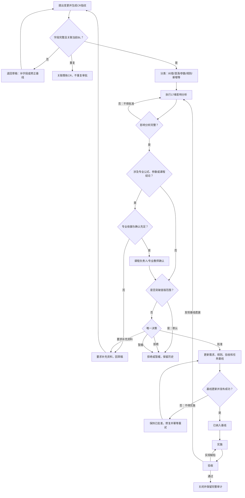

# 范围排除清单与变更流程

> 文档状态：第1周第6天需求治理基线候选稿
> 编制日期：2026-06-23
> 适用首版：单案例、三条候选路线、六阶段浏览器端教学实验
> 专业边界：本文所有运输判断均为教学演示，不替代真实工程勘测、设计、审查或安全论证。

## 1. 文档目标与依据

本文建立首版范围排除清单、范围总台账、需求变更申请（CR）、变更决策（DEC）和需求基线（BL）规则。目标是把“首版必须实现”“首版支撑能力”“论文明确但首版暂不实现”“论文未明确”“明确排除”“禁止擅自实现”和“后续版本候选”分开治理；任何新增、删除、纠错、澄清、参数、规则、页面、数据、权限、日志、评价或技术约束变化都必须先登记、分析、审批并更新基线，不能由口头要求、缺陷单或开发提交直接进入实现。

依据优先级如下：

1. 论文《大件运输虚拟仿真实验教学系统设计与实现》第2—4章原文；页码沿用前5天文档的“论文页/PDF页”标注。
2. `docs/论文功能映射.md`、`docs/用户与场景.md`、`docs/六阶段实验主流程.md`、第4天分支 `ai/week1-day4-page-list` 中的 `docs/通用功能与页面清单.md`、`docs/专业规则目录.md`。
3. `大件运输虚拟仿真实验教学系统_单人复刻126天计划.md` 的“执行假设”“严格范围”“本期必须做”“本期禁止做”、第1周第6天和G1需求冻结要求。

第4天文档尚未合并到 `main`，本文只读引用其分支版本，不复制、不修改参考文件。前5天文档共同构成G1需求冻结的输入；它们在逻辑上共同有效，不代表当前Git分支已经完成合并。

## 2. 范围治理原则

1. 每个范围项只能有一个主分类和一个唯一编号；语义相近但治理对象不同的“功能”“待确认问题”和“禁止行为”分别建项并互相引用。
2. **“论文提到”不等于“首版必须实现”**。论文研究过程、原型技术、增强体验和实施计划明确排除的内容，即使论文出现，也不能自动进入首版。
3. **“论文未明确”不等于可以自行补造**。未明确的公式、参数、阈值、容差、权限和流程必须登记为TBD或OUT；确认前采用本文件规定的保守处理。
4. 首版专业规则只输出教学结论；任何页面、文案、日志或报告不得把教学简化包装为真实工程安全结论。
5. 范围变化必须遵循“CR登记→完整性→关联→分类→影响分析→必要确认→唯一决策→基线更新→实施→验收→关闭”。
6. “已批准”不等于“可开发”；只有状态为“已纳入基线”的变更才能进入实施。
7. 技术缺陷修复只恢复已批准基线行为，不自动新增产品能力；需要改变基线时仍须提交CR。
8. 专业参数补充必须记录数据来源、单位、版本、确认责任人和生效时间；来源不足时不得形成确定性判断。
9. 被拒绝、暂缓、撤销和失败记录永久保留其历史链路，不因重新提交、回滚或版本发布而删除。
10. 重复申请按指纹去重；同一变更只保留一个主CR，后续材料追加到该记录，不重复审批。

## 3. 范围分类与编号

| 前缀 | 范围分类 | 定义 | 首版处理 |
|---|---|---|---|
| IN | 首版必须实现 | 论文业务闭环或实施计划“本期必须做/G1—G7”不可删除的能力 | 纳入首版验收；缺专业参数时实现结构与门禁，确定结论须等待获批配置 |
| SUP | 首版支撑能力 | 为部署、权限、数据、恢复、验收和可追溯所必需，但不是独立教学功能 | 与所支撑IN项共同验收 |
| OUT | 明确排除，含“论文明确但首版暂不实现” | 实施计划明确禁止、研究过程非运行功能，或未确认且不得进入首版的功能 | 首版无入口、接口、数据结构或隐性实现；满足重入条件后另提CR |
| TBD | 论文未明确，待确认 | 决策会改变流程、规则、权限、版本或验收，当前证据不足 | 采用明确保守处理，不生成默认规则 |
| BAN | 禁止擅自实现 | 无论实现难易，未经CR、批准和基线更新均不得发生的行为 | 代码评审、测试和验收发现即阻断 |
| FUT | 后续版本候选 | 仅是独立立项的候选主题，不构成路线图承诺 | 不进入首版设计与开发；重启时从新CR和范围评估开始 |
| CR | 需求变更申请 | 对当前需求/规则/页面/数据/权限/技术约束提出的唯一申请记录 | `CR-001`起连续编号，不回收 |
| DEC | 变更决策 | 对一个CR作出的批准、拒绝、暂缓或要求补充资料的唯一决策 | `DEC-001`起连续编号；补充资料后可新增决策版本但不覆盖历史 |
| BL | 需求基线版本 | 一组经批准、可实施且可验收的需求文档及版本清单 | `BL-001`起连续编号；业务版本另记为`v主.次.修订` |

编号一经分配不得复用、重排或因记录撤销而删除。本文范围台账编号在各前缀内连续；本日没有真实变更申请，不虚构CR/DEC记录。G1通过时建立首个正式基线记录 `BL-001 / v1.0.0`。

## 4. 首版必须实现范围

首版必须实现由 `IN-001—IN-018` 构成，覆盖学生和教师身份、知识学习、六阶段、单案例三路线、专业教学判断、状态恢复、评价、结果和交付验收。专业结构属于首版承诺，但TBD参数在获得可追溯确认前不得用隐藏默认值出结论。

## 5. 首版支撑能力

首版支撑能力由 `SUP-001—SUP-008` 构成，包括权限门禁、版本化配置、三维教学资产、数据库隔离、评价取数所需最小异步功能、导出统计、部署回滚和自动验收。支撑能力不能借机扩展成管理员业务端、社交平台或工程计算平台。

## 6. 明确排除范围

明确排除由 `OUT-001—OUT-022` 构成。每项均有排除原因、首版处理和重新进入条件；“重新进入条件”不是延期承诺，而是未来重新立项的最低门槛。首版不得预建未使用入口、接口、表、开关或隐藏演示。

其中 `OUT-017` 德尔菲问卷管理和 `OUT-018` AHP现场计算工具属于**论文明确但首版暂不实现**：论文提到的是评价体系形成过程，首版只使用经确认、版本化的最终26项指标和权重。

## 7. 论文未明确与待确认范围

待确认项为 `TBD-001—TBD-014`。每项在未关闭前都有保守处理：默认拒绝扩大权限、默认不重算历史、默认不使用未发布规则、默认完整审批、默认阻断确定性专业判断。不得只写“待定”。

## 8. 禁止擅自实现范围

禁止行为为 `BAN-001—BAN-008`：绕过CR开发、填造专业值、开发人员单独批准专业规则、把缺陷修复变成功能扩展、改写历史、绕过隔离、把技术异常当业务决策、重复记录和审批。违反任一项即不通过G1及后续验收门。

## 9. 后续版本候选

候选项为 `FUT-001—FUT-004`，仅包括从现有材料可推导出的独立后续主题：新增经批准教学案例、模型与动画表现升级、已排除能力的独立可行性评估、已确认治理能力的独立管理工具。候选项不进入首版估时、页面、数据库或验收。

## 10. 范围总台账

以下六张表合并构成唯一范围总台账。字段“—”表示不适用，不表示遗漏；“论文页码”使用论文页/PDF页，“计划”表示仅来源于126天实施计划。

### 10.1 首版必须实现（IN）

| 范围编号 | 范围名称 | 范围分类 | 所属模块 | 所属阶段 | 使用角色 | 范围描述 | 纳入或排除理由 | 需求属性 | 需求来源 | 论文页码 | 首版是否实现 | 优先级 | 依赖项 | 影响页面 | 影响规则 | 影响数据 | 影响状态机 | 影响日志与评价 | 当前处理方式 | 重新进入范围的条件 | 决策责任人 | 基线版本 | 验收标准 | 备注 |
|---|---|---|---|---|---|---|---|---|---|---|---|---|---|---|---|---|---|---|---|---|---|---|---|---|
| IN-001 | 学生注册、登录、会话与本人数据隔离 | 首版必须实现 | 认证权限 | 通用 | 学生 | 学号注册、凭据登录、会话恢复；仅访问本人尝试/日志/获准结果 | 论文明确学生登录；隔离是计划硬门 | 论文明确要求；实施计划要求 | 映射GEN-001—003；场景STU-001；G2/G7 | 12—13、24、45—46/PDF19—20、31、52—53 | 是 | P0 | SUP-001、SUP-004 | PUB/AUTH/STU | DAT-003、FLW-004 | 用户、会话、尝试归属 | 未开始、加载、进行、只读 | 登录审计、身份关联日志 | 纳入首版并做双学生越权测试 | — | 产品经理、技术负责人 | G1形成BL-001 | 刷新会话可恢复；学生A不能读取B或教师端 | 不含找回/锁定，见OUT-021 |
| IN-002 | 教师认证、授权学生查看与原始日志只读 | 首版必须实现 | 教师端/权限 | 通用 | 教师 | 教师认证；仅看授权学生、实验详情和原始日志，日志不可改 | 教师教学评价闭环不可缺 | 论文明确要求；合理推导 | 映射TEA-001—002；场景TEA-001—002；计划第106—107天 | 11—13、69/PDF18—20、76 | 是 | P0 | SUP-001、SUP-004、TBD-002 | AUTH/TEA/LOG | LOG-001、ERR-001 | 教师授权、访问审计 | 只读查看，不进入学生操作态 | 查看审计；原始日志不变 | 以抽象授权范围实现，无授权即拒绝 | — | 课程负责人、技术负责人 | G1形成BL-001 | 列表和直访均无越权；所有日志写请求被拒绝 | 授权模型细节见TBD-002 |
| IN-003 | 知识学习、资料库与实验内帮助 | 首版必须实现 | 知识/提示 | 全阶段 | 学生 | 四类核心知识、章节导航、实验内随时查阅、主动和错误提示且不代做 | 论文教学目标和提示机制明确 | 论文明确要求 | 映射GEN-004—009；页面LRN/HLP | 13、24—25、46—47/PDF20、31—32、53—54 | 是 | P0 | SUP-003、SUP-005 | LRN-001—004、HLP-001—003 | TLS-002、LOG-002 | 内容、学习活动、提示事件 | 状态不变或失败后回退 | D2/D3、B5原始事件 | 图文最低可用；视频仅合法素材启用 | — | 产品经理、课程负责人 | G1形成BL-001 | 六阶段均可打开并原状态返回；提示可记录且不自动完成 | 提示计分口径见TBD |
| IN-004 | 阶段1运输任务及货物介绍 | 首版必须实现 | 六阶段实验 | 阶段1 | 学生 | 展示任务、起终点、货物重量尺寸重心并360°查看 | 六阶段起点和后续数据源 | 论文明确要求 | 映射SIM-001—004；主流程§6 | 14、25—26、48/PDF21、32—33、55 | 是 | P0 | IN-010、SUP-003 | EXP-S1-001 | DAT-001—003、FLW-001 | 案例、货物、阶段快照 | 进行中→校验→通过/失败 | 查看、确认、缺失、保存日志 | 关键字段缺失阻止继续 | — | 产品经理、专业教师 | G1形成BL-001 | 参数齐全、模型可旋转缩放；缺字段不能进阶段2 | 不填造缺失案例值 |
| IN-005 | 阶段2简单配车 | 首版必须实现 | 六阶段实验 | 阶段2 | 学生 | 三种组合教学；选择挂车轴线/纵列及牵引车种类/数量 | 论文六阶段明确 | 论文明确要求 | 映射SIM-005—010；主流程§7 | 26、48—49/PDF33、55—56 | 是 | P0 | IN-004、IN-012、TBD专业参数 | EXP-S2-001 | VEH-001—003、SLP-002—003 | 车辆参数、初步车组 | 阶段2校验/失败回本阶段 | B1/B2、选择与修改日志 | 结构、解释和门禁实现；参数缺失阻断 | — | 课程负责人、专业教师 | G1形成BL-001 | 错误方案有原因且不可继续；正确方案保存后进阶段3 | 经济性不造公式 |
| IN-006 | 阶段3路线勘测 | 首版必须实现 | 六阶段实验 | 阶段3 | 学生 | 三路线完成高度、圆弧、直交、坡度、桥梁勘测及选线 | 论文六阶段明确 | 论文明确要求 | 映射SIM-011—018；主流程§8 | 50—51/PDF57—58 | 是 | P0 | IN-005、IN-011、TBD专业规则 | EXP-S3-001 | HGT/ARC/ORT/SLP/BRG/RTE | 测量、单位、计算、结论、路线版本 | 失败回具体测量或选线 | B1、测量/错误/提示日志 | 三路线×五类结构必须完整；未确认公式阻断结论 | — | 课程负责人、专业教师 | G1形成BL-001 | 15类路线障碍记录齐全；不可处置路线不可选 | 不替代工程勘测 |
| IN-007 | 阶段4车组确定 | 首版必须实现 | 六阶段实验 | 阶段4 | 学生 | 按路线调整、挂车拼接、三点编点、阀门、逐轴校核 | 论文六阶段明确 | 论文明确要求 | 映射SIM-019—023；主流程§9 | 15—16、27、42、52—53/PDF22—23、34、49、59—60 | 是 | P0 | IN-006、IN-012、TBD专业参数 | EXP-S4-001 | CFG-001—004、AXL-001—003 | 正式车组、回路、逐轴结果 | 超限唯一回挂车参数 | B2、配置/超限/回退日志 | 结构和回退实现；完整参数获批后出数值结论 | — | 课程负责人、专业教师 | G1形成BL-001 | 任一轴超限必回退；全轴合格且保存才进阶段5 | 不做复杂动力学 |
| IN-008 | 阶段5货物装车与绑扎加固 | 首版必须实现 | 六阶段实验 | 阶段5 | 学生 | 重心/液压反馈；六类工具顺序；点位、倒八字和≤60° | 论文六阶段明确 | 论文明确要求；部分参数未明确 | 映射SIM-024—027；主流程§10 | 42—43、53—54/PDF49—50、60—61 | 是 | P0 | IN-007、IN-013、TBD专业参数 | EXP-S5-001 | LOD/TLS/LSH | 位置、读数、工具序列、点位、角度 | 错位/错序/错点唯一回退 | B2/B3、提示和重试 | 固定顺序和60°实现；重心/液压阈值确认前阻断 | — | 课程负责人、专业教师 | G1形成BL-001 | 五类失败均阻断并回唯一目标；全部通过才进阶段6 | 角度60°边界通过 |
| IN-009 | 阶段6货物运输 | 首版必须实现 | 六阶段实验 | 阶段6 | 学生 | 汇总复验；错误路线失败动画并回退，正确路线完成并锁定 | 六阶段终点 | 论文明确要求 | 映射SIM-028；主流程§11 | 28、54/PDF35、61 | 是 | P0 | IN-006—008、IN-014 | EXP-S6-001、SCR-001 | RTE-004、FLW-005 | 汇总版本、路线、完成记录 | 失败回阶段3并失效4—6；成功完成只读 | 复验、动画、完成、回退日志 | 只有当前有效版本的正确路线可完成 | — | 产品经理、专业教师 | G1形成BL-001 | 两条错误路线失败；正确路线唯一完成；重复请求不重记 | 动画技术失败不计业务错 |
| IN-010 | 一个气化炉运输教学案例 | 首版必须实现 | 案例数据 | 全阶段 | 学生、教师 | 唯一气化炉案例贯穿任务、车辆、路线、装车、评价 | 计划严格限定一个案例 | 论文明确原型案例；实施计划要求 | 映射§5.1；计划“严格范围” | 14、48/PDF21、55 | 是 | P0 | TBD专业参数、SUP-002 | EXP全阶段 | DAT及全部专业规则 | 案例、货物、车辆、障碍配置 | 全流程 | 所有日志/评价关联案例版本 | 数据逐项确认；缺项显式阻断 | — | 课程负责人、专业教师 | G1形成BL-001 | 所有阶段引用同一案例版本且来源可追溯 | 不扩展多案例平台 |
| IN-011 | 三条候选路线与五类教学判断 | 首版必须实现 | 路线/规则 | 阶段3、6 | 学生 | 三路线；高度、圆弧、直交、坡度、桥梁判断 | 论文和计划明确数量及类型 | 论文明确要求 | 映射§5.3；计划第57—70天 | 50—51/PDF57—58 | 是 | P0 | IN-010、TBD专业规则 | EXP-S3/S6 | HGT/ARC/ORT/SLP/BRG/RTE | 路线、障碍、测量真值、结论 | 阶段3/6及下游失效 | B1、路线证据 | 建立完整对象和规则门禁；未知值不猜测 | — | 专业教师 | G1形成BL-001 | 每路线五类记录可追溯；桥梁明示教学简化 | 非设计院级校核 |
| IN-012 | 牵引力、车组调整、液压操作与轴载校核 | 首版必须实现 | 专业规则 | 阶段2—4 | 学生 | 所需/有效牵引力、增车重算、悬架/拼接/液压、逐轴判断 | 论文明确教学步骤 | 论文明确要求；参数待确认 | 专业规则VEH/SLP/CFG/AXL | 15—18、42、49、52—53/PDF22—25、49、56、59—60 | 是 | P0 | SUP-002、TBD专业参数 | EXP-S2/S4 | VEH/SLP/CFG/AXL | 车辆、路面、回路、轴载 | 阶段2/4及超限回退 | B1/B2、规则版本 | 公式结构与解释纳入；参数和冲突公式获批后发布 | — | 课程负责人、专业教师 | G1形成BL-001 | 输入、过程、单位、结论可追溯；超限不继续 | 教学模型，不做工程校核 |
| IN-013 | 装车重心、液压、绑扎工具点位倒八字与60° | 首版必须实现 | 专业规则 | 阶段5 | 学生 | 装车与绑扎全套教学规则 | 论文明确核心操作；部分阈值未明确 | 论文明确要求；论文未明确 | 专业规则LOD/TLS/LSH | 42—43、53—54/PDF49—50、60—61 | 是 | P0 | SUP-002、TBD专业参数 | EXP-S5 | LOD/TLS/LSH | 坐标、读数、序列、点、角 | 阶段5失败回退 | B2/B3/B5 | 明确规则直接实现；未知容差配置为空并阻断 | — | 专业教师 | G1形成BL-001 | 顺序、倒八字、60°可测；未知阈值不产生通过 | 不允许系统代做 |
| IN-014 | 阶段继续、失败、唯一回退与下游失效 | 首版必须实现 | 流程状态机 | 全阶段 | 学生、系统 | 前序门禁、失败唯一目标、上游修改失效矩阵、完成只读/重做新尝试 | 保证六阶段闭环可恢复 | 实施计划要求；合理推导 | 主流程§3、§5、§13—17 | — | 是 | P0 | IN-004—009、SUP-002 | EXP/STU/SCR/ERR | FLW-001—005 | 阶段快照、失效链 | 15生命周期状态 | 回退/失效/拒绝审计 | 按冻结状态和矩阵实现 | — | 产品经理、测试负责人 | G1形成BL-001 | 非法跳步拒绝；上游修改只失效不删历史；每失败唯一恢复 | 变更流程另有13状态 |
| IN-015 | 保存、恢复、幂等、日志与技术异常处理 | 首版必须实现 | 数据/异常 | 全阶段 | 学生、教师、系统 | 服务端保存点、断网重试、事件幂等、业务/技术错误分离、完整日志 | G2/G5/G6及评价取数必需 | 实施计划要求；论文日志明确 | 映射LOG；主流程§14；计划第99—100、118天 | 13、47、68/PDF20、54、75 | 是 | P0 | SUP-004、SUP-008 | LOG/ERR/EXP | FLW-003—004、LOG-001—002、ERR-001—003 | 事件、快照、重试队列 | 暂停/加载/原业务态 | 14项系统评价原始依据 | 未确认保存不得显示通过；原键重试 | — | 技术负责人、测试负责人 | G1形成BL-001 | 刷新断网不丢关键日志、不重复计数；技术异常不扣分 | 续传细节须后续基线化 |
| IN-016 | 14项系统评价、12项教师评价、26项综合评价 | 首版必须实现 | 评价 | 完成后 | 教师、评价系统 | 客观14项、主观12项、AHP既定权重和百分制总分，全部版本可追溯 | 论文教学评价核心 | 论文明确要求 | 映射EVA-001—009；计划第101—109天 | 62—69/PDF69—76 | 是 | P0 | IN-015、SUP-002、SUP-005 | SCR-003—006、TEA-006 | LOG-002、评价配置 | 原始值、分档、权重、贡献、总分 | 评价待生成→完成 | 26项及计算审计 | 冲突区间未确认不出伪总分；权重版本化 | — | 课程负责人、测试负责人 | G1形成BL-001 | 数量准确；固定样例可复算；缺项不补0 | 德尔菲/AHP现场工具排除 |
| IN-017 | 学生实验记录、教师详情、成绩与薄弱模块 | 首版必须实现 | 结果/教师端 | 完成后 | 学生、教师 | 学生看本人实验记录/完成结果；教师看详情、成绩、薄弱证据；成绩可追溯 | 计划教学闭环明确 | 论文明确教师能力；计划要求 | 场景STU/TEA；页面LOG/SCR/TEA | 12—13、69/PDF19—20、76 | 是 | P0 | IN-002、IN-016、TBD成绩发布 | STU-003/005、TEA-003—007、SCR | LOG/EVA | 尝试、成绩、证据链 | 完成只读 | 查看/导出审计 | 学生至少见完成状态和本人记录；最终成绩发布依获批规则 | — | 课程负责人、产品经理 | G1形成BL-001 | 学生仅本人；教师仅授权；薄弱点追溯至分项和日志 | 不含未确认发布/复核/撤回流程 |
| IN-018 | 首版部署、权限、隔离与自动化验收最小能力 | 首版必须实现 | 交付/质量 | 全局 | 全角色 | 正式网址、生产权限、备份/回滚、浏览器与端到端验收 | “本期必须做”和G7 | 实施计划要求 | G2、G7；计划第113—126天 | — | 是 | P0 | SUP-001、SUP-004、SUP-007—008 | 全部 | 全部已纳入规则 | 生产配置、测试证据、部署版本 | 全生命周期 | 审计、监控、测试报告 | 只做首版验收必要能力 | — | 项目负责人、技术负责人、测试负责人 | G1形成BL-001 | 正式URL可用；隔离测试通过；主流程自动验收通过；可回滚 | 不安装依赖或编码属于后续日任务 |

### 10.2 首版支撑能力（SUP）

| 范围编号 | 范围名称 | 范围分类 | 所属模块 | 所属阶段 | 使用角色 | 范围描述 | 纳入或排除理由 | 需求属性 | 需求来源 | 论文页码 | 首版是否实现 | 优先级 | 依赖项 | 影响页面 | 影响规则 | 影响数据 | 影响状态机 | 影响日志与评价 | 当前处理方式 | 重新进入范围的条件 | 决策责任人 | 基线版本 | 验收标准 | 备注 |
|---|---|---|---|---|---|---|---|---|---|---|---|---|---|---|---|---|---|---|---|---|---|---|---|---|
| SUP-001 | 路由、鉴权与权限门禁 | 首版支撑能力 | 应用/权限 | 全局 | 学生、教师 | 角色路由、资源归属、403/会话失效和教师授权双重校验 | 支撑IN-001/002/018 | 实施计划要求 | 页面清单AUTH/ERR；G2 | — | 是 | P0 | IN-001、IN-002 | AUTH、ERR、全部受保护页 | ERR-001、FLW门禁 | 会话、授权、访问审计 | 非法访问状态不变 | 安全审计，不计专业错误 | 首版仅学生/教师业务角色 | — | 技术负责人 | G1形成BL-001 | 列表、直访、接口三层越权均拒绝且不泄露内容 | 管理员业务端不因此产生 |
| SUP-002 | 案例、规则、评价与基线版本配置 | 首版支撑能力 | 配置/版本 | 全阶段 | 系统、获批维护者 | 保存案例、规则、权重、基线版本及生效时间；未发布不可判定 | 历史可追溯和参数门禁必需 | 合理推导；实施计划要求 | 专业规则DAT-003/ERR-002；计划第101天 | 66/PDF73 | 是 | P0 | IN-010—016 | 只读版本展示；无独立管理端 | 全部专业规则、评价规则 | 版本、来源、批准人、生效时间 | 版本不相容阻止前进 | 每条日志/成绩关联版本 | 通过受控数据或部署配置发布，不开放未确认管理员端 | — | 产品经理、技术负责人 | G1形成BL-001 | 未发布版本不能出确定结论；历史记录仍指向旧版本 | 配置发布也必须走CR |
| SUP-003 | 最小三维教学资产与交互底座 | 首版支撑能力 | 3D场景 | 阶段1—6 | 学生 | 气化炉、车组、道路、五类障碍、工具；相机、点选、碰撞和教学动画 | 支撑六阶段教学表达 | 论文明确要求；计划要求 | 映射MOD/PHY/INT；G3 | 23、33—44/PDF30、40—51 | 是 | P0 | IN-004—013 | EXP工作区 | 交互结果输入专业规则 | 资产版本、交互事件 | 加载失败待恢复 | 操作/资源异常日志 | 以可辨识、流畅、可验收为限 | — | 技术负责人、产品经理 | G1形成BL-001 | 核心对象可辨、命中正确、普通电脑达到计划指标 | 不追求影视级效果 |
| SUP-004 | 数据库、RLS、保存点和审计存储 | 首版支撑能力 | 数据平台 | 全局 | 系统 | 用户、尝试、步骤、日志、评价、版本和审计的最小持久化与隔离 | 支撑恢复、评分和权限 | 实施计划要求 | 计划第22—28、99—100天 | — | 是 | P0 | IN-001/002/014—018 | 全部数据页 | FLW-003—004、LOG-001 | 核心实体、RLS、幂等键 | 保存/恢复/只读 | 原始日志和访问审计 | 依第11天实体设计落地，不提前扩大实体 | — | 技术负责人 | G1形成BL-001 | 空库可迁移；A不能读B；重复键不重复；失败可恢复 | 本日不设计具体表结构 |
| SUP-005 | 评价取数所需最小异步学习活动 | 首版支撑能力 | 学习/评价 | 通用 | 学生、教师 | 为C1—C5、D3、报告指标提供最小提问、讨论、互动、笔记、报告记录 | 26项评价需要原始数据；不等于实时聊天 | 论文明确指标；实现方式合理推导 | 映射LOG-007、评价表4.2 | 62/PDF69 | 是 | P1 | IN-003、IN-016 | 后续原型确定最小入口 | LOG-002、评价聚合 | 次数、字数、时间、内容 | 不改变六阶段顺序 | C/D和报告指标 | 仅异步、最小、可取数；细节须基线化 | — | 课程负责人、产品经理 | G1形成BL-001 | 每个相关指标可追溯到原始记录；无即时聊天 | 字数/周期仍需确认 |
| SUP-006 | 成绩导出、打印与班级最小概览 | 首版支撑能力 | 教师端 | 完成后 | 教师 | 授权范围CSV/打印；完成率、均分、常见错误最小概览 | 计划第110—111天明确 | 实施计划要求 | 映射TEA-006；计划第110—111天 | — | 是 | P1 | IN-002、IN-016/017 | TEA-002/007、SCR-006 | 评价聚合 | 导出任务、筛选、审计 | 无 | 导出审计，不触发成绩发布 | 字段和统计仅限计划列明内容 | — | 产品经理、测试负责人 | G1形成BL-001 | 中文正常、零越权、行数/统计可复算 | 不做复杂分析 |
| SUP-007 | 部署、监控、备份与回滚说明 | 首版支撑能力 | 运维 | 全局 | 技术负责人 | 生产构建、环境变量、错误记录、数据库备份和上一稳定版回滚 | 正式网址和可恢复交付必需 | 实施计划要求 | 计划第120—122天 | — | 是 | P1 | IN-018 | 错误页/运维文档 | 技术异常规则 | 部署版本、备份、错误事件 | 发布失败回稳定版 | 技术日志，不改业务决策 | 只覆盖首版生产运行所需 | — | 技术负责人、项目负责人 | G1形成BL-001 | 密钥不暴露；可定位错误；回滚不删历史记录 | 不产生管理员业务功能 |
| SUP-008 | 自动化验收与证据链 | 首版支撑能力 | 测试验收 | 全阶段 | 测试负责人 | 规则、状态机、权限、幂等、E2E、浏览器和部署验收证据 | 各验收门不可凭主观通过 | 实施计划要求 | G1—G7；计划第97、113—119天 | — | 是 | P0 | 全部IN/SUP | 全部 | 全部 | 固定样例、测试版本、结果 | 覆盖成功/失败/恢复 | 验收审计 | 每次基线变更同步更新受影响样例 | — | 测试负责人 | G1形成BL-001 | 每条P0范围可映射自动或人工样例；失败有记录 | 本日只定义要求，不写测试代码 |

### 10.3 明确排除（OUT）

| 范围编号 | 范围名称 | 范围分类 | 所属模块 | 所属阶段 | 使用角色 | 范围描述 | 纳入或排除理由 | 需求属性 | 需求来源 | 论文页码 | 首版是否实现 | 优先级 | 依赖项 | 影响页面 | 影响规则 | 影响数据 | 影响状态机 | 影响日志与评价 | 当前处理方式 | 重新进入范围的条件 | 决策责任人 | 基线版本 | 验收标准 | 备注 |
|---|---|---|---|---|---|---|---|---|---|---|---|---|---|---|---|---|---|---|---|---|---|---|---|---|
| OUT-001 | VR头显和数据手套 | 明确排除 | 终端/交互 | 全局 | 学生 | VR专用渲染、操控与硬件适配 | 计划本期禁止；论文选择桌面型 | 首版暂不实现 | 计划严格范围；论文3.1.1 | 29/PDF36 | 否 | — | 无 | 无入口 | 无 | 无 | 无 | 无 | 浏览器桌面键鼠完成同等教学 | 独立立项、硬件/安全/工期/验收获批并形成新BL | 项目负责人 | BL-001排除 | 首版无VR依赖、入口和验收项 | 不预埋隐藏模式 |
| OUT-002 | 多人同步实验 | 明确排除 | 协作 | 全阶段 | 学生 | 多人同场景实时协作 | 计划本期禁止且显著扩大并发状态 | 首版暂不实现 | 计划严格范围 | — | 否 | — | 无 | 无入口 | 无 | 无多人会话 | 无同步状态 | 无协作评分 | 单人独立尝试 | 独立协作教学需求、并发/权限/冲突方案和工期获批 | 项目负责人 | BL-001排除 | 不存在房间、组队、同步状态或邀请 | — |
| OUT-003 | 即时聊天 | 明确排除 | 交流 | 通用 | 学生、教师 | 实时消息、在线状态、已读回执 | 计划明确排除；评价只需最小异步取数 | 首版暂不实现 | 计划严格范围；SUP-005 | — | 否 | — | SUP-005 | 无聊天页 | 无 | 无即时消息表 | 无 | 不产生聊天评价 | 仅最小异步记录 | 课程确认实时教学价值、合规/留存/审核和工期后提CR | 项目负责人、课程负责人 | BL-001排除 | 无WebSocket聊天、在线状态或即时通知 | 异步能力不等于聊天 |
| OUT-004 | 移动端专用版本 | 明确排除 | 终端 | 全局 | 学生、教师 | 独立移动端页面、触控流程或App | 计划本期禁止；首版桌面浏览器 | 首版暂不实现 | 计划严格范围 | — | 否 | — | 无 | 无专用页面 | 无 | 无 | 无 | 无 | 桌面Chrome/Edge/Firefox为验收环境 | 独立终端需求、交互重设计、性能预算与工期获批 | 项目负责人 | BL-001排除 | 无移动端专用路由、包体和验收承诺 | 基础响应式不等于专用版 |
| OUT-005 | 开放世界路线生成 | 明确排除 | 路线/场景 | 阶段3、6 | 学生 | 自由生成或探索无限路线 | 计划限定三条预设路线 | 首版暂不实现 | 计划严格范围 | — | 否 | — | IN-011 | 无入口 | 不进入RTE | 无生成数据 | 无 | 无 | 固定三路线 | 新教学目标、生成规则/资产/验证责任和独立工期获批 | 项目负责人、专业教师 | BL-001排除 | 只能选择已版本化三条路线 | — |
| OUT-006 | 实时交通仿真 | 明确排除 | 交通环境 | 阶段3、6 | 学生 | 实时车流、信号、拥堵和动态路径 | 专业规则目录明确排除；非首版教学闭环 | 首版暂不实现 | 专业规则§24 | — | 否 | — | 无 | 无入口 | 无实时交通规则 | 无交通流数据 | 无 | 无 | 采用预设教学场景与动画 | 有课程依据、数据源、模型边界和验收获批后独立立项 | 项目负责人、专业教师 | BL-001排除 | 无实时交通数据源、仿真器和动态结论 | — |
| OUT-007 | 复杂车辆动力学 | 明确排除 | 物理仿真 | 阶段2—6 | 学生 | 高保真车辆动力学、轮胎/悬架实时求解 | 计划禁止；Rapier只作教学碰撞刚体 | 首版暂不实现 | 计划严格范围 | — | 否 | — | SUP-003 | 无独立页面 | 不进入专业规则 | 无高保真参数 | 无 | 无 | 参数计算+预设动画表达教学含义 | 专业目标、模型、验证数据、算力/工期获批后独立立项 | 项目负责人、专业教师 | BL-001排除 | 不出现工程级动力学结果或承诺 | — |
| OUT-008 | 工程级有限元分析 | 明确排除 | 工程分析 | 阶段3—5 | 工程人员 | 结构/构件有限元建模和求解 | 计划明确禁止；超出教学系统 | 首版暂不实现 | 计划严格范围 | — | 否 | — | 无 | 无入口 | 无 | 无模型网格/求解数据 | 无 | 无 | 不实现 | 独立工程产品立项、资质、责任和验证体系获批 | 项目负责人 | BL-001排除 | 无网格、求解器、云算力或工程报告 | — |
| OUT-009 | 桥梁结构受力分析 | 明确排除 | 桥梁规则 | 阶段3 | 学生 | 梁体、桥墩、影响线等结构受力计算 | 论文明确采用承载值直接比较 | 首版暂不实现 | 论文3.4.2；计划范围 | 51/PDF58 | 否 | — | IN-011 | 无结构分析页 | 仅BRG-001 | 仅给定承载值 | 无 | 仅教学结论日志 | 明示教学简化比较 | 独立工程依据、结构数据、专业责任和验收获批 | 项目负责人、专业教师 | BL-001排除 | 界面显示“非桥梁结构分析” | — |
| OUT-010 | 设计院级路线校核 | 明确排除 | 路线规则 | 阶段3、6 | 工程人员 | 按设计规范出具路线工程校核 | 超出论文教学目标和责任边界 | 首版暂不实现 | 计划执行假设；专业规则安全声明 | — | 否 | — | IN-011 | 无工程报告页 | 教学规则不升级 | 无工程签章数据 | 无 | 无工程结论 | 仅可解释教学判断 | 独立工程立项、规范、资质、责任及验收获批 | 项目负责人 | BL-001排除 | 无“设计合格/可施工”等结论 | — |
| OUT-011 | 真实工程安全论证 | 明确排除 | 安全/报告 | 全阶段 | 工程人员 | 为真实运输提供安全保证、审批或结论 | 教学系统不得承担工程安全责任 | 首版暂不实现 | 计划执行假设；前5天安全声明 | — | 否 | — | 无 | 无入口 | 无 | 无 | 无 | 无 | 所有结论标注教学演示 | 只能由有资质主体另立工程系统并承担责任 | 项目负责人 | BL-001排除 | 全文案、导出和界面无真实工程安全承诺 | 高风险边界 |
| OUT-012 | 多案例规则编辑器 | 明确排除 | 案例/配置 | 全局 | 管理员 | 可视化增删案例与规则 | 计划只做一个案例且禁止多案例编辑器 | 首版暂不实现 | 计划严格范围 | — | 否 | — | IN-010 | 无编辑器 | 无动态规则创作 | 无编辑器实体 | 无 | 无 | 受控配置只服务唯一案例 | 至少第二个获批案例、角色/审批/版本/迁移方案和工期获批 | 项目负责人、课程负责人 | BL-001排除 | 无案例创建、复制、发布界面或接口 | — |
| OUT-013 | AI自动生成运输方案 | 明确排除 | AI/方案 | 阶段2—6 | 学生、教师 | AI生成配车、路线、车组或绑扎方案 | 计划禁止AI辅导；会破坏规则可追溯和边界 | 首版暂不实现 | 计划严格范围；专业规则§24 | — | 否 | — | 无 | 无入口 | 无AI规则 | 无提示词/模型输出 | 无 | 无 | 仅确定性教学规则和固定提示 | 独立教学伦理、模型评估、数据安全、工期和验收获批 | 项目负责人、课程负责人 | BL-001排除 | 无模型调用、AI按钮或生成方案数据 | — |
| OUT-014 | AI替学生完成实验 | 明确排除 | AI/学习诚信 | 全阶段 | 学生 | AI自动点击、填值、选择或提交 | 与自主学习目标冲突；明确禁止代做 | 首版暂不实现 | 前5天“不代做”；计划AI排除 | 24—25、47/PDF31—32、54 | 否 | — | 无 | 无入口 | 无 | 无 | 无自动前进 | 无 | 帮助只给方法，由学生操作 | 不允许重新进入教学考核流程；如作演示须独立非评分模式立项 | 课程负责人、项目负责人 | BL-001排除 | 任一提示不会写入答案并代提交 | — |
| OUT-015 | 排行榜和游戏化扩展 | 明确排除 | 激励 | 通用 | 学生 | 排名、徽章、积分、竞赛 | 计划明确禁止排行榜，非核心闭环 | 首版暂不实现 | 计划严格范围 | — | 否 | — | 无 | 无入口 | 无 | 无排名数据 | 无 | 不影响26项评价 | 不实现 | 课程证明教学价值、隐私/公平评估和独立验收获批 | 课程负责人 | BL-001排除 | 无排名、徽章、积分字段或页面 | — |
| OUT-016 | 影视级模型与特效 | 明确排除 | 3D表现 | 全阶段 | 学生 | 电影级高模、光效、复杂特效 | 计划以教学辨识和浏览器流畅为准 | 首版暂不实现 | 计划执行假设；映射§14 | — | 否 | — | SUP-003 | 无专门入口 | 无 | 无 | 无 | 无 | 低模/中等表现满足教学与性能预算 | 首版稳定后另立资产升级预算、许可和性能验收 | 项目负责人 | BL-001排除 | 资产预算不以影视标准验收 | 不排除必要反馈动画 |
| OUT-017 | 德尔菲问卷管理 | 明确排除（论文明确但首版暂不实现） | 研究管理 | 评价前置 | 专家 | 两轮专家问卷录入、回收与统计 | 是论文研究过程，不是运行功能 | 论文明确；首版暂不实现 | 映射EVA-010 | 56—62/PDF63—69 | 否 | — | 无 | 无入口 | 无 | 无问卷/专家实体 | 无 | 不影响既定26项评分 | 使用论文最终指标，不复刻研究过程 | 新课程研究目标、专家角色、伦理与统计验收获批 | 课程负责人 | BL-001排除 | 无问卷管理入口/数据；26项仍可用 | “论文提到”不等于首版必须做 |
| OUT-018 | AHP现场计算工具 | 明确排除（论文明确但首版暂不实现） | 研究/权重 | 评价配置 | 专家、管理员 | 现场录入判断矩阵、CR检验和发布权重 | 首版使用既定权重版本 | 论文明确；首版暂不实现 | 映射EVA-011 | 63—65/PDF70—72 | 否 | — | SUP-002 | 无计算页 | 无现场AHP | 无矩阵实体 | 无 | 只引用已批准权重 | 固化并版本化最终权重 | 课程需要重建权重、专家/审批/一致性验收获批 | 课程负责人 | BL-001排除 | 无矩阵录入和现场计算；历史权重可追溯 | 不排除只读权重展示 |
| OUT-019 | 未确认的管理员业务端 | 明确排除 | 管理端 | 全局 | 管理员 | 账号、课程、规则、成绩等综合业务后台 | 论文未定义角色权限；不得默认扩权 | 论文未明确 | 用户与场景Q-07；页面Q-07 | — | 否 | — | SUP-002/007 | 无管理员入口 | 无 | 无管理员业务实体 | 无 | 仅技术支持审计 | 不设独立业务端；生产支持走获批运维权限 | TBD职责关闭、权限矩阵/审计/页面/验收经CR纳入新BL | 项目负责人 | BL-001排除 | 公共入口无管理员业务入口；管理员不能默认读业务数据 | 支持角色不等于业务端 |
| OUT-020 | 未确认的成绩发布、复核和撤回流程 | 明确排除 | 成绩治理 | 完成后 | 学生、教师 | 发布、申诉复核、撤回已完成或直接改总分 | 论文未明确，流程会改变权限和历史 | 论文未明确 | 用户与场景Q-04/05；页面Q-05/06 | — | 否 | — | IN-017、TBD-008/009 | 无对应操作页 | 无 | 无发布/复核/撤回状态 | 完成保持只读 | 不改原始成绩 | 学生最小可见范围按基线；教师评分合法修改只触发版本化重算 | 课程规则、角色、时限、审计和历史处理经CR批准并更新BL | 课程负责人、项目负责人 | BL-001排除 | 无发布/复核/撤回按钮和接口；完成记录不可改 | 导出不等于发布 |
| OUT-021 | 未确认的密码找回和账号锁定流程 | 明确排除 | 认证 | 通用 | 学生、教师 | 邮件/短信找回、验证码、失败锁定和解锁 | 论文未明确；不得猜测安全规则 | 论文未明确 | 映射§4.1；用户与场景Q-06 | — | 否 | — | IN-001 | 无找回/解锁页 | 无 | 无验证码/锁定业务数据 | 登录失败留原态 | 仅登录失败审计 | 只提供明确登录失败；不暴露账户存在性 | 安全负责人确认渠道、阈值、隐私和验收，经CR更新BL | 项目负责人、技术负责人 | BL-001排除 | 无找回、验证码、锁定/解锁业务流程 | 不影响基础认证安全实践 |
| OUT-022 | 未确认的专业公式、阈值、容差与工程参数 | 明确排除 | 专业规则 | 阶段2—6 | 学生、系统 | 未经来源和专业确认的数值或公式版本 | 论文缺失/冲突；填造会产生错误教学结论 | 论文未明确或表述冲突 | 专业规则§21.2、§23 | 15—21、49—54/PDF22—28、56—61 | 否 | — | SUP-002、TBD-006/007 | 仅显示规则待确认 | ERR-002门禁 | 只存原始值和来源 | 阻止确定性通过/失败 | 记录配置缺失，不计学生错 | 结构可实现；未确认值不进入发布配置 | 可追溯来源、单位/精度、专业确认、边界样例和生效版本齐全后逐项CR纳入 | 课程负责人、专业教师 | BL-001排除 | 扫描配置无隐藏默认；缺项返回RULE_CONFIG_INCOMPLETE | 已确认论文常数如60°不在此项 |

### 10.4 论文未明确与待确认（TBD）

| 范围编号 | 范围名称 | 范围分类 | 所属模块 | 所属阶段 | 使用角色 | 范围描述 | 纳入或排除理由 | 需求属性 | 需求来源 | 论文页码 | 首版是否实现 | 优先级 | 依赖项 | 影响页面 | 影响规则 | 影响数据 | 影响状态机 | 影响日志与评价 | 当前处理方式 | 重新进入范围的条件 | 决策责任人 | 基线版本 | 验收标准 | 备注 |
|---|---|---|---|---|---|---|---|---|---|---|---|---|---|---|---|---|---|---|---|---|---|---|---|---|
| TBD-001 | 需求变更最终批准人 | 论文未明确，待确认 | 需求治理 | 全局 | 项目团队 | 明确谁对批准/拒绝/暂缓承担最终责任 | 不确认会导致冲突审批 | 论文未明确；治理需要 | 第6天任务 | — | 否 | P0 | 无 | 无 | 无 | DEC记录 | 变更状态 | 审批审计 | 当前由项目负责人最终批准；专业确认不能替代最终批准 | 用户明确指定并形成责任矩阵、CR更新BL | 项目负责人 | G1前关闭或保守规则入BL-001 | 任一CR只有一个最终决策人和一个有效决策 | 课程负责人对专业内容有否决性确认权 |
| TBD-002 | 课程负责人与专业教师职责边界 | 论文未明确，待确认 | 角色治理 | 全局 | 课程负责人、专业教师 | 课程目标/评价口径与公式参数/教学判断的确认边界 | 专业确认链必须唯一 | 论文未明确 | 前5天待确认；第6天任务 | — | 否 | P0 | IN-002、IN-012/013 | 教师/配置相关页 | 全部专业规则 | 确认记录 | 待专业确认 | 专业审批审计 | 当前课程负责人确认课程/评价与最终教学采用；专业教师核实公式参数来源和技术正确性，两者均需签署专业变更 | 双方职责书面确认并更新RACI/BL | 项目负责人 | G1前关闭或保守规则入BL-001 | 专业CR能定位核实人和最终教学采用人 | 开发人员不代签 |
| TBD-003 | 技术负责人审批权限 | 论文未明确，待确认 | 角色治理 | 全局 | 技术负责人 | 技术负责人能否批准技术约束或业务范围变化 | 防止技术判断替代产品/专业决策 | 论文未明确 | 第6天任务 | — | 否 | P0 | TBD-001 | 无 | 技术约束 | 决策记录 | 待决策 | 审批审计 | 当前仅确认可行性、安全、数据和工期影响；无权单独批准范围或专业规则 | 项目负责人书面授权具体决策类别并更新BL | 项目负责人 | G1前关闭或保守规则入BL-001 | 技术签字不会单独把CR推进已批准 | — |
| TBD-004 | 紧急变更流程 | 论文未明确，待确认 | 需求治理 | 全局 | 项目团队 | 安全、法规或生产故障下是否允许加速审批 | 加速不能绕过专业和基线门 | 论文未明确 | 第6天任务 | — | 否 | P1 | TBD-001 | 无 | 可能全部 | CR/DEC/BL | 变更状态 | 全量审计 | 当前无旁路；紧急项可提升排序，但仍完成最小影响分析、必要确认、批准和基线热修订后实施 | 明确触发条件、授权人、时限、事后复核和版本规则后经CR纳入 | 项目负责人 | BL-001保守规则 | 标记紧急的CR仍不能从草稿直接实施 | — |
| TBD-005 | 基线版本号规则 | 论文未明确，待确认 | 基线治理 | 全局 | 项目团队 | 主/次/修订号何时递增 | 历史可追溯必需 | 论文未明确；计划要求v1.0 | G1；第6天任务 | — | 否 | P0 | SUP-002 | 版本展示 | 规则版本 | BL记录 | 版本生效 | 日志/成绩关联 | 当前采用`v主.次.修订`：范围破坏/重大调整升主，兼容新增升次，纠错/文案升修订；每次批准至少新修订号 | 项目负责人确认并在G1记录 | 项目负责人、技术负责人 | BL-001拟用v1.0.0 | 任一批准CR对应唯一新版本且旧版可查 | 文档内BL编号与业务版本并存 |
| TBD-006 | 轻微文案修改是否完整审批 | 论文未明确，待确认 | 页面/治理 | 全局 | 产品经理 | 不改变语义的文字修正能否简化流程 | 需兼顾效率和防止规则偷改 | 论文未明确 | 第6天任务 | — | 否 | P1 | TBD-005 | 可能任一页 | 原则上无 | 文案版本 | 原状态 | 审计 | 当前仍建CR；若影响分析明确页面以外均“无”，可走同日简化决策，但仍须批准并更新修订基线 | 定义“纯文案”判定、授权和抽查机制后更新BL | 产品经理、项目负责人 | BL-001保守规则 | 任何文案改动可追溯；专业语义变化不能走简化路径 | 验收样例AC-005 |
| TBD-007 | 专业参数更新是否必须重新验收 | 论文未明确，待确认 | 专业/测试 | 阶段2—6 | 专业教师、测试负责人 | 参数变化触发哪些规则和E2E重验 | 参数可能改变判断与成绩 | 论文未明确 | 专业规则Q项；第6天任务 | — | 否 | P0 | IN-012/013、SUP-008 | 受影响实验页 | 直接及下游规则 | 参数/案例版本 | 下游失效 | 评分结果可能变化 | 当前必须执行直接规则边界、下游集成、主流程和历史不改写验收 | 课程负责人按参数类别批准可缩减的回归矩阵并更新BL | 课程负责人、测试负责人 | BL-001保守规则 | 参数CR没有重验范围不得关闭 | — |
| TBD-008 | 已完成实验是否受新规则影响 | 论文未明确，待确认 | 历史兼容 | 完成后 | 学生、教师 | 新规则是否作用于旧尝试 | 静默重算会改历史学习证据 | 论文未明确 | 前5天版本原则；第6天任务 | — | 否 | P0 | SUP-002、IN-017 | 结果/成绩页 | 评价/专业规则 | 历史尝试、规则版本 | 已完成只读 | 历史成绩 | 当前不受影响；旧尝试始终引用当时版本，新规则只作用于生效后新计算对象 | 课程政策明确追溯范围、通知、审计和重算授权后提独立CR | 课程负责人、项目负责人 | BL-001保守规则 | 发布新规则后旧实验结果字节/数值不变且版本可见 | — |
| TBD-009 | 规则版本生效时间 | 论文未明确，待确认 | 版本治理 | 全阶段 | 系统 | 按批准、发布、课程批次还是实验开始时间锁定规则 | 决定并发尝试一致性 | 论文未明确 | 专业规则Q-22；第6天任务 | — | 否 | P0 | SUP-002 | 版本提示 | 全规则 | 生效时间、尝试锁定版本 | 开始/恢复/完成 | 日志/成绩版本 | 当前发布版本必须有明确未来或即时生效时间；尝试创建时锁定版本，中途不静默切换 | 课程负责人确认切换窗口和进行中尝试策略后更新BL | 课程负责人、技术负责人 | BL-001保守规则 | 同一尝试全程规则版本一致；无生效时间的版本不可用 | — |
| TBD-010 | 历史成绩是否允许重算 | 论文未明确，待确认 | 评价治理 | 完成后 | 教师、评价系统 | 修正规则后能否重算旧成绩及如何展示 | 涉及公平、发布与历史 | 论文未明确 | 第6天任务；用户场景Q-05 | — | 否 | P0 | TBD-008/009 | SCR/TEA | 评价规则 | 新旧成绩版本 | 完成只读例外 | 重算审计 | 当前禁止；发现错误保留原结果并登记CR，不覆盖、不删除 | 课程政策、影响学生范围、通知/申诉、双版本展示和批准权限全部明确后独立CR | 课程负责人、项目负责人 | BL-001保守规则 | 系统无无授权历史重算入口；旧结果始终可查 | — |
| TBD-011 | 变更通知对象和方式 | 论文未明确，待确认 | 治理/通知 | 全局 | 项目团队 | 哪些状态通知提出人、开发、测试、课程和运维 | 通知失败不应改变决策 | 论文未明确 | 第6天任务 | — | 否 | P1 | 无 | 无 | 无 | 通知记录 | 状态不因通知失败回滚 | 审计 | 当前状态变更在CR记录内可见；由产品经理人工通知提出人、责任人和受影响角色，并记录结果 | 确认渠道、对象矩阵、时效和失败升级后更新BL | 产品经理 | BL-001保守规则 | 通知失败有日志和重试，但不变批准/拒绝结果 | — |
| TBD-012 | 被暂缓需求复审周期 | 论文未明确，待确认 | 需求治理 | 全局 | 产品经理 | 暂缓项何时复审 | 避免永久遗忘或自动复活 | 论文未明确 | 第6天任务 | — | 否 | P1 | 无 | 无 | 无 | CR复审日期 | 已暂缓 | 审计 | 当前每次G门前复审一次；未达到重入条件继续暂缓，不自动批准 | 项目负责人确认固定周期和逾期处置后更新BL | 产品经理、项目负责人 | BL-001保守规则 | 每条暂缓CR有下次复审点和条件 | — |
| TBD-013 | 变更记录保存期限 | 论文未明确，待确认 | 审计/数据 | 全局 | 项目团队 | CR/DEC/BL和证据保存多久 | 删除会破坏追溯 | 论文未明确 | 第6天任务 | — | 否 | P1 | SUP-004 | 无 | 无 | CR/DEC/BL/审计 | 无 | 全历史 | 当前项目生命周期内永久保留且不提供删除；交付后继续随项目档案保存 | 项目/学校档案政策明确期限、归档与销毁审批后更新BL | 项目负责人 | BL-001保守规则 | 拒绝、暂缓、撤销记录仍可查询 | 不含个人业务数据留存政策 |
| TBD-014 | 变更撤销和回滚权限 | 论文未明确，待确认 | 治理/发布 | 全局 | 项目团队 | 谁能撤销未实施CR或回滚已发布BL | 防止删除历史或越权回滚 | 论文未明确 | 第6天任务 | — | 否 | P0 | TBD-001/005 | 受影响页 | 受影响规则 | 撤销/回滚记录 | 已撤销或回滚到稳定版 | 审计且历史保留 | 当前提出人可在批准前申请撤销，项目负责人决定；已纳入基线后只能新建反向CR，技术回滚由技术负责人执行且项目负责人批准 | 明确权限矩阵和紧急回滚规则后更新BL | 项目负责人、技术负责人 | BL-001保守规则 | 回滚不删除已发生实验/日志/成绩；撤销不抹除记录 | — |

### 10.5 禁止擅自实现（BAN）

| 范围编号 | 范围名称 | 范围分类 | 所属模块 | 所属阶段 | 使用角色 | 范围描述 | 纳入或排除理由 | 需求属性 | 需求来源 | 论文页码 | 首版是否实现 | 优先级 | 依赖项 | 影响页面 | 影响规则 | 影响数据 | 影响状态机 | 影响日志与评价 | 当前处理方式 | 重新进入范围的条件 | 决策责任人 | 基线版本 | 验收标准 | 备注 |
|---|---|---|---|---|---|---|---|---|---|---|---|---|---|---|---|---|---|---|---|---|---|---|---|---|
| BAN-001 | 未登记CR直接开发新增需求 | 禁止擅自实现 | 全局 | 全局 | 全团队 | 口头、聊天、缺陷单或提交直接扩大范围 | 破坏基线和验收 | 治理强制规则 | 第6天任务 | — | 否 | P0 | 无 | 可能全部 | 可能全部 | 可能全部 | 非法进入实施 | 审计缺失 | 代码/设计评审直接阻断并补建CR | 仅在CR批准且纳入新BL后解除对该具体项的禁止 | 项目负责人 | BL-001禁止 | 任一实施任务可反查CR/基线或证明是原基线工作 | — |
| BAN-002 | 填造未确认专业值或公式 | 禁止擅自实现 | 专业规则 | 阶段2—6 | 开发、产品 | 用常识、测试值或UI默认值形成专业结论 | 可能制造错误教学和安全误解 | 论文未明确禁止推造 | 专业规则§2/§23 | 15—21、49—54/PDF22—28、56—61 | 否 | P0 | OUT-022 | EXP规则页 | ERR-002 | 配置/案例 | 阻断而非通过 | 配置缺失日志 | 使用RULE_CONFIG_INCOMPLETE和可追溯确认 | 具体值经专业确认、CR批准、BL发布后仅对该版本解除 | 课程负责人、专业教师 | BL-001禁止 | 搜索配置无无来源默认；测试假设不进入案例 | — |
| BAN-003 | 开发人员单独批准专业规则变化 | 禁止擅自实现 | 角色治理 | 全局 | 开发人员 | 开发者兼任专业审批并使规则生效 | 职责冲突且无专业授权 | 治理强制规则 | 第6天任务 | — | 否 | P0 | TBD-002/003 | 无 | 专业规则 | DEC签署 | 待专业确认 | 审批审计 | 必须由课程负责人/专业教师完成规定确认 | 只有正式角色授权变更并更新责任矩阵后按新流程执行 | 项目负责人 | BL-001禁止 | 专业CR无专业签署不能进入待决策/已批准 | 技术负责人也不例外 |
| BAN-004 | 以缺陷修复名义扩大产品范围 | 禁止擅自实现 | 缺陷/需求 | 全局 | 开发、测试 | 修复时增加新页面、规则、权限或数据 | 缺陷只恢复基线行为 | 治理强制规则 | 第6天任务 | — | 否 | P0 | BAN-001 | 可能全部 | 可能全部 | 可能全部 | 非法范围变化 | 测试范围变化 | 对超出基线部分另提CR；原缺陷独立关闭 | 新增部分完成CR、影响分析、批准和基线更新 | 产品经理 | BL-001禁止 | 缺陷提交的验收只引用既有基线；新增能力有独立CR | — |
| BAN-005 | 静默改写历史实验、日志、成绩或规则结果 | 禁止擅自实现 | 数据/版本 | 全局 | 全角色 | 新版本覆盖或删除旧结果 | 破坏证据、评分公平与追溯 | 合理推导；版本原则 | 前5天文档；第6天任务 | — | 否 | P0 | SUP-002/004 | 结果/日志页 | 全规则/评价 | 历史数据 | 已完成只读 | 全部评价证据 | 追加新版本、旧版本保持可查 | 不允许直接解除；合法重算也必须双版本并走CR | 项目负责人、课程负责人 | BL-001禁止 | 发布/回滚/重算后旧记录仍存在且引用原版本 | — |
| BAN-006 | 绕过权限或数据隔离以方便调试 | 禁止擅自实现 | 安全 | 全局 | 开发、支持 | 共享账号、关闭RLS、越权读写生产业务数据 | 违反首版硬边界 | 实施计划要求 | G2/G7 | — | 否 | P0 | SUP-001/004 | 全部受保护页 | 权限门禁 | 用户业务数据 | 状态不变 | 安全审计 | 测试用隔离数据和明确环境；生产最小权限 | 不允许以产品功能重入；临时运维须获批、限时、审计 | 项目负责人、技术负责人 | BL-001禁止 | 权限自动测试通过；生产无通用共享业务账号 | — |
| BAN-007 | 用技术异常代替业务批准或拒绝 | 禁止擅自实现 | 异常/治理 | 变更全流程 | 系统、团队 | 保存/通知/发布失败被记录成批准、拒绝或专业失败 | 技术状态与业务决策必须正交 | 治理强制规则 | 第6天任务；专业ERR-001 | — | 否 | P0 | 无 | 变更页/错误页 | ERR-001 | 异常和决策分表/分字段 | 回唯一技术恢复目标 | 不计业务错误/决策 | 保持原业务状态并重试技术步骤 | 不允许重入；只能修复技术步骤 | 技术负责人、产品经理 | BL-001禁止 | 注入技术失败后DEC结果不变化 | — |
| BAN-008 | 重复申请产生重复记录或重复审批 | 禁止擅自实现 | 需求治理 | 变更全流程 | 提出人、系统 | 同一基线、对象和变更内容创建多个主CR | 导致冲突决策和重复实施 | 治理强制规则 | 第6天任务 | — | 否 | P0 | 无 | 变更登记页 | 无 | 指纹、主CR、关联记录 | 保持既有CR状态 | 重复命中审计 | 指纹去重并返回既有CR；补充材料追加 | 不允许解除；确属不同影响范围时须说明差异并通过完整性检查 | 产品经理 | BL-001禁止 | 相同输入重复提交只返回一个CR编号和一个审批链 | 验收样例AC-006 |

### 10.6 后续版本候选（FUT）

| 范围编号 | 范围名称 | 范围分类 | 所属模块 | 所属阶段 | 使用角色 | 范围描述 | 纳入或排除理由 | 需求属性 | 需求来源 | 论文页码 | 首版是否实现 | 优先级 | 依赖项 | 影响页面 | 影响规则 | 影响数据 | 影响状态机 | 影响日志与评价 | 当前处理方式 | 重新进入范围的条件 | 决策责任人 | 基线版本 | 验收标准 | 备注 |
|---|---|---|---|---|---|---|---|---|---|---|---|---|---|---|---|---|---|---|---|---|---|---|---|---|
| FUT-001 | 新增经批准的第二教学案例 | 后续版本候选 | 案例 | 全阶段 | 学生、教师 | 在不先建设编辑器的前提下评估第二套教学案例 | 首版明确仅一个案例；后续可能复用架构 | 根据计划边界形成候选 | 计划严格范围 | — | 否 | — | IN-010 | 未设计 | 需全规则映射 | 新案例/参数/版本 | 全流程 | 新评价证据 | 不做设计、估时或预留业务入口 | 独立教学目标、完整数据/来源、专业确认、工期与验收经新CR批准 | 项目负责人、课程负责人 | BL-001候选 | 首版仓库/数据库无第二案例业务记录 | 不等于多案例编辑器 |
| FUT-002 | 教学模型与动画表现升级 | 后续版本候选 | 3D资产 | 全阶段 | 学生 | 在首版性能达标后提升模型细节和反馈动画 | 计划允许先降级表现、保留教学含义 | 实施计划降级顺序反向候选 | 计划§九 | — | 否 | — | SUP-003、OUT-016 | 未设计 | 原则上无规则变化 | 资产版本 | 加载状态 | 资源异常日志 | 首版只做预算内资产 | 版权、性能预算、教学收益、兼容性和独立验收获批 | 项目负责人 | BL-001候选 | 首版不以影视质量为缺陷 | 不得降低30FPS目标 |
| FUT-003 | 已排除沉浸/协作/移动能力可行性评估 | 后续版本候选 | 产品研究 | 全局 | 项目团队 | 对OUT-001—004进行独立研究，不等于实现承诺 | 明确保留重新立项通道又不污染首版 | 范围治理候选 | OUT-001—004 | — | 否 | — | 对应OUT项 | 无 | 无 | 无 | 无 | 无 | 首版不开展实现性工作 | 首版交付后，存在课程目标、预算、风险、合规和验收负责人并分别提交CR | 项目负责人 | BL-001候选 | 首版计划、页面、数据和代码不含这些能力 | 每类必须独立决策 |
| FUT-004 | 经确认后的独立治理管理工具 | 后续版本候选 | 管理/治理 | 全局 | 获批管理员 | 在角色和审批明确后评估可视化管理案例/规则/权重/变更 | 当前管理员业务端与编辑器被排除 | 论文未明确；治理候选 | OUT-012/019、TBD-001—014 | — | 否 | — | SUP-002 | 无 | 可能全部 | 治理实体 | 可能新增发布态 | 审批/发布审计 | 首版用受控文档和部署配置，不建管理工具 | 管理角色、最小权限、审批、审计、数据迁移和验收全部确认并新CR批准 | 项目负责人 | BL-001候选 | 首版无该工具入口、接口和默认权限 | 不自动包含德尔菲/AHP工具 |

范围条目合计 **74**：IN 18、SUP 8、OUT 22、TBD 14、BAN 8、FUT 4。编号在各前缀内唯一、连续且无缺号。

## 11. 变更类型与编号

| 变更类型 | 定义 | 特别门禁 |
|---|---|---|
| 原需求纠错 | 修正错字、编号、引用或与已批准意图不符的错误 | 必须证明原意，不得借纠错新增能力 |
| 描述澄清 | 消除歧义但不改变可观察行为 | 影响分析须证明范围、规则、数据和验收不变 |
| 专业参数补充 | 补充车辆、货物、路线、公式变量、阈值、单位、精度或容差 | 必须有可追溯来源、专业教师核实、课程负责人确认采用 |
| 专业规则修订 | 改变公式、比较、边界、顺序或教学结论 | 必须列出直接规则和全部下游失效/重验范围 |
| 新增功能 | 增加页面、入口、行为、角色能力或业务结果 | 突破首版边界默认拒绝或暂缓 |
| 删除功能 | 删除已纳入能力或验收条件 | IN/P0删除视为范围重大变化，须项目负责人批准并调整验收门 |
| 页面或交互调整 | 改变布局、文案、控件、导航或三维交互 | 若改变教学语义、流程或数据，不得只按页面变更处理 |
| 数据结构调整 | 改变实体、字段、关系、约束、迁移或留存 | 必须分析历史兼容、RLS、回滚和数据迁移 |
| 权限调整 | 改变角色、授权范围、读写或数据可见性 | 安全/数据责任人和项目负责人确认；不得默认放宽 |
| 日志与评价口径调整 | 改变事件、聚合、分档、权重、成绩或薄弱模块 | 必须评估历史成绩、版本和重新验收 |
| 技术约束调整 | 改变浏览器、性能、部署、存储或第三方约束 | 技术负责人确认可行性；不能单独批准产品扩围 |
| 缺陷引起的基线修正 | 缺陷证明基线本身错误，需要修正需求/验收 | 缺陷修复不得自动扩大范围；基线变化仍走完整CR |
| 法规、安全或课程要求变化 | 外部强制要求或课程目标变化 | 提供正式来源、适用时间和责任人；可提高紧急度但不绕过基线 |

CR编号按登记成功顺序生成 `CR-001`、`CR-002`……；相同申请指纹不生成新编号。DEC编号按决策事件生成，必须引用一个CR。BL编号按正式基线记录生成，必须列出纳入的CR/DEC。编号删除、撤销、拒绝后均不回收。

## 12. 变更申请字段

所有字段必填；确实无影响时填“无”，不适用时填“—”，不得留空。

| 字段 | 填写规则 |
|---|---|
| 变更编号 | 系统/台账分配唯一连续CR编号 |
| 变更标题 | 一句话描述对象和预期变化，不使用“优化一下”等模糊词 |
| 提出人 | 姓名、角色和联系方式/组织标识 |
| 提出时间 | 带时区时间，项目默认Asia/Shanghai |
| 变更类型 | 只能选择§11的13类之一；复合变更取主类型并在备注列次类型 |
| 原始需求或规则编号 | 至少关联一个IN/SUP/OUT/TBD/BAN/FUT、前5天编号或页面/规则编号；全新需求写“无原编号+拟关联模块” |
| 当前基线版本 | 必须填写有效BL编号和业务版本；无关联不得审批 |
| 变更原因 | 说明问题证据、触发条件和不变更的后果 |
| 变更前内容 | 引用当前基线原文/规则/页面和版本，不得只写“旧版” |
| 建议变更内容 | 可验证地描述建议结果、边界和非目标 |
| 需求来源 | 论文、计划、课程、法规、缺陷或用户证据；附可追溯位置 |
| 专业依据 | 涉及专业内容时列文献/数据/单位/版本；不涉及填“无” |
| 紧急程度 | 常规/高/紧急；紧急只改变处理顺序 |
| 业务价值 | 对教学闭环、质量、合规或风险的可验证价值 |
| 范围影响 | 对IN/SUP/OUT/TBD/BAN/FUT的增删改和是否突破首版 |
| 页面影响 | 逐页编号；无则填“无” |
| 规则影响 | 逐规则编号、输入/输出/边界/版本；无则填“无” |
| 数据库影响 | 实体/字段/关系/RLS/迁移/历史兼容；无则填“无” |
| 状态机影响 | 状态、转换、进入/离开/失败目标；无则填“无” |
| 日志和评价影响 | 事件、计数、14/12/26项、成绩/证据链；无则填“无” |
| 测试影响 | 单元、集成、E2E、权限、兼容和总体验收范围 |
| 工期影响 | 估算增减、关键路径、G门和缓冲影响；无则填“0天” |
| 风险 | 专业、教学、安全、数据、工期和回滚风险及控制 |
| 兼容性影响 | 历史数据、进行中尝试、旧规则/成绩、浏览器和接口 |
| 是否突破首版边界 | 是/否；引用本台账判断依据 |
| 建议处理结果 | 批准/拒绝/暂缓/要求补充资料之一，仅为建议 |
| 决策结果 | 未决时填“未决”；决策后只能填批准/拒绝/暂缓/要求补充资料 |
| 决策人 | 未决填“未决”；决策后填唯一最终决策人，专业确认人另记审批链 |
| 决策时间 | 未决填“未决”；决策后记录带时区时间 |
| 生效版本 | 未纳入基线填“未生效”；批准并基线更新后填BL和业务版本 |
| 验收要求 | 明确正常、失败、边界、异常、历史兼容及证据 |
| 关闭条件 | 实施/验收/文档/基线/通知/审计全部满足的可检查条件 |
| 备注 | 重复指纹、关联CR/DEC、附件、复审日期和例外说明；无则填“无” |

申请指纹至少由“当前基线版本+原始编号集合+标准化建议内容+主变更类型”生成。附件不能替代字段填写；口头确认必须转成可审计记录。

## 13. 变更角色与职责

| 角色 | 提出 | 完整性检查/登记 | 影响分析 | 专业确认 | 权限/数据/安全确认 | 最终决策 | 更新基线 | 实施 | 验收 | 关闭 |
|---|---|---|---|---|---|---|---|---|---|---|
| 需求提出人 | 可以 | 补充材料 | 配合 | 不可以，除非同时具正式专业角色且披露 | 不可以，除非具正式职责 | 不可以 | 不可以 | 可按岗位参与 | 提供业务复核 | 不可以 |
| 产品经理/需求负责人 | 可以 | 负责、去重、关联 | 牵头汇总 | 不替代专业签署 | 牵头收集确认 | 提出建议；非最终批准人 | 负责更新需求文档、台账和版本清单 | 不以此角色直接实施 | 参与需求验收 | 在验收负责人确认后关闭记录 |
| 课程负责人 | 可以 | 审阅 | 分析课程/评价影响 | 确认课程采用、评价口径和教学边界 | 参与学生权益影响 | 对专业/课程内容有否决性确认；最终批准按TBD-001保守规则归项目负责人 | 审核课程基线内容 | 不负责技术实施 | 课程验收签署 | 参与专业CR关闭 |
| 交通运输专业教师 | 可以 | 审阅专业字段 | 分析公式、参数、单位、边界和下游 | 核实专业依据并签署 | 参与专业数据来源确认 | 不单独作项目最终批准 | 审核专业规则/案例版本 | 可提供配置，不直接绕过流程发布 | 执行专业边界样例 | 参与专业CR关闭 |
| 技术负责人 | 可以 | 审阅技术字段 | 分析架构、数据、状态、兼容、工期 | 不单独批准专业规则 | 确认技术安全、数据迁移、部署和回滚 | 不能单独批准范围或专业变化；按授权签署技术约束 | 维护技术版本清单并复核可实施性 | 组织实施 | 提供技术验证证据 | 确认发布/回滚技术条件 |
| 测试与验收负责人 | 可以 | 检查验收字段 | 分析测试、回归和证据影响 | 不替代专业确认 | 复核权限/隔离测试范围 | 提供可验收性意见，不作最终业务批准 | 更新验收基线、样例与追踪矩阵 | 不以验收角色改需求 | 独立验收并判定通过/失败 | 验收通过后签署关闭条件 |
| 项目负责人 | 可以 | 监督 | 审核整体范围、工期、风险 | 依赖课程/专业签署 | 审核权限、数据和安全签署 | 当前保守规则下唯一最终批准/拒绝/暂缓人 | 批准BL发布和回滚 | 授权实施 | 审核G门结果 | 批准关闭重大/范围变化CR |

职责约束：开发人员可以提出和分析，但不得单独批准专业规则变化；任何人不得同时以“提出人+唯一分析人+唯一批准人+唯一验收人”闭环自己的重大变更。

## 14. 变更状态

每条CR任何时刻只能处于以下13个状态之一。

| 状态 | 进入条件 | 离开条件/合法去向 | 允许角色 | 失败时唯一恢复目标 |
|---|---|---|---|---|
| 草稿 | 提出人开始填写，尚未提交 | 字段自检后→待完整性检查；放弃→已撤销 | 提出人、产品经理 | 草稿 |
| 待完整性检查 | 已提交且生成唯一CR编号/指纹 | 完整→待影响分析；缺失→草稿；重复→关联既有CR并将本记录已撤销 | 产品经理 | 草稿 |
| 待影响分析 | 字段完整并关联原需求/规则/页面/当前BL | 分析完整且不需专业确认→待决策；需专业确认→待专业确认；资料不足→草稿 | 产品经理、技术/测试/专业相关人员 | 待影响分析（保留已完成部分） |
| 待专业确认 | 涉及公式、参数、阈值、单位、精度、安全/课程结论 | 专业确认齐全→待决策；依据不足→草稿；否定且无需再审→待决策并建议拒绝 | 课程负责人、专业教师；产品经理只读跟踪 | 草稿（补充专业资料） |
| 待决策 | 影响分析完成，必要确认齐全，当前BL有效 | 唯一决策→已批准/已拒绝/已暂缓；要求补充资料→草稿 | 项目负责人；相关角色提供意见 | 待决策（解决审批冲突后重提同一决策） |
| 已批准 | DEC结果为批准，但尚未完成全部基线更新 | 基线及验收/规则/下游任务更新成功→已纳入基线；撤回批准须新DEC并→已撤销 | 项目负责人、产品经理 | 已批准 |
| 已拒绝 | DEC结果为拒绝并记录理由 | 保持历史；有新证据以新CR关联，不复活原记录 | 产品经理只读维护、项目负责人 | 已拒绝 |
| 已暂缓 | DEC结果为暂缓，记录重入条件和复审点 | 条件满足→待影响分析；继续暂缓→已暂缓；取消→已撤销 | 产品经理、项目负责人 | 已暂缓 |
| 已纳入基线 | 新BL已发布，受影响文档/验收/规则版本/任务均更新 | 实施负责人接受任务→实施中 | 产品经理、技术负责人、测试负责人 | 已批准（基线发布被撤销且尚未实施） |
| 实施中 | 状态为已纳入基线且实施版本绑定CR/BL | 实施完成并有验证证据→待验收；实施阻塞仍保持实施中 | 技术负责人、实施人员 | 已纳入基线（实施回退，保留提交记录） |
| 待验收 | 实施完成，测试数据和版本就绪 | 全部验收通过→已关闭；失败→实施中或待影响分析（发现基线问题） | 测试与验收负责人、课程/专业验收人 | 实施中；若基线错误则待影响分析 |
| 已关闭 | 验收通过，基线/实现/测试/通知/审计一致 | 终态；后续变化新建CR | 产品经理、测试负责人、项目负责人 | 已关闭 |
| 已撤销 | 提出人合法撤销或项目负责人撤销未完成变更，原因已记录 | 终态；需要重提则新建CR关联 | 提出人申请，项目负责人决定，产品经理记录 | 已撤销 |

“要求补充资料”是唯一决策结果之一，但不是独立持久状态；作出该DEC后，CR回到“草稿”，并记录缺失清单、决策编号和补充截止点。技术步骤失败不改变业务状态，只按§21恢复。

## 15. 变更处理流程

1. 提出人提交CR，系统/台账生成指纹并检查重复。
2. 产品经理检查§12字段完整性；缺项退回草稿并列出缺失字段。
3. 关联原需求、范围、专业规则、页面、数据对象、状态转换、验收项和当前BL版本。
4. 选择§11唯一主类型；专业参数、规则、范围新增等附加标签写入备注。
5. 按§16执行全维度影响分析，所有维度必须有内容或“无”。
6. 根据本范围台账判断是否突破首版边界；突破者建议结果默认为拒绝或暂缓。
7. 涉及专业规则，由交通运输专业教师核实依据、课程负责人确认教学采用；任一必要签署缺失不得进入待决策。
8. 涉及权限、数据、安全、迁移或部署，由技术负责人及项目负责人确认；测试负责人确认可验证性。
9. 项目负责人给出且只给出批准、拒绝、暂缓、要求补充资料之一；DEC记录理由、条件和时间。
10. 批准后，产品经理更新所有受影响需求基线文档、范围台账、追踪矩阵和版本清单。
11. 专业/测试负责人更新规则版本、验收样例、下游失效范围和后续任务；技术负责人复核兼容/迁移/回滚。
12. 新BL发布并将CR置为“已纳入基线”前，不得创建实施任务或进入开发。
13. 开发完成后进入待验收；按CR验收要求执行正常、失败、边界、异常和历史兼容检查。
14. 验收通过且记录/通知齐全后关闭；被拒绝、暂缓、撤销和验收失败的历史均保留。

## 16. 变更影响分析

每个CR必须逐项回答以下17个维度；“无影响”也要给出一句依据。

| 维度 | 最低分析内容 |
|---|---|
| 用户角色和权限 | 哪些角色新增/减少读写、授权范围、越权风险和RLS变化 |
| 六阶段流程 | 影响哪一阶段、前后置、继续/失败/回退和完成闭环 |
| 页面及入口 | 页面编号、入口、加载/空/成功/失败/恢复状态 |
| 专业规则 | 规则编号、输入输出、比较、边界、恢复目标和版本 |
| 公式与参数 | 来源、变量、单位、精度、容差、相等边界、确认人 |
| 案例数据 | 气化炉、车辆、三路线、障碍和答案数据版本 |
| 数据库实体 | 表/实体、字段、关系、约束、RLS、迁移和回滚 |
| 状态机 | 当前/目标状态、进入离开条件、非法转换和失败恢复 |
| 保存与幂等 | 保存点、事务、业务键、重试和重复提交 |
| 日志和评价指标 | 事件字段、错误/提示/时长口径、14/12/26项、历史成绩 |
| 单元测试 | 新增/修改/失效的规则正常、失败、边界、非法样例 |
| 集成测试 | 页面—规则—数据库—权限—日志链路 |
| 总体验收 | G门、主流程、五名试用和交付物影响 |
| 部署和运维 | 环境变量、资源、监控、备份、发布和回滚 |
| 项目工期 | 工作量、关键路径、并行限制、G门日期和缓冲 |
| 首版范围 | 对IN/SUP/OUT/TBD/BAN/FUT的变化及是否扩围 |
| 历史数据和版本兼容性 | 旧尝试、日志、成绩、进行中会话、旧接口和浏览器 |

## 17. 变更决策规则

1. 未关联当前有效BL编号和业务版本的CR不得审批。
2. 17维影响分析未全部完成不得批准；“无”必须有依据。
3. 涉及专业公式、参数、阈值、单位、精度、容差和安全结论，必须提供可追溯依据并完成专业教师与课程负责人确认。
4. “论文未明确”事项不得由开发人员自行批准或用默认值实现。
5. 突破首版边界的新增功能默认拒绝或暂缓本期；只有项目负责人明确调整范围、工期、资源和验收门并发布新BL才可改变。
6. 已批准不等于可以开发；受影响文档、规则、验收和任务全部更新且状态“已纳入基线”后才可实施。
7. 已批准但基线未更新时，状态不得进入“实施中”。
8. 修改上游需求/规则必须列出下游失效、迁移、重新校验和重新验收范围。
9. 已实施但未通过验收不得关闭；按失败性质返回实施中或待影响分析。
10. 同一基线、对象和标准化内容的重复提交只关联既有CR，不生成重复记录、DEC或实施任务。
11. 技术缺陷修复仅恢复当前BL；若改变范围、规则、数据或验收，必须新建CR。
12. 权限放宽、历史重算、删除日志/成绩、管理员业务权限默认拒绝，除非有明确政策、审计、回滚和项目负责人批准。
13. 专业确认只能证明内容可采用，不能替代范围、工期和最终项目决策。
14. 技术异常不得自动形成批准、拒绝、暂缓或专业判断；恢复后继续原业务状态。
15. 被拒绝、暂缓或撤销记录不得删除；以新证据重提时必须关联历史记录。

## 18. 基线与版本管理

1. `论文功能映射`、`用户与场景`、`六阶段实验主流程`、`通用功能与页面清单`、`专业规则目录`和本文共同构成G1需求基线输入。
2. G1冻结通过后建立 `BL-001 / v1.0.0`；在此之前文档是候选输入，不可伪称已完成G1。
3. 每个批准CR至少产生新修订号；兼容新增升次版本，首版边界/关键流程破坏性变化升主版本。
4. BL记录必须包含：BL编号、业务版本、创建时间、批准人、生效时间、纳入CR/DEC、受影响文件、规则/案例/评价版本、历史兼容说明和回滚目标。
5. 历史实验、步骤、日志、系统评价、教师评价、综合成绩和规则结果必须关联创建/计算时生效的BL及规则版本。
6. 新版本只追加结果，不静默改写历史；当前默认不重算已完成实验和成绩。
7. 未发布、缺批准人或缺生效时间的版本不得用于确定性专业判断。
8. 进行中尝试在创建时锁定版本；中途切换策略未确认前不得自动切换。
9. 回滚通过新BL/发布记录指向上一稳定实现；不得删除回滚前已发生的实验、日志、成绩、CR、DEC或BL。
10. 基线更新失败时CR保持“已批准”，不得进入“已纳入基线”或实施；修复后用同一版本发布操作幂等重试。

## 19. 下游失效与重新验收

| 上游变化 | 最小下游失效范围 | 必须重新验收 | 历史处理 |
|---|---|---|---|
| 任务/货物关键数据、案例版本 | 阶段2—6、所有专业结论和评价输入 | 配车、三路线、车组、装车绑扎、运输、日志/评分E2E | 旧尝试保留旧案例版本 |
| 初步车组/牵引参数 | 阶段3—6 | 五类路线规则、正式车组、装车绑扎、运输 | 旧计算保留并标记非当前 |
| 路线测量、公式、处置或选线 | 阶段4—6 | 车组调整/轴载、装车绑扎、路线复验和完成 | 旧路线结论保留版本和失效原因 |
| 正式车组、液压或轴载规则 | 阶段5—6 | 重心/液压、绑扎、运输完成门禁 | 旧正式车组结果不删除 |
| 装车/绑扎规则或结果 | 阶段6 | 运输复验、成功/失败、完成幂等 | 旧操作日志保留 |
| 权限/RLS | 所有受影响页面、接口、导出和审计 | 学生A/B隔离、教师授权、直访/列表/接口、导出零越权 | 历史访问审计不改写 |
| 日志/评价口径、分档或权重 | 14项、12项合并、26项、成绩/薄弱模块/导出 | 固定样例手算、边界唯一命中、缺项、历史不重算 | 旧成绩保留旧规则/权重版本 |
| 状态机、保存或幂等 | 当前及所有可达下游状态 | 正常、失败、刷新、断网、重复提交、保存失败、只读/重做 | 历史事件序列不改写 |

CR影响分析必须从变化点沿依赖链列到最终运输、评价、部署和历史兼容；不得只写“重新测试相关模块”。如果新证据表明基线本身遗漏了下游影响，验收失败后返回“待影响分析”，而不是在实现中口头补做。

## 20. 保存、幂等与审计

1. CR创建使用申请指纹幂等；重复请求返回既有CR编号。
2. DEC以“CR编号+决策轮次”唯一；并发决策冲突时不保留两个有效结果，进入审批冲突恢复。
3. BL发布以“业务版本+纳入DEC集合”唯一；发布重试不产生两个相同版本。
4. CR、DEC、BL和状态转换采用追加式审计，至少记录操作者、角色、前状态、后状态、时间、原因、关联版本和结果。
5. 附件、专业依据、影响分析和验收证据使用版本或哈希关联；更新材料不得覆盖旧附件。
6. 被拒绝、暂缓、撤销、重复命中和技术失败记录都保留；前台可归档显示，但数据不可物理删除。
7. 通知事件与业务状态分离；通知失败写审计并重试，不回滚或篡改DEC。
8. 基线更新、实施发布和验收结果都必须引用同一CR/DEC/BL链；链路断裂不得关闭。
9. 审计写入失败时业务动作不得显示为已完成；恢复后以原幂等键重试。
10. 任何人工线下决定须在进入下一状态前补录为正式DEC或确认记录。

## 21. 技术异常与恢复

| 异常 | 检测与业务结果 | 唯一恢复目标 | 审计要求 |
|---|---|---|---|
| 申请字段缺失 | 不生成可审批记录；已分配CR保持待完整性检查或退草稿 | 草稿 | 缺失字段清单、检查人、时间 |
| 原需求编号不存在 | 不进入影响分析 | 草稿，修正关联编号 | 错误编号和检索结果 |
| 基线版本失效 | 不审批、不使用旧版本分析结论 | 待完整性检查，重新关联当前BL | 原/新BL和失效原因 |
| 专业依据缺失 | 不作专业通过/拒绝结论，不进入待决策 | 草稿，补充专业资料 | 缺失来源、单位、确认人 |
| 影响分析不完整 | 不批准 | 待影响分析 | 未完成维度及责任人 |
| 审批冲突 | 不保留多个有效DEC，不自动选一个 | 待决策 | 冲突DEC、角色、时间和解决记录 |
| 重复申请 | 不新建主CR、不重复审批 | 既有CR当前状态 | 指纹、提交人、关联结果 |
| 基线更新失败 | 已批准不变，但不得纳入基线或实施 | 已批准 | 失败文件/版本、重试键、错误详情 |
| 通知失败 | 业务状态不变 | 原业务状态，通知队列重试 | 对象、渠道、次数、最终结果 |
| 验收失败 | 不关闭；实现缺陷回实施，基线遗漏回分析 | 实施中或待影响分析（二选一，由失败分类唯一确定） | 失败样例、版本、分类和责任人 |
| 版本发布失败 | 不标记生效、不让新规则参与判断 | 已批准，以原发布键重试 | 发布版本、稳定回滚目标、错误和重试 |

所有异常都不得转化为“批准”“拒绝”或学生专业业务错误。恢复完成前页面必须显示真实状态，不显示“已纳入基线”“实施中”“已关闭”或“规则已生效”。

## 22. 变更治理流程图

## 23. 变更验收样例

以下为流程验收数据，不是实际CR/DEC；执行测试时使用测试命名空间，不能占用生产编号。

| 样例 | 输入 | 当前状态 | 采用规则 | 影响分析 | 预期决策 | 目标状态 | 页面反馈 | 唯一恢复目标 | 日志和审计记录 | 是否允许进入开发 |
|---|---|---|---|---|---|---|---|---|---|---|
| AC-001 原需求文字纠错 | 当前BL中“WSAD”改为“WASD”，引用论文原文和前5天勘误 | 待影响分析 | §11原需求纠错；§17-1/2/6 | 页面文案有；规则/数据/权限/状态/评价均无；测试更新术语断言 | 批准 | 基线更新后已纳入基线 | 显示DEC和新修订版本 | 基线更新失败则回已批准 | 原文、差异、影响17维、DEC、BL受影响文件 | 仅新BL发布后允许 |
| AC-002 专业参数来源不足 | 提议装车重心容差±50mm，仅有口头说法 | 待专业确认 | §17-3/4；OUT-022；BAN-002 | 影响LOD、阶段5通过、阶段6、日志、评分和E2E；来源/单位责任人缺失 | 要求补充资料 | 草稿 | 列出缺少文献/案例来源、单位、确认人和边界样例 | 补齐专业资料后重新完整性检查 | 口头来源、缺失清单、DEC“要求补充资料” | 否 |
| AC-003 新增VR功能 | 新增头显和手套交互 | 待决策 | OUT-001；§17-5 | 突破终端、3D、交互、资产、测试、工期和G门 | 拒绝或暂缓（本样例取拒绝） | 已拒绝 | 显示首版排除依据和独立立项重入条件 | 终态；新证据须新CR关联 | 完整影响、DEC理由、OUT-001引用 | 否 |
| AC-004 修改轴载规则 | 更新AXL-003允许轴载表，附权威来源、单位、车速条件和专业签署 | 待专业确认 | §17-3/8；§19轴载链；TBD-007 | AXL及阶段4变更；阶段5—6失效；案例/日志/评价/单元/集成/E2E重验；旧尝试不改 | 专业确认后批准 | 新BL发布后已纳入基线 | 显示失效阶段5—6和重验清单 | 基线失败回已批准；验收失败回实施中/分析 | 来源、签署、旧新表、失效矩阵、DEC、BL、测试证据 | 仅纳入新BL后允许 |
| AC-005 页面文案修改 | “提交”改为“提交本阶段”，不改变动作和规则 | 待影响分析 | TBD-006；§11页面或交互调整 | 仅页面文案/可访问性断言；专业规则、数据库、状态、日志评价均明确无 | 批准，走可审计简化决策 | 新修订BL后已纳入基线 | 显示“纯文案；无规则/数据影响” | 发现语义变化则回待影响分析 | 文案差异、无影响依据、DEC、修订版本 | 仅基线更新后允许 |
| AC-006 重复提交 | 同一BL、AXL-003、相同新旧内容连续提交两次 | 待完整性检查 | BAN-008；§20-1 | 第二次无新增影响 | 不产生第二个决策 | 返回既有CR当前状态 | 显示“重复申请，已关联CR-x” | 既有CR | 两次请求指纹、命中结果；仅一条主CR/审批链 | 依既有CR状态；不重复允许 |
| AC-007 基线更新失败 | CR已批准，写入受影响文档或发布BL失败 | 已批准 | §17-6/7；§18-10；§21 | 实施、测试任务均未获得新基线引用 | 不产生新业务决策 | 已批准 | 显示“基线未生效，禁止实施”及重试入口 | 已批准，用原发布键重试 | DEC不变、失败文件、错误、重试次数 | 否 |
| AC-008 实施后验收失败 | 新规则实现通过单测但历史兼容用例失败 | 待验收 | §17-9；§14待验收 | 历史数据被改写，属于实现缺陷 | 不关闭 | 实施中 | 显示失败用例和禁止关闭 | 实施中，修复后重新待验收 | 实现版本、失败证据、回退、复验结果 | 已是实施阶段；不得继续发布/关闭 |
| AC-009 被拒绝记录保留 | VR CR已拒绝后查询和再次提交同内容 | 已拒绝 | §17-10/15；§20 | 无新影响 | 保持拒绝；重复关联原记录 | 已拒绝 | 显示原DEC理由、时间和重入条件 | 已拒绝 | 查询、重复命中、原CR/DEC完整历史 | 否 |
| AC-010 新基线与旧实验 | 已批准专业规则生成v1.0.1；已有实验使用v1.0.0 | 已批准 | §18-3—9；TBD-008—010 | 新尝试用新版本；旧实验/日志/成绩仍指旧版本；兼容与展示重验 | 基线更新后生效 | 已纳入基线 | 新旧版本并列可查，不提示旧结果已重算 | 发布失败回已批准 | BL创建/批准/生效、CR/DEC、受影响文件、旧实验版本查询 | 新BL发布后仅对适用新对象允许 |

## 24. 待确认事项

| 编号 | 待确认事项 | 当前保守处理 | 决策责任建议 |
|---|---|---|---|
| TBD-001 | 需求变更最终批准人 | 项目负责人作唯一最终批准人 | 项目负责人 |
| TBD-002 | 课程负责人与专业教师职责边界 | 专业教师核实，课程负责人确认采用；两者均签署 | 项目负责人 |
| TBD-003 | 技术负责人的审批权限 | 只签技术可行/安全/数据/工期，不单独批范围或专业 | 项目负责人 |
| TBD-004 | 紧急变更流程 | 无旁路；只提升队列优先级 | 项目负责人 |
| TBD-005 | 基线版本号规则 | 使用主.次.修订；每个批准CR至少升修订 | 项目负责人、技术负责人 |
| TBD-006 | 轻微文案修改是否完整审批 | 仍建CR和基线修订，可简化影响/决策时长 | 产品经理、项目负责人 |
| TBD-007 | 专业参数更新是否必须重新验收 | 直接规则、全部下游、E2E和历史兼容全部重验 | 课程负责人、测试负责人 |
| TBD-008 | 已完成实验是否受新规则影响 | 不受影响，引用创建时版本 | 课程负责人 |
| TBD-009 | 规则版本生效时间 | 发布须有明确生效时间；尝试创建时锁定版本 | 课程负责人、技术负责人 |
| TBD-010 | 历史成绩是否允许重算 | 禁止自动/覆盖式重算 | 课程负责人、项目负责人 |
| TBD-011 | 变更通知对象和方式 | 产品经理人工通知提出人及所有责任/受影响角色并留痕 | 产品经理 |
| TBD-012 | 被暂缓需求复审周期 | 每个G门前复审，不自动转批准 | 项目负责人 |
| TBD-013 | 变更记录保存期限 | 项目生命周期内永久保留且无删除入口 | 项目负责人 |
| TBD-014 | 变更撤销和回滚权限 | 批准前可申请撤销；纳入基线后用反向CR；回滚须项目批准 | 项目负责人、技术负责人 |

## 25. 与后续任务的衔接

- 第7天复盘：逐项检查74条范围台账、14项TBD和前5天文档一致性；任何模糊延期表述都改为明确保守处理。
- 第8—10天信息架构与原型：只为IN/SUP创建首版入口；OUT/BAN不得出现；TBD只显示获批的保守状态。
- 第11天数据库：实体、RLS和版本字段必须能支持CR/DEC/BL关联、历史版本、幂等和审计，不为排除项预建业务表。
- 第12天状态机：业务15状态与本文变更13状态分开；不得用技术异常改变业务决策。
- 第13天总体验收：把IN/SUP验收、OUT/BAN不存在性、TBD保守处理和本文件10个样例纳入追踪矩阵。
- 第14天G1：关闭阻断性TBD或把保守处理正式批准进 `BL-001 / v1.0.0`；页面、流程、规则、数据、资产清单必须无未治理待定项。
- 第15天以后：所有任务卡必须引用有效BL；任何新增要求先查重并走本流程，未纳入基线不得开发。

## 26. 第6天验收结果

| 验收项 | 结果 | 证据 |
|---|---|---|
| 七类范围边界明确 | 通过 | §3—§10；IN/SUP/OUT/TBD/BAN/FUT及“论文明确但暂不实现”已区分 |
| 范围编号唯一连续 | 通过 | IN 18、SUP 8、OUT 22、TBD 14、BAN 8、FUT 4，无缺号 |
| 每项字段、来源、理由、处理和重入条件完整 | 通过 | §10六张25列表；不适用填“—/无” |
| 首版必须覆盖用户要求14类能力 | 通过 | IN-001—018及SUP-001—008 |
| 明确排除覆盖指定22项 | 通过 | OUT-001—022，均含原因、首版处理和重入条件 |
| 变更类型和申请字段完整 | 通过 | §11共13类；§12共33个字段 |
| 变更13状态唯一且可恢复 | 通过 | §14列明进入、离开、角色和失败恢复 |
| 影响分析完整 | 通过 | §16共17维，要求无影响也填依据 |
| 决策规则可执行 | 通过 | §17共15条 |
| 批准后先更新基线再实施 | 通过 | §14—§18和Mermaid门禁 |
| 下游失效与重新验收明确 | 通过 | §19共8类变化链 |
| 技术异常不替代业务决策 | 通过 | §20—§21、BAN-007 |
| 重复申请不重复记录/审批 | 通过 | BAN-008、§20、AC-006 |
| Mermaid闭合且节点覆盖完整 | 通过 | §22共1张流程图 |
| 10个验收样例字段完整 | 通过 | §23 AC-001—010 |
| 14个待确认项有保守处理 | 通过 | §24 TBD-001—014 |
| 不扩大为真实工程安全结论 | 通过 | 顶部声明、OUT-008—011/022、BAN-002 |
| 未修改前5天参考文档或编写业务代码 | 通过 | 本日目标变更仅为本文档；Git最终检查后确认 |

**范围条目总数：74。**

**各范围分类：首版必须实现18、首版支撑能力8、明确排除22、论文未明确/待确认14、禁止擅自实现8、后续版本候选4。**

**变更状态数量：13。**

**变更决策规则数量：15。**

**验收样例数量：10。**

**Mermaid图数量：1。**

**待确认事项数量：14。**
**第6天结论：文档内容满足本日验收条件；以完成最终自动校验、Git提交和远程推送后的证据为准。**
