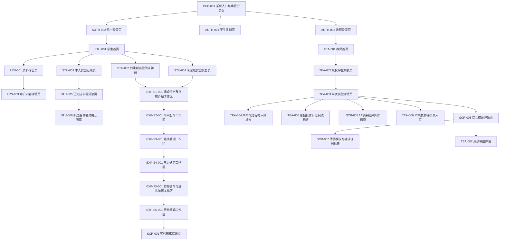

# 通用功能与页面清单

## 1. 文档目标与依据

本文档是“大件运输虚拟仿真实验教学系统”第1周第4天页面基线，目标是把登录、学习、提示、日志、实验、成绩和教师端落实为可进入、可鉴权、可恢复、可验收的页面或界面组件，为后续信息架构、低保真原型、路由、权限、数据库和验收设计提供统一编号。

依据为 `article.pdf` 第2—4章、`docs/论文功能映射.md`、`docs/用户与场景.md`、`docs/六阶段实验主流程.md`，以及实施计划第1周第4天“登录、学习、提示、日志、实验、成绩、教师端均有页面入口”的要求。需求属性只使用：论文明确要求、根据论文合理推导、实施计划要求、论文未明确、首版暂不实现。

## 2. 页面范围与设计原则

1. 独立权限、独立路由、可直接恢复或需要浏览器前进/后退的内容定义为独立页面。
2. 同一业务对象下的并列只读视图定义为页面内标签页；短时确认定义为弹窗；不离开实验的辅助内容定义为抽屉；短暂状态反馈定义为浮层提示。
3. 加载、空数据、权限不足、断网、保存失败等定义为状态，不伪装成业务页面；403和404因需独立路由兜底，保留为独立页面。
4. 六阶段各使用一个独立实验工作区页面，内部共享“阶段目标、进度、操作、参数/结果、帮助、错误、保存、提交、继续、回退、重试、通过/失败”框架。
5. 所有“已提交”“阶段通过”“实验完成”均以服务端确认保存为前提；技术异常不计为学生业务错误。
6. 学生只访问本人数据，教师只访问授权范围且原始日志只读；已完成实验只读，重做创建新尝试。

## 3. 角色与页面权限

| 角色 | 可进入范围 | 禁止范围 | 强制校验 |
|---|---|---|---|
| 学生 | 学生首页、资料库、本人实验/日志/结果、获准发布的本人成绩 | 教师端、其他学生数据、原始日志编辑、已完成尝试编辑 | 会话角色、学生ID、尝试归属、阶段顺序、完成只读 |
| 教师 | 教师首页、授权学生列表、授权实验详情、只读日志、评价与成绩、导出 | 未授权学生、替学生操作、修改原始日志、直接改总分 | 教师角色、授权范围、目标学生/尝试归属、写入对象类型 |
| 评价系统 | 无人工登录页面；后台生成系统评价与综合成绩 | 猜测缺失规则、覆盖原始日志 | 数据完整性、规则/权重版本、幂等键 |
| 系统管理员 | 首版无独立业务页面 | 未确认前不得默认读写学生日志、评价或成绩 | 具体权限待确认 |

## 4. 页面分类与编号规则

编号按类别独立连续：PUB公共入口；AUTH注册、登录和会话；STU学生首页、记录和结果入口；LRN知识学习；EXP-S1至EXP-S6为六阶段；HLP提示；LOG日志与恢复；SCR评价与成绩；TEA教师端；ERR通用异常。编号不得复用或跳号。

页面类型统计口径：独立页面26项、页面内标签页6项、弹窗6项、抽屉2项、浮层提示1项、错误状态6项、加载状态2项、空状态1项。弹窗/抽屉/浮层共9项；通用状态（错误、加载、空状态及断网浮层）共10项。

## 5. 公共页面与通用状态

- `PUB-001 系统入口与角色分流页`是公开根入口，提供学生登录、学生注册和教师登录入口，不直接暴露任何业务数据。
- 403、404、保存失败、资源失败、断网、恢复加载、非法跳步、无数据分别由`ERR-001`至`ERR-008`承载。
- 通用应用框架中的角色导航不是独立台账条目；它随登录角色生成，并在所有受保护路由再次校验权限。

## 6. 注册、登录与会话页面

- 学生注册、统一登录、教师登录为独立页面；教师账号如何创建不在页面中虚构。
- 登录失败是登录页内错误状态；会话失效使用阻断弹窗，确认后带安全返回地址跳转登录。
- 学生登录成功进入学生首页；教师登录成功进入教师首页。无法确认原角色时返回统一登录，不猜测身份。

## 7. 学生首页与实验入口

学生首页同时提供创建、继续、恢复、记录与资料库入口。创建和重做均先确认，创建成功后进入第一阶段；继续与恢复进入最近成功保存点。实验记录只列本人尝试；已完成尝试进入只读查看，重做产生新尝试ID且旧记录不变。

## 8. 知识学习页面

资料库首页与知识内容详情为独立页面，章节目录作为资料库内标签页。实验内资料库使用抽屉，不改变实验路由；关闭后回到原阶段、原步骤和原保存状态。资源失败统一进入`ERR-004`，不记为学习成功或学生业务错误。

## 9. 六阶段实验页面

六阶段名称与顺序固定：

1. 运输任务及货物介绍
2. 简单配车
3. 路线勘测
4. 车组确定
5. 货物装车与绑扎加固
6. 货物运输

每个工作区都必须显示阶段目标、六阶段进度、当前步骤、学生操作区、参数/结果区、帮助、保存状态、提交、继续条件、回退、重试和通过/失败反馈。未通过前序阶段访问后续路由时进入`ERR-007`；修改上游后，下游显示失效并回到最早失效阶段重新校验。第六阶段成功后进入`SCR-001`，失败按既有唯一目标回退。

## 10. 操作提示界面

主动帮助使用抽屉；首次阻断错误和同类错误升级使用弹窗。提示关闭后返回原步骤，不填值、不替学生点击、不自动完成。每次记录提示ID、类型、阶段、步骤、规则ID、同类次数和时间；主动、自动、升级提示分别统计，最终计分口径待确认。

## 11. 日志与恢复界面

学生本人操作记录为只读独立页面，阶段时间线为页内标签；教师只读日志位于`TEA-005`。错误、提示、回退、重试、保存、网络与技术异常按时间排序。日志保存失败显示待重试状态，并使用原事件ID重试；不得把技术异常显示为业务错误或重复计分。

## 12. 实验结果与成绩页面

实验完成结果页至少展示完成状态与六阶段摘要。评价数据生成期间显示加载状态，缺失或失败显示错误状态。系统评价详情、综合成绩详情和薄弱模块证据当前只向授权教师开放；学生最终成绩是否可见为“论文未明确”，默认不开放接口。本文不设计成绩发布、复核、直接改总分或已完成实验撤回流程。

## 13. 教师端页面

教师从首页进入授权学生列表，搜索/筛选后打开单次实验详情；详情内有六阶段时间线和原始日志只读标签，并可进入14项系统评价、12项教师评价、综合成绩/薄弱模块和成绩导出。越权、无数据、数据缺失与保存失败必须区分；任何页面和接口均不得提供原始日志编辑能力。

## 14. 页面状态与异常处理

| 状态 | 展示与动作 | 恢复目标 | 是否计业务错误 |
|---|---|---|---|
| 加载中 | 骨架/进度、加载对象、取消或重试 | 原入口或最近保存点 | 否 |
| 空数据 | 说明无记录与可执行下一步 | 调整筛选、创建实验或返回 | 否 |
| 权限不足 | 不泄露目标数据，显示安全返回入口 | 当前角色首页 | 否 |
| 资源加载失败 | 标识资源、重试、返回 | 原页面/阶段加载入口 | 否 |
| 保存失败 | 明示未保存/待重试，不显示已提交 | 原保存点，原幂等键重试 | 否 |
| 网络中断 | 全局浮层，禁用不可安全提交动作 | 重连后恢复加载 | 否 |
| 业务规则失败 | 原因、修正方法、唯一回退目标 | 当前步骤或既定上游步骤 | 是 |
| 非法跳步 | 拒绝前进，不泄露后续数据 | 当前合法阶段 | 否 |

## 15. 页面入口关系

## 16. 页面总台账

“生命周期状态”沿用《六阶段实验主流程》的15个状态；“—”仅表示该界面不改变生命周期，不表示缺少恢复路径。

| 页面编号 | 页面名称 | 所属端 | 页面类型 | 使用角色 | 页面目标 | 进入入口 | 前置条件 | 核心展示内容 | 核心操作 | 输入数据 | 输出数据 | 系统判断 | 成功去向 | 失败状态 | 回退或恢复目标 | 权限要求 | 保存要求 | 日志要求 | 对应生命周期状态 | 是否首版实现 | 优先级 | 验收标准 | 需求属性 | 需求来源 | 备注 |
|---|---|---|---|---|---|---|---|---|---|---|---|---|---|---|---|---|---|---|---|---|---|---|---|---|---|
| PUB-001 | 系统入口与角色分流页 | 公共 | 独立页面 | 访客 | 提供认证入口 | 根地址 | 系统可访问 | 项目说明、学生登录/注册、教师登录 | 选择入口 | 目标角色入口 | 目标登录路由 | 入口是否有效 | AUTH-001/002/003 | ERR-004 | 本页重试 | 公开；不展示业务数据 | 无 | 记录技术访问可选 | 未开始 | 是 | P0 | 三类入口可达且无数据泄露 | 实施计划要求 | 第4天、映射GEN-003 | 不提供管理员入口 |
| AUTH-001 | 学生注册页 | 公共/学生 | 独立页面 | 访客学生 | 以学号建立账户 | PUB-001、AUTH-002 | 未登录 | 学号、密码、注册说明 | 提交、返回登录 | 学号、密码 | 注册结果 | 非空、唯一；其余规则未明确 | AUTH-002 | AUTH-004 | 保留学号并修正重试 | 仅未登录访客 | 成功后保存用户；不得明文密码 | 注册成功/失败时间与结果 | 未开始 | 是 | P0 | 合法注册成功；空值/重复拒绝 | 论文明确要求 | 论文2.3.5；映射GEN-001 | 审批/复杂度待确认 |
| AUTH-002 | 统一登录页 | 公共 | 独立页面 | 学生、教师 | 认证并按角色分流 | PUB-001、会话失效 | 未登录或会话失效 | 账号密码、教师入口 | 登录、去注册、教师登录 | 账号、密码 | 会话、角色路由 | 凭据、角色、会话状态 | STU-001或TEA-001 | AUTH-004 | 修正重试或返回PUB-001 | 认证成功后最小权限 | 会话成功后保存 | 登录时间、结果；不记明文密码 | 未开始/暂停或等待恢复 | 是 | P0 | 正确凭据分流；错误不建会话 | 论文明确要求；合理推导 | 论文2.2、3.4.1；计划第25—26天 | 可作为统一入口 |
| AUTH-003 | 教师登录页 | 教师 | 独立页面 | 教师 | 建立教师会话 | PUB-001、AUTH-002 | 已有教师账号；创建方式待确认 | 教师账号密码、未决说明 | 登录、返回统一登录 | 账号、密码 | 教师会话 | 凭据与教师角色 | TEA-001 | AUTH-004 | 修正重试或AUTH-002 | 必须为教师角色 | 保存会话 | 登录结果与时间 | 未开始/暂停或等待恢复 | 是 | P0 | 非教师凭据不能进入教师端 | 实施计划要求；论文未明确 | 用户与场景Q-01；计划第25—26天 | 不设计教师注册 |
| AUTH-004 | 登录失败状态 | 公共 | 错误状态 | 访客 | 明确反馈且不泄露账户 | AUTH-001/002/003提交失败 | 校验失败 | 字段级或通用错误 | 修改、重试 | 失败类型 | 可执行反馈 | 空值、重复、凭据不匹配 | 原认证页成功路径 | 重复失败 | 原认证页 | 无会话 | 不保存错误会话 | 失败类型、时间；不得记录密码 | 未开始 | 是 | P0 | 三类失败可辨认且无账户枚举泄露 | 论文明确要求；合理推导 | 映射GEN-001—002 | 锁定/找回未明确 |
| AUTH-005 | 会话失效与重新登录弹窗 | 公共/受保护端 | 弹窗 | 学生、教师 | 阻断操作并安全重登 | 任一受保护页面检测失效 | 会话无效 | 失效说明、最近保存点、重新登录 | 确认重登 | 当前路由、尝试ID | 安全返回地址 | 返回地址归属与可恢复性 | AUTH-002/003 | 重登失败 | 登录后STU-004或原教师页 | 不展示失效后的受保护数据 | 保存点不得前移 | session_expired、重登与恢复 | 暂停或等待恢复 | 是 | P0 | 失效后不能继续写；重登回最近保存点 | 实施计划要求 | 计划第25天；主流程ERR-003 | 返回地址需防越权 |
| STU-001 | 学生首页 | 学生 | 独立页面 | 学生 | 汇集学习和实验入口 | AUTH-002登录成功 | 有效学生会话 | 最近尝试、创建/继续、记录、资料库 | 创建、继续、恢复、查看记录/资料 | 学生ID | 本人尝试摘要 | 归属、状态、是否可继续 | STU-002/003/004、LRN-001 | ERR-008/004 | 刷新或重新登录 | 仅本人数据 | 只读聚合 | 首页访问与入口点击 | 未开始/进行中/暂停或等待恢复 | 是 | P0 | 七类核心入口可达且不出现他人数据 | 实施计划要求 | 第4天；用户与场景STU-001—003 | 不展示未发布最终成绩 |
| STU-002 | 创建新实验确认弹窗 | 学生 | 弹窗 | 学生 | 创建唯一的新尝试 | STU-001 | 有效学生会话、案例可用 | 案例摘要、创建说明 | 确认、取消 | 案例ID、请求ID | 新尝试ID | 角色、案例、幂等 | EXP-S1-001 | ERR-003/004 | STU-001或原键重试 | 仅为本人创建 | 创建成功须持久化 | attempt_create_requested/created | 未开始→创建实验→加载中 | 是 | P0 | 同请求只创建一个本人尝试 | 实施计划要求 | 主流程ENT-001—002 | 首版一个案例 |
| STU-003 | 本人实验记录页 | 学生 | 独立页面 | 学生 | 查看本人全部尝试 | STU-001 | 有效学生会话 | 状态、阶段、时间、尝试次数 | 筛选、打开、继续、只读查看 | 本人ID、筛选 | 尝试列表 | 归属、状态 | STU-004或STU-005 | ERR-008/004 | 调整筛选或STU-001 | 仅本人 | 只读 | 查询与打开记录 | 任意本人生命周期状态 | 是 | P0 | 进行中与完成尝试去向正确；无他人记录 | 根据论文合理推导；计划要求 | 用户与场景§3.4；主流程§4 | 完成记录不可编辑 |
| STU-004 | 未完成实验恢复页 | 学生 | 独立页面 | 学生 | 校验并恢复最近保存点 | STU-001/003、重登后 | 本人未完成尝试 | 当前阶段、保存时间、待重试提示 | 继续、返回记录 | 尝试ID、版本 | 恢复目标 | 归属、未完成、快照一致 | 对应EXP-Sx-001 | ERR-006/003/004 | 最近保存点或STU-003 | 本人未完成尝试 | 恢复不改写通过状态 | resume_requested/loaded | 暂停或等待恢复→加载中→进行中 | 是 | P0 | 刷新、断网、重登均恢复一致且不重复计分 | 实施计划要求 | 主流程ENT-003—004、ERR-002—003 | 未保存草稿不冒充提交 |
| STU-005 | 已完成实验只读页 | 学生 | 独立页面 | 学生 | 查看锁定尝试并提供重做入口 | STU-003、SCR-001 | 本人已完成尝试 | 六阶段结果、完成时间、日志/重做入口 | 查看、发起重做 | 尝试ID | 只读详情 | 归属、完成锁定 | LOG-001、STU-006 | ERR-001/004 | STU-003 | 仅本人；全部只读 | 禁止写入原尝试 | 查看与拒绝写入审计 | 已提交实验只读 | 是 | P0 | 修改全部拒绝；旧结果保持不变 | 实施计划要求 | 主流程END-003—004 | 最终成绩默认不展示 |
| STU-006 | 新建重做尝试确认弹窗 | 学生 | 弹窗 | 学生 | 从完成记录创建新尝试 | STU-005 | 本人已完成尝试 | 新旧尝试隔离说明 | 确认、取消 | 旧尝试ID、请求ID | 新尝试ID | 归属、幂等、旧记录锁定 | EXP-S1-001 | 创建失败 | STU-005或原键重试 | 仅本人 | 新建记录；不复制通过状态 | redo_requested/created | 已提交实验只读→新建重做尝试→加载中 | 是 | P0 | 新ID从第一阶段开始，旧日志不变 | 实施计划要求 | 主流程END-004—005 | 不是撤回 |
| LRN-001 | 资料库首页 | 学生 | 独立页面 | 学生 | 提供知识主题入口 | STU-001、实验工作区 | 有效学生会话 | 安全、车组、方案、校核等主题 | 选主题、打开目录/内容 | 学生ID、内容目录 | 内容入口 | 章节发布与资源可用 | LRN-002/003 | ERR-004/008 | STU-001或重试 | 学生；教师无编辑需求 | 可记学习进入时间 | 进入/退出与主题 | 任意非锁定业务状态 | 是 | P0 | 四类论文主题有可读入口 | 论文明确要求 | 论文2.2、2.3.5、3.4.1 | 视频仅有合法素材时启用 |
| LRN-002 | 章节目录标签 | 学生 | 页面内标签页 | 学生 | 快速定位章节 | LRN-001 | 目录已加载 | 章节层级、已读状态 | 选择章节 | 目录、学生进度 | 目标章节ID | 章节有效性 | LRN-003 | ERR-004 | LRN-001 | 学生本人进度 | 保存已读状态 | chapter_selected | — | 是 | P1 | 点击后准确定位且可回目录 | 论文明确要求 | 映射GEN-006 | 不单独设路由可接受 |
| LRN-003 | 知识内容详情页 | 学生 | 独立页面 | 学生 | 阅读章节内容 | LRN-001/002 | 章节存在且可访问 | 标题、图文、来源、前后章 | 阅读、前后章、返回 | 章节ID | 学习活动 | 内容与资源有效 | LRN-001或下一章 | ERR-004 | 目录或最近可用内容 | 学生 | 保存阅读进度 | 章节、进入/退出、时长 | — | 是 | P0 | 内容可读、导航正确、失败不记有效学习 | 论文明确要求；计划要求 | 映射GEN-005—006；计划第47天 | 笔记独立页面未由本任务确认 |
| LRN-004 | 实验内资料库抽屉 | 学生/实验 | 抽屉 | 学生 | 实验中查阅且不丢状态 | 任一EXP工作区资料库按钮 | 本人进行中尝试 | 目录、当前步骤推荐内容 | 阅读、关闭返回 | 阶段、步骤、章节 | 学习日志、原步骤 | 当前尝试与返回上下文 | 原EXP工作区原步骤 | ERR-004 | 原实验保存点 | 本人尝试 | 不改实验状态；学习可保存 | 打开/关闭、章节、时长 | 进行中/回退修改 | 是 | P0 | 六阶段均可打开；关闭后状态不丢 | 论文明确要求；计划要求 | 映射GEN-004；用户与场景STU-002 | 不遮蔽保存状态 |
| EXP-S1-001 | 运输任务及货物介绍工作区 | 学生/实验 | 独立页面 | 学生 | 理解任务和货物参数 | STU-002/004/006 | 本人尝试、阶段1、资源可用 | 目标、进度、任务参数、360°模型、结果/保存区 | 查看、缩放、帮助、确认、提交、重试 | 任务/货物版本、确认 | 阶段1快照 | 归属、顺序、必需字段、模型绑定 | EXP-S2-001 | 阶段失败/ERR-003/004 | 本阶段或最近保存点 | 本人可编辑；教师只读 | 保存确认和通过快照 | 查看、帮助、提交、失败/通过 | 进行中→校验中→通过/失败 | 是 | P0 | 目标/操作/参数/帮助/保存/提交/回退齐全；缺字段不继续 | 论文明确要求；合理推导 | 主流程§6；SIM-001—004 | 通过后才进入S2 |
| EXP-S2-001 | 简单配车工作区 | 学生/实验 | 独立页面 | 学生 | 形成初步车组 | EXP-S1-001通过 | 阶段1已保存通过 | 目标、进度、组合教学、车辆参数、方案/结果区 | 选择组合/挂车/牵引车、帮助、提交、回退、重试 | 货物、组合、轴线/纵列、牵引车 | 初步车组快照 | 完整性、尺寸、承载、牵引力 | EXP-S3-001 | 阶段失败/保存失败 | 本阶段选择或保存点 | 本人可编辑；教师只读 | 草稿可存；通过快照必存 | 选择、计算、提示、错误、重试 | 进行中→校验中→通过/失败 | 是 | P0 | 错误方案可解释；未通过不能进S3 | 论文明确要求；计划要求 | 主流程§7；SIM-005—010 | 规则数据不可伪造 |
| EXP-S3-001 | 路线勘测工作区 | 学生/实验 | 独立页面 | 学生 | 完成三路线五类勘测和选线 | EXP-S2-001通过 | 阶段2已保存通过 | 目标、进度、路线/障碍、测量、计算/结果、保存 | 测量、判断、处置、选线、帮助、提交、回退、重试 | 测量值/单位、车组、处置、选线 | 勘测与路线快照 | 完整性、单位、通行/处置；不猜经济公式 | EXP-S4-001 | 阶段失败/规则待确认 | 对应测量或路线选择 | 本人可编辑；教师只读 | 单项草稿和通过快照 | 测量、修改、错误、提示、回退 | 进行中→校验中→通过/失败 | 是 | P0 | 3条路线×5类齐全；非法选线不可继续 | 论文明确要求；论文未明确 | 主流程§8；SIM-011—018 | 经济性待确认 |
| EXP-S4-001 | 车组确定工作区 | 学生/实验 | 独立页面 | 学生 | 完成正式车组与轴载校核 | EXP-S3-001通过 | 阶段3已保存通过 | 目标、进度、配置、拼接/液压、轴载参数/结果 | 调整、拼接、编点、阀门、帮助、提交、回退、重试 | 路线、车组、回路、阀门、轴载参数 | 正式车组快照 | 路线约束、步骤正确、逐轴不超限 | EXP-S5-001 | 阶段失败/参数缺失 | 当前步骤；超限回挂车参数 | 本人可编辑；教师只读 | 步骤快照；全轴通过后必存 | 动作、计算、超限、回退、重试 | 进行中→待提交→校验中→通过/失败 | 是 | P0 | 任一轴超限回指定步骤；全轴合格才继续 | 论文明确要求；论文未明确 | 主流程§9；SIM-019—023 | 完整案例参数待确认 |
| EXP-S5-001 | 货物装车与绑扎加固工作区 | 学生/实验 | 独立页面 | 学生 | 完成装车与绑扎 | EXP-S4-001通过 | 阶段4已保存通过 | 目标、进度、位置/液压、工具序列、点位/角度、结果 | 调位、选工具/点、帮助、提交、回退、重试 | 位置、读数、工具、点位、布置、角度 | 装车绑扎快照 | 配置规则、固定顺序、倒八字、角度≤60° | EXP-S6-001 | 阶段失败/规则待确认 | 位置、当前工具或绑扎点 | 本人可编辑；教师只读 | 正确步骤和通过结果必存 | 移动、工具、错误、提示、回退 | 进行中→校验中→通过/失败 | 是 | P0 | 错位/错序/错点/>60°均阻断且可恢复 | 论文明确要求；论文未明确 | 主流程§10；SIM-024—027 | 容差/液压区间待确认 |
| EXP-S6-001 | 货物运输工作区 | 学生/实验 | 独立页面 | 学生 | 复验并完成运输 | EXP-S5-001通过 | 前五阶段当前版本有效 | 目标、进度、方案汇总、路线、动画/结果、保存状态 | 复验、帮助、开始运输、回退、重试 | 全阶段版本、路线 | 运输结果、完成键 | 完整性、版本相容、路线正确 | SCR-001 | 阶段失败/动画或保存失败 | 错路线回S3；技术错回保存点 | 本人可编辑；教师只读 | 复验、动画、完成均幂等保存 | 路线判断、动画、回退、完成 | 进行中→通过→六阶段完成 | 是 | P0 | 错路线不完成；正确路线唯一完成；重复不重复计分 | 论文明确要求；计划要求 | 主流程§11；SIM-028 | 上游改动使下游失效 |
| HLP-001 | 学生主动帮助抽屉 | 学生/实验 | 抽屉 | 学生 | 提供当前方法提示 | EXP工作区帮助按钮 | 当前步骤可识别 | 目标、知识点、方法、资料入口 | 查看、关闭、去资料库 | 阶段、步骤、提示ID | 提示事件 | 上下文匹配 | 原步骤 | 提示加载失败 | 原步骤或LRN-004 | 本人尝试 | 不改业务值 | 类型/次数/阶段/步骤/时间 | 进行中/回退修改 | 是 | P0 | 可开关，返回原步，不自动代做 | 论文明确要求 | 主流程HLP-001 | 主动提示单独统计 |
| HLP-002 | 阻断性错误自动提示弹窗 | 学生/实验 | 弹窗 | 学生 | 解释失败并指向唯一恢复 | 业务规则失败自动触发 | 有可定位规则 | 原因、失败输入、修正方法、恢复目标 | 关闭并返回 | 规则、输入、阶段 | 自动提示事件 | 是否阻断、恢复目标 | 指定步骤 | 提示资源失败 | 指定步骤；资源失败可重试 | 本人尝试 | 失败日志先保存 | 规则ID、类型、次数、时间 | 阶段失败→回退修改 | 是 | P0 | 不可绕过；关闭回唯一目标 | 论文明确要求 | 主流程HLP-002 | 不用技术错误文案 |
| HLP-003 | 同类错误升级提示弹窗 | 学生/实验 | 弹窗 | 学生 | 再错时给更具体方法 | 同尝试同规则再次失败 | 同类错误次数≥2 | 更具体说明、资料入口、恢复目标 | 关闭、查资料、重试 | 规则ID、次数 | 升级提示事件 | 同尝试同规则计数 | 指定步骤 | 提示加载失败 | 指定步骤或LRN-004 | 本人尝试 | 不自动填值或提交 | 升级类型/序号/阶段/时间 | 阶段失败→回退修改 | 是 | P1 | 比首次更具体但仍由学生完成 | 论文明确要求；合理推导 | 主流程HLP-003 | 计分口径待确认 |
| LOG-001 | 学生本人操作记录页 | 学生 | 独立页面 | 学生 | 只读查看本人过程证据 | STU-003/005 | 本人尝试存在 | 阶段、动作、错误、提示、回退、重试、时间 | 筛选、展开、返回 | 尝试ID、筛选 | 只读日志 | 归属、完整性、排序 | LOG-002或原详情 | ERR-004/008 | 重试或原详情 | 仅本人只读 | 禁止修改 | 查看审计 | 任意本人状态 | 是 | P1 | 仅本人；事件顺序稳定且不可编辑 | 论文明确要求；合理推导 | 映射LOG-001—005 | 技术异常单独标识 |
| LOG-002 | 阶段时间线标签 | 学生/教师 | 页面内标签页 | 学生、教师 | 按六阶段还原过程 | LOG-001、TEA-003 | 有日志且有权限 | 六阶段节点、错误/提示/回退/重试 | 展开、定位证据 | 尝试ID | 时间线 | 权限、阶段排序、缺口 | 原详情 | 数据缺失 | 原详情或重试 | 学生本人；教师授权只读 | 无写入 | 查看审计 | 任意状态 | 是 | P0 | 六阶段顺序正确，缺口明确不伪装完整 | 论文明确要求 | 映射LOG-008；用户与场景TEA-002 | 共享只读组件 |
| LOG-003 | 日志待重试状态 | 学生/教师 | 错误状态 | 学生、系统 | 显示未确认日志并安全重试 | 日志写入失败 | 有事件ID/批次 | 待重试数量、最近结果 | 重试、继续只读操作 | 事件ID、批次 | 提交状态 | 幂等、是否已成功 | 原业务状态 | 持续失败 | 原业务状态待重试队列 | 不扩大业务权限 | 原事件ID重试且仅一条 | log_save_failed/retried | 暂停或等待恢复/原状态 | 是 | P0 | 重试不丢关键日志、不重复计数 | 实施计划要求 | 主流程ERR-006；计划第100天 | 续传交互细节待确认 |
| SCR-001 | 实验完成结果页 | 学生/教师 | 独立页面 | 学生、教师 | 确认六阶段完成并进入评价衔接 | EXP-S6-001成功、STU-005 | 完成记录保存成功 | 完成状态、时间、六阶段摘要、评价状态 | 查看摘要/日志、返回记录 | 尝试ID | 完成结果 | 归属、完成键、评价状态 | SCR-002/003/004 | ERR-003/004 | STU-005或重试 | 学生本人；教师授权只读 | 只读；完成记录唯一 | 查看与完成审计 | 六阶段完成→评价数据待生成→已完成 | 是 | P0 | 六阶段摘要齐全；未保存不显示完成 | 实施计划要求；合理推导 | 主流程END-001—003 | 不等于成绩发布 |
| SCR-002 | 六阶段结果摘要标签 | 学生/教师 | 页面内标签页 | 学生、教师 | 汇总各阶段结果 | SCR-001、TEA-003 | 完成或只读尝试 | 六阶段状态、关键输入/结论、失效标识 | 展开、去日志 | 阶段快照 | 摘要 | 权限、版本、完整性 | LOG-002或原页 | 数据缺失 | 原页或SCR-004 | 本人/授权只读 | 无写入 | 查看审计 | 六阶段完成及以后 | 是 | P0 | 六阶段名称顺序一致且结果可追溯 | 根据论文合理推导 | 主流程§5—11 | 不显示伪成绩 |
| SCR-003 | 评价数据待生成状态 | 成绩 | 加载状态 | 学生、教师 | 表示评价任务尚未完成 | SCR-001 | 评价任务存在 | 状态、触发时间、刷新/返回 | 刷新、返回 | 尝试ID、任务ID | 最新状态 | 任务归属、幂等、完成性 | SCR-005或SCR-006 | SCR-004 | SCR-001 | 学生只见状态；教师授权 | 不创建重复任务 | evaluation_pending/retry | 评价数据待生成 | 是 | P0 | 不伪造分数；重复刷新不重复任务 | 论文明确要求；合理推导 | 主流程END-001—002 | 学生不可据此读最终成绩 |
| SCR-004 | 评价数据缺失或生成失败状态 | 成绩 | 错误状态 | 教师；学生仅见概括状态 | 明确缺失并阻止伪结果 | SCR-003/005/006 | 聚合失败或缺项 | 缺项/冲突清单、重试状态 | 教师重试或返回 | 尝试、规则版本、缺项 | 问题记录 | 完整性、唯一分档、权重版本 | SCR-003/005/006 | 持续失败 | TEA-003或原页 | 教师授权；学生不见敏感细节 | 不写伪分，不补0 | 失败、版本、重试 | 评价数据待生成 | 是 | P0 | 缺项不按0；失败不展示旧结果为当前 | 根据论文合理推导 | 用户与场景ERR-009 | 人工处理入口待确认 |
| SCR-005 | 14项系统评价详情页 | 教师/成绩 | 独立页面 | 教师 | 查看客观评价依据 | TEA-003 | 授权且聚合完成 | 14项原始值、区间、分值、权重、来源 | 展开、去证据、返回 | 学生ID、尝试ID | 只读评价 | 权限、完整性、唯一分档、版本 | SCR-006/007 | SCR-004/ERR-001 | TEA-003 | 仅授权教师只读；学生默认无权 | 禁止人工覆盖 | 查看审计 | 实验已完成/只读 | 是 | P0 | 恰14项且逐项可解释；冲突不出分 | 论文明确要求 | 论文4.3.3—4.3.4 | 学生可见性待确认 |
| SCR-006 | 综合成绩详情页 | 教师/成绩 | 独立页面 | 教师；学生条件未开放 | 展示26项、四维和总分 | TEA-003、SCR-005、TEA-006保存后 | 26项齐全、权重有效 | 总分、四维、26项贡献、版本 | 查看证据、导出 | 成绩记录ID | 可复算成绩 | 权限、完整性、公式、版本 | SCR-007/TEA-007 | SCR-004/ERR-001 | TEA-003 | 授权教师只读；学生默认拒绝 | 不直接编辑总分 | 查看与重算审计 | 实验已完成/只读 | 是 | P0 | 固定样例可复算；未发布学生接口拒绝 | 论文明确要求；论文未明确 | 论文4.3.2—4.3.4；Q-04/05 | 舍入/发布流程待确认 |
| SCR-007 | 薄弱模块与错误证据标签 | 教师/成绩 | 页面内标签页 | 教师 | 从低分项追溯过程证据 | SCR-005/006 | 授权且评价可用 | 低分指标、阶段、错误/提示/日志链接 | 筛选、打开证据 | 评价、日志 | 证据链 | 关联关系、权限、日志存在 | TEA-005/LOG-002 | SCR-004/ERR-008 | SCR-006或TEA-003 | 授权教师只读 | 无写入 | 查看审计 | 实验已完成/只读 | 是 | P0 | 薄弱点至少追溯到分项和原日志 | 论文明确要求；合理推导 | 论文2.1、4.3.4 | 不自动生成教学处方 |
| TEA-001 | 教师首页 | 教师 | 独立页面 | 教师 | 汇集教学管理入口 | AUTH-003成功 | 有效教师会话 | 授权学生概览、待评价、成绩入口 | 去学生列表、待评价、导出 | 教师ID | 授权摘要 | 教师角色、授权范围 | TEA-002 | ERR-001/004/008 | 重新登录或重试 | 仅教师；只返回授权数据 | 只读聚合 | 页面访问 | — | 是 | P0 | 学生账号不能进入；入口均可达 | 实施计划要求 | 计划第106—110天 | 班级/课程归属待确认 |
| TEA-002 | 授权学生列表页 | 教师 | 独立页面 | 教师 | 搜索筛选授权学生 | TEA-001 | 教师有效且有授权范围 | 学生、实验状态、搜索/筛选 | 搜索、筛选、打开详情、导出 | 姓名/班级/状态、教师ID | 授权结果 | 逐条授权、筛选合法 | TEA-003/007 | ERR-001/004/008 | 调整筛选或TEA-001 | 仅授权范围 | 只读查询 | 查询与访问审计 | — | 是 | P0 | 搜索筛选有效；直访和列表均无越权 | 论文明确模块；计划要求 | 论文4.3.4；计划第106天 | 授权依据待确认 |
| TEA-003 | 单次实验详情页 | 教师 | 独立页面 | 教师 | 汇集一次实验的只读过程与评价入口 | TEA-002 | 学生和尝试均授权 | 尝试摘要、六阶段、日志、评价、成绩入口 | 切换标签、进评价/成绩 | 学生ID、尝试ID | 只读详情 | 权限、归属、数据存在 | TEA-004/005/006、SCR-005/006 | ERR-001/004/008 | TEA-002或重试 | 授权教师只读实验数据 | 禁止写学生阶段/日志 | 访问审计 | 任意尝试状态 | 是 | P0 | 六阶段、日志、14项、12项、成绩入口明确 | 论文明确要求 | 用户与场景TEA-002—005 | 无替学生操作按钮 |
| TEA-004 | 六阶段过程时间线标签 | 教师 | 页面内标签页 | 教师 | 按阶段还原学生过程 | TEA-003 | 授权且有阶段数据 | 六阶段输入、判断、失败、耗时、结果 | 展开、定位日志 | 尝试ID | 时间线 | 权限、排序、完整性 | TEA-005或原详情 | ERR-008/004 | TEA-003 | 授权只读 | 无写入 | 查看审计 | 任意状态 | 是 | P0 | 六阶段顺序稳定，缺失明确 | 论文明确要求 | 映射TEA-002；用户与场景TEA-002 | 可复用LOG-002呈现层 |
| TEA-005 | 原始操作日志只读标签 | 教师 | 页面内标签页 | 教师 | 查看原始事件且不可修改 | TEA-003/004/SCR-007 | 授权且日志存在 | 动作、输入摘要、判断、错误、提示、回退、重试、时间 | 筛选、展开、返回 | 尝试ID、筛选 | 只读日志 | 权限、排序、缺口 | TEA-003 | ERR-008/004 | TEA-003或重试 | 授权教师只读 | 接口和界面均禁止增删改 | 查看审计 | 任意状态 | 是 | P0 | 无编辑控件；写接口拒绝；可定位证据 | 论文明确要求；合理推导 | 论文2.2、3.4.1、4.3.4 | 技术异常不算学生错误 |
| TEA-006 | 12项教师评价录入页 | 教师 | 独立页面 | 教师 | 录入主观评价 | TEA-003 | 授权、有评价材料 | A1—A8、B4、D4、D6、D7、评语、保存状态 | 评分、保存、修改 | 12项1—5分、评语 | 评价版本 | 权限、12项齐全、范围、幂等 | SCR-006 | 保存失败/校验失败 | 本页草稿或TEA-003 | 授权教师可写教师评价；不可写日志 | 保存评分人/时间/版本；失败不完整 | 保存、修改、重算触发 | 实验已完成/只读 | 是 | P0 | 12项不多不少；缺项/越界不完成；保存失败可恢复 | 论文明确要求；PCR-008 | 论文4.3.3—4.3.4；EVAL-POL-001 | 5分最好、1分最低 |
| TEA-007 | 成绩导出弹窗 | 教师 | 弹窗 | 教师 | 导出当前授权筛选结果 | TEA-002/SCR-006 | 授权范围内有成绩 | 范围、字段、数量、格式 | 预览、确认、取消 | 筛选、格式 | 文件/失败结果 | 逐条授权、字段、编码 | 原页面并获得文件 | 导出失败/越权 | 原页面修改筛选重试 | 仅授权教师 | 保存导出任务审计；不改成绩 | 发起人、范围、时间、结果 | — | 是 | P1 | 行数匹配、中文正常、零越权；不触发发布 | 实施计划要求；合理推导 | 计划第110天 | 首版至少CSV |
| ERR-001 | 无权限页面 | 公共/受保护端 | 独立页面 | 学生、教师 | 拒绝越权且安全返回 | 路由/资源鉴权失败 | 请求已被拒绝 | 权限不足说明、返回入口 | 返回角色首页/登录 | 角色、目标类型；不展示目标内容 | 拒绝结果 | 角色、归属、教师授权 | STU-001/TEA-001/AUTH-002 | 重复越权 | 当前角色首页 | 不泄露资源存在性和内容 | 无业务保存 | access_denied审计 | 当前状态不变 | 是 | P0 | 学生不能进教师端/他人实验；教师不能看未授权学生 | 根据论文合理推导；计划要求 | 权限矩阵；计划第24—26天 | 403语义 |
| ERR-002 | 页面不存在状态 | 公共 | 独立页面 | 所有人 | 处理未知路由 | 路由未匹配 | 无 | 404说明、首页/后退入口 | 返回首页或后退 | 原URL | 安全去向 | 当前会话角色 | 角色首页或PUB-001 | 返回失败 | PUB-001 | 不展示受保护导航给访客 | 无 | 可记录404 | 当前状态不变 | 是 | P1 | 任意未知URL可恢复且不泄露路由数据 | 实施计划要求 | 计划第17天 | 404语义 |
| ERR-003 | 保存失败状态 | 通用 | 错误状态 | 学生、教师 | 明示未保存并重试 | 任一写入未确认 | 有原请求/幂等键 | 失败对象、未保存、重试/返回 | 原键重试、返回保存点 | 请求ID、快照版本 | 最新保存状态 | 是否已持久化、幂等 | 原业务成功路径 | 持续失败 | 最近成功保存点 | 保持原业务权限 | 未确认不得标已提交/完成 | save_failed/retried | 暂停或等待恢复/原状态 | 是 | P0 | 失败不前移状态；重试只保存一次 | 实施计划要求 | 主流程FR-14—16 | 教师评分同样适用 |
| ERR-004 | 资源加载失败状态 | 通用 | 错误状态 | 学生、教师 | 标识失败资源并提供恢复 | 页面/场景/资料加载失败 | 有安全返回点 | 资源名、重试、返回 | 重试、返回 | 资源ID、版本 | 加载结果 | 必需性、版本、可用性 | 原页面/阶段 | 持续失败 | 原入口或最近保存点 | 沿用原页面权限 | 不改业务状态 | resource_load_failed/retried | 加载中/暂停或等待恢复 | 是 | P0 | 不进入空场景；失败不破坏数据、不算业务错 | 实施计划要求 | 主流程ERR-004；计划第118天 | 技术异常 |
| ERR-005 | 网络中断与恢复浮层 | 通用 | 浮层提示 | 学生、教师 | 全局反馈连接状态 | 网络状态变化 | 当前页面已加载 | 离线、待同步、恢复中/已恢复 | 重试安全请求、等待 | 网络状态、待重试数 | 恢复事件 | 在线状态、请求是否可幂等 | ERR-006或原页面 | 长期离线 | 最近保存点 | 不改变原权限 | 未确认写入保持待重试 | connection_interrupted/restored | 暂停或等待恢复 | 是 | P0 | 离线不显示成功；恢复后不重复日志/计分 | 实施计划要求 | 主流程ERR-002—003 | 续传细节待确认 |
| ERR-006 | 恢复加载状态 | 通用 | 加载状态 | 学生、教师 | 重连/重登后校验恢复点 | AUTH-005、ERR-005、STU-004 | 网络和身份恢复 | 身份、资源、保存点校验进度 | 等待、失败返回 | 尝试ID、版本、待重试队列 | 恢复目标 | 归属、权限、版本、幂等 | 原页面/对应EXP | ERR-001/003/004 | 最近成功保存点 | 重新执行完整鉴权 | 不前移未确认状态 | recovery_started/completed | 加载中 | 是 | P0 | 返回一致保存点且无越权、无重复计分 | 实施计划要求 | 主流程ENT-004、ERR-003 | 教师恢复原只读页 |
| ERR-007 | 非法跳步拒绝状态 | 学生/实验 | 错误状态 | 学生 | 拒绝未满足前置的阶段访问 | 直接URL/按钮访问后续阶段 | 前序未通过或下游失效 | 原因、当前合法阶段、返回入口 | 返回当前阶段 | 尝试、目标阶段 | 拒绝结果 | 归属、顺序、有效版本 | 当前合法EXP | 重复非法请求 | 当前合法阶段 | 仅本人也须顺序合法 | 状态不变 | illegal_transition_rejected | 当前状态不变 | 是 | P0 | 不显示后续数据；状态不前移；可回合法阶段 | 根据论文合理推导 | 主流程ERR-008、FR-11 | 不计专业错误 |
| ERR-008 | 无数据空状态 | 通用 | 空状态 | 学生、教师 | 区分真空与加载/权限错误 | 合法查询返回0项 | 查询成功且有权限 | 无记录说明、可执行下一步 | 创建、清筛选、返回 | 查询条件 | 空结果 | 查询成功、权限有效、数量0 | STU-002/原列表 | 查询失败转ERR-004 | 原页面或创建入口 | 仅显示授权范围的空结果 | 无 | 查询结果可审计 | 当前状态不变 | 是 | P1 | 空数据不冒充权限/加载失败；有明确下一步 | 根据论文合理推导 | 用户与场景TEA-001、异常§10 | 教师无授权应走ERR-001而非空状态 |

## 17. 待确认事项

| 编号 | 待确认事项 | 当前页面基线处理 | 影响页面 |
|---|---|---|---|
| Q-01 | 教师登录和账号创建方式 | 仅提供教师登录，不提供教师注册 | AUTH-003 |
| Q-02 | 教师授权学生范围 | 强制“无授权即拒绝”，授权模型不虚构 | TEA-001—005、SCR-005—007 |
| Q-03 | 班级和课程归属 | 筛选字段可预留，不定义实体关系 | TEA-002、TEA-007 |
| Q-04 | 学生最终成绩查看权限 | 默认只见完成状态，不开放成绩接口 | SCR-001、SCR-005—007 |
| Q-05 | 成绩发布、复核和修改流程 | 不提供发布、复核、直接改总分页面 | SCR、TEA |
| Q-06 | 已完成实验是否允许撤回 | 不提供撤回；重做只建新尝试 | STU-005—006 |
| Q-07 | 管理员具体页面和权限 | 首版不设独立管理员业务端 | PUB、权限体系 |
| Q-08 | 自动保存频率 | 关键提交/通过必存；周期频率不规定 | EXP、ERR-003 |
| Q-09 | 日志断网续传的页面交互 | 固化待重试、幂等和不重复；队列细节待定 | LOG-003、ERR-005—006 |
| Q-10 | 页面是否需要单独的暂停按钮 | 当前允许安全离开；不新增独立暂停业务规则 | EXP、STU-004 |
| Q-11 | 提示次数的最终计分口径 | EVAL-POL-001规定三类均计B5，按同一幂等事件去重；原始类型仍分别保存 | HLP-001—003 |
| Q-12 | 评价数据生成失败后的人工处理入口 | 首版显示问题与重试；处理角色/入口待定 | SCR-004 |

## 18. 首版范围与排除范围

首版包含本文50项台账：公共/认证、学生入口、资料库、六阶段工作区、提示、日志/恢复、结果/评价/成绩、教师端和通用异常。学生最终成绩页面仅保留权限边界，不视为向学生开放。

首版排除：VR或头显专用页面、多人同步实验、即时聊天、移动端专用页面、开放世界、多案例编辑器、排行榜、AI辅导、德尔菲问卷管理、AHP现场计算工具、工程级有限元或桥梁分析页面；同时不暗中实现未确认的管理员端、成绩发布/复核、完成撤回、密码找回/锁定流程。

## 19. 与后续任务的衔接

- 第8天信息架构直接使用本文编号作为节点，学生主导航控制在两层内。
- 第9—10天低保真原型逐项呈现台账中的展示、操作、状态与恢复目标。
- 第11天数据库设计据“输入/输出、保存、日志”字段映射实体和关系。
- 第12天状态机以“生命周期状态、系统判断、成功去向、失败恢复”生成转换。
- 第13天验收清单以每条验收标准建立路由、权限、状态和数据用例。
- 第17天路由实现必须保持独立页面与标签/弹窗/抽屉/状态边界，不得随意升降级。

## 20. 第4天验收结果

| 验收项 | 结果 | 证据 |
|---|---|---|
| 20个规定标题齐全 | 通过 | §1—§20连续且名称一致 |
| 七类核心功能均有入口 | 通过 | AUTH、LRN、HLP、LOG、EXP、SCR、TEA台账及§15 |
| 六阶段名称和顺序一致 | 通过 | §9、EXP-S1—S6及Mermaid |
| 首版条目有入口、成功去向、失败与恢复 | 通过 | §16共50条，相关列均已填写 |
| 学生/教师权限无越权 | 通过 | §3、ERR-001、STU与TEA权限列 |
| 已完成只读、重做建新尝试 | 通过 | STU-005—006 |
| 非法跳步明确拒绝 | 通过 | ERR-007及六阶段前置条件 |
| 加载、空、权限、断网、保存失败均覆盖 | 通过 | ERR-001、003—006、008及SCR状态 |
| 页面与组件边界清楚 | 通过 | §2、§4及页面类型列 |
| 每个首版条目有可执行验收标准 | 通过 | §16验收标准列 |
| 每项有需求属性和来源 | 通过 | §16最后三列 |
| 未伪造成绩发布或专业规则 | 通过 | §12、§17、§18及相关备注 |
| Mermaid语法闭合且名称一致 | 通过 | §15共1个闭合代码块 |
| 编号唯一且分类内连续 | 通过 | §16：PUB 1、AUTH 5、STU 6、LRN 4、六个EXP各1、HLP 3、LOG 3、SCR 7、TEA 7、ERR 8 |
| Markdown台账列数一致 | 通过 | §16表头及50条数据均为26列 |
| 未修改参考文件或编写业务代码 | 通过 | 本日仅新增本文档 |

**页面条目总数：50。**

**分类计数：PUB 1、AUTH 5、STU 6、LRN 4、EXP-S1 1、EXP-S2 1、EXP-S3 1、EXP-S4 1、EXP-S5 1、EXP-S6 1、HLP 3、LOG 3、SCR 7、TEA 7、ERR 8。**

**独立页面数量：26。**

**弹窗/抽屉/浮层数量：9（弹窗6、抽屉2、浮层1）。**

**通用状态数量：10（错误状态6、加载状态2、空状态1、断网浮层1）。**

**Mermaid图数量：1。**

**待确认事项数量：12。**

**第4天结论：通过验收。**
## 21. PCR-006最小异步页面补充

本节经PDEC-006批准，作为Day4页面候选基线的追加内容；不回写第4天历史验收结论。

| 页面编号 | 页面名称 | 角色 | 入口 | 允许操作 | 保存/状态边界 | 权限与恢复 | 范围 |
|---|---|---|---|---|---|---|---|
| LRN-005 | 学习活动中心 | 学生 | LRN-001、LRN-003 | 创建/保存本人提问或讨论草稿、提交、查看本人参与内容、异步回复 | 草稿/已提交为局部状态；保存确认前不得显示提交；重复提交返回原结果 | 仅本人及可参与范围；断网回最近确认草稿；越权ERR-001 | SUP-005 |
| LRN-006 | 报告提交页 | 学生 | LRN-001、STU-001 | 创建、保存、提交、查看本人预习/实验报告 | 草稿/已提交；未确认内容不得冒充提交 | 仅本人；失败回最近确认草稿 | SUP-005 |
| TEA-008 | 学习活动查看与回复页 | 教师 | TEA-001、TEA-002 | 查看授权范围活动、异步回复 | 不修改学生原文，不改变实验生命周期 | 无授权ERR-001；失败回原主题 | SUP-005 |
| TEA-009 | 报告查看页 | 教师 | TEA-003、TEA-006 | 只读授权学生已提交报告 | 报告缺失保持评价缺项，不补0 | 逐次校验授权；无授权ERR-001 | SUP-005 |

即时聊天、实时在线状态、已读回执、撤回已提交和教师代改学生内容均不进入首版。
